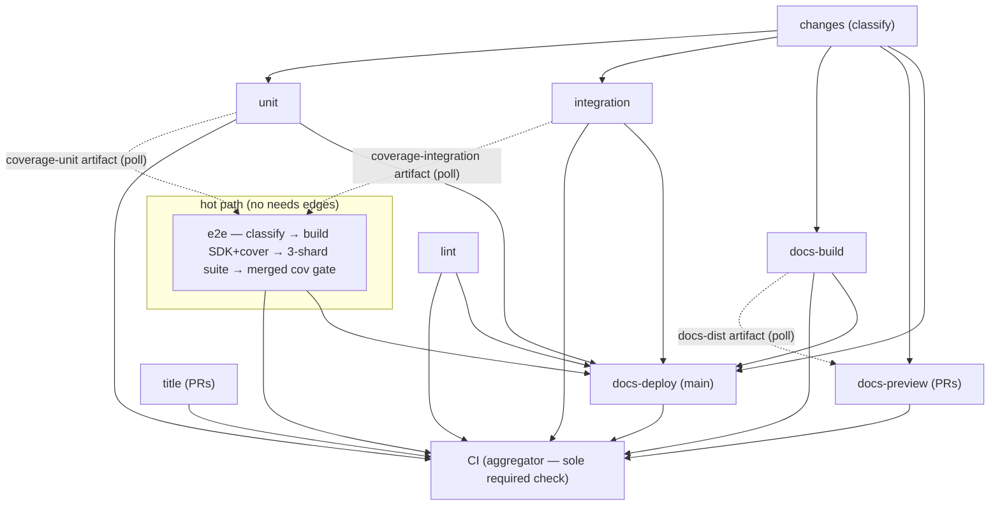

# CI architecture

How `ci.yml` is shaped and why. This is the canonical reference — the
workflow file's comments only explain what's local to a step, and
[development.md](../../docs/src/content/docs/development.md) carries the
contributor-facing summary. Measured wall-clock for a full PR run:
**~1m50s push → all green** (was 5m54s before the 2026-06 reshape).

## The graph

Dotted lines are **artifact polls**, not `needs` edges — see invariant 2.

## Design invariants

Break one of these knowingly or not at all.

1. **The aggregator job named `CI` is the only required status check.**
   The `main branch protection` ruleset requires `CI` and nothing else.
   The aggregator fails on any `failure`/`cancelled` need and treats
   `skipped` as passing — so path-filtered jobs (docs-only PRs skip the
   Go suites) and event-filtered jobs (title on pushes, deploys on PRs)
   never orphan the required check, and adding/renaming jobs never
   requires a ruleset edit. Consequence: every job that must gate merges
   **must be in the aggregator's `needs` list** (and `timing`, which is
   deliberately non-gating, must not be).

2. **Poll for artifacts; don't `needs`-wait on their producers.**
   A `needs` edge serializes a whole runner: the consumer's checkout +
   caches + installs all wait for the producer to finish. Instead a
   consumer does its own setup in parallel and calls
   [`scripts/ci/wait-artifact.sh`](../../scripts/ci/wait-artifact.sh)
   right before the artifact is actually needed (e2e does this for the
   coverage fragments; docs-preview for `docs-dist`, inline — see
   invariant 6). The wait is usually 0s; the script fails fast when a
   producer concluded without producing.

3. **The e2e job owns the critical path — keep it edge-free.** It
   classifies the change set itself (same script as the `changes` job),
   builds its own SDK dist + cover binary (`make -j test-e2e`), runs the
   suite as concurrent orchestrator shards, then applies the
   consolidated coverage gate (`make cov`) at its tail. Anything that
   would put a `needs` edge or a new serial step on e2e needs a wall-
   clock justification.

4. **Two classifiers, one script, cross-checked.** `changes` and `e2e`
   both run [`scripts/ci/classify-changes.sh`](../../scripts/ci/classify-changes.sh)
   (fail-closed: pushes, dispatches, API hiccups ⇒ `code=true`). The
   aggregator fails the run if `changes` said `code=true` but e2e
   classified docs-only (`e2e.outputs.ran != 'true'`) — classifier drift
   degrades to a red run, never to a silently skipped test suite or
   coverage gate.

5. **e2e parallelism lives across server instances, not within one.**
   Within one server the vitest files must run sequentially (shared
   global policy state, [#214](https://github.com/Wave-RF/WaveHouse/issues/214)).
   [`scripts/e2e-shards.sh`](../../scripts/e2e-shards.sh) runs N
   orchestrators concurrently, each with its own ClickHouse
   testcontainer + `wavehouse-cov`, so the suite's wall-clock is the
   slowest shard (~37s, the `ingest.test.ts` floor) instead of the file
   sum (~100s). The shard map lives in that script with a completeness
   guard — a new test file fails loudly until it's assigned. Local
   `make test-e2e` stays single-orchestrator; CI passes `E2E_SHARDED=1`.

6. **Trust domains.** Jobs that can reach deploy secrets (`docs-preview`,
   `docs-deploy`) check out **trusted `main`** and execute only files
   resolved from it — wrangler, the worker source, `wrangler.jsonc`, and
   any `scripts/ci/*.sh` they call ([#305](https://github.com/Wave-RF/WaveHouse/issues/305)).
   The only PR-derived input they touch is the static `docs-dist`
   artifact, consumed as data. Inline `run:` blocks in those jobs are
   acceptable (the workflow file itself is the reviewed surface);
   PR-tree *files* are not. Everything else (suites, lint, docs-build)
   runs the PR tree with no secrets beyond a read-mostly `GITHUB_TOKEN`.
   Fork PRs: secrets are absent and `docs-preview` skips itself.

7. **Caches are owned end-to-end by `setup-env`**
   ([.github/actions/setup-env](../actions/setup-env/action.yml)): each
   cache is a nested `actions/cache` step that restores inline and saves
   automatically at job end on an exact-key miss. No save steps in
   `ci.yml`. Trade-offs accepted: failed jobs don't save (restore-keys
   cushion the next run), and concurrent same-key misses produce benign
   "already exists" warnings.

## Cache inventory

| Cache | Key | Saved by | Notes |
|---|---|---|---|
| Go modules + build | `gobuild-v2-<os>-go<suffix>-<go.sum hash>` | every Go job (own suffix) | Suffix partitions by compile flavor (`-lint`, `-unit`, `-integration`, `-e2e-cov`). v2 = the GOTOOLCHAIN=auto toolchain rides in `~/go/pkg/mod` (no setup-go). **TODO:** drop the unversioned v1 restore-keys fallbacks once a v2 entry exists on main. |
| golangci binary + analysis | `golangci-<os>-<Makefile,.golangci.yml hash>` | lint | Analysis cache: ~10s warm vs ~90s. |
| pnpm store | `pnpm-<os>-<lockfile hash>` | any node job on miss | Store path resolved from pnpm at runtime. docs-build prunes before its save on a key rotation. |
| Playwright Chromium | `playwright-<os>-<lockfile hash>` | docs-build | rehype-mermaid renders via headless Chrome at docs build. |
| Astro content collections | `astro-<os>-<lockfile,astro.config.mjs hash>` | lint / docs-build | Warm `astro check`/`build` skip unchanged content. |

Key-versioning policy: bump the `v<N>` prefix whenever the cache's
expected *contents* change shape — saves only fire on an exact-key miss,
so without a bump the old entry exact-hits forever and the new content
is never captured. Keep the old prefixes as transitional restore-keys,
then delete them once main has saved the new version.

## Timing (steady state, full pipeline)

The non-gating **Timing summary** job writes a per-job wall-clock table
to every run's Summary page. Reference numbers from the reshape:

| Job | Starts | Duration |
|---|---:|---:|
| e2e (critical path) | +2s | ~103s — 24 setup, 70 suite (15 builds ∥ image prefetch, 37 shard wall, 10 cover-binary OTel exit [#288](https://github.com/Wave-RF/WaveHouse/issues/288)), 5 gate tail |
| integration | +8s | ~85s (runner-up — further e2e cuts hit this next) |
| docs-build → docs-preview | +8s | preview ends ~+95s (poll overlaps build) |
| lint / unit | +2s / +8s | ~65s / ~50s |
| CI aggregator | after slowest | ~4s |

Known floors, deliberately out of scope: splitting `ingest.test.ts`
(test changes), the ~10s covered-binary shutdown backoff (#288, server
fix), the ~17s gobuild cache restore (size-bound).

## Adding a job

1. Pick the gate: must it block merges? Add it to **both** the
   aggregator's and `timing`'s `needs` lists. Advisory-only? Mirror
   `timing` (`continue-on-error: true`, not in the aggregator's needs).
2. Gate on the change set via `needs: changes` + `if:` on its outputs —
   never with workflow-level `paths` filters (they'd orphan the required
   check, invariant 1).
3. Use `setup-env` with a fresh `go-cache-suffix` if it compiles Go with
   new flags; never add cache save steps (invariant 7).
4. Need a build product from another job? Upload it as an artifact there
   and poll with `wait-artifact.sh` here (invariant 2).
5. Declare least-privilege `permissions:` on the job; the workflow
   default is `contents: read`.
6. Nontrivial logic goes in `scripts/ci/*.sh` (shellcheck-gated via
   `make lint-sh`), not inline YAML — except in the trusted-main deploy
   jobs (invariant 6) where inline is the point.
7. Run `make lint-gha` (actionlint) before pushing; it's part of
   `make verify`.

## Debugging a slow or red run

- Start at the run's **Summary** page: the Timing table says where the
  wall-clock went; the coverage table comes from e2e's tail.
- e2e red in "Wait for sibling coverage fragments" with *skipped*
  producers = classifier drift (see invariant 4) — check the two
  "Classify changed files" steps' outputs.
- A red e2e shard prints `[shard N]`-prefixed logs; the failing shard's
  server log is in the job log via the orchestrator's tail-dump.
- Re-run failed jobs is safe everywhere: fragments/dist artifacts
  persist per-run, polls find them instantly, and the sticky preview
  comment updates in place.

## Transition notes (delete when done)

- **v1 gobuild restore-keys** in setup-env: drop after the first main
  run saves `gobuild-v2-*` entries.
- **docs-preview comment guard**: the comment step skips with a notice
  until `scripts/ci/docs-preview-comment.sh` exists on main (it executes
  from the trusted-main checkout). Remove the guard after merge.
