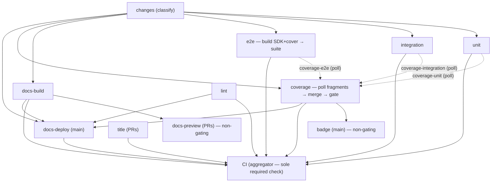

# CI architecture

How `ci.yml` is shaped and why. This is the canonical reference — the
workflow file's comments only explain what's local to a step, and
[development.md](../../docs/src/content/docs/development.md) carries the
contributor-facing summary. Wall-clock for a full PR run: **~3m15s push →
all green** (e2e ~170s is the long pole; the `coverage` job overlaps its
setup with the suites and merges within ~10s of e2e finishing, then the
~4s aggregator. Reliable now that the variable Cloudflare `docs-preview`
deploy is non-gating — only `docs-build` gates. Was 5m54s before the
2026-06 reshape, and ~4m when the
coverage job still serialized its setup via `needs`).

## The graph



Solid arrows are `needs` edges. Dotted arrows are **artifact polls**
(invariant 2): the `coverage` job starts off `changes` alone and polls
for the suites' fragments rather than `needs`-ing the suites, so its setup
overlaps them.

## Design invariants

Break one of these knowingly or not at all.

1. **The aggregator job named `CI` is the only required status check.**
   The `main branch protection` ruleset requires `CI` and nothing else.
   The aggregator fails on any `failure`/`cancelled` need and treats
   `skipped` as passing — so path-filtered jobs (docs-only PRs skip the
   Go suites) and event-filtered jobs (title on pushes, deploys on PRs)
   never orphan the required check, and adding/renaming jobs never
   requires a ruleset edit. Consequence: every job that must gate merges
   **must be in the aggregator's `needs` list**. Three jobs are deliberately
   non-gating and excluded: `timing` (advisory wall-clock table),
   `docs-preview` (the convenience Cloudflare preview deploy — `docs-build`
   already validates the build and *is* a need, so only the build gates;
   the preview deploy reports its own "Docs preview" check but, slow or
   failed, never delays or reds `CI`), and `badge` (publishes the README
   coverage badge to the `badges` branch on main pushes — a badge push must
   never block a merge; it reports its own "Coverage badge" status).

2. **A dedicated `coverage` job applies the consolidated gate, polling —
   not `needs`-ing — the suites.** Each suite (`unit`, `integration`,
   `e2e`) runs with `COV_DEFER=1` and uploads a `coverage-<suite>`
   fragment; the `coverage` job runs `make cov` (merge + every threshold
   gate) over all three — exactly like local `make ci`'s final step.
   Keeping it a separate job (not folded into e2e's tail) decouples the
   gate result from the e2e suite's pass/fail. Crucially it is
   `needs: changes` **only, not the suites**: a `needs` edge is a
   *scheduling* barrier — GitHub won't pick up a runner, check out, restore
   caches, or `pnpm install` until the needed jobs finish — so needing the
   suites would serialize this job's ~50s of setup onto the critical path
   after the last suite, for nothing (the setup doesn't depend on their
   results). Instead it starts at run creation, runs its setup in parallel
   with the suites, and blocks only at the merge by polling for the three
   fragments with [`scripts/ci/wait-artifact.sh`](../../scripts/ci/wait-artifact.sh)
   (fails fast if a producer concluded without producing). Tail on the
   critical path: ~10s, not ~50s. **The aggregator and `docs-deploy` must
   keep `coverage` *and* every suite in their `needs`** — the suites
   directly (a suite failure must red the gate even though `coverage`
   no longer needs them), and `coverage` (else a coverage-gate failure
   wouldn't block merge or a prod deploy).

3. **e2e builds its own inputs and mirrors local `make test-e2e`.** It
   compiles the SDK dist + cover binary itself (`make -j test-e2e`, warm
   per-suffix cache) rather than waiting on a builder job, and runs the
   suite exactly as a developer does — one orchestrator, one ClickHouse
   testcontainer, sequential files. The ClickHouse image pulls in the
   background while caches restore (also in the integration job).

4. **One change classifier, split into a pure core + a CI wrapper.** The
   pure allowlist — file list on stdin ⇒ `code`/`docs` — lives in
   [`scripts/classify-paths.sh`](../../scripts/classify-paths.sh),
   dependency-free and unit-tested by
   [`scripts/classify-paths.test.sh`](../../scripts/classify-paths.test.sh)
   (`make test-classify-paths`, a `verify` leaf) so the allowlists can't
   silently regress. The `changes` job runs the thin wrapper
   [`scripts/ci/classify-changes.sh`](../../scripts/ci/classify-changes.sh),
   which adds the CI-only policy (API file-list fetch + fail-closed:
   pushes, dispatches, API hiccups ⇒ `code=true`) on top. Keeping the core
   pure means the local git hooks can share it (`git diff --name-only |
   scripts/classify-paths.sh`). The `code`/`docs` outputs gate the suites
   and docs jobs — gate on these, never on workflow-level `paths:`
   filters, which would orphan the required check (invariant 1).

5. **Trust domains.** Jobs that can reach deploy secrets (`docs-preview`,
   `docs-deploy`) check out **trusted `main`** and execute only files
   resolved from it — wrangler, the worker source, `wrangler.jsonc`, and
   any `scripts/ci/*.sh` they call ([#305](https://github.com/Wave-RF/WaveHouse/issues/305)).
   The only PR-derived input they touch is the static `docs-dist`
   artifact, consumed as data. Inline `run:` blocks in those jobs are
   acceptable (the workflow file itself is the reviewed surface);
   PR-tree *files* are not. Everything else (suites, lint, docs-build)
   runs the PR tree with no secrets beyond a read-mostly `GITHUB_TOKEN`.
   Fork PRs: secrets are absent and `docs-preview` skips itself.

6. **Caches are owned end-to-end by `setup-env`**
   ([.github/actions/setup-env](../actions/setup-env/action.yml)): each
   cache is a nested `actions/cache` step that restores inline and saves
   automatically at job end on an exact-key miss. No save steps in
   `ci.yml`. Trade-offs accepted: failed jobs don't save (restore-keys
   cushion the next run), and concurrent same-key misses produce benign
   "already exists" warnings.

## Coverage publishing

The `coverage` job both **gates** (`make cov` against the floors in
`.testcoverage.yml`) and **publishes** — independent concerns, and only the
gate blocks merges ([#133](https://github.com/Wave-RF/WaveHouse/issues/133)):

- **Per-run job summary** — the merged per-package func table on every run's
  Summary page.
- **PR comment (GitHub Code Quality)** — on same-repo PRs and main pushes the
  job converts the merged Go profile to Cobertura (`go tool gocover-cobertura`,
  `-ignore-dirs` mirroring `.testcoverage.yml`'s global excludes so the % tracks
  the merged-total gate) and uploads it via `actions/upload-code-coverage`; the
  `github-code-quality[bot]` posts the aggregate + per-file diff-vs-main
  comment. **Non-gating**: the upload is `continue-on-error`, so this
  public-preview feature can never red `CI`. Fork PRs skip (no `code-quality`
  token, per GitHub's own guard). Renders only once the repo's *Settings →
  Security → Code quality* is enabled.
- **README badge** — on main pushes the job emits a shields.io endpoint JSON
  for the merged Go total (`cov badge`, the exact gated number); the separate
  non-gating `badge` job publishes it to the orphan `badges` branch, which the
  README badge reads over `raw.githubusercontent.com` (public-repo only). The
  `badge` job is the sole holder of `contents:write` and runs only on trusted
  main, so a push to `badges` can't be influenced by PR code (invariant 5).

SDK (TS) coverage is gated by `make cov` but not yet published — extend with a
`language: javascript` upload step and a second badge JSON when wanted.

## Merge queue

PRs land through a **merge queue**: "Merge when ready" enqueues the PR,
GitHub builds a merge-group ref (current main ⊕ the PRs ahead ⊕ this
PR), runs the required `CI` check against **that**, and fast-forwards
main only on green. This is the integration gate — it catches semantic
conflicts with a main that advanced after the PR's own run, replaces
the old "require branches to be up to date" rule (PRs no longer show
"out of date", and nobody clicks Update-branch), and never touches the
PR branch itself (so `require_last_push_approval` is never reset by it).

How a `merge_group` run flows through the DAG: the classifier treats it
like a push (full suite — the queue never skips code checks; `docs`
still gates docs-build), while `title` (already validated on the PR),
`docs-preview` (PR-scoped), and `docs-deploy` (push-scoped) sit out and
the aggregator counts their skips as passes, exactly like any other
event-filtered run. **Removing the `merge_group:` trigger from ci.yml
would hang every queued PR** — no trigger means the required `CI` check
never reports on the merge group, and entries bounce out only after the
60-minute check timeout.

Queue settings live in the `main branch protection` ruleset's
`merge_queue` rule: squash merges, land-as-ready (`min_entries_to_merge:
1`, no batching wait), up to 5 speculative builds.

## Cache inventory

| Cache | Key | Saved by | Notes |
|---|---|---|---|
| Go modules | `gomod-v1-<os>-<go.mod+go.sum hash>` | every Go job (shared) | `~/go/pkg/mod`, **unsuffixed** — a pure function of `go.mod` + `go.sum`, so one entry serves every job (~1.6 GB on disk, ~1 GB stored). The GOTOOLCHAIN=auto toolchain rides in here too (no setup-go), which is why `go.mod` is in the key — a `go` directive bump changes the required toolchain without touching `go.sum`. |
| Go build objects | `gobuild-v3-<os>-go<suffix>-<go.mod+go.sum hash>` | every Go job (own suffix) | `~/.cache/go-build` only. Suffix partitions by compile flavor (`-lint`, `-unit`, `-integration`, `-e2e-cov`, `-cov`), which compile with different flags. |
| golangci binary + analysis | `golangci-<os>-<Makefile,.golangci.yml hash>` | lint | Analysis cache: ~10s warm vs ~90s. `.bin` also carries shellcheck + actionlint. |
| pnpm store | `pnpm-<os>-<lockfile hash>` | any node job on miss | Store path resolved from pnpm at runtime. docs-build prunes before its save on a key rotation. |
| Playwright Chromium | `playwright-<os>-<lockfile hash>` | docs-build | rehype-mermaid renders via headless Chrome at docs build. |
| Astro content collections | `astro-<os>-<lockfile,astro.config.mjs hash>` | lint / docs-build | Warm `astro check`/`build` skip unchanged content. |
| CodeQL DB + deps | `codeql-dependencies-*`, `codeql-overlay-base-database-*` | GHAS default setup | **Not ours** — minted by GitHub's default CodeQL setup, not by any workflow in this repo, and not configurable here. ~0.4 GB. Listed so the budget arithmetic below is honest. |

Deliberately **not** cached: `actions/setup-go`'s bundled cache in
`publish-dev.yml`, `release.yml` and `goreleaser-validate.yml` (`cache: false`
on each). It stores its own go.sum-keyed copy of `~/go/pkg/mod` +
`~/.cache/go-build` — ~1 GB duplicating what `gomod-v1` already holds once —
for release builds dominated by cross-compiling and multi-arch docker rather
than by `go mod download`.

Key-versioning policy: bump the `v<N>` prefix whenever the cache's
expected *contents* change shape — saves only fire on an exact-key miss,
so without a bump the old entry exact-hits forever and the new content
is never captured. Keep the old prefixes as transitional restore-keys,
then delete them once main has saved the new version.

**Exception — a rotation that *narrows* `path:` carries no transitional
restore-key.** The old archive still contains the paths you just removed,
so restoring it would re-materialize exactly the content the rotation was
meant to stop storing (and, for `~/go/pkg/mod`, extract 0444 module files
over an already-restored tree). Drop the old prefix and purge the stale
entries instead — they hold budget the new keys need. `gobuild-v3` is the
worked example: it kept only its own same-suffix prefix.

**Sizing policy — the repo cache budget is 10 GB, hard.** Past it GitHub
LRU-evicts, so warm entries disappear mid-run and builds silently get
slower. Budget for **two live generations**: a `go.mod`/`go.sum` or
lockfile bump mints a whole new set while the previous one is still warm,
so the steady state is ~2× a single generation. That is why `~/go/pkg/mod`
is cached **once** (`gomod-v1`) rather than folded into each suffixed
build cache — doing the latter stored the module tree five times over,
five entries of ~1.1 GB each, ~5.5 GB per generation, and #438's 24-module
bump pushed the repo to 10.53 GB
([#443](https://github.com/Wave-RF/WaveHouse/issues/443)).

Before adding a cache or widening an existing `path:`, check the current
footprint and confirm two generations still fit:

```bash
gh api repos/Wave-RF/WaveHouse/actions/cache/usage \
  -q '"\(.active_caches_size_in_bytes/1073741824*100|round/100)GB / 10GB"'
gh api repos/Wave-RF/WaveHouse/actions/caches --paginate \
  -q '.actions_caches[]|"\(.size_in_bytes)\t\(.key)"' | sort -rn | head
```

Never add a per-job copy of content that is a pure function of a lockfile
— key it once, unsuffixed, and let every job share it.

## Timing (steady state, full pipeline)

The non-gating **Timing summary** job writes a per-job wall-clock table
to every run's Summary page. Reference shape:

| Job | Starts | Duration |
|---|---:|---:|
| e2e (long pole) | +8s | ~170s — ~25 setup, ~120 suite (15 builds ∥ image prefetch, ~100 vitest, ~10 cover-binary OTel exit [#288](https://github.com/Wave-RF/WaveHouse/issues/288)), ~5 fragment upload |
| coverage | +18s | ~50s setup overlaps the suites, then idle-polls; ~10s critical-path tail (poll-detect + download + ~3s merge) after e2e |
| integration | +8s | ~85s |
| docs-build (gates) → docs-preview (non-gating) | +8s | build ~80s; the Cloudflare preview deploy is ~1.5–3min and varies, but doesn't gate — only `docs-build` does |
| lint / unit | +2s / +8s | ~65s / ~50s |
| CI aggregator | after coverage / docs-build | ~4s |

## Deferred optimizations

Designed and measured during the 2026-06 reshape, then backed out to
keep CI simple and in parity with local `make test-e2e`. If the e2e
suite's wall-clock becomes a problem again, start here:

- **e2e sharding** (the big one, ~60s): N concurrent orchestrators in
  one runner, each with its own ClickHouse + server — file-level
  parallelism is impossible *within* one server (shared global policy
  state, [#214](https://github.com/Wave-RF/WaveHouse/issues/214)), but
  isolated stacks dissolve the constraint with zero test changes.
  Measured green at 3 shards: suite wall 100s → ~40s (floor = the
  slowest file, `ingest.test.ts` at 36s), CPU contention negligible on
  the 4-core runners. Needs: per-shard scratch paths + vitest file
  filters in the orchestrator, a shard-map driver script, per-shard TS
  coverage dirs nyc-merged back into `ts-e2e/` (Go covdata can share
  one GOCOVERDIR — covcounters are pid-stamped). See PR #312's history
  (commit `ed1db1c`) for a working implementation.
- **No-`needs` e2e** (~5s): e2e classifies the change set itself and
  starts at run creation; requires a second classifier run plus an
  aggregator cross-check so drift fails closed. Also in `ed1db1c`.
- **docs-preview artifact-poll** (~0s on today's critical path): preview
  does its trusted-main setup in parallel with docs-build and polls for
  `docs-dist`. Only worth it if e2e drops under ~150s again.

## Adding a job

1. Pick the gate: must it block merges? Add it to **both** the
   aggregator's and `timing`'s `needs` lists. Advisory-only? Mirror
   `timing` (`continue-on-error: true`, not in the aggregator's needs).
2. Gate on the change set via `needs: changes` + `if:` on its outputs —
   never with workflow-level `paths` filters (they'd orphan the required
   check, invariant 1).
3. Use `setup-env` with a fresh `go-cache-suffix` if it compiles Go with
   new flags; never add cache save steps (invariant 6).
4. Need a build product / data from another job? Upload it as an artifact
   there, then either `needs` the producer + `download-artifact` (simple,
   but serializes this job's setup behind the producer), or — when this
   job has its own setup to overlap and sits on the critical path — start
   it off `changes` and poll with
   [`scripts/ci/wait-artifact.sh`](../../scripts/ci/wait-artifact.sh) (see
   the `coverage` job). The poll holds a runner idle while waiting; worth
   it to keep setup off the critical path.
5. Declare least-privilege `permissions:` on the job; the workflow
   default is `contents: read`.
6. Nontrivial logic goes in `scripts/ci/*.sh` (shellcheck-gated via
   `make lint-sh`), not inline YAML — except in the trusted-main deploy
   jobs (invariant 5) where inline is the point.
7. Run `make lint-gha` (actionlint) before pushing; it's part of
   `make verify`.

## Debugging a slow or red run

- Start at the run's **Summary** page: the Timing table says where the
  wall-clock went; the coverage table comes from the `coverage` job.
- `coverage` red in "Wait for coverage fragments" means a suite failed or
  was cancelled before uploading its fragment — the aggregator is already
  red from that suite. Fix that job first; it's not a `coverage` bug.
- Re-run failed jobs is safe everywhere: fragments/dist artifacts
  persist per-run, `download-artifact` finds them instantly, and the
  sticky preview comment updates in place.
