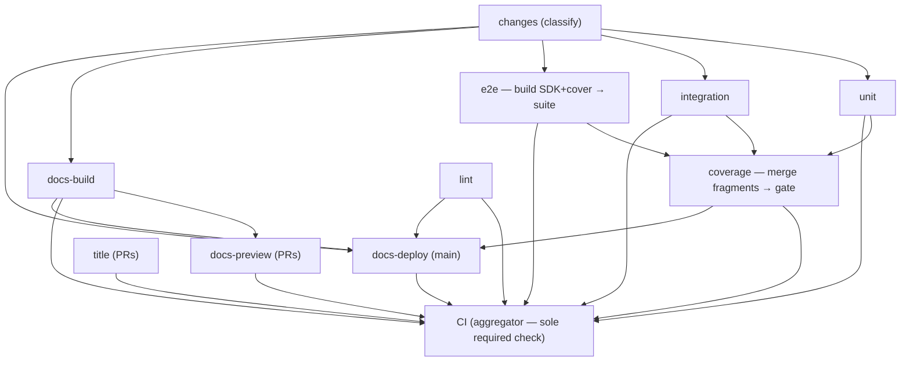

# CI architecture

How `ci.yml` is shaped and why. This is the canonical reference — the
workflow file's comments only explain what's local to a step, and
[development.md](../../docs/src/content/docs/development.md) carries the
contributor-facing summary. Wall-clock for a full PR run: **~3m45s push →
all green** (e2e ~165s + the `coverage` job's ~50s tail; was 5m54s before
the 2026-06 reshape).

## The graph

Every suite uploads a `coverage-<suite>` fragment; the `coverage` job
merges all three and applies the threshold gates (invariant 2).

## Design invariants

Break one of these knowingly or not at all.

1. **The aggregator job named `CI` is the only required status check.**
   The `main branch protection` ruleset requires `CI` and nothing else.
   The aggregator fails on any `failure`/`cancelled` need and treats
   `skipped` as passing — so path-filtered jobs (docs-only PRs skip the
   Go suites) and event-filtered jobs (title on pushes, deploys on PRs)
   never orphan the required check, and adding/renaming jobs never
   requires a ruleset edit. Consequence: every job that must gate merges
   **must be in the aggregator's `needs` list** (and `timing`, which is
   deliberately non-gating, must not be).

2. **A dedicated `coverage` job applies the consolidated gate.** Each
   suite (`unit`, `integration`, `e2e`) runs with `COV_DEFER=1` and
   uploads a `coverage-<suite>` fragment; the `coverage` job
   (`needs: [unit, integration, e2e]`) downloads all three, runs
   `make cov` (merge + every threshold gate), and posts the summary —
   exactly like local `make ci`'s final step. Keeping it separate, rather
   than folded into e2e's tail, decouples the gate result from the e2e
   suite's pass/fail and lets the DAG barrier handle whichever suite
   finishes last (integration occasionally outlasts e2e) with no in-run
   polling. The cost is one job's setup (~40–60s) on the critical path
   after e2e; the trade buys clarity and parity with local. **Both the
   aggregator and `docs-deploy` must keep `coverage` in `needs`** — else
   a coverage-gate failure wouldn't block merge or a prod deploy.

3. **e2e builds its own inputs and mirrors local `make test-e2e`.** It
   compiles the SDK dist + cover binary itself (`make -j test-e2e`, warm
   per-suffix cache) rather than waiting on a builder job, and runs the
   suite exactly as a developer does — one orchestrator, one ClickHouse
   testcontainer, sequential files. The ClickHouse image pulls in the
   background while caches restore (also in the integration job).

4. **One change classifier, split into a pure core + a CI wrapper.** The
   pure allowlist — file list on stdin ⇒ `code`/`docs` — lives in
   [`scripts/classify-paths.sh`](../../scripts/classify-paths.sh),
   dependency-free and unit-tested by
   [`scripts/classify-paths.test.sh`](../../scripts/classify-paths.test.sh)
   (`make test-classify-paths`, a `verify` leaf) so the allowlists can't
   silently regress. The `changes` job runs the thin wrapper
   [`scripts/ci/classify-changes.sh`](../../scripts/ci/classify-changes.sh),
   which adds the CI-only policy (API file-list fetch + fail-closed:
   pushes, dispatches, API hiccups ⇒ `code=true`) on top. Keeping the core
   pure means the local git hooks can share it (`git diff --name-only |
   scripts/classify-paths.sh`). The `code`/`docs` outputs gate the suites
   and docs jobs — gate on these, never on workflow-level `paths:`
   filters, which would orphan the required check (invariant 1).

5. **Trust domains.** Jobs that can reach deploy secrets (`docs-preview`,
   `docs-deploy`) check out **trusted `main`** and execute only files
   resolved from it — wrangler, the worker source, `wrangler.jsonc`, and
   any `scripts/ci/*.sh` they call ([#305](https://github.com/Wave-RF/WaveHouse/issues/305)).
   The only PR-derived input they touch is the static `docs-dist`
   artifact, consumed as data. Inline `run:` blocks in those jobs are
   acceptable (the workflow file itself is the reviewed surface);
   PR-tree *files* are not. Everything else (suites, lint, docs-build)
   runs the PR tree with no secrets beyond a read-mostly `GITHUB_TOKEN`.
   Fork PRs: secrets are absent and `docs-preview` skips itself.

6. **Caches are owned end-to-end by `setup-env`**
   ([.github/actions/setup-env](../actions/setup-env/action.yml)): each
   cache is a nested `actions/cache` step that restores inline and saves
   automatically at job end on an exact-key miss. No save steps in
   `ci.yml`. Trade-offs accepted: failed jobs don't save (restore-keys
   cushion the next run), and concurrent same-key misses produce benign
   "already exists" warnings.

## Merge queue

PRs land through a **merge queue**: "Merge when ready" enqueues the PR,
GitHub builds a merge-group ref (current main ⊕ the PRs ahead ⊕ this
PR), runs the required `CI` check against **that**, and fast-forwards
main only on green. This is the integration gate — it catches semantic
conflicts with a main that advanced after the PR's own run, replaces
the old "require branches to be up to date" rule (PRs no longer show
"out of date", and nobody clicks Update-branch), and never touches the
PR branch itself (so `require_last_push_approval` is never reset by it).

How a `merge_group` run flows through the DAG: the classifier treats it
like a push (full suite — the queue never skips code checks; `docs`
still gates docs-build), while `title` (already validated on the PR),
`docs-preview` (PR-scoped), and `docs-deploy` (push-scoped) sit out and
the aggregator counts their skips as passes, exactly like any other
event-filtered run. **Removing the `merge_group:` trigger from ci.yml
would hang every queued PR** — no trigger means the required `CI` check
never reports on the merge group, and entries bounce out only after the
60-minute check timeout.

Queue settings live in the `main branch protection` ruleset's
`merge_queue` rule: squash merges, land-as-ready (`min_entries_to_merge:
1`, no batching wait), up to 5 speculative builds.

## Cache inventory

| Cache | Key | Saved by | Notes |
|---|---|---|---|
| Go modules + build | `gobuild-v2-<os>-go<suffix>-<go.sum hash>` | every Go job (own suffix) | Suffix partitions by compile flavor (`-lint`, `-unit`, `-integration`, `-e2e-cov`, `-cov`). v2 = the GOTOOLCHAIN=auto toolchain rides in `~/go/pkg/mod` (no setup-go). **TODO:** drop the unversioned v1 restore-keys fallbacks once a v2 entry exists on main. |
| golangci binary + analysis | `golangci-<os>-<Makefile,.golangci.yml hash>` | lint | Analysis cache: ~10s warm vs ~90s. `.bin` also carries shellcheck + actionlint. |
| pnpm store | `pnpm-<os>-<lockfile hash>` | any node job on miss | Store path resolved from pnpm at runtime. docs-build prunes before its save on a key rotation. |
| Playwright Chromium | `playwright-<os>-<lockfile hash>` | docs-build | rehype-mermaid renders via headless Chrome at docs build. |
| Astro content collections | `astro-<os>-<lockfile,astro.config.mjs hash>` | lint / docs-build | Warm `astro check`/`build` skip unchanged content. |

Key-versioning policy: bump the `v<N>` prefix whenever the cache's
expected *contents* change shape — saves only fire on an exact-key miss,
so without a bump the old entry exact-hits forever and the new content
is never captured. Keep the old prefixes as transitional restore-keys,
then delete them once main has saved the new version.

## Timing (steady state, full pipeline)

The non-gating **Timing summary** job writes a per-job wall-clock table
to every run's Summary page. Reference shape:

| Job | Starts | Duration |
|---|---:|---:|
| e2e (long pole) | +8s | ~165s — ~25 setup, ~120 suite (15 builds ∥ image prefetch, ~100 vitest, ~10 cover-binary OTel exit [#288](https://github.com/Wave-RF/WaveHouse/issues/288)), ~5 fragment upload |
| coverage (critical path tail) | after e2e | ~45–60s — setup + pnpm install, ~3s merge + gate |
| integration | +8s | ~85s |
| docs-build → docs-preview | +8s | preview ends ~+150s |
| lint / unit | +2s / +8s | ~65s / ~50s |
| CI aggregator | after coverage | ~4s |

## Deferred optimizations

Designed and measured during the 2026-06 reshape, then backed out to
keep CI simple and in parity with local `make test-e2e`. If the e2e
suite's wall-clock becomes a problem again, start here:

- **e2e sharding** (the big one, ~60s): N concurrent orchestrators in
  one runner, each with its own ClickHouse + server — file-level
  parallelism is impossible *within* one server (shared global policy
  state, [#214](https://github.com/Wave-RF/WaveHouse/issues/214)), but
  isolated stacks dissolve the constraint with zero test changes.
  Measured green at 3 shards: suite wall 100s → ~40s (floor = the
  slowest file, `ingest.test.ts` at 36s), CPU contention negligible on
  the 4-core runners. Needs: per-shard scratch paths + vitest file
  filters in the orchestrator, a shard-map driver script, per-shard TS
  coverage dirs nyc-merged back into `ts-e2e/` (Go covdata can share
  one GOCOVERDIR — covcounters are pid-stamped). See PR #312's history
  (commit `ed1db1c`) for a working implementation.
- **No-`needs` e2e** (~5s): e2e classifies the change set itself and
  starts at run creation; requires a second classifier run plus an
  aggregator cross-check so drift fails closed. Also in `ed1db1c`.
- **docs-preview artifact-poll** (~0s on today's critical path): preview
  does its trusted-main setup in parallel with docs-build and polls for
  `docs-dist`. Only worth it if e2e drops under ~150s again.

## Adding a job

1. Pick the gate: must it block merges? Add it to **both** the
   aggregator's and `timing`'s `needs` lists. Advisory-only? Mirror
   `timing` (`continue-on-error: true`, not in the aggregator's needs).
2. Gate on the change set via `needs: changes` + `if:` on its outputs —
   never with workflow-level `paths` filters (they'd orphan the required
   check, invariant 1).
3. Use `setup-env` with a fresh `go-cache-suffix` if it compiles Go with
   new flags; never add cache save steps (invariant 6).
4. Need a build product from another job? Upload it as an artifact there
   and `needs` the producer, then `download-artifact` it (see the
   `coverage` job consuming the suites' fragments).
5. Declare least-privilege `permissions:` on the job; the workflow
   default is `contents: read`.
6. Nontrivial logic goes in `scripts/ci/*.sh` (shellcheck-gated via
   `make lint-sh`), not inline YAML — except in the trusted-main deploy
   jobs (invariant 5) where inline is the point.
7. Run `make lint-gha` (actionlint) before pushing; it's part of
   `make verify`.

## Debugging a slow or red run

- Start at the run's **Summary** page: the Timing table says where the
  wall-clock went; the coverage table comes from the `coverage` job.
- `coverage` skipped while a suite failed is expected — a failed suite
  (its fragment never uploaded) skips `coverage` via the DAG, and the
  aggregator is already red from the suite itself. Fix that job first.
- Re-run failed jobs is safe everywhere: fragments/dist artifacts
  persist per-run, `download-artifact` finds them instantly, and the
  sticky preview comment updates in place.

## Transition notes (delete when done)

- **v1 gobuild restore-keys** in setup-env: drop after the first main
  run saves `gobuild-v2-*` entries.
- **docs-preview comment guard**: the comment step skips with a notice
  until `scripts/ci/docs-preview-comment.sh` exists on main (it executes
  from the trusted-main checkout). Remove the guard after merge.
- **PR-title script guard**: the `PR title` job's step skips with a notice
  until `scripts/ci/check-pr-title.sh` exists on main (same trusted-main
  checkout). Title enforcement is advisory via `PR housekeeping` until
  then. Remove the guard after merge.
- **Merge-queue ruleset flip**: AFTER the PR adding the `merge_group:`
  trigger lands on main (ordering matters — flipping first strands every
  other queued PR with no CI run), update the `main branch protection`
  ruleset: add the `merge_queue` rule and set
  `strict_required_status_checks_policy: false` (prepared payload:
  `gh api -X PUT repos/Wave-RF/WaveHouse/rulesets/15353356 --input
  tmp/ruleset-merge-queue.json`). Then delete this note.
