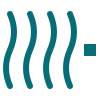

<!-- ============================================================================
     UNTRACKED DRAFT — not committed. A proposed README for launch, to diff
     against the real README.md. Inline "PROPOSED" comments explain each
     change. Nothing here ships until you copy it over yourself.
     Biggest levers: (1) a hero GIF up top, (2) a 30-second try block,
     (3) lead with the quotable "great database, poor API" line,
     (4) condense the 10-bullet feature wall, (5) a scannable comparison table.
     ============================================================================ -->

<h1 align="center">
  <picture>
    <source media="(prefers-color-scheme: dark)" srcset="docs/public/branding/mark-dark.svg">
    
  </picture>
  <br>
  WaveHouse
</h1>

<!-- PROPOSED: lead with the most quotable sentence you've written (it's the /why-wavehouse closer). This is what people paste into the HN thread. -->
<p align="center"><strong>ClickHouse is a great database and a poor API. WaveHouse is the API.</strong></p>

<p align="center">
  The open-source real-time API gateway for ClickHouse — schema-aware ingest, async batching, real-time SSE streaming, and tiered query caching in a single binary.
</p>

<p align="center">
  <a href="https://github.com/Wave-RF/WaveHouse/actions/workflows/ci.yml"></a>
  <a href="https://go.dev/"></a>
  <a href="LICENSE"></a>
  <!-- PROPOSED: add once the repo is public — cheap, compounding social proof:
  <a href="https://github.com/Wave-RF/WaveHouse/stargazers"></a>
  <a href="https://github.com/Wave-RF/WaveHouse/releases"></a>
  <a href="https://goreportcard.com/report/github.com/Wave-RF/WaveHouse"></a>
  -->
</p>

<p align="center">
  <a href="https://wavehouse.dev"><strong>Docs</strong></a> ·
  <a href="#-quick-start"><strong>Quick start</strong></a> ·
  <a href="https://wavehouse.dev/why-wavehouse"><strong>Why WaveHouse</strong></a> ·
  <a href="https://github.com/Wave-RF/WaveHouse/discussions"><strong>Discussions</strong></a>
</p>

<!-- PROPOSED — #1 star-driver: a hero GIF/screen-recording of the live SSE
     stream (the demo you're building, showing repo activity). Drop the asset in
     and uncomment. A repo with a compelling top-of-README visual gets markedly
     more stars on launch day.
<p align="center">
  
</p>
-->

---

## ⚡ Try it in 30 seconds

<!-- PROPOSED: a single self-contained block above the prose, for the "does it
     actually run" reflex. Compose boots ClickHouse + WaveHouse together, so it's
     the honest fastest path. NOTE: reconcile with the docs hero, which shows
     `docker run … ghcr.io/wave-rf/wavehouse` — pick ONE canonical fastest path
     across the site + README. -->

```bash
git clone https://github.com/Wave-RF/WaveHouse.git && cd WaveHouse
docker compose -f deployments/compose/standalone.yaml up -d   # ClickHouse + WaveHouse

# ingest an event, then watch it stream back live
curl -sX POST "http://localhost:8080/v1/ingest?table=events" \
  -H 'content-type: application/json' -d '{"kind":"click","user":"u_42"}'
curl -N "http://localhost:8080/v1/stream?table=events"
```

Full walkthrough → **[wavehouse.dev/getting-started](https://wavehouse.dev/getting-started)**.

## ✨ Why WaveHouse

ClickHouse is a phenomenal OLAP database, but pointing a frontend straight at it
has sharp edges: one-row inserts trigger `Too many parts`, there's no
backpressure or edge validation, no real-time push, and no row/column security.
You end up building custom APIs, a Kafka queue, a batch consumer, a cache tier,
and an auth service. **WaveHouse is that whole stack as one binary** — the only
external dependency is ClickHouse.

If you're building user-facing analytics, WaveHouse is like **Supabase for
ClickHouse** — or an **open-source Tinybird** that pushes data to the frontend
in real time over SSE, not just pull-based REST.

<!-- PROPOSED: condense the previous 10 emoji bullets into 5 grouped lines.
     The full per-feature detail lives on the docs site; the README should be
     skimmable in 10 seconds. -->

- **Ingest** — async durable WAL (embedded NATS JetStream), `200 OK` instantly, background batch-flush; schema-validated against `system.columns`; optional exact-match dedup; dead-letter queue for failed inserts.
- **Query** — in-process Ristretto cache + `singleflight` coalescing; type-safe structured query AST; Tinybird-style named pipes (parameterized SQL endpoints).
- **Real-time** — native SSE push, broadcast *before* the ClickHouse flush, with JetStream gap-fill for late/reconnecting clients.
- **Security** — Hasura-style per-table, per-role column + row policies with JWT claim templating, stored in NATS KV.
- **Client** — `@wavehouse/sdk`: zero-dependency TypeScript client with query builder, live queries, streaming, and schema codegen.

## 📊 How it compares

<!-- PROPOSED: a condensed version of the /why-wavehouse matrix. HN loves a
     scannable comparison table. Keep it scrupulously fair — see PERF-CLAIMS-REVIEW.md. -->

| | Direct ClickHouse | Kafka + CH (DIY) | Tinybird | **WaveHouse** |
| --- | :---: | :---: | :---: | :---: |
| Self-hosted, single binary | — | — | ✗ (SaaS) | ✓ |
| Safe high-rate inserts | ✗ | ✓ (via Kafka) | ✓ | ✓ |
| Schema validation at the edge | ✗ | custom | ✓ | ✓ |
| Real-time push (SSE) | ✗ | custom service | ✗ | ✓ native |
| Thundering-herd coalescing | ✗ | custom | ✓ | ✓ |
| Row/column policies (JWT) | ✗ | custom | tokens only | ✓ Hasura-style |
| Cost model | infra | infra + eng time | per-vCPU SaaS | infra only |

Full breakdown, failure modes, and the engineering rationale →
**[wavehouse.dev/why-wavehouse](https://wavehouse.dev/why-wavehouse)**.

## 🛠️ Quick Start

Pick whichever fits — each ends with WaveHouse listening on `http://localhost:8080`.

### A. Docker Compose (recommended first run)

```bash
git clone https://github.com/Wave-RF/WaveHouse.git && cd WaveHouse
docker compose -f deployments/compose/standalone.yaml up -d
```

Then create a table in ClickHouse (Bring Your Own Schema) and ingest — see the
[getting-started walkthrough](https://wavehouse.dev/getting-started) for the full
ingest → query → stream tour.

### B. Prebuilt container image

```bash
docker pull ghcr.io/wave-rf/wavehouse:latest   # tagged release
docker pull ghcr.io/wave-rf/wavehouse:dev      # rolling main-branch build
```

### C. `go install` (binary, no Docker)

```bash
go install github.com/Wave-RF/WaveHouse/cmd/wavehouse@latest
```

You'll still need ClickHouse reachable — point WaveHouse at it via `WH_CH_ADDR`.
See [Configuration](https://wavehouse.dev/configuration).

## 🚦 Project status

<!-- PROPOSED: make maturity explicit and honest right in the README — the
     single biggest trust-builder for a project claiming this much surface area.
     Fill the matrix with REAL status (Claude won't invent it). -->

WaveHouse is in **alpha** — built in the open, MIT-licensed, no SaaS tier, no
vendor lock-in. See [SUPPORT.md](SUPPORT.md) for the response cadence and
what's in vs. out of scope.

<!-- OPTIONAL feature-status matrix — replace the ?? with your honest status:
| Capability | Status |
| --- | --- |
| Async ingest + batch flush | ✅ |
| Schema validation | ✅ |
| Real-time SSE + gap-fill | ?? |
| Query cache + singleflight | ?? |
| Access control (JWT policies) | ?? |
| Named pipes | ?? |
| Exact-match dedup | ?? optional |
| TypeScript SDK | ?? |
-->

## 💻 Local Development

You'll need **Go 1.26+, GNU Make 4+, Docker (Compose v2), Node.js 22 LTS, and
pnpm 11.1+**. See [development docs](https://wavehouse.dev/development) for the
full list and gotchas.

```bash
make tools                                                  # one-time bootstrap
docker compose -f deployments/compose/dependencies.yaml up -d clickhouse
make dev                                                    # hot-reload on .go save
```

## 🤝 Contributing

Issues, PRs, and feedback welcome — see [CONTRIBUTING.md](CONTRIBUTING.md).
`AGENTS.md` is the canonical source of truth for project conventions.

<!-- PROPOSED: link a few `good first issue`s here once the repo is public —
     converts launch-day lurkers into contributors (your stated goal). -->

## 🛡️ Security

Found a vulnerability? **Don't open a public issue.** Email `security@wave-rf.com` per [SECURITY.md](SECURITY.md) — acknowledged within 48 hours, initial assessment within 5 business days.

## 📜 License

Open source under the [MIT License](LICENSE).
