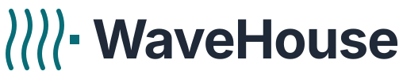

<h1 align="center">
  <picture>
    <source media="(prefers-color-scheme: dark)" srcset="docs/public/branding/lockup-dark.svg">
    
  </picture>
</h1>

<p align="center">
  <strong>
    ClickHouse is a great database and a poor API. WaveHouse is the API.
  </strong>
</p>

<p align="center">
  The open-source real-time API gateway for ClickHouse — schema-aware ingest, async batching, real-time SSE streaming, and tiered query caching in a single binary.
</p>

<p align="center">
  <a href="https://github.com/Wave-RF/WaveHouse/actions/workflows/ci.yml"></a>
  <a href="https://goreportcard.com/report/github.com/Wave-RF/WaveHouse"></a>
  <a href="LICENSE"></a>
</p>

<p align="center">
  <a href="https://wavehouse.dev"><strong>Docs</strong></a> ·
  <a href="#-quick-start"><strong>Quick start</strong></a> ·
  <a href="https://wavehouse.dev/why-wavehouse"><strong>Why WaveHouse</strong></a> ·
  <a href="https://github.com/Wave-RF/WaveHouse/discussions"><strong>Discussions</strong></a>
</p>

---

## ⚡ Try it in 30 seconds

```bash
git clone https://github.com/Wave-RF/WaveHouse.git && cd WaveHouse
docker compose -f deployments/compose/standalone.yaml up -d   # ClickHouse + WaveHouse (ships a dev policy)

# create a table (Bring Your Own Schema)
docker compose -f deployments/compose/standalone.yaml exec clickhouse \
  clickhouse-client --query "CREATE TABLE IF NOT EXISTS events (kind String, user String, received_timestamp DateTime64(3,'UTC') DEFAULT now64(3,'UTC')) ENGINE=MergeTree ORDER BY kind"

# stream live events in one terminal, then ingest one in another and watch it arrive
curl -N "http://localhost:8080/v1/stream?table=events" & sleep 1
# in another terminal, ingest an event (no auth needed with the dev policy)
# (a 404 "unknown table" here just means schema discovery hasn't seen the new table yet — retry; worst case 60s)
curl -sX POST "http://localhost:8080/v1/ingest?table=events" \
  -H 'content-type: application/json' -d '{"kind":"click","user":"u_42"}'
```

Full walkthrough → **[wavehouse.dev/getting-started](https://wavehouse.dev/getting-started)**.

## ✨ Why WaveHouse

Directly exposing ClickHouse to frontends causes `Too many parts` errors on single-row inserts and lacks backpressure, edge validation, real-time push, or row/column security. **WaveHouse replaces the need for custom APIs, Kafka queues, batch consumers, cache tiers, and auth services with one binary.**

It is an open-source alternative to Tinybird that pushes data via SSE.

- **Ingest**: Async durable WAL (NATS JetStream), instant `200 OK`, background batch-flush, schema validation via `system.columns`, idempotent ID-based dedup, and dead-letter queues.
- **Query**: Ristretto cache + `singleflight` coalescing, type-safe structured query AST, and parameterized SQL endpoints (named pipes).
- **Real-time**: Native SSE push broadcasting *before* ClickHouse flushes, with JetStream gap-fill for reconnecting clients.
- **Security**: Hasura-style per-table/role column and row policies using JWT claim templating, stored in NATS KV.
- **Client**: `@wavehouse/sdk` TypeScript client featuring a query builder, live queries, streaming, and schema codegen.

## 📊 How it compares

|                               | Direct ClickHouse | Kafka + CH (DIY) |   Tinybird    | **WaveHouse**  |
| ----------------------------- | :---------------: | :--------------: | :-----------: | :------------: |
| Self-hosted, single binary    |         —         |        —         |   ✗ (SaaS)    |       ✓        |
| Safe high-rate inserts        |         ✗         |  ✓ (via Kafka)   |       ✓       |       ✓        |
| Schema validation at the edge |         ✗         |      custom      |       ✓       |       ✓        |
| Real-time push (SSE)          |         ✗         |  custom service  |       ✗       |    ✓ native    |
| Thundering-herd coalescing    |         ✗         |      custom      |       ✓       |       ✓        |
| Row/column policies (JWT)     |         ✗         |      custom      |  tokens only  | ✓ Hasura-style |
| Cost model                    |       infra       | infra + eng time | per-vCPU SaaS |   infra only   |

Details → **[wavehouse.dev/why-wavehouse](https://wavehouse.dev/why-wavehouse)**.

## 🛠️ Quick Start

All methods result in WaveHouse listening on `http://localhost:8080`.

### A. Docker Compose (recommended first run)

```bash
git clone https://github.com/Wave-RF/WaveHouse.git && cd WaveHouse
docker compose -f deployments/compose/standalone.yaml up -d
```

Ships a permissive dev policy for tokenless ingest. See the [getting-started walkthrough](https://wavehouse.dev/getting-started).

### B. Prebuilt container image

```bash
docker pull ghcr.io/wave-rf/wavehouse:latest    # tagged release
docker pull ghcr.io/wave-rf/wavehouse:dev       # rolling main-branch build
```

Verify via [Sigstore](https://www.sigstore.dev/) provenance:

```bash
gh attestation verify oci://ghcr.io/wave-rf/wavehouse:latest --repo Wave-RF/WaveHouse
```

### C. `go install` (binary, no Docker)

```bash
go install github.com/Wave-RF/WaveHouse/cmd/wavehouse@latest
```

Point to ClickHouse via `WH_CH_ADDR` (default `localhost:9000`). See [Configuration](https://wavehouse.dev/configuration).

## 🚦 Project status

WaveHouse is in **alpha** (Apache-2.0). See [SUPPORT.md](SUPPORT.md) for scope and response cadence (1–2 business days). Track progress on the [**project board**](https://github.com/orgs/Wave-RF/projects/7).

> **Alpha — expect change.** APIs, configuration, wire formats, and on-disk state may change without migration paths. Pin versions until a GA release.

## 💻 Local Development

Requires **Go 1.26+, GNU Make 4+, Docker (Compose v2), Node.js 22 LTS, and pnpm 11+**. See [development docs](https://wavehouse.dev/development).

```bash
make tools    # one-time bootstrap
docker compose -f deployments/compose/dependencies.yaml up -d clickhouse
make dev      # hot-reload on .go save
```

## 🤖 Working with Claude Code

WaveHouse is developed with AI assistance via [Claude Code](https://claude.com/claude-code). All changes undergo standard review, testing, and CI. Treat docs as the source of truth; [open an issue](https://github.com/Wave-RF/WaveHouse/issues) for inaccuracies.

The repo includes minimal team-wide configuration (guardrails, slash commands, auto-format hooks, and [worktrunk](https://worktrunk.dev) project hooks). See [Claude Code & AI agents](docs/src/content/docs/claude-code.md) and `AGENTS.md` for conventions.

## 🤝 Contributing

Issues and PRs are welcome. Follow [CONTRIBUTING.md](CONTRIBUTING.md) for code structure and integration tests.

## 🛡️ Security

Email `security@wave-rf.com` per [SECURITY.md](SECURITY.md). We acknowledge within 48 hours and assess within 5 business days. Do not open public issues for vulnerabilities.

## 📜 License

Open source under the [Apache License 2.0](LICENSE).
