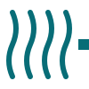

<h1>
  <picture>
    <source media="(prefers-color-scheme: dark)" srcset="docs/src/assets/branding/wavehouse-mark-dark.svg">
    
  </picture>
  WaveHouse
</h1>

[](https://github.com/Wave-RF/WaveHouse/actions/workflows/ci.yml)
[](https://go.dev/)
[](LICENSE)

**The Open-Source Real-Time API Gateway for ClickHouse.**

WaveHouse is a high-performance, Go-based gateway designed to sit entirely in front of ClickHouse. It acts as the exclusive entry and exit point for your analytics data, solving the hardest parts of high-scale data ingestion and real-time querying so ClickHouse can focus on what it does best: fast analytics.

If you are building user-facing analytics, **WaveHouse acts like Supabase for ClickHouse**—or an **open-source Tinybird** that pushes data to your frontend in real time over SSE and WebSockets, not just via pull-based REST queries.

📖 **Full documentation:** [wavehouse.dev](https://wavehouse.dev)

## ✨ Why WaveHouse?

ClickHouse is a phenomenal OLAP database, but directly exposing it to frontend applications comes with sharp edges. You typically have to build custom APIs, manage Kafka queues to prevent "too many parts" errors during insertion, and write complex replacing logic for deduplication. WaveHouse abstracts all of this away into a single, deployable binary so you stop interacting with ClickHouse directly.

* **📋 Schema-Aware Validation:** WaveHouse discovers your ClickHouse table schemas automatically via `system.columns` and validates every ingest payload against the real schema — unknown fields are rejected, types are checked, and nullable constraints are enforced. Bring Your Own Schema: you define tables in ClickHouse, WaveHouse enforces them.
* **📥 Asynchronous Buffered Ingestion:** Never drop a packet. WaveHouse writes incoming data to a highly durable Write-Ahead Log (WAL) and returns `200 OK` instantly, batching inserts to ClickHouse in the background.
* **👯 Optional Exact-Once Deduplication:** Built-in exact-match deduplication ensures duplicate payloads are dropped *before* they ever reach ClickHouse, saving expensive merge operations. Enable it when you need it, skip it when you don't.
* **⚡ In-process Query Caching:** An in-process Ristretto cache plus Go `singleflight` coalesce identical queries, protecting ClickHouse from dashboard "thundering herds."
* **🌊 Zero-Latency Real-Time Push:** When data is pushed via the WaveHouse API, it is immediately broadcast to SSE/WebSocket listeners—even before it gets flushed to ClickHouse. This ensures instant perceived ingestion, with seamless gap-fill from NATS JetStream history for clients that connect late.
* **🛡️ Dead Letter Queue:** Failed batch inserts are routed to a DLQ (backed by a separate NATS stream) so no data is silently lost. Inspect failures via the DLQ stats API.
* **🔐 Hasura-Style Access Control:** Define per-table, per-role column and row-level permissions with JWT claim templating. Policies are stored in NATS KV with file-based bootstrap and cluster-wide sync.
* **🔍 Structured Queries:** A type-safe query AST endpoint (`POST /v1/tables/{table}/query`) with schema validation, permission enforcement, timestamp bucketing for cache optimization, and aggregation support.
* **🔗 Named Pipes:** Pre-defined SQL templates (like Tinybird pipes) with parameter binding, role restrictions, and caching. Managed via admin API or bootstrapped from `.sql` files.
* **📦 TypeScript SDK:** `@wavehouse/sdk` — a zero-dependency client with type-safe query builder, real-time SSE streaming, live queries with smart aggregation updates, and codegen from ClickHouse schemas.

## 🛠️ Quick Start

Pick whichever flavour fits — Docker, prebuilt binary, or `go install`. Each one ends with WaveHouse listening on `http://localhost:8080`.

### A. Docker Compose (recommended for first-time)

The easiest way to see WaveHouse in action. Requires Docker.

```bash
# Clone the repository
git clone https://github.com/Wave-RF/WaveHouse.git
cd WaveHouse

# Start ClickHouse and WaveHouse
docker compose -f deployments/compose/standalone.yaml up -d

# Create a table in ClickHouse (Bring Your Own Schema)
docker compose -f deployments/compose/standalone.yaml exec clickhouse \
  clickhouse-client --query "
    CREATE TABLE IF NOT EXISTS clicks (
      page String,
      button String,
      score Float64,
      received_timestamp DateTime64(3, 'UTC') DEFAULT now64(3, 'UTC')
    ) ENGINE = MergeTree()
    ORDER BY (page)
  "

# Ingest data (no auth required by default)
curl -s -X POST http://localhost:8080/v1/ingest/clicks \
  -H "Content-Type: application/json" \
  -d '{"page": "/home", "button": "signup", "score": 42.5}'
# → {"ok":true}

# Check discovered schemas
curl -s http://localhost:8080/v1/schema | jq

# Query data (wait ~5s for the batch flush to ClickHouse)
curl -s -X POST http://localhost:8080/v1/query \
  -H "Content-Type: application/json" \
  -d '{"sql": "SELECT * FROM clicks LIMIT 10"}'

# Open a real-time SSE stream (Ctrl+C to stop)
curl -N http://localhost:8080/v1/stream/sse
```

WaveHouse is now accepting API requests on `http://localhost:8080`.

### B. Prebuilt container image

Skip the source clone — pull from GHCR:

```bash
# Tagged release (recommended for production)
docker pull ghcr.io/wave-rf/wavehouse:latest

# Or rolling main-branch dev build
docker pull ghcr.io/wave-rf/wavehouse:dev
```

Tagged images are built by `release.yml` on every `v*` git tag (`:latest`, `:vX.Y.Z`). Dev images are built by `publish-dev.yml` on every push to `main` (`:dev`, `:dev-<sha>`); old `:dev-<sha>` tags are pruned weekly by `cleanup-ghcr.yml`.

### C. `go install` / `go run` (binary, no Docker)

If you have Go 1.26+ installed:

```bash
# Install the latest tagged release into $GOBIN
go install github.com/Wave-RF/WaveHouse/cmd/wavehouse@latest

# Or run directly without installing
go run github.com/Wave-RF/WaveHouse/cmd/wavehouse@latest

# Or pin to a specific version
go install github.com/Wave-RF/WaveHouse/cmd/wavehouse@v0.1.0
```

You'll still need ClickHouse running somewhere — point WaveHouse at it via `WH_CH_ADDR`. See [Configuration](docs/configuration.md).

WaveHouse is built as an application, not a library — `internal/` packages are not importable from outside the module. Use the binary or container; if you need programmatic access, the [TypeScript SDK](docs/sdk.md) is the supported integration surface.

## 💻 Local Development

You'll need **Go 1.26+, GNU Make 4+, Docker (or Podman) with Compose v2, Node.js 20+, and pnpm 10+** on your PATH — see [docs/development.md § Prerequisites](docs/development.md#prerequisites) for the full list, version requirements, and macOS gotchas (BSD Make 3.81 won't work).

For building and testing WaveHouse locally with hot-reload:

```bash
# One-time bootstrap: installs golangci-lint into .bin/, downloads Go modules,
# and runs pnpm install for the SDK + E2E harness.
make tools

# Start ClickHouse
docker compose -f deployments/compose/dependencies.yaml up -d clickhouse

# Create your tables in ClickHouse, then:
make dev
```

WaveHouse will automatically recompile and restart whenever you save a `.go` file.

## 🤝 Contributing

We welcome issues, pull requests, and feedback! Please see our [CONTRIBUTING.md](CONTRIBUTING.md) for guidelines on how to structure your code and run the integration test suites.

## 📖 Documentation

The full documentation site lives at **[wavehouse.dev](https://wavehouse.dev)**. Source markdown is in [`docs/src/content/docs/`](docs/src/content/docs/):

* [Getting Started](docs/src/content/docs/getting-started.md) — Five-minute quickstart
* [Architecture](docs/src/content/docs/architecture.md) — System design, data flows, and package overview
* [API Reference](docs/src/content/docs/api.md) — All endpoints, authentication, request/response formats
* [Configuration](docs/src/content/docs/configuration.md) — Full config reference (YAML + environment variables)
* [Deployment](docs/src/content/docs/deployment.md) — Single-binary deployment, Docker images, releases, and health checks
* [Development](docs/src/content/docs/development.md) — Building, testing, linting, and project structure
* [SDK Reference](docs/src/content/docs/sdk.md) — TypeScript client SDK usage and codegen

## 📜 License

WaveHouse is open source under the [MIT License](LICENSE).
