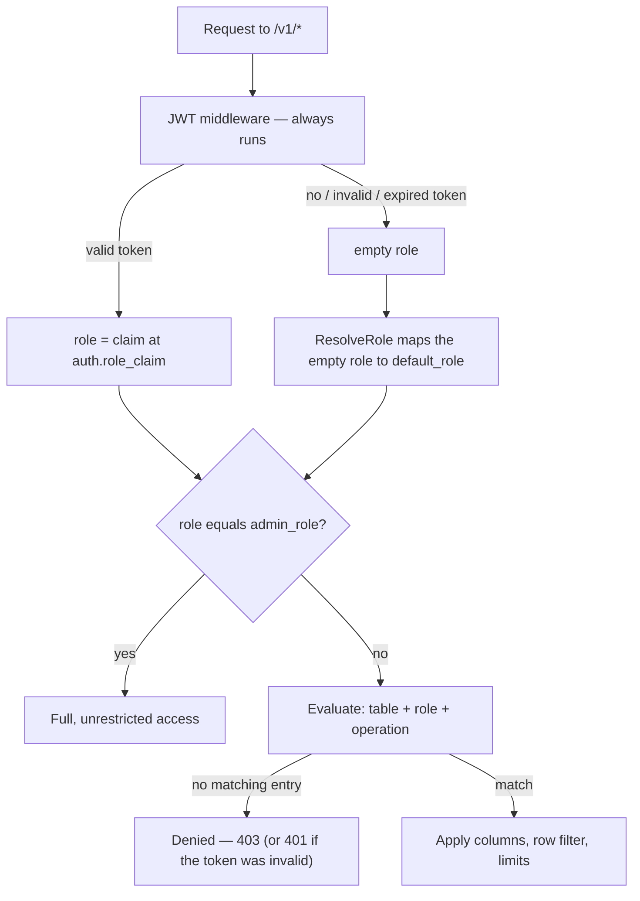

WaveHouse authorizes every request against a single **access control policy**: a per-table, per-role document that decides which columns a caller may see, which rows they may touch, what they may aggregate, and how much work a query may do. It is Hasura-style — column-level and row-level permissions with JWT claim templating — stored centrally and applied on every read, write, and live stream.

This guide explains the whole model: where roles come from, how to write a policy, how each rule is enforced, and how the policy is loaded and changed at runtime. For the raw config knobs see [Configuration](/configuration#access-control-policy); for the HTTP surface see the [API reference](/api#authentication). Named query pipes have their own, simpler authorization model — see [Named Pipes](/pipes).

## How a request is authorized

Authentication and authorization are **decoupled**. The JWT middleware always runs, but it never rejects a request — it only establishes *who* the caller is. The policy decides *what* they can do.



Two things make this safe by default:

- **Fail-closed.** A role only gets what the policy explicitly grants it. No policy entry for a table, operation, or role means *denied* — there is no implicit allow. If there is no policy at all (none seeded yet, or it was deleted), **every** request is denied, including the admin role.
- **The empty role matches nothing.** A request with no role never matches a policy entry by accident. It is authorized only after `default_role` deliberately maps it to a concrete role, or via the admin role.

## Roles

A role is an opaque string. Matching is **exact and case-sensitive** — `Viewer` and `viewer` are different roles, and there is no `"*"` any-role wildcard. Roles do not inherit one another's permissions.

### Where a role comes from

The role is read from a single JWT claim — the dot-path `auth.role_claim` (default `role`; e.g. `app_metadata.role` for a nested claim). The token plumbing around it — HMAC vs. JWKS validation, accepted signing algorithms, the `?token=` query fallback for streams — is covered in [API Reference — Authentication](/api#authentication), and the knobs that configure it in [Configuration — Authentication](/configuration#authentication).

For authorization, the behavior that matters is what happens with **no** role: the request falls back to `default_role`. A request is roleless when there is no token, when the token is invalid/expired/malformed (the reason is remembered, so a later denial is a `401`, not a bare `403`), or when a valid token simply carries no `role_claim`.

### `default_role` — public (unauthenticated) access

`default_role` is the policy field that controls public access. It is the role an empty/absent role resolves to, applied *before* evaluation:

- **Set it** (to a role that has policy entries) and roleless requests are evaluated as that role and receive exactly its permissions.
- **Leave it empty** and roleless requests stay roleless, match nothing, and are denied — a closed deployment.

Setting `default_role` does nothing on its own; the role you name still needs entries under `tables` to grant any access. Think of it as "which role does an anonymous caller assume", not "what can anonymous callers do".

:::caution[`default_role: admin` is a dev-only footgun]
Setting `default_role` equal to `admin_role` is permitted — it makes every unauthenticated request a full admin, including `/v1/admin/*`, which is handy for local development with no tokens. It is **never** for production. Every node that loads such a policy logs a loud `WARN` on startup and on every update.
:::

### `admin_role` — the privileged role

`admin_role` (default: `"admin"`) is the one role that bypasses the entire policy:

- It is granted **full, unrestricted access** to every table and operation. An admin is **never** column-scoped or row-scoped, even by a policy entry that explicitly names the admin role — admin is an unconditional bypass, not a scoped grant.
- It is the gate for every admin surface: `/v1/admin/*` (raw SQL, policy CRUD, pipe CRUD), plus the schema and DLQ endpoints. The gate reads `admin_role` live from the policy, so changing it applies without a restart.

There is no separate `service` role. To reach an admin endpoint or to read data beyond what `default_role` grants, present a valid token whose `role_claim` is the admin role (or another granted role).

:::caution[A missing policy locks everyone out — including admin]
`admin_role` only grants access while a policy is loaded. Deleting the policy from the store sets it to `nil`, and a `nil` policy denies everyone, by design: an implicit admin grant must never re-open a deliberately-emptied deployment. Recovery is server-side — restore the [bootstrap file](#bootstrapping-and-the-policy-lifecycle) and reboot, not an "admin" token over HTTP.
:::

## Anatomy of a policy

A policy is a YAML or JSON document with three top-level fields:

| Field | Type | Description |
| ----- | ---- | ----------- |
| `default_role` | string | Role that a roleless (tokenless or claimless) request assumes. Empty = no public access. |
| `admin_role` | string | Role granted full, unrestricted access and the `/v1/admin/*` gate. Optional; defaults to `"admin"`. |
| `tables` | map | Per-table permissions, keyed by ClickHouse table name. |

Each table entry holds permissions for two operations — `select` (reads) and `insert` (writes) — and each operation maps **role → permissions**:

```yaml
tables:
  events:                 # ClickHouse table name
    select:               # read permissions
      viewer:             # role → what "viewer" may read
        allow_columns: ["page", "score"]
    insert:               # write permissions
      writer:             # role → what "writer" may insert
        allow_columns: ["page", "score", "user_id"]
```

A role with no entry under the operation it is attempting is denied. The set of permission fields below applies to both `select` and `insert` entries, though some (row `filter`, aggregations, limits) only take effect on the read path and some (`check`) only on the write path — the [enforcement table](#where-each-rule-is-enforced) maps which is which.

## Column permissions

`allow_columns` and `deny_columns` control which columns a role can read (on `select`) or write (on `insert`).

```yaml
select:
  viewer:
    allow_columns: ["page", "button", "received_timestamp"]
    deny_columns: ["user_email", "ip_address"]
```

The rules, in order:

1. **`deny_columns` always wins.** A column in the deny list is rejected even if it is also allowed.
2. **An empty (or `["*"]`) `allow_columns` means "all columns"** — every column not in `deny_columns` is permitted. Use this with `deny_columns` for a blocklist posture: see everything *except* a few sensitive columns.
3. **A non-empty `allow_columns` is an allowlist** — only the named columns (and never the denied ones) are permitted.

On a structured query (`POST /v1/query?table={table}`) the allowlist is a **hard cap on every column the query references — in any clause**: the projection, an aggregation argument, `filters`, `group_by`, `order_by`, and `time_range`. Naming a disallowed column anywhere is rejected with `403 column "x" not allowed`. A full-row read is requested explicitly with `"select_all": true`, which expands to exactly the columns the role may read — never a raw `SELECT *` that could include a denied column; if the role is allowed *no* columns, the read is rejected (`403`) rather than returning empty rows. **Omitting `columns` (or sending `[]` / `""`) returns nothing** — a request for no data — so a hidden column can't leak by being left out, grouped on, or filtered on to infer its values. (Note: in a query, `["*"]` is the *literal column named `*`*, not a wildcard — use `select_all` for all columns. In `allow_columns`, `["*"]` is still the all-columns wildcard.) On insert (`POST /v1/ingest?table={table}`) the body is `403 column "x" not allowed for insert`. On live streams, denied columns are silently **stripped** from each event rather than rejecting the connection. The structured-query and live-stream paths defer to the **same** per-column decision (`IsColumnAllowed`), so the two read surfaces enforce identical column visibility and can't drift apart.

## Row-level security

`filter` restricts *which rows* a role can read by injecting a `WHERE` clause into the generated SQL. Each entry maps a column to a comparison whose value is usually a **JWT claim template**:

```yaml
select:
  viewer:
    filter:
      tenant_id:
        _eq: "{{ jwt.app_metadata.tenant_id }}"
```

This produces `WHERE (tenant_id = ?)` with the caller's `app_metadata.tenant_id` claim bound as the parameter — so a `viewer` only ever sees rows for their own tenant, and the value comes from the signed token, not from anything the client sends.

Supported comparison operators:

| Operator | SQL | Meaning |
| -------- | --- | ------- |
| `_eq` | `col = ?` | equals |
| `_neq` | `col != ?` | not equals |
| `_gt` | `col > ?` | greater than |
| `_lt` | `col < ?` | less than |

> The policy `Filter` schema also accepts `_in`, but it is **not yet enforced** (tracked in #224) — an `_in` clause is silently ignored (no predicate is produced), so stick to the operators above.

Multiple columns (and multiple operators on one column) are combined with `AND`. The policy-derived predicate is ANDed with whatever filters the caller's own query supplies, so a caller can never widen their row visibility past the policy.

### JWT claim templating

Any policy value may interpolate token claims with `{{ jwt.<dot.path> }}`:

- `{{ jwt.sub }}` → the token's `sub` claim.
- `{{ jwt.app_metadata.tenant_id }}` → a nested claim.

Values are always bound as SQL **parameters**, never concatenated into the query, so templating is injection-safe. If a claim path can't be resolved, the template renders as an **empty string** (rather than leaking `<nil>` into the predicate) — which, for a tenant filter, means the caller matches no tenant and sees nothing. Make sure your identity provider actually issues the claims your policy templates reference.

## Insert checks

`check` is the write-path counterpart to `filter`: it constrains the *values* a role may insert, again via claim templates. It only supports `_eq`.

```yaml
insert:
  writer:
    allow_columns: ["page", "score", "user_id", "tenant_id"]
    check:
      user_id:
        _eq: "{{ jwt.sub }}"
      tenant_id:
        _eq: "{{ jwt.app_metadata.tenant_id }}"
```

For each checked column, on `POST /v1/ingest?table={table}`:

- **If the request body includes the column**, its value must equal the claim-derived value, or the insert is rejected with `403 check failed for column "x"`. A `writer` cannot forge a row for another user or tenant.
- **If the request body omits the column**, WaveHouse **auto-injects** the claim-derived value before publishing. So clients can send just the business fields (`page`, `score`) and let the policy stamp `user_id` and `tenant_id` from the token.

This pairs naturally with a matching `filter` on the `select` side: `check` stamps the tenant on write, `filter` scopes reads to that tenant.

## Aggregation controls

`allowed_aggregations` and `denied_aggregations` restrict which aggregation functions a role may use in a structured query (`count`, `sum`, `avg`, `quantile`, …). Matching is case-insensitive and follows the same precedence as columns:

```yaml
select:
  viewer:
    denied_aggregations: ["quantile", "median"]   # blocklist: everything else is allowed
  analyst:
    allowed_aggregations: ["count", "sum", "avg"]  # allowlist: only these three
```

- `denied_aggregations` always wins.
- An empty `allowed_aggregations` means all non-denied functions are allowed; a non-empty list is an allowlist.

A disallowed function returns `403 aggregation "x" not allowed`. This is useful when row-level privacy depends on preventing fine-grained reconstruction (e.g. blocking `quantile`/`argMin` while allowing coarse `count`/`sum`).

## Resource limits

Two fields cap the cost of a single structured query. Both must be non-negative; `0` (the default) means "no policy-imposed limit".

| Field | Effect |
| ----- | ------ |
| `max_rows` | Caps the query's `LIMIT`. If the caller asks for more (or omits a limit), the result is clamped to `max_rows`. |
| `max_execution_time_ms` | Caps the ClickHouse execution timeout for the query, applied as the *minimum* of this value and the server's `clickhouse.query_timeout`. |

```yaml
select:
  viewer:
    max_rows: 1000
    max_execution_time_ms: 5000
```

These bound a role's blast radius on the cached read path. They do not apply to raw admin SQL, which is unbounded by design (other than the 64 MiB response cap noted in the [API reference](/api)).

## Where each rule is enforced

The same policy drives every data path, but not every field is meaningful on every path:

| Surface | Endpoint | Enforced |
| ------- | -------- | -------- |
| Structured read | `POST /v1/query?table={table}` | table+role `select` required, then `allow`/`deny_columns`, row `filter`, aggregation rules, `max_rows`, `max_execution_time_ms` |
| Ingest (write) | `POST /v1/ingest?table={table}` | table+role `insert` required, then `allow`/`deny_columns` and `check` (enforced and auto-injected) |
| Live stream | `GET /v1/stream` | table+role `select` required (a table the role can't read is skipped), then denied columns are masked from each event |
| Raw SQL | `POST /v1/admin/query` | `admin_role` only — no per-statement policy; the role gate is the entire authorization story |
| Named pipe | `GET/POST /v1/pipes/{name}` | not the policy engine — per-pipe `allowed_roles`; see [Named Pipes](/pipes) |

:::caution[Live streams enforce access, not row filters]
SSE subscribers are checked for table-level `select` permission and have denied columns stripped from each event, but the row-level `filter` predicates and `max_rows`/`max_execution_time_ms` limits are a property of the SQL query path and are **not** applied to the live event stream. If a role must never observe another tenant's rows in real time, don't grant it stream access to a shared table — scope the data at the table level.
:::

## Managing the policy

The policy lives behind three admin endpoints (all require `admin_role`):

| Method | Endpoint | Purpose |
| ------ | -------- | ------- |
| `GET` | `/v1/admin/policy` | Fetch the current policy. Returns `{"tables":{}}` when none is set. |
| `PUT` | `/v1/admin/policy` | Replace the **entire** policy. Validated before it is saved. |
| `POST` | `/v1/admin/policy/validate` | Dry-run validation — returns `{"valid": true}` or the error, without saving. |

`PUT` is a full replace, not a merge: send the complete document every time. Validation rejects empty role names and negative limits (but intentionally allows `default_role == admin_role`, warning instead). Once accepted, the policy is written to NATS KV and propagated to every node via KV Watch — changes apply cluster-wide within moments, no restart.

```bash
# Replace the policy (admin token required). POST the same body to
# /v1/admin/policy/validate first for a dry run that doesn't save.
curl -X PUT http://localhost:8080/v1/admin/policy \
  -H "Authorization: Bearer $ADMIN_TOKEN" \
  -H "Content-Type: application/json" \
  -d @policy.json
```

The full request and response shapes for these endpoints live in the [API Reference](/api); the [TypeScript SDK](/sdk) wraps them as `client.policy.get()`, `client.policy.set(policy)`, and `client.policy.validate(policy)`.

## Bootstrapping and the policy lifecycle

NATS KV is the **source of truth** for the live policy. A file is only ever a *seed* for an empty store:

- `policy.file_path` (config) points at a YAML or JSON policy file. On startup, **if and only if the KV store is empty**, the file is loaded, validated, and written to KV. On every subsequent boot the file is ignored — KV already has the authoritative copy, and runtime edits flow through `PUT /v1/admin/policy`.
- **When `policy.file_path` is set, the file must exist and parse**, or WaveHouse refuses to boot. That turns a typo or a missing mount into a loud failure instead of a silent fail-closed deployment that denies everything.
- **When `policy.file_path` is empty and KV is empty**, the store comes up with no policy — every request is denied (logged loudly) until you seed one via `PUT /v1/admin/policy`.

```yaml
# config.yaml
policy:
  file_path: /etc/wavehouse/policy.yaml   # seed on first boot only; KV wins thereafter
```

Because a deleted policy is a total lockout (including admin), treat the bootstrap file as your recovery path: keep it in version control, mount it read-only, and you can always restore a known-good policy by clearing KV state and rebooting. See [Configuration — Access Control Policy](/configuration#access-control-policy) for the exact knobs.

## A complete example

A multi-tenant analytics deployment: anonymous callers get nothing, `viewer` reads its own tenant's rows with sensitive columns masked and expensive aggregations blocked, `writer` ingests events that are stamped with the caller's identity, and `admin` is unrestricted.

```yaml
admin_role: admin        # full access + the /v1/admin/* gate (this is also the default)
default_role: ""         # "" = closed: a request with no/!valid token is denied

tables:
  events:
    select:
      viewer:
        # See every column except PII, only for your own tenant, and don't
        # allow distribution-revealing aggregations or runaway scans.
        deny_columns: ["user_email", "ip_address"]
        filter:
          tenant_id:
            _eq: "{{ jwt.app_metadata.tenant_id }}"
        denied_aggregations: ["quantile", "median"]
        max_rows: 1000
        max_execution_time_ms: 5000
    insert:
      writer:
        # Clients send business fields; the policy stamps identity from the token.
        allow_columns: ["event_name", "page", "score", "user_id", "tenant_id"]
        check:
          user_id:
            _eq: "{{ jwt.sub }}"
          tenant_id:
            _eq: "{{ jwt.app_metadata.tenant_id }}"
```

With this policy loaded:

- A request with **no token** has the empty role, which `default_role: ""` leaves empty → **denied** everywhere.
- A `viewer` token can `POST /v1/query?table=events` but only sees its tenant's rows, never `user_email`/`ip_address`, can't run `quantile`, and is capped at 1000 rows / 5s.
- A `writer` token can `POST /v1/ingest?table=events` sending `{"event_name":"click","page":"/home","score":1}`; WaveHouse auto-injects `user_id` and `tenant_id` from the token, and rejects any body that tries to set them to someone else.
- An `admin` token can do all of the above plus raw SQL, schema, DLQ, and policy/pipe management — unscoped.

## Field reference

Per-role permissions (`tables.<table>.select.<role>` and `.insert.<role>`):

| Field | Type | Applies to | Description |
| ----- | ---- | ---------- | ----------- |
| `allow_columns` | string[] | select, insert | Allowlist of columns. Empty or `["*"]` = all columns (minus `deny_columns`). |
| `deny_columns` | string[] | select, insert | Blocklist of columns. Always wins over `allow_columns`. |
| `filter` | map | select | Row-level `WHERE` predicates (`_eq`/`_neq`/`_gt`/`_lt`), ANDed together. Values support `{{ jwt.path }}` templating. |
| `check` | map | insert | Required insert values (`_eq` only). Enforced if present in the body, auto-injected if absent. Supports templating. |
| `allowed_aggregations` | string[] | select | Allowlist of aggregation functions. Empty = all (minus denied). Case-insensitive. |
| `denied_aggregations` | string[] | select | Blocklist of aggregation functions. Always wins. |
| `max_rows` | int | select | Caps the query `LIMIT`. `0` = no limit. Must be non-negative. |
| `max_execution_time_ms` | int | select | Caps the query timeout (min with `clickhouse.query_timeout`). `0` = no limit. Must be non-negative. |

## See also

- **[Named Pipes](/pipes)** — pre-defined, parameterized SQL with their own `allowed_roles` allowlist.
- **[Configuration — Access Control Policy](/configuration#access-control-policy)** — the `policy.file_path` and auth config knobs.
- **[API Reference — Authentication](/api#authentication)** — token format, the admin endpoints, and error codes.
