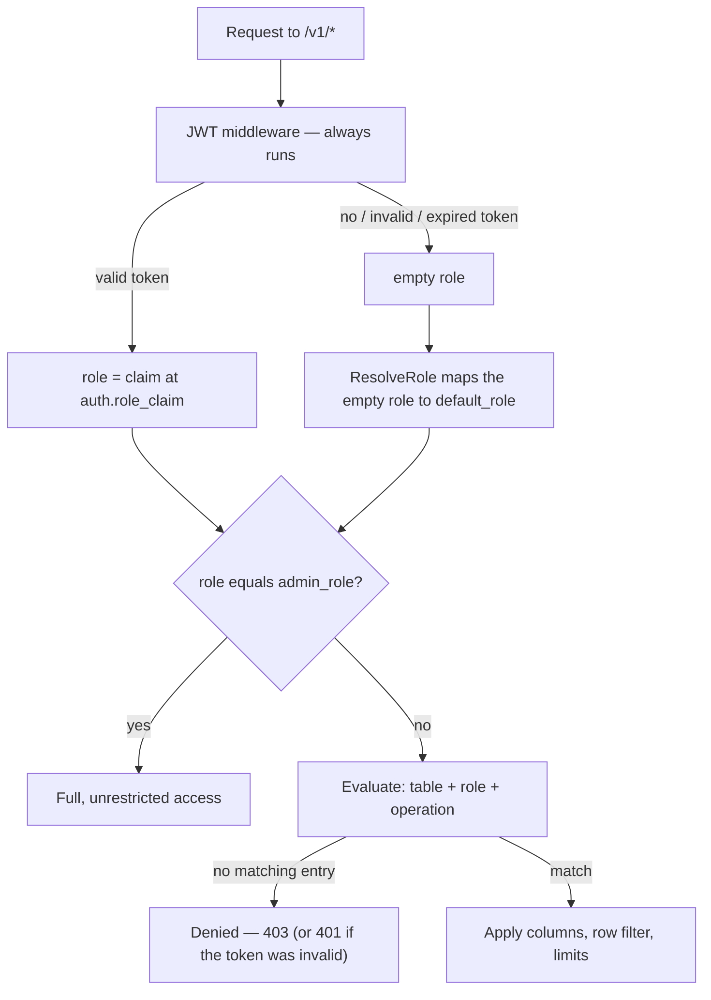

WaveHouse authorizes every request against a single **access control policy**: a per-table, per-role document that decides which columns a caller may see, which rows they may touch, what they may aggregate, and how much work a query may do. It is Hasura-style — column-level and row-level permissions with JWT claim templating — kept in the [settings directory](/settings-directory#policiesjson) and applied on every read, write, and live stream.

This guide explains the whole model: where roles come from, how to write a policy, how each rule is enforced, and how the policy is loaded and changed at runtime. For the file format and validation rules see [Settings Directory — `policies.json`](/settings-directory#policiesjson); for the request-level auth surface — token format, the operator key, and the denial codes — see the [API reference](/api#authentication). Named query pipes have their own, simpler authorization model — see [Named Pipes](/pipes).

## How a request is authorized

Authentication and authorization are **decoupled**. The JWT middleware always runs, but it never rejects a request — it only establishes *who* the caller is. The policy decides *what* they can do.



Two things make this safe by default:

- **Fail-closed.** A role only gets what the policy explicitly grants it. No policy entry for a table, operation, or role means *denied* — there is no implicit allow. If there is no policy at all (an empty `policies.json`), **every token-based** request is denied, including the admin role — the lone exception is the [operator key](#operator-key), below.
- **The empty role matches nothing.** A request with no role never matches a policy entry by accident. It is authorized only after `default_role` deliberately maps it to a concrete role, or via the admin role.

## Roles

A role is an opaque string. Matching is **exact and case-sensitive** — `Viewer` and `viewer` are different roles, and there is no `"*"` any-role wildcard. Roles do not inherit one another's permissions.

### Where a role comes from

The role is read from a single JWT claim — the dot-path `auth.role_claim` (default `role`; e.g. `app_metadata.role` for a nested claim). The token plumbing around it — HMAC vs. JWKS validation, accepted signing algorithms, the `?token=` query fallback for streams — is covered in [API Reference — Authentication](/api#authentication), and the knobs that configure it in [Configuration — Authentication](/configuration#authentication).

For authorization, the behavior that matters is what happens with **no** role: the request falls back to `default_role`. A request is roleless when there is no token, when the token is invalid/expired/malformed (the reason is remembered, so a later denial is a `401`, not a bare `403`), or when a valid token simply carries no `role_claim`.

### `default_role` — public (unauthenticated) access

`default_role` is the policy field that controls public access. It is the role an empty/absent role resolves to, applied *before* evaluation:

- **Set it** (to a role that has policy entries) and roleless requests are evaluated as that role and receive exactly its permissions.
- **Leave it empty** and roleless requests stay roleless, match nothing, and are denied — a closed deployment.

Setting `default_role` does nothing on its own; the role you name still needs entries under `tables` to grant any access. Think of it as "which role does an anonymous caller assume", not "what can anonymous callers do".

:::caution[`default_role: admin` is a dev-only footgun]
Setting `default_role` equal to `admin_role` is permitted — it makes every unauthenticated request a full admin, including `/v1/ops/*`, which is handy for local development with no tokens. It is **never** for production. Every node that loads such a policy logs a loud `WARN` on startup and on every update.
:::

### `admin_role` — the privileged role

`admin_role` (default: `"admin"`) is the one role that bypasses the entire policy:

- It is granted **full, unrestricted access** to every table and operation. An admin is **never** column-scoped or row-scoped, even by a policy entry that explicitly names the admin role — admin is an unconditional bypass, not a scoped grant.
- It is the gate for the whole `/v1/ops/*` tree — raw SQL, pipe inspection, settings reload, schema discovery, and DLQ stats. The gate reads `admin_role` live from the policy, so changing it applies without a restart.

There is no separate `service` role. To reach an admin endpoint or to read data beyond what `default_role` grants, present a valid token whose `role_claim` is the admin role (or another granted role) — **or** present the non-JWT [operator key](#operator-key) described below.

:::caution[A missing policy locks everyone out — including admin]
`admin_role` only grants access while a policy is adopted. An empty `policies.json` (`{}`) adopts **no policy**, and no policy denies every **token-based** caller, by design: an implicit admin grant must never re-open a deliberately-emptied deployment. Recovery is a file edit: write a policy to `policies.json` and let the watcher pick it up (or `SIGHUP`, or `POST /v1/ops/settings/reload`) — see [the policy lifecycle](#the-policy-lifecycle). The one credential that still works meanwhile is the [operator key](#operator-key), which can trigger the reload over HTTP.
:::

### Operator key

`auth.operator_key` (config; presented in an `Authorization: Operator <key>` header, or the `X-Operator-Key` alias) is a static, role-free credential for the person running the deployment, meant for break-glass recovery. A request presenting it is authorized as a **full-access platform operator** — the entire data plane *and* the `/v1/ops/*` management surface — without minting a JWT, and independently of the JWT verifier (`jwt_secret`/`jwks_url`).

Unlike `admin_role`, the operator key is honored **even when no policy is adopted** (an empty `policies.json`), so it is the one HTTP credential that still reaches `/v1/ops/*` — `POST /v1/ops/settings/reload` once the file is fixed, whose findings report exactly why a rejected directory was refused — the break-glass case the caution above describes. It is matched in constant time, takes precedence over any Bearer token on the same request, and is disabled when empty (the default). Treat it as an admin secret: load it from a secret store, serve it only over TLS, and rotate it like any other credential. See [Configuration — Authentication](/configuration#authentication).

Generate a high-entropy value (≥ 256 bits of randomness) and load it from a secret manager rather than committing it:

```bash
openssl rand -base64 32          # 32 random bytes, base64-encoded — no shell-quoting surprises
# or, without openssl:
head -c 32 /dev/urandom | base64
```

Set the result via `WH_AUTH_OPERATOR_KEY` (or `auth.operator_key`) and present it as `Authorization: Operator <key>` (or `X-Operator-Key: <key>`):

```bash
curl -X POST -H "Authorization: Operator $(cat operator.key)" https://wavehouse.example.com/v1/ops/settings/reload
```

**Monitor failed attempts.** A successful operator authentication is audit-logged at `INFO`; a request presenting a *wrong* operator key is logged at `WARN` (`operator key authentication failed`) and counted by the `wavehouse_auth_operator_key_failures_total` metric, then handled as an ordinary unauthenticated request (the middleware never rejects). A wrong operator key is never sent by accident, so a nonzero rate is a strong probing/brute-force signal against your most privileged credential — alert on it.

## Anatomy of a policy

A policy is a JSON document — the settings directory's [`policies.json`](/settings-directory#policiesjson) — with three top-level fields:

| Field | Type | Description |
| ----- | ---- | ----------- |
| `default_role` | string | Role that a roleless (tokenless or claimless) request assumes. Empty = no public access. |
| `admin_role` | string | Role granted full, unrestricted access and the `/v1/ops/*` gate. Optional; defaults to `"admin"`. |
| `tables` | map | Per-table permissions, keyed by ClickHouse table name. |

Each table entry maps **role → grant**, and each grant states what that role may do with two optional blocks — `select` (reads) and `insert` (writes):

```json
{
  "tables": {
    "events": {
      "viewer": {
        "select": {
          "allow_columns": ["page", "score"]
        }
      },
      "writer": {
        "insert": {
          "allow_columns": ["page", "score", "user_id"]
        }
      }
    }
  }
}
```

A role with no entry on the table — or an entry whose block for the operation it is attempting is absent — is denied. `select` and `insert` carry genuinely different fields: row `filter`, aggregation rules, and the resource limits are read-side only; `check` is write-side only; `allow_columns`/`deny_columns` appear on both. The [enforcement table](#where-each-rule-is-enforced) maps which is which, and the [field reference](#field-reference) lists each block's fields.

**Upgrading?** Earlier versions nested the other way round — `tables.<table>.select.<role>`. A file in the old shape is rejected at validation, with the message naming both layouts and linking straight to [Migrating from the operation-first layout](#migrating-from-the-operation-first-layout), which has a before/after.

### Migrating from the operation-first layout

Before this release a table entry was keyed by operation first, with the roles underneath:

```json
{
  "tables": {
    "events": {
      "select": {
        "viewer": { "allow_columns": ["page", "score"] },
        "analyst": { "allow_columns": ["*"], "max_rows": 1000 }
      },
      "insert": {
        "viewer": { "allow_columns": ["*"], "check": { "user_id": { "_eq": "{{ jwt.sub }}" } } }
      }
    }
  }
}
```

Now the role comes first and the operations sit inside its grant. The permission fields themselves are unchanged — only the nesting moves, and each role that appeared under both operations collapses into one entry:

```json
{
  "tables": {
    "events": {
      "viewer": {
        "select": { "allow_columns": ["page", "score"] },
        "insert": { "allow_columns": ["*"], "check": { "user_id": { "_eq": "{{ jwt.sub }}" } } }
      },
      "analyst": {
        "select": { "allow_columns": ["*"], "max_rows": 1000 }
      }
    }
  }
}
```

Each field is now accepted only on the side it was ever enforced on. Under the old layout one struct backed both operation maps, so every field decoded on both sides — but they were not all treated alike. `filter` on an `insert` grant and `check` on a `select` one are rejected at validation by a rule written for exactly that mistake ([#541](https://github.com/Wave-RF/WaveHouse/pull/541)) — unreleased, like this change — and the split types now refuse them one layer earlier still, as unknown keys at the strict decode. `allowed_aggregations`, `denied_aggregations` and the four `max_*` limits had no such rule and were simply decoded under `insert` and ignored; those now fail validation too. **If you are migrating from 0.1.0, none of the eight were enforced** — an insert-side `filter` there resolved into a `WHERE` the insert path never read, exactly as an insert-side `max_rows` did nothing. Converting to the role-first layout drops both, and validation will now tell you they are there — naming the offending field, though not yet the table or role that carried it.

There is no automatic conversion — the file is the source of truth and rewriting it in place would be a write path WaveHouse deliberately does not have. Convert `policies.json` by hand (or with the mapping above), then check it with `wavehouse validate` before restarting. A document still in the old layout is reported as one clear error naming the table and operation, not a decode failure. One shape escapes that detection: an **empty** operation block (`"select": {}`) carries no role names to give it away, so it reads as a grant for a role literally named `select`. Whether you then see an error or a warning depends on `roles.json` — if `select` is not declared there, the usual case, the undeclared-role error fires; if it is, you get the empty-grant warning and the document adopts. The one shape whose two readings *disagree* — a grant keyed by a role named after the *other* operation, such as `tables.clicks.select.insert` — is refused with its own message asking you to rename the role, rather than guessed at in either direction. A role named after its own operation (`tables.clicks.select.select`) grants the same access under either reading, so it is accepted.

## Column permissions

`allow_columns` and `deny_columns` control which columns a role can read (on `select`) or write (on `insert`).

```json
{
  "viewer": {
    "select": {
      "allow_columns": ["page", "button", "received_timestamp"],
      "deny_columns": ["user_email", "ip_address"]
    }
  }
}
```

The rules, in order:

1. **`deny_columns` always wins.** A column in the deny list is rejected even if it is also allowed.
2. **An empty (or `["*"]`) `allow_columns` means "all columns"** — every column not in `deny_columns` is permitted. Use this with `deny_columns` for a blocklist posture: see everything *except* a few sensitive columns.
3. **A non-empty `allow_columns` is an allowlist** — only the named columns (and never the denied ones) are permitted.

On a structured query (`POST /v1/query?table={table}`) the allowlist is a **hard cap on every column the query references — in any clause**: the projection, an aggregation argument, `filters`, `group_by`, `order_by`, and `time_range`. Naming a disallowed column anywhere is rejected with `403 column "x" not allowed`. A full-row read is requested explicitly with `"select_all": true`, which expands to exactly the columns the role may read — never a raw `SELECT *` that could include a denied column; if the role is allowed *no* columns, the read is rejected (`403`) rather than returning empty rows. **Omitting `columns` (or sending `[]` / `""`) returns nothing** — a request for no data — so a hidden column can't leak by being left out, grouped on, or filtered on to infer its values. (Note: in a query, `["*"]` is the *literal column named `*`*, not a wildcard — use `select_all` for all columns. In `allow_columns`, `["*"]` is still the all-columns wildcard.) On insert (`POST /v1/ingest?table={table}`) the rule is enforced by compiling the role its *own* copy of the table schema, without the columns it may not write — so a record naming one is refused by ClickHouse's parser with code **117**, `Unknown field found while parsing JSONEachRow format: x`, the same answer a column the table does not have gets. The message no longer confirms whether the column exists. On live streams, denied columns are silently **stripped** from each event rather than rejecting the connection. The structured-query and live-stream paths defer to the **same** per-column decision (`IsColumnAllowed`), so the two read surfaces enforce identical column visibility and can't drift apart.

## Row-level security

`filter` restricts *which rows* a role can read. One resolution drives **both** read surfaces: the structured query injects the predicates as a `WHERE` clause, and the live stream compiles the *same* resolved predicates through chtypes and evaluates them per subscriber before delivering an event — so row visibility cannot drift between the two paths (fail-closed boundary; see [the enforcement caution below](#where-each-rule-is-enforced)). Each entry maps a column to a comparison whose value is usually a **JWT claim template**:

```json
{
  "viewer": {
    "select": {
      "filter": {
        "tenant_id": {
          "_eq": "{{ jwt.app_metadata.tenant_id }}"
        }
      }
    }
  }
}
```

This produces `WHERE (tenant_id = ?)` with the caller's `app_metadata.tenant_id` claim bound as the parameter — so a `viewer` only ever sees rows for their own tenant, and the value comes from the signed token, not from anything the client sends.

Supported comparison operators:

| Operator | SQL | Meaning |
| -------- | --- | ------- |
| `_eq` | `col = ?` | equals |
| `_neq` | `col != ?` | not equals |
| `_gt` | `col > ?` | greater than |
| `_lt` | `col < ?` | less than |
| `_in` | `col IN (?, …)` | one of a set |

`_in` scopes a column to a **set** of values. Unlike the other operators, its value is a single claim that resolves to a JSON **array**: `tenant_id: { _in: "{{ jwt.app_metadata.tenant_ids }}" }` with a token claim `tenant_ids: ["a", "b"]` produces `tenant_id IN ('a', 'b')`. This is the multi-tenant case — the allowed set rides on the signed token. A scalar claim yields a one-element set; a claim that is absent, `null`, or an empty **array** matches **no rows** (fail-closed: an empty allowed-set sees nothing, never everything). So does an array carrying any **non-scalar element** — one `null`, object, or nested-array element fails the *whole* set closed rather than being skipped, since a set the token only half-vouches for shouldn't quietly shrink. A claim present as an empty *string* is a value like any other and binds as the one-element set `IN ('')` — see [JWT claim templating](#jwt-claim-templating).

Multiple columns (and multiple operators on one column) are combined with `AND`. The policy-derived predicate is ANDed with whatever filters the caller's own query supplies, so a caller can never widen their row visibility past the policy.

Every `filter` entry must set at least one operator: an operator-less entry (`"tenant_id": {}`) would contribute no predicate — no row restriction at all — so validation rejects it. And `filter` exists only on `select` grants — the `insert` block has no such field, so a `filter` there is an unknown key and the strict decode rejects the whole document before any resolver sees it; constrain inserted values with [`check`](#insert-checks) instead.

### JWT claim templating

Any `filter` or `check` operator value may interpolate token claims with `{{ jwt.<dot.path> }}` (other policy fields, like `allow_columns`, take their values literally):

- `{{ jwt.sub }}` → the token's `sub` claim.
- `{{ jwt.app_metadata.tenant_id }}` → a nested claim.

Values are always bound as SQL **parameters**, never concatenated into the query, so templating is injection-safe. If a claim path in a `filter` template can't be resolved (a validly-signed token that simply doesn't carry the claim), that filter **fails closed**: the predicate becomes constant-false, so on the structured-query path (`POST /v1/query`) the role sees **no rows**, and the live stream withholds every event for that subscriber — one resolution drives both read surfaces (see [where each rule is enforced](#where-each-rule-is-enforced)). This holds for every operator — `_eq`, `_neq`, `_gt`, `_lt`, and `_in` alike. The alternative, binding the empty string the template would render to, would leave a live predicate against `''`: `_eq` would match every empty-valued row, and `_neq`/`_gt` on a string column would match essentially *all* rows, erasing the restriction. A literal value with no template in it — including an explicit `""` — binds exactly as written, and ClickHouse reads it under the column's type: a `String` column compares that exact text, while a numeric column reads the constant as a number. A spelling the column cannot read is not a second chance — `_eq: "1.0"` against a `UInt64` is ClickHouse's own code 53 `TYPE_MISMATCH` per row, which withholds on a read filter and is a `422` on an insert. Write a literal the column can read.

"Can't be resolved" means the claim path is **absent** from the token (or `null`) — or resolves to a JSON **object or array** rather than a scalar, which usually means a dropped path segment (`{{ jwt.app_metadata }}` where `{{ jwt.app_metadata.tenant_id }}` was meant); the one structured shape with defined semantics is the bare-claim `_in` array above. Scalar claims — strings, booleans, and numbers — resolve normally. A numeric claim binds in **canonical decimal form**, not the token's spelling: `1.0` and `1e3` bind as `1` and `1000`, so spelling differences between issuers never change the bound value, and an integer id keeps every digit up to a ~100-digit bound on the value's *exact* decimal form (so `1e150` is refused even though a float64 holds it — prefer issuing integer ids as integers). Type the scoped column to match: an integer column, or a `Decimal` whose scale covers the claim's fractional digits, keeps the comparison exact, while a `Float32`/`Float64` column rounds the stored value and gives that exactness back (`col = '9007199254740993'` matches a stored `9007199254740992` there). A claim that is *present but empty* is a value the token vouches for: it resolves to `''` and binds normally. Make sure your identity provider issues the claims your policy templates reference — and omits unset claims rather than issuing them as empty strings.

Claim paths may contain only letters, digits, `_`, and `.` (the segment separator). Any `{{ … }}` fragment that is not a well-formed `{{ jwt.<path> }}` template — a path outside that grammar (a hyphen: `{{ jwt.tenant-id }}`; a namespaced claim: `{{ jwt.https://app.example.com/tenant_id }}`), a missing or misspelled `jwt.` prefix, or an unterminated `{{` — is **not** recognized as a template, and left unchecked the resolver would bind the literal `{{ … }}` text as a value. (Policy values have no other placeholder syntax; a pipe's `{{param}}` placeholders are a different mechanism and are not accepted here.) That is *not* fail-closed: on a read filter `_neq`/`_lt` would then match essentially every row (a leak), and on a write `check` the literal text would be stamped into every inserted row (silent corruption). So such a policy is **rejected when it is validated**: a `policies.json` carrying one refuses boot, is refused by a reload (the previous good policy stays in effect), and fails `wavehouse validate`. Every adoption runs the current rules, so an upgrade that tightens validation re-checks the file on the next boot or reload. Flatten hyphenated or namespaced claims into a supported path at your identity provider — on Auth0, an [Action can set a flat custom claim](https://auth0.com/docs/secure/tokens/json-web-tokens/create-custom-claims) outside the registered OIDC names (its legacy Rules required URL namespacing, which established tenants often still carry), and namespacing is a common OIDC convention elsewhere, so a namespaced claim is the shape you are most likely to meet first.

Row filters apply on the structured-query path and, per subscriber, on the live SSE stream — the stream compiles the same resolved predicates through the in-process ClickHouse parser and evaluates them against each subscriber's token claims (see the [enforcement caution](#where-each-rule-is-enforced) for the fail-closed reasons a compile or evaluation can withhold a row). Named pipes authorize by `allowed_roles` membership alone — scope a pipe's exposure in its SQL text, since neither the table policy's row `filter` nor its column allow/deny list is applied on the pipe path (see [Named Pipes](/pipes#authorizing-a-pipe)).

## Insert checks

`check` is the write-path counterpart to `filter`: it constrains the *values* a role may insert, again via claim templates. It supports `_eq` (the inserted value must equal the claim) and `_in` (it must be one of a claim-derived set); the comparison operators `_neq`/`_gt`/`_lt` have no insert-time meaning and are **rejected when the policy is validated** (the same boundary as malformed templates above), as is setting both `_eq` and `_in` on one column (use exactly one) — or neither, since an operator-less entry would constrain nothing. And `check` exists only on `insert` grants — the `select` block has no such field, so a `check` there is an unknown key and the strict decode rejects the whole document; constrain visible rows with [`filter`](#row-level-security) instead — the mirror of the `filter`-under-`insert` rejection above.

```json
{
  "writer": {
    "insert": {
      "allow_columns": ["page", "score", "user_id", "tenant_id"],
      "check": {
        "user_id": {
          "_eq": "{{ jwt.sub }}"
        },
        "tenant_id": {
          "_eq": "{{ jwt.app_metadata.tenant_id }}"
        }
      }
    }
  }
}
```

Checks are compiled into **one chtypes filter** — `col = {p:String}` for `_eq`, `col IN (…)` for `_in`, AND-joined over every checked column — and evaluated against the row ClickHouse's own parser produced, by the same engine that evaluates a row `filter`. So a check sees the **stored** value, after coercion and after `DEFAULT`s: what it admits is what the table will hold.

- **If the request body includes the column**, its value must satisfy the check or the record is rejected with `403 check failed for column "x"` (`… for columns "x", "y"` when more than one is checked — the filter is AND-joined, so it names the set tested rather than inventing an attribution). Comparison is ClickHouse's, under the column's own type: on an integer, `Decimal`, `UUID` or `String` column a writer cannot forge a row for another tenant, because equal values store equal. A `Float32`/`Float64` column rounds the stored value and gives that exactness back — the row can land on a neighboring id. A check the engine cannot evaluate at all is a `422`, never a silent pass.
- **If the request body omits the column** — or sends an explicit `null`, which `input_format_null_as_default` resolves the same way — an `_eq` check **auto-injects** the claim-derived value, so clients can send just the business fields and let the policy stamp `user_id` and `tenant_id` from the token. It is implemented as a `DEFAULT` on the role's compiled schema, so a value the caller *does* send still wins. An `_in` check has no single value to stamp, so the **table's own default** is what gets tested: the record is admitted if that default is in the claim-derived set and rejected if it is not.
- **The check's column must be one a record can actually carry.** A `check` naming a column the table does not have, one ClickHouse computes (`MATERIALIZED`/`ALIAS`), or an `EPHEMERAL` one is refused with a per-record `403` naming the column — on *every* insert by that role, until the policy or the table is corrected. None of the three can be enforced: the published row has one slot per wire column, so an injected value for a computed or unknown column is dropped on the way out, and an ephemeral column is never stored. Each would have answered `200` while enforcing nothing. `wavehouse validate` cannot catch this — it never sees the ClickHouse schema — so **audit your `check` blocks against their tables before upgrading**.
- **A claim literal the column cannot read fails closed, not loosely.** A `_eq` value that is not a legal literal for the column (`"1.0"` on a `UInt64`) cannot be compiled as that column's `DEFAULT`, so the injection is dropped and logged; the filter then judges the record as sent, which an absent column loses. Supplied values are ClickHouse's code 53 `TYPE_MISMATCH` per row — a `422`.

**When the claim can't be resolved** (a validly-signed token that doesn't carry it), an `_eq` check is — unlike a row filter — **not** fail-closed on a `String` column: the template still renders, the unresolvable placeholder replaced by the empty string and any surrounding literal text kept (`"acct-{{ jwt.org_id }}"` → `acct-`, a bare `"{{ jwt.sub }}"` → `''`), and that rendered value becomes the required value — so an omitted column is auto-injected with it and any other supplied value is rejected. On a **numeric** column it now fails closed: `''` is not a literal a `UInt64` can read, so the role's schema will not compile with it as a default and the check cannot be evaluated either — every insert by that role into that table is a `422`, rather than the rows landing on tenant/user `0` as they used to ([#463](https://github.com/Wave-RF/WaveHouse/issues/463)). An unresolvable `_in` check fails closed everywhere: the claim-derived set is empty, so nothing satisfies it. The `_in` element rule from [row-level security](#row-level-security) applies here too — one non-scalar element (`null`, object, nested array) in the claim array collapses the allowed set the same way.

This pairs naturally with a matching `filter` on the `select` side: `check` stamps the tenant on write, `filter` scopes reads to that tenant.

## Aggregation controls

`allowed_aggregations` and `denied_aggregations` restrict which aggregation functions a role may use in a structured query (`count`, `sum`, `avg`, `quantile`, …). Matching is case-insensitive and follows the same precedence as columns:

```json
{
  "viewer": {
    "select": {
      "denied_aggregations": ["quantile", "median"]
    }
  },
  "analyst": {
    "select": {
      "allowed_aggregations": ["count", "sum", "avg"]
    }
  }
}
```

- `denied_aggregations` always wins.
- An empty `allowed_aggregations` means all non-denied functions are allowed; a non-empty list is an allowlist.

A disallowed function returns `403 aggregation "x" not allowed`. This is useful when row-level privacy depends on preventing fine-grained reconstruction (e.g. blocking `quantile`/`argMin` while allowing coarse `count`/`sum`).

## Resource limits

Four fields cap the cost of a single structured query for this role. All must be non-negative; `0` / unset means "no role-imposed limit" — the [server-wide ClickHouse limits](#server-wide-limits-live-in-clickhouse) still apply, and for `max_rows` the `query.default_max_rows` result default (10,000) still clamps the `LIMIT`.

| Field | Effect |
| ----- | ------ |
| `max_rows` | Caps the query's `LIMIT`. If the caller asks for more (or omits a limit), the result is clamped to `max_rows`. |
| `max_execution_time` | Caps the query execution time, applied as the *minimum* of this value and the server's `clickhouse.query_timeout`. |
| `max_rows_to_read` | Caps the rows **scanned from storage** server-side — the lever that stops a full-table scan. The read is rejected once it is exceeded. |
| `max_memory_usage` | Caps **peak query memory** server-side — the lever that stops a heavy aggregation from exhausting the box. The read is rejected once it is exceeded. |

`max_execution_time`, `max_rows_to_read`, and `max_memory_usage` are enforced **server-side by ClickHouse** (sent as per-query `max_execution_time` / `max_rows_to_read` / `max_memory_usage` settings), so a query can't outrun its budget during a server-side scan, merge, or aggregation phase — not just while the client is reading rows back. `max_rows` is applied as the SQL `LIMIT` (and mirrored server-side as `max_result_rows` for defense-in-depth).

**`max_execution_time` and `max_memory_usage` accept a human-readable value or a number.** Set `max_execution_time` as a duration string (`"5s"`, `"500ms"`) or a bare number of **milliseconds**; set `max_memory_usage` as a size string (`"4GiB"`, `"512MiB"` — IEC vs SI is respected, so `"4GB"` is 4×10<sup>9</sup> and `"4GiB"` is 4×2<sup>30</sup>) or a bare number of **bytes**.

```json
{
  "viewer": {
    "select": {
      "max_rows": 1000,
      "max_execution_time": "5s",
      "max_rows_to_read": 50000000,
      "max_memory_usage": "4GiB"
    }
  }
}
```

These bound a role's blast radius on the cached read path. They do not apply to raw admin SQL, which is unbounded by design (other than the 64 MiB response cap noted in the [API reference](/api)).

### Server-wide limits live in ClickHouse

These policy fields are **per-role** caps. A **server-wide** backstop — one that applies to *every* query regardless of role, including named pipes and raw admin SQL — is not part of the WaveHouse policy: configure it in ClickHouse's own [settings profiles and quotas](/configuration#server-side-resource-limits), where it is enforced natively and composes with the per-role caps above. That keeps global resource governance in one authoritative place and holds even against paths the policy engine doesn't touch.

## Where each rule is enforced

The same policy drives every data path, but not every field is meaningful on every path:

| Surface | Endpoint | Enforced |
| ------- | -------- | -------- |
| Structured read | `POST /v1/query?table={table}` | table+role `select` required, then `allow`/`deny_columns`, row `filter`, aggregation rules, and the per-role `max_rows` / `max_execution_time` / `max_rows_to_read` / `max_memory_usage` caps (over the [ClickHouse server-wide limits](/configuration#server-side-resource-limits)) |
| Ingest (write) | `POST /v1/ingest?table={table}` | table+role `insert` required, then `allow`/`deny_columns` and `check` (enforced and auto-injected) |
| Live stream | `GET /v1/stream` | table+role `select` required (a table the role can't read is skipped), then denied columns are masked from each event and the role's row `filter` is applied per subscriber against their JWT claims (see caution below) |
| Raw SQL | `POST /v1/ops/query` | `admin_role` only — no per-statement policy; the role gate is the entire authorization story |
| Named pipe | `GET/POST /v1/pipes/{name}` | per-pipe `allowed_roles` (not the policy engine; see [Named Pipes](/pipes)). Resource limits come from ClickHouse's [server-wide settings](/configuration#server-side-resource-limits), not per-role policy caps |

:::caution[Live streams enforce column and row policy, but not resource limits]
SSE subscribers are checked for table-level `select` permission, have denied columns stripped from each event, and receive only the rows their role's row `filter` admits, evaluated per subscriber against their JWT claims. Row-level security on the stream is evaluated by the **same engine as the server's own `WHERE` clause**: each event is parsed once (`internal/typelayer.Table.ParseRow`) and each subscriber's resolved predicates are compiled — claim values bound as `{p:String}` parameters, never interpolated — and evaluated against it (`Row.Visible`). Because this is ClickHouse's own parsing and comparison, every column type compares exactly as it would in a real `WHERE` clause, and there is no per-type comparison table to reconcile with the server. Predicates are evaluated against the **full ingested event**, so a filter may key on a column the role cannot `select`.

Only a **definite true** admits a row. Everything else withholds, and `wavehouse_sse_rows_withheld_total{table,role,reason}` counts each cause separately so a quiet stream's reason is visible rather than guessed: `filter` (a definite non-match), `error` (the predicate errored on this row — no supertype between constant and column, or a constant the column's type cannot read, ClickHouse's code 53), `decline` (the engine would not answer), `unavailable` (no chtypes artifact for the connected server's line, or a server timezone change since boot — see [Deployment → chtypes artifacts](/deployment#chtypes-artifacts)), and `drift` (the event's column list and the live table disagree after a mid-stream `ALTER`). A filter naming a column the table no longer has, or a `MATERIALIZED`/`ALIAS`/`EPHEMERAL` one, fails to **compile**, which withholds every row for that role until the filter or the table changes — logged once, not per event.

Two edges follow from the stream evaluating the **ingested event** rather than re-reading the stored row. An **omitted `DEFAULT` column is not a problem case**: chtypes evaluated the `DEFAULT` before publish, so the event carries the real value, and the [`check` + `filter` pairing](#insert-checks) works — an `_eq` insert check stamps its claim into any payload that omits the column *before* publish, so the streamed event carries it and the matching row filter evaluates normally. What remains is the other direction: an event whose insert later **fails outright** at the ClickHouse level (a connectivity fault, a batch error unrelated to the record's own shape — chtypes already caught the shape problems at ingest) was already streamed to whichever subscribers the filter admitted, and its row never becomes queryable.

One more boundary is temporal: a subscriber's claims and role are captured when the SSE connection is established and never re-read, while the policy itself is re-read on every live event. A gap-fill replay is the one exception: it runs under the single policy snapshot taken when the connection opened, so a policy change landing mid-replay applies from the first live event after it. Tightening a policy therefore applies from the next live event, but a token that expires — or claims revoked at the identity provider — keeps its open stream until the client disconnects, so treat connection lifetime as the revocation window.

The resource limits (`max_rows`, `max_execution_time`, `max_rows_to_read`, `max_memory_usage`) remain a property of the SQL query path and are **not** applied to the live event stream; if those caps are part of a role's isolation story, don't rely on them over the stream.
:::

## Managing the policy

The policy is the settings directory's `policies.json`, and the files are the only write path: edit the file (standalone: on the host; on WaveHouse Cloud the control plane writes it) and the running server re-validates and adopts it on file change, `SIGHUP`, or `POST /v1/ops/settings/reload` — see [Settings Directory — Loading and hot reload](/settings-directory#loading-and-hot-reload). Every role a grant names must be declared in `roles.json` alongside it.

The policy has no HTTP surface — the file is where it is read, edited, and validated.

Validation decodes the document strictly — an unknown or misspelled key (`eq` for `_eq`) or a duplicate key is rejected, never silently dropped as "no rule" — and because `select` and `insert` are now separate types, a field on the wrong side (`filter` inside an `insert` grant, `check` inside a `select` one) is an unknown key there and rejected the same way — by the strict decode, rather than by the dedicated per-operation rule it replaces — and rejects rules the engine would not honor: empty role names, negative limits, [malformed claim templates](#jwt-claim-templating), a `filter` or `check` entry that sets no operator (it would constrain nothing), and unsupported `check` operators — `_neq`/`_gt`/`_lt`, or `_eq` and `_in` together on one column (but it intentionally allows `default_role == admin_role`, warning instead). `wavehouse validate` runs these checks on the whole directory — including the cross-file role references — so gate a policy change with it before the edit reaches a running instance; a reload runs the same validation and rejects a bad directory, keeping the previous good policy in effect.

```bash
# Gate the change in CI, or on the copy you're about to deploy:
wavehouse validate ./settings

# On the running instance: the watcher picks the edit up, or force it:
curl -X POST http://localhost:8080/v1/ops/settings/reload \
  -H "Authorization: Bearer $ADMIN_TOKEN"
```

The reload endpoint's request and response shapes live in the [API Reference](/api); the [TypeScript SDK](/sdk) wraps it as `client.settings.reload()`.

## The policy lifecycle

The settings directory is the **source of truth** for the live policy — there is no other copy:

- At boot, `policies.json` (with `roles.json`, `pipes.json`, and `config.json`) must exist, parse, and pass validation, or WaveHouse refuses to start. That turns a typo, a missing mount, or a policy invalid under a newly-tightened rule — such as the [malformed-template rejection](#jwt-claim-templating) above — into a loud failure instead of a silent fail-closed deployment that denies everything.
- An **empty** `policies.json` (`{}`) is valid but adopts no policy — every **token-based** request is denied (logged loudly, admin included). `wavehouse bootstrap` writes it that way, so a fresh directory is closed until you write a policy.
- A **reload** that fails validation keeps the previous good policy in effect and reports the findings (in the log, and in the `POST /v1/ops/settings/reload` response), so an operator mid-edit never breaks a running server. A reload that passes applies to the very next request.

Because no policy locks out every *token-based* caller (including admin), keep the settings directory in version control so a known-good policy is always a file away, and configure an [operator key](#operator-key) so you can trigger a reload over HTTP without shell access.

## A complete example

A multi-tenant analytics deployment: anonymous callers get nothing, `viewer` reads its own tenant's rows with sensitive columns masked and expensive aggregations blocked, `writer` ingests events that are stamped with the caller's identity, and `admin` is unrestricted. Save it as the settings directory's `policies.json`, with `{ "roles": ["admin", "viewer", "writer"] }` in `roles.json`:

```json
{
  "admin_role": "admin",
  "default_role": "",
  "tables": {
    "events": {
      "viewer": {
        "select": {
          "deny_columns": ["user_email", "ip_address"],
          "filter": {
            "tenant_id": {
              "_eq": "{{ jwt.app_metadata.tenant_id }}"
            }
          },
          "denied_aggregations": ["quantile", "median"],
          "max_rows": 1000,
          "max_execution_time": "5s"
        }
      },
      "writer": {
        "insert": {
          "allow_columns": ["event_name", "page", "score", "user_id", "tenant_id"],
          "check": {
            "user_id": {
              "_eq": "{{ jwt.sub }}"
            },
            "tenant_id": {
              "_eq": "{{ jwt.app_metadata.tenant_id }}"
            }
          }
        }
      }
    }
  }
}
```

With this policy adopted:

- A request with **no token** has the empty role, which `default_role: ""` leaves empty → **denied** everywhere.
- A `viewer` token can `POST /v1/query?table=events` but only sees its tenant's rows, never `user_email`/`ip_address`, can't run `quantile`, and is capped at 1000 rows / 5s.
- A `writer` token can `POST /v1/ingest?table=events` sending `{"event_name":"click","page":"/home","score":1}`; WaveHouse auto-injects `user_id` and `tenant_id` from the token, and rejects any body that tries to set them to someone else.
- An `admin` token can do all of the above plus raw SQL, schema, DLQ, settings reload, and pipe inspection — unscoped.

## Field reference

Per-role permissions (`tables.<table>.<role>.select` and `.insert`):

| Field | Type | Applies to | Description |
| ----- | ---- | ---------- | ----------- |
| `allow_columns` | string[] | select, insert | Allowlist of columns. Empty or `["*"]` = all columns (minus `deny_columns`). |
| `deny_columns` | string[] | select, insert | Blocklist of columns. Always wins over `allow_columns`. |
| `filter` | map | select | Row-level predicates (`_eq`/`_neq`/`_gt`/`_lt`/`_in`), ANDed together — injected as a SQL `WHERE` on structured reads and evaluated per subscriber on the live stream (see [enforcement](#where-each-rule-is-enforced)). `_in` takes a single claim → `col IN (…)`: an array-valued claim contributes each element, a scalar claim acts as a one-element set. An entry naming no operator (`{}`) is rejected when the policy is validated. Values support `{{ jwt.path }}` templating; a claim the token doesn't carry fails the filter closed (no rows on either surface), and a malformed template is rejected when the policy is validated. |
| `check` | map | insert | Required insert values (`_eq`, or `_in` for a claim-derived set; `_neq`/`_gt`/`_lt`, setting both `_eq` and `_in`, and an entry naming no operator at all, are rejected when the policy is validated). `_eq` is enforced if present and auto-injected if absent; `_in` requires the column be present and in-set. Supports templating. |
| `allowed_aggregations` | string[] | select | Allowlist of aggregation functions. Empty = all (minus denied). Case-insensitive. |
| `denied_aggregations` | string[] | select | Blocklist of aggregation functions. Always wins. |
| `max_rows` | int | select | Caps the query `LIMIT`. `0` = no limit (the `query.default_max_rows` config default applies). Must be non-negative. |
| `max_execution_time` | duration or ms | select | Caps the query timeout (min with `clickhouse.query_timeout`). Set as `"5s"`/`"500ms"` or a number of ms. `0` = no limit. Must be non-negative. |
| `max_rows_to_read` | int | select | Caps rows **scanned** server-side (ClickHouse `max_rows_to_read`); the read is rejected once exceeded. `0` = no role limit. Must be non-negative. |
| `max_memory_usage` | size or bytes | select | Caps peak query memory server-side (ClickHouse `max_memory_usage`). Set as `"4GiB"`/`"512MiB"` or a number of bytes. `0` = no role limit. Must be non-negative. |

## See also

- **[Named Pipes](/pipes)** — pre-defined, parameterized SQL with their own `allowed_roles` allowlist.
- **[Settings Directory](/settings-directory#policiesjson)** — the `policies.json` / `roles.json` file rules and the reload triggers; [Configuration — Authentication](/configuration#authentication) for the secrets.
- **[API Reference — Authentication](/api#authentication)** — token format, the admin endpoints, and error codes.
