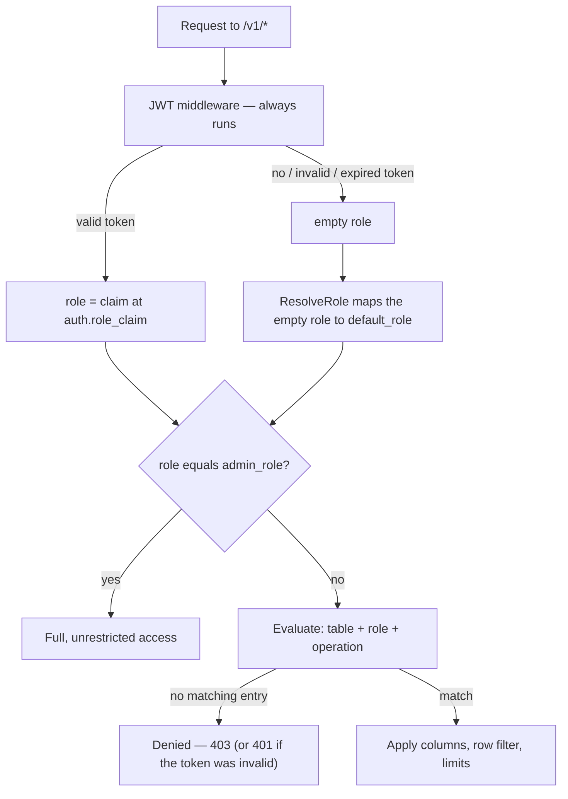

import { Tabs, TabItem } from "@astrojs/starlight/components";

WaveHouse authorizes every request against a single **access control policy**: a per-table, per-role document that decides which columns a caller may see, which rows they may touch, what they may aggregate, and how much work a query may do. It is Hasura-style — column-level and row-level permissions with JWT claim templating — stored centrally and applied on every read, write, and live stream.

This guide explains the whole model: where roles come from, how to write a policy, how each rule is enforced, and how the policy is loaded and changed at runtime. For the raw config knobs see [Configuration](/configuration#access-control-policy); for the HTTP surface see the [API reference](/api#authentication). Named query pipes have their own, simpler authorization model — see [Named Pipes](/pipes).

## How a request is authorized

Authentication and authorization are **decoupled**. The JWT middleware always runs, but it never rejects a request — it only establishes *who* the caller is. The policy decides *what* they can do.



Two things make this safe by default:

- **Fail-closed.** A role only gets what the policy explicitly grants it. No policy entry for a table, operation, or role means *denied* — there is no implicit allow. If there is no policy at all (none seeded yet, or it was deleted), **every token-based** request is denied, including the admin role — the lone exception is the [operator key](#operator-key), below.
- **The empty role matches nothing.** A request with no role never matches a policy entry by accident. It is authorized only after `default_role` deliberately maps it to a concrete role, or via the admin role.

## Roles

A role is an opaque string. Matching is **exact and case-sensitive** — `Viewer` and `viewer` are different roles, and there is no `"*"` any-role wildcard. Roles do not inherit one another's permissions.

### Where a role comes from

The role is read from a single JWT claim — the dot-path `auth.role_claim` (default `role`; e.g. `app_metadata.role` for a nested claim). The token plumbing around it — HMAC vs. JWKS validation, accepted signing algorithms, the `?token=` query fallback for streams — is covered in [API Reference — Authentication](/api#authentication), and the knobs that configure it in [Configuration — Authentication](/configuration#authentication).

For authorization, the behavior that matters is what happens with **no** role: the request falls back to `default_role`. A request is roleless when there is no token, when the token is invalid/expired/malformed (the reason is remembered, so a later denial is a `401`, not a bare `403`), or when a valid token simply carries no `role_claim`.

### `default_role` — public (unauthenticated) access

`default_role` is the policy field that controls public access. It is the role an empty/absent role resolves to, applied *before* evaluation:

- **Set it** (to a role that has policy entries) and roleless requests are evaluated as that role and receive exactly its permissions.
- **Leave it empty** and roleless requests stay roleless, match nothing, and are denied — a closed deployment.

Setting `default_role` does nothing on its own; the role you name still needs entries under `tables` to grant any access. Think of it as "which role does an anonymous caller assume", not "what can anonymous callers do".

:::caution[`default_role: admin` is a dev-only footgun]
Setting `default_role` equal to `admin_role` is permitted — it makes every unauthenticated request a full admin, including `/v1/admin/*`, which is handy for local development with no tokens. It is **never** for production. Every node that loads such a policy logs a loud `WARN` on startup and on every update.
:::

### `admin_role` — the privileged role

`admin_role` (default: `"admin"`) is the one role that bypasses the entire policy:

- It is granted **full, unrestricted access** to every table and operation. An admin is **never** column-scoped or row-scoped, even by a policy entry that explicitly names the admin role — admin is an unconditional bypass, not a scoped grant.
- It is the gate for every admin surface: `/v1/admin/*` (raw SQL, policy CRUD, pipe CRUD), plus the schema and DLQ endpoints. The gate reads `admin_role` live from the policy, so changing it applies without a restart.

There is no separate `service` role. To reach an admin endpoint or to read data beyond what `default_role` grants, present a valid token whose `role_claim` is the admin role (or another granted role) — **or** present the non-JWT [operator key](#operator-key) described below.

:::caution[A missing policy locks everyone out — including admin]
`admin_role` only grants access while a policy is loaded. Deleting the policy from the store sets it to `nil`, and a `nil` policy denies every **token-based** caller, by design: an implicit admin grant must never re-open a deliberately-emptied deployment. The one credential that still works is the [operator key](#operator-key) — configure one to recover over HTTP; without it, recovery is server-side only (restore the [bootstrap file](#bootstrapping-and-the-policy-lifecycle) and reboot).
:::

### Operator key

`auth.operator_key` (config; presented in an `Authorization: Operator <key>` header, or the `X-Operator-Key` alias) is a static, role-free credential for the person running the deployment, meant for bootstrap and break-glass recovery. A request presenting it is authorized as a **full-access platform operator** — the entire data plane *and* the `/v1/admin/*` management surface — without minting a JWT, and independently of the JWT verifier (`jwt_secret`/`jwks_url`).

Unlike `admin_role`, the operator key is honored **even when the policy is `nil`** (deleted, or never seeded), so it is the one HTTP path that can restore a wiped policy — the break-glass case the caution above describes. It is matched in constant time, takes precedence over any Bearer token on the same request, and is disabled when empty (the default). Treat it as an admin secret: load it from a secret store, serve it only over TLS, and rotate it like any other credential. See [Configuration — Authentication](/configuration#authentication).

Generate a high-entropy value (≥ 256 bits of randomness) and load it from a secret manager rather than committing it:

```bash
openssl rand -base64 32          # 32 random bytes, base64-encoded — no shell-quoting surprises
# or, without openssl:
head -c 32 /dev/urandom | base64
```

Set the result via `WH_AUTH_OPERATOR_KEY` (or `auth.operator_key`) and present it as `Authorization: Operator <key>` (or `X-Operator-Key: <key>`):

```bash
curl -H "Authorization: Operator $(cat operator.key)" https://wavehouse.example.com/v1/admin/policy
```

**Monitor failed attempts.** A successful operator authentication is audit-logged at `INFO`; a request presenting a *wrong* operator key is logged at `WARN` (`operator key authentication failed`) and counted by the `wavehouse_auth_operator_key_failures_total` metric, then handled as an ordinary unauthenticated request (the middleware never rejects). A wrong operator key is never sent by accident, so a nonzero rate is a strong probing/brute-force signal against your most privileged credential — alert on it.

## Anatomy of a policy

A policy is a YAML or JSON document with three top-level fields:

| Field | Type | Description |
| ----- | ---- | ----------- |
| `default_role` | string | Role that a roleless (tokenless or claimless) request assumes. Empty = no public access. |
| `admin_role` | string | Role granted full, unrestricted access and the `/v1/admin/*` gate. Optional; defaults to `"admin"`. |
| `tables` | map | Per-table permissions, keyed by ClickHouse table name. |

Each table entry holds permissions for two operations — `select` (reads) and `insert` (writes) — and each operation maps **role → permissions**:

<Tabs syncKey="policy">
  <TabItem label="YAML">
```yaml
tables:
  events:                 # ClickHouse table name
    select:               # read permissions
      viewer:             # role → what "viewer" may read
        allow_columns: ["page", "score"]
    insert:               # write permissions
      writer:             # role → what "writer" may insert
        allow_columns: ["page", "score", "user_id"]
```
  </TabItem>
  <TabItem label="JSON">
```json
{
  "tables": {
    "events": {
      "select": {
        "viewer": {
          "allow_columns": ["page", "score"]
        }
      },
      "insert": {
        "writer": {
          "allow_columns": ["page", "score", "user_id"]
        }
      }
    }
  }
}
```
  </TabItem>
</Tabs>

A role with no entry under the operation it is attempting is denied. The set of permission fields below applies to both `select` and `insert` entries, though some (row `filter`, aggregations, limits) only take effect on the read path and some (`check`) only on the write path — the [enforcement table](#where-each-rule-is-enforced) maps which is which.

## Column permissions

`allow_columns` and `deny_columns` control which columns a role can read (on `select`) or write (on `insert`).

<Tabs syncKey="policy">
  <TabItem label="YAML">
```yaml
select:
  viewer:
    allow_columns: ["page", "button", "received_timestamp"]
    deny_columns: ["user_email", "ip_address"]
```
  </TabItem>
  <TabItem label="JSON">
```json
{
  "select": {
    "viewer": {
      "allow_columns": ["page", "button", "received_timestamp"],
      "deny_columns": ["user_email", "ip_address"]
    }
  }
}
```
  </TabItem>
</Tabs>

The rules, in order:

1. **`deny_columns` always wins.** A column in the deny list is rejected even if it is also allowed.
2. **An empty (or `["*"]`) `allow_columns` means "all columns"** — every column not in `deny_columns` is permitted. Use this with `deny_columns` for a blocklist posture: see everything *except* a few sensitive columns.
3. **A non-empty `allow_columns` is an allowlist** — only the named columns (and never the denied ones) are permitted.

On a structured query (`POST /v1/query?table={table}`) the allowlist is a **hard cap on every column the query references — in any clause**: the projection, an aggregation argument, `filters`, `group_by`, `order_by`, and `time_range`. Naming a disallowed column anywhere is rejected with `403 column "x" not allowed`. A full-row read is requested explicitly with `"select_all": true`, which expands to exactly the columns the role may read — never a raw `SELECT *` that could include a denied column; if the role is allowed *no* columns, the read is rejected (`403`) rather than returning empty rows. **Omitting `columns` (or sending `[]` / `""`) returns nothing** — a request for no data — so a hidden column can't leak by being left out, grouped on, or filtered on to infer its values. (Note: in a query, `["*"]` is the *literal column named `*`*, not a wildcard — use `select_all` for all columns. In `allow_columns`, `["*"]` is still the all-columns wildcard.) On insert (`POST /v1/ingest?table={table}`) the body is `403 column "x" not allowed for insert`. On live streams, denied columns are silently **stripped** from each event rather than rejecting the connection. The structured-query and live-stream paths defer to the **same** per-column decision (`IsColumnAllowed`), so the two read surfaces enforce identical column visibility and can't drift apart.

## Row-level security

`filter` restricts *which rows* a role can read. Like the per-column decision above, one resolution drives **both** read surfaces: a structured query gets the predicates injected as a `WHERE` clause in the generated SQL, and the live stream evaluates the *same* resolved predicates in memory against each subscriber's claims before delivering an event — so row visibility can't drift between the two paths (the stream's in-memory comparison has a fail-closed boundary; see [the enforcement caution below](#where-each-rule-is-enforced)). Each entry maps a column to a comparison whose value is usually a **JWT claim template**:

<Tabs syncKey="policy">
  <TabItem label="YAML">
```yaml
select:
  viewer:
    filter:
      tenant_id:
        _eq: "{{ jwt.app_metadata.tenant_id }}"
```
  </TabItem>
  <TabItem label="JSON">
```json
{
  "select": {
    "viewer": {
      "filter": {
        "tenant_id": {
          "_eq": "{{ jwt.app_metadata.tenant_id }}"
        }
      }
    }
  }
}
```
  </TabItem>
</Tabs>

This produces `WHERE (tenant_id = ?)` with the caller's `app_metadata.tenant_id` claim bound as the parameter — so a `viewer` only ever sees rows for their own tenant, and the value comes from the signed token, not from anything the client sends.

Supported comparison operators:

| Operator | SQL | Meaning |
| -------- | --- | ------- |
| `_eq` | `col = ?` | equals |
| `_neq` | `col != ?` | not equals |
| `_gt` | `col > ?` | greater than |
| `_lt` | `col < ?` | less than |
| `_in` | `col IN (?, …)` | one of a set |

`_in` scopes a column to a **set** of values. Unlike the other operators, its value is a single claim that resolves to a JSON **array**: `tenant_id: { _in: "{{ jwt.app_metadata.tenant_ids }}" }` with a token claim `tenant_ids: ["a", "b"]` produces `tenant_id IN ('a', 'b')`. This is the multi-tenant case — the allowed set rides on the signed token. A scalar claim yields a one-element set; a claim that is absent, `null`, or an empty **array** matches **no rows** (fail-closed: an empty allowed-set sees nothing, never everything). So does an array carrying any **non-scalar element** — one `null`, object, or nested-array element fails the *whole* set closed rather than being skipped, since a set the token only half-vouches for shouldn't quietly shrink. A claim present as an empty *string* is a value like any other and binds as the one-element set `IN ('')` — see [JWT claim templating](#jwt-claim-templating).

Multiple columns (and multiple operators on one column) are combined with `AND`. The policy-derived predicate is ANDed with whatever filters the caller's own query supplies, so a caller can never widen their row visibility past the policy.

### JWT claim templating

Any `filter` or `check` operator value may interpolate token claims with `{{ jwt.<dot.path> }}` (other policy fields, like `allow_columns`, take their values literally):

- `{{ jwt.sub }}` → the token's `sub` claim.
- `{{ jwt.app_metadata.tenant_id }}` → a nested claim.

Values are always bound as SQL **parameters**, never concatenated into the query, so templating is injection-safe. If a claim path in a `filter` template can't be resolved (a validly-signed token that simply doesn't carry the claim), that filter **fails closed**: the predicate becomes constant-false, so on the structured-query path (`POST /v1/query`) the role sees **no rows**, and the live stream withholds every event for that subscriber — one resolution drives both read surfaces (see [where each rule is enforced](#where-each-rule-is-enforced)). This holds for every operator — `_eq`, `_neq`, `_gt`, `_lt`, and `_in` alike. The alternative, binding the empty string the template would render to, would leave a live predicate against `''`: `_eq` would match every empty-valued row, and `_neq`/`_gt` on a string column would match essentially *all* rows, erasing the restriction. A literal value with no template in it — including an explicit `""` — binds exactly as written, even when it spells a number ([insert checks](#insert-checks) additionally accept such a literal's numeric reading at compare time, since a policy literal carries no JSON type — but what binds, and what a filter matches, is always the spelling you wrote).

"Can't be resolved" means the claim path is **absent** from the token (or `null`) — or resolves to a JSON **object or array** rather than a scalar, which usually means a dropped path segment (`{{ jwt.app_metadata }}` where `{{ jwt.app_metadata.tenant_id }}` was meant); the one structured shape with defined semantics is the bare-claim `_in` array above. Scalar claims — strings, booleans, and numbers — resolve normally. A numeric claim binds in **canonical decimal form**, not the token's spelling: an integer id keeps every digit — up to a 100-digit bound, far past any real id — while `1.0` or `1e3` binds as `1` and `1000`, so spelling differences between issuers never change the bound value. What must fit the bound is the value's **exact decimal form**, exponent applied — roughly 100 digits (the exact-form gate allows 102 characters, whatever they are) — so `1e400` can't be resolved, but neither can `1e150` or `1e-150`, whose short spellings expand to 151- and 152-character exact forms even though a float64 could hold them; prefer issuing integer ids as integers. Type the scoped column to match: an integer column — or a `Decimal` whose scale covers the claim's fractional digits — keeps the comparison exact, while a `Float32`/`Float64` column rounds the stored value and quietly gives that exactness back (`col = '9007199254740993'` matches a stored `9007199254740992` there). A claim that is *present but empty* is a value the token vouches for: it resolves to `''` and binds normally, so `_neq` against an empty-string claim still emits `col != ''`. Make sure your identity provider actually issues the claims your policy templates reference — and omits unset claims rather than issuing them as empty strings.

Claim paths may contain only letters, digits, `_`, and `.` (the segment separator). Any `{{ … }}` fragment that is not a well-formed `{{ jwt.<path> }}` template — a path outside that grammar (a hyphen: `{{ jwt.tenant-id }}`; a namespaced claim: `{{ jwt.https://app.example.com/tenant_id }}`), a missing or misspelled `jwt.` prefix, or an unterminated `{{` — is **not** recognized as a template, and left unchecked the resolver would bind the literal `{{ … }}` text as a value. (Policy values have no other placeholder syntax; a pipe's `{{param}}` placeholders are a different mechanism and are not accepted here.) That is *not* fail-closed: on a read filter `_neq`/`_lt` would then match essentially every row (a leak), and on a write `check` the literal text would be stamped into every inserted row (silent corruption). So such a policy is **rejected when it is written**: a bootstrap policy file carrying one makes WaveHouse refuse to start when the store is seeded from it (a populated KV store skips the file), and a `PUT` on `/v1/admin/policy` (or a `POST` to `/v1/admin/policy/validate`) returns `400`. A policy already stored in NATS KV is *not* re-validated when a node loads it ([#461](https://github.com/Wave-RF/WaveHouse/issues/461)), so after upgrading, re-`PUT` your policy once to surface a template written before this rule existed — until you do, that stored policy keeps binding the literal text, and the leak above stays live for it. Flatten hyphenated or namespaced claims into a supported path at your identity provider — on Auth0, an [Action can set a flat custom claim](https://auth0.com/docs/secure/tokens/json-web-tokens/create-custom-claims) outside the registered OIDC names (its legacy Rules required URL namespacing, which established tenants often still carry), and namespacing is a common OIDC convention elsewhere, so a namespaced claim is the shape you are most likely to meet first.

Row filters apply on the structured-query path and, per subscriber, on the live SSE stream — the stream evaluates the same resolved predicates in memory against each subscriber's token claims (see the [enforcement caution](#where-each-rule-is-enforced) for what its in-memory comparison can and cannot decide). Named pipes authorize by `allowed_roles` membership alone — scope a pipe's exposure in its SQL text, since neither the table policy's row `filter` nor its column allow/deny list is applied on the pipe path (see [Named Pipes](/pipes#authorizing-a-pipe)).

## Insert checks

`check` is the write-path counterpart to `filter`: it constrains the *values* a role may insert, again via claim templates. It supports `_eq` (the inserted value must equal the claim) and `_in` (it must be one of a claim-derived set); the comparison operators `_neq`/`_gt`/`_lt` have no insert-time meaning and are **rejected when the policy is written** (the same boundary as malformed templates above), as is setting both `_eq` and `_in` on one column (use exactly one).

<Tabs syncKey="policy">
  <TabItem label="YAML">
```yaml
insert:
  writer:
    allow_columns: ["page", "score", "user_id", "tenant_id"]
    check:
      user_id:
        _eq: "{{ jwt.sub }}"
      tenant_id:
        _eq: "{{ jwt.app_metadata.tenant_id }}"
```
  </TabItem>
  <TabItem label="JSON">
```json
{
  "insert": {
    "writer": {
      "allow_columns": ["page", "score", "user_id", "tenant_id"],
      "check": {
        "user_id": {
          "_eq": "{{ jwt.sub }}"
        },
        "tenant_id": {
          "_eq": "{{ jwt.app_metadata.tenant_id }}"
        }
      }
    }
  }
}
```
  </TabItem>
</Tabs>

For each checked column, on `POST /v1/ingest?table={table}`:

- **If the request body includes the column**, its value must satisfy the check — equal the claim-derived value (`_eq`), or be one of the claim-derived set (`_in`) — or the insert is rejected with `403 check failed for column "x"`. Equality is decided on **canonical scalar form**, the same rule the claim side follows: a numeric body value matches by value, not spelling (`1.0` satisfies a check against claim `1`); a body value with no canonical form — an object, array, or `null` — satisfies no check, so a `check` on a `Map` or `Array` column rejects every insert that names it; and the 100-digit bound applies to the body's literal too, so an over-long numeric value is this same `403`, not a schema error. A **template-free** `_eq` check value carries no JSON type, so it matches by either reading — a static `_eq: "1.0"` accepts an inserted `1.0` (number) and an inserted `"1.0"` (string) alike, while auto-injecting exactly as written. A claim-derived value keeps strict canonical equality: a string-typed claim matches only its exact text, so a claim of `"1e3"` never accepts an inserted `1000`. On an integer or `Decimal` column a `writer` therefore cannot forge a row for another user or tenant — equal canonical forms store equal values. On a `Float32`/`Float64` column the rounding [noted above](#jwt-claim-templating) applies to the write side too: the stored value can land on a neighboring id. And on a `String` column the guarantee is narrower in a different way: the check compares canonical forms but ClickHouse stores the body's raw spelling, so a body value that is an alternate numeric spelling of the claim (`1e3` for a claim of `1000`) passes the check yet stores differently than the auto-injected value would — and a literal's numeric reading shares this property (`_eq: "1.0"` accepting an inserted `1` stores the text `1`, not `1.0`).
- **If the request body omits the column**, an `_eq` check **auto-injects** the claim-derived value before publishing, so clients can send just the business fields (`page`, `score`) and let the policy stamp `user_id` and `tenant_id` from the token. An `_in` check has no single value to stamp, so an omitted column is **rejected** — the writer must name a value within their allowed set.

**When the claim can't be resolved** (a validly-signed token that doesn't carry it), an `_eq` check is — unlike a row filter — **not** fail-closed: the template still renders, the unresolvable placeholder replaced by the empty string and any surrounding literal text kept (`"acct-{{ jwt.org_id }}"` → `acct-`, a bare `"{{ jwt.sub }}"` → `''`), and that rendered value becomes the required value — so an omitted column is auto-injected with it and any other supplied value is rejected. On an integer or `Decimal` column that stamped `''` does not stay empty: ClickHouse coerces it to `0`, so every such row lands on tenant/user `0` — and since the read side of the same claim fails closed, those rows are also invisible to the writer that produced them. (A `Float` column may instead reject the coercion — ClickHouse-version-dependent — failing the insert into the DLQ.) An unresolvable `_in` check instead fails closed: the claim-derived set is empty, so every insert by that role into that table is rejected (there is no single value to auto-inject). The `_in` element rule from [row-level security](#row-level-security) applies here too — one non-scalar element (`null`, object, nested array) in the claim array collapses the allowed set the same way. Whether the `_eq` write path should match the read path and reject the insert rather than stamp `''` is tracked in [#463](https://github.com/Wave-RF/WaveHouse/issues/463).

This pairs naturally with a matching `filter` on the `select` side: `check` stamps the tenant on write, `filter` scopes reads to that tenant.

## Aggregation controls

`allowed_aggregations` and `denied_aggregations` restrict which aggregation functions a role may use in a structured query (`count`, `sum`, `avg`, `quantile`, …). Matching is case-insensitive and follows the same precedence as columns:

<Tabs syncKey="policy">
  <TabItem label="YAML">
```yaml
select:
  viewer:
    # blocklist: everything else is allowed
    denied_aggregations: ["quantile", "median"]
  analyst:
    # allowlist: only these three
    allowed_aggregations: ["count", "sum", "avg"]
```
  </TabItem>
  <TabItem label="JSON">
```json
{
  "select": {
    "viewer": {
      "denied_aggregations": ["quantile", "median"]
    },
    "analyst": {
      "allowed_aggregations": ["count", "sum", "avg"]
    }
  }
}
```
  </TabItem>
</Tabs>

- `denied_aggregations` always wins.
- An empty `allowed_aggregations` means all non-denied functions are allowed; a non-empty list is an allowlist.

A disallowed function returns `403 aggregation "x" not allowed`. This is useful when row-level privacy depends on preventing fine-grained reconstruction (e.g. blocking `quantile`/`argMin` while allowing coarse `count`/`sum`).

## Resource limits

Four fields cap the cost of a single structured query for this role. All must be non-negative; `0` / unset means "no role-imposed limit" — the [server-wide ClickHouse limits](#server-wide-limits-live-in-clickhouse) still apply, and for `max_rows` the `query.default_max_rows` result default (10,000) still clamps the `LIMIT`.

| Field | Effect |
| ----- | ------ |
| `max_rows` | Caps the query's `LIMIT`. If the caller asks for more (or omits a limit), the result is clamped to `max_rows`. |
| `max_execution_time` | Caps the query execution time, applied as the *minimum* of this value and the server's `clickhouse.query_timeout`. |
| `max_rows_to_read` | Caps the rows **scanned from storage** server-side — the lever that stops a full-table scan. The read is rejected once it is exceeded. |
| `max_memory_usage` | Caps **peak query memory** server-side — the lever that stops a heavy aggregation from exhausting the box. The read is rejected once it is exceeded. |

`max_execution_time`, `max_rows_to_read`, and `max_memory_usage` are enforced **server-side by ClickHouse** (sent as per-query `max_execution_time` / `max_rows_to_read` / `max_memory_usage` settings), so a query can't outrun its budget during a server-side scan, merge, or aggregation phase — not just while the client is reading rows back. `max_rows` is applied as the SQL `LIMIT` (and mirrored server-side as `max_result_rows` for defense-in-depth).

**`max_execution_time` and `max_memory_usage` accept a human-readable value or a number.** Set `max_execution_time` as a duration string (`"5s"`, `"500ms"`) or a bare number of **milliseconds**; set `max_memory_usage` as a size string (`"4GiB"`, `"512MiB"` — IEC vs SI is respected, so `"4GB"` is 4×10<sup>9</sup> and `"4GiB"` is 4×2<sup>30</sup>) or a bare number of **bytes**. The API always **returns** them as those numbers (ms and bytes), so SDK consumers read a plain integer.

<Tabs syncKey="policy">
  <TabItem label="YAML">
```yaml
select:
  viewer:
    max_rows: 1000
    max_execution_time: "5s"
    max_rows_to_read: 50000000      # reject a read that scans > 50M rows
    max_memory_usage: "4GiB"        # peak memory per query
```
  </TabItem>
  <TabItem label="JSON">
```json
{
  "select": {
    "viewer": {
      "max_rows": 1000,
      "max_execution_time": "5s",
      "max_rows_to_read": 50000000,
      "max_memory_usage": "4GiB"
    }
  }
}
```
  </TabItem>
</Tabs>

These bound a role's blast radius on the cached read path. They do not apply to raw admin SQL, which is unbounded by design (other than the 64 MiB response cap noted in the [API reference](/api)).

### Server-wide limits live in ClickHouse

These policy fields are **per-role** caps. A **server-wide** backstop — one that applies to *every* query regardless of role, including named pipes and raw admin SQL — is not part of the WaveHouse policy: configure it in ClickHouse's own [settings profiles and quotas](/configuration#server-side-resource-limits), where it is enforced natively and composes with the per-role caps above. That keeps global resource governance in one authoritative place and holds even against paths the policy engine doesn't touch.

## Where each rule is enforced

The same policy drives every data path, but not every field is meaningful on every path:

| Surface | Endpoint | Enforced |
| ------- | -------- | -------- |
| Structured read | `POST /v1/query?table={table}` | table+role `select` required, then `allow`/`deny_columns`, row `filter`, aggregation rules, and the per-role `max_rows` / `max_execution_time` / `max_rows_to_read` / `max_memory_usage` caps (over the [ClickHouse server-wide limits](/configuration#server-side-resource-limits)) |
| Ingest (write) | `POST /v1/ingest?table={table}` | table+role `insert` required, then `allow`/`deny_columns` and `check` (enforced and auto-injected) |
| Live stream | `GET /v1/stream` | table+role `select` required (a table the role can't read is skipped), then denied columns are masked from each event and the role's row `filter` is applied per subscriber against their JWT claims (see caution below) |
| Raw SQL | `POST /v1/admin/query` | `admin_role` only — no per-statement policy; the role gate is the entire authorization story |
| Named pipe | `GET/POST /v1/pipes/{name}` | per-pipe `allowed_roles` (not the policy engine; see [Named Pipes](/pipes)). Resource limits come from ClickHouse's [server-wide settings](/configuration#server-side-resource-limits), not per-role policy caps |

:::caution[Live streams enforce column and row policy, but not resource limits]
SSE subscribers are checked for table-level `select` permission, have denied columns stripped from each event, and — like the query path — receive only the rows their role's row-level `filter` predicates admit, evaluated per subscriber against their JWT claims. Predicates are evaluated against the **full ingested event**, so a filter may key on a column the role can't `select` (denied columns are still stripped from what's delivered). The stream evaluates predicates in memory, without ClickHouse's per-type coercion, so how much it can enforce depends on what the schema says about the filtered column — and every case it cannot decide **fails closed**. Provided the filter constant is one the query path's SQL also accepts (see the per-type guidance below — the *every other type* bucket constrains your constant to the event's own text rendering, and on ClickHouse releases before 26.5 timestamp constants must be zone-less or Unix-seconds strings), ambiguity only ever *withholds* a row the query path would return, never delivers one it would hide. The one payload-vs-stored exception, insert-time numeric narrowing, is called out below.

- **Numeric columns** (`Int*`/`UInt*`/`Float*`/`Decimal*`, unwrapping `Nullable`/`LowCardinality` in any nesting): all five operators compare numerically, matching ClickHouse (`9 < 100`). Equality ties beyond `float64`'s 2^53 resolve at full precision (a 64-bit ID never falsely matches a neighbor, whether it arrives string-encoded or as a bare JSON number); an unparseable, `NaN`, infinite (any `Inf`/`Infinity` spelling), or over-long operand — past roughly the same [100-digit bound](#jwt-claim-templating) the claim side has — withholds the row.
- **`String` columns** (again under any `Nullable`/`LowCardinality` wrapping): byte comparison *is* ClickHouse's String comparison — equality and ordering are both exact.
- **`DateTime`/`DateTime64` columns** (again under any wrapping): both operands are parsed as **instants** — through the same grammar [ingest canonicalization](/api#timestamp-canonicalization) reads — and compared chronologically, so all five operators are exact and the constant's spelling doesn't need to match the event's: ingest rewrites payload values to RFC 3339 UTC before publishing, and a zone-less constant (`2026-06-21 04:00:00`, read in the column's declared zone, else the discovered server default — ClickHouse's own rule) still matches the rewritten payload denoting that instant. **Write timestamp constants zone-less like that, or as 9–10-digit Unix-seconds strings**: those two spellings are converted to the column type in a `WHERE` comparison on every ClickHouse release. Releases before 26.5 instead reject the RFC 3339 `Z` form there with a type error — a property of that release's constant conversion, not of `date_time_input_format`, which governs the [ingest parser WaveHouse pins](/api#timestamp-canonicalization) rather than comparison constants, so setting `best_effort` server-side does not rescue it — while 26.5+ accepts the `Z` form. The stream accepts every grammar spelling regardless. An operand the grammar can't read — on either side — withholds the row, as does an instant outside the column type's range (which insert-time *saturation* would have moved anyway). A column whose **declared** zone can't be loaded at runtime has no timestamp parser at all — it falls into the byte-equality bucket below (its values aren't canonicalized at ingest either), so `_neq`/`_gt`/`_lt` withhold every row. A column relying on the **server default** zone when that couldn't be resolved keeps instant comparison for zone-explicit operands (RFC 3339, Unix seconds) but refuses zone-less ones rather than guess the zone.
- **Every other type** (`Enum`, `UUID`, `Date`/`Date32`, `Bool`, `IPv4`/`IPv6`, `FixedString`, …): only byte-equality is trusted. `_eq`/`_in` admit exactly the event's own text rendering — write the filter value the way your events carry it (`true`, not `1`; a lowercase UUID if that's what clients send; `Date` values keep the producer's spelling — unlike `DateTime`, they are not canonicalized at ingest). The same constant is bound into the query path's SQL, where ClickHouse compares it against the column's declared type rather than the event's text rendering — so pick a value that works on both surfaces, and verify the query path returns what you expect before relying on the filter. `_neq`, `_gt` and `_lt` withhold **every** row: a text difference can be pure representation (an uppercase UUID, an alternate date format, an Enum name vs. its number), so inequality and order are unprovable without ClickHouse — on these columns, use the query path for ordering/exclusion filters.
- **No usable schema** — the table is unknown to schema discovery, or discovery is still failing at boot (the server serves while retrying in the background): every column is treated as the "other" bucket above (timestamp columns lose their parser too). Equality scoping keeps working; ordering and `_neq` withhold until a schema is available.

A few more edges worth knowing when you write a policy — the stream evaluates the **ingested event payload**, not the stored row, and each of these follows from that:

- **A filtered column the payload doesn't carry withholds *every* event** for that subscriber, even though the same filter matches normally on the query path. That bites a `MATERIALIZED`/`ALIAS` column (never part of an ingest payload) or a `DEFAULT` column your clients omit. The recommended [`check` + `filter` pairing](#insert-checks) is unaffected: an `_eq` insert `check` auto-injects its claim value into any payload that omits the column *before* the event is published, so the streamed event carries it and the matching row filter evaluates normally. (That holds for timestamp columns too: the injected claim value is canonicalized with the rest of the payload before publish, and the stream compares timestamps as instants, so the claim's spelling and the canonical wire spelling meet.)
- **A non-scalar event value** (array/object/null) under a filtered column withholds the row.
- **Insert-time numeric narrowing bounds the fail-closed guarantee itself** — this one edge can fail *open*. The guarantee holds for the *payload* value. The one place that differs from the stored row is a payload with more precision than the column's declared type, which the insert narrows: a `Decimal` **truncates** at its scale (`1.005`, `1.006` and `1.009` all store as `1.00` in a `Decimal(10, 2)`), while a `Float32` **rounds** to its nearest representable value (`16777217` stores as `16777216`). A numeric `_neq`/`_gt`/`_lt` filter on such a column compares the pre-narrowing payload, so it can deliver an event whose stored row lands on the other side of the comparison: a `_gt: "1.004"` on a `Decimal(10, 2)` column delivers a payload of `1.005` on the stream, while the query path compares the stored (truncated) `1.00` and hides the row. `_eq`/`_in` cannot fail open here: ClickHouse narrows the bound filter constant to the column's declared type just as insert narrowed the payload, so an equality that matches on the stream matches the stored row too. Columns that store exactly (integer IDs, `String` tenants) are unaffected under every operator.

One more boundary is temporal: a subscriber's claims (and role) are captured when the SSE connection is established and are never re-read, while the policy itself is re-read on every event. Tightening a policy therefore applies from the next event, but a token that expires — or claims revoked at the identity provider — keeps its open stream until the client disconnects, so treat connection lifetime as the revocation window for stream row-scoping.

Each row withheld **from a subscriber** by row-level security is counted in `wavehouse_sse_rows_withheld_total` (labeled by table and role; a row withheld from three subscribers counts three times) — check it before concluding a quiet stream simply has no matching rows.

The resource limits (`max_rows`, `max_execution_time`, `max_rows_to_read`, `max_memory_usage`) remain a property of the SQL query path and are **not** applied to the live event stream; if those caps are part of a role's isolation story, don't rely on them over the stream.
:::

## Managing the policy

The policy lives behind three admin endpoints (all require `admin_role`):

| Method | Endpoint | Purpose |
| ------ | -------- | ------- |
| `GET` | `/v1/admin/policy` | Fetch the current policy. Returns `{"tables":{}}` when none is set. |
| `PUT` | `/v1/admin/policy` | Replace the **entire** policy. Validated before it is saved. |
| `POST` | `/v1/admin/policy/validate` | Dry-run validation — returns `{"valid": true}` or the error, without saving. |

`PUT` is a full replace, not a merge: send the complete document every time. Validation rejects empty role names, negative limits, [malformed claim templates](#jwt-claim-templating), and unsupported `check` operators — `_neq`/`_gt`/`_lt`, or `_eq` and `_in` together on one column (but it intentionally allows `default_role == admin_role`, warning instead). Once accepted, the policy is written to NATS KV and propagated to every node via KV Watch — changes apply cluster-wide within moments, no restart.

```bash
# Replace the policy (admin token required). POST the same body to
# /v1/admin/policy/validate first for a dry run that doesn't save.
curl -X PUT http://localhost:8080/v1/admin/policy \
  -H "Authorization: Bearer $ADMIN_TOKEN" \
  -H "Content-Type: application/json" \
  -d @policy.json
```

The full request and response shapes for these endpoints live in the [API Reference](/api); the [TypeScript SDK](/sdk) wraps them as `client.policy.get()`, `client.policy.set(policy)`, and `client.policy.validate(policy)`.

## Bootstrapping and the policy lifecycle

NATS KV is the **source of truth** for the live policy. A file is only ever a *seed* for an empty store:

- `policy.file_path` (config) points at a YAML or JSON policy file. On startup, **if and only if the KV store is empty**, the file is loaded, validated, and written to KV. On every subsequent boot the file is ignored — KV already has the authoritative copy, and runtime edits flow through `PUT /v1/admin/policy`.
- **When `policy.file_path` is set, the file must exist, parse, and pass policy validation**, or WaveHouse refuses to boot. That turns a typo, a missing mount, or a policy invalid under a newly-tightened rule — such as the [malformed-template rejection](#jwt-claim-templating) above — into a loud failure instead of a silent fail-closed deployment that denies everything.
- **When `policy.file_path` is empty and KV is empty**, the store comes up with no policy — every **token-based** request is denied (logged loudly, admin included). Seed one via `PUT /v1/admin/policy` using the [operator key](#operator-key), the deliberate break-glass that works under a `nil` policy — or set `policy.file_path` and reboot.

:::caution
Validation guards only the **seed** path. A policy already in KV is not re-validated when a node loads it ([#461](https://github.com/Wave-RF/WaveHouse/issues/461)), so upgrading WaveHouse never re-checks the stored policy — after an upgrade that tightens validation (like the [claim-template rules](#jwt-claim-templating) above), re-`PUT` your policy once; until you do, a policy the new rules would reject keeps its old runtime behavior.
:::

In `config.yaml` (or the matching environment variable):

<Tabs syncKey="cfg">
<TabItem label="YAML">
```yaml
policy:
  # seed on first boot only; KV wins thereafter
  file_path: /etc/wavehouse/policy.yaml
```
</TabItem>
<TabItem label="Environment">
```ini
WH_POLICY_FILE_PATH=/etc/wavehouse/policy.yaml
```
</TabItem>
</Tabs>

Because a deleted policy locks out every *token-based* caller (including admin), treat the bootstrap file as your recovery path — unless you configured an [operator key](#operator-key), which restores a policy over HTTP without a reboot. Keep the bootstrap file in version control, mount it read-only, and you can always restore a known-good policy by clearing KV state and rebooting. See [Configuration — Access Control Policy](/configuration#access-control-policy) for the exact knobs.

## A complete example

A multi-tenant analytics deployment: anonymous callers get nothing, `viewer` reads its own tenant's rows with sensitive columns masked and expensive aggregations blocked, `writer` ingests events that are stamped with the caller's identity, and `admin` is unrestricted. Save it as your `policy.file_path` bootstrap file (`policy.yaml` or `policy.json` — both parse identically), or `PUT` it to `/v1/admin/policy`:

<Tabs syncKey="policy">
<TabItem label="YAML">
```yaml
# admin: full access + the /v1/admin/* gate (this is also the default)
admin_role: admin
# "" = closed: a request with no/!valid token is denied
default_role: ""

tables:
  events:
    select:
      viewer:
        # See every column except PII, only for your own tenant, and don't
        # allow distribution-revealing aggregations or runaway scans.
        deny_columns: ["user_email", "ip_address"]
        filter:
          tenant_id:
            _eq: "{{ jwt.app_metadata.tenant_id }}"
        denied_aggregations: ["quantile", "median"]
        max_rows: 1000
        max_execution_time: "5s"
    insert:
      writer:
        # Clients send business fields; the policy stamps identity from the token.
        allow_columns: ["event_name", "page", "score", "user_id", "tenant_id"]
        check:
          user_id:
            _eq: "{{ jwt.sub }}"
          tenant_id:
            _eq: "{{ jwt.app_metadata.tenant_id }}"
```
</TabItem>
<TabItem label="JSON">
```json
{
  "admin_role": "admin",
  "default_role": "",
  "tables": {
    "events": {
      "select": {
        "viewer": {
          "deny_columns": ["user_email", "ip_address"],
          "filter": {
            "tenant_id": {
              "_eq": "{{ jwt.app_metadata.tenant_id }}"
            }
          },
          "denied_aggregations": ["quantile", "median"],
          "max_rows": 1000,
          "max_execution_time": "5s"
        }
      },
      "insert": {
        "writer": {
          "allow_columns": ["event_name", "page", "score", "user_id", "tenant_id"],
          "check": {
            "user_id": {
              "_eq": "{{ jwt.sub }}"
            },
            "tenant_id": {
              "_eq": "{{ jwt.app_metadata.tenant_id }}"
            }
          }
        }
      }
    }
  }
}
```
</TabItem>
</Tabs>

With this policy loaded:

- A request with **no token** has the empty role, which `default_role: ""` leaves empty → **denied** everywhere.
- A `viewer` token can `POST /v1/query?table=events` but only sees its tenant's rows, never `user_email`/`ip_address`, can't run `quantile`, and is capped at 1000 rows / 5s.
- A `writer` token can `POST /v1/ingest?table=events` sending `{"event_name":"click","page":"/home","score":1}`; WaveHouse auto-injects `user_id` and `tenant_id` from the token, and rejects any body that tries to set them to someone else.
- An `admin` token can do all of the above plus raw SQL, schema, DLQ, and policy/pipe management — unscoped.

## Field reference

Per-role permissions (`tables.<table>.select.<role>` and `.insert.<role>`):

| Field | Type | Applies to | Description |
| ----- | ---- | ---------- | ----------- |
| `allow_columns` | string[] | select, insert | Allowlist of columns. Empty or `["*"]` = all columns (minus `deny_columns`). |
| `deny_columns` | string[] | select, insert | Blocklist of columns. Always wins over `allow_columns`. |
| `filter` | map | select | Row-level predicates (`_eq`/`_neq`/`_gt`/`_lt`/`_in`), ANDed together — injected as a SQL `WHERE` on structured reads and evaluated per subscriber on the live stream (see [enforcement](#where-each-rule-is-enforced)). `_in` takes a single claim → `col IN (…)`: an array-valued claim contributes each element, a scalar claim acts as a one-element set. Values support `{{ jwt.path }}` templating; a claim the token doesn't carry fails the filter closed (no rows on either surface), and a malformed template is rejected when the policy is written. |
| `check` | map | insert | Required insert values (`_eq`, or `_in` for a claim-derived set; `_neq`/`_gt`/`_lt`, and setting both `_eq` and `_in`, are rejected when the policy is written). `_eq` is enforced if present and auto-injected if absent; `_in` requires the column be present and in-set. Supports templating. |
| `allowed_aggregations` | string[] | select | Allowlist of aggregation functions. Empty = all (minus denied). Case-insensitive. |
| `denied_aggregations` | string[] | select | Blocklist of aggregation functions. Always wins. |
| `max_rows` | int | select | Caps the query `LIMIT`. `0` = no limit (the `query.default_max_rows` config default applies). Must be non-negative. |
| `max_execution_time` | duration or ms | select | Caps the query timeout (min with `clickhouse.query_timeout`). Set as `"5s"`/`"500ms"` or a number of ms; returned as ms. `0` = no limit. Must be non-negative. |
| `max_rows_to_read` | int | select | Caps rows **scanned** server-side (ClickHouse `max_rows_to_read`); the read is rejected once exceeded. `0` = no role limit. Must be non-negative. |
| `max_memory_usage` | size or bytes | select | Caps peak query memory server-side (ClickHouse `max_memory_usage`). Set as `"4GiB"`/`"512MiB"` or a number of bytes; returned as bytes. `0` = no role limit. Must be non-negative. |

## See also

- **[Named Pipes](/pipes)** — pre-defined, parameterized SQL with their own `allowed_roles` allowlist.
- **[Configuration — Access Control Policy](/configuration#access-control-policy)** — the `policy.file_path` and auth config knobs.
- **[API Reference — Authentication](/api#authentication)** — token format, the admin endpoints, and error codes.
