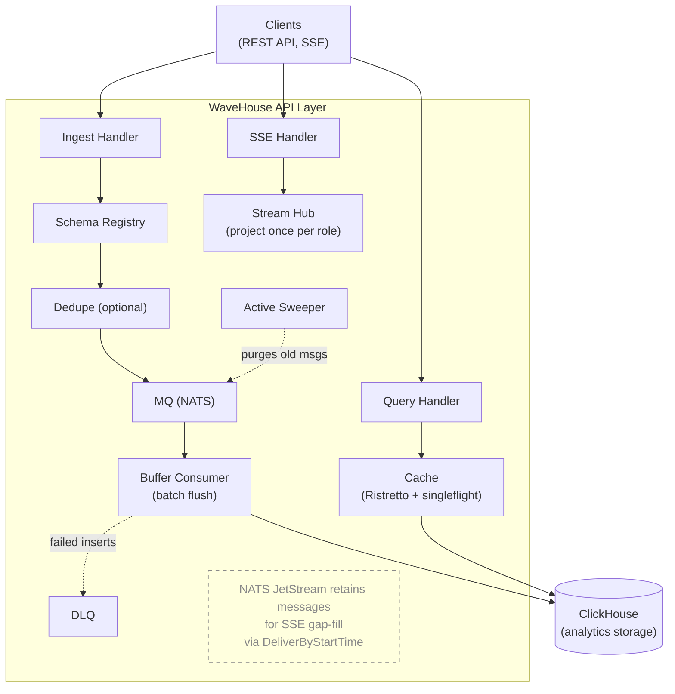

This document describes the internal architecture of WaveHouse, a schema-aware ClickHouse proxy.

## Overview

WaveHouse is a Go gateway for ClickHouse. It discovers table schemas, validates ingest data, batches asynchronous inserts, and provides real-time streaming and query caching.



## Binaries

`wavehouse` is a single binary running the API, batch worker, embedded NATS JetStream, and optional Pebble dedup. Dependency: ClickHouse.

## Internal Packages

```text
internal/
├── api/         HTTP layer (Chi router, handlers, middleware)
├── auth/        JWT/JWKS authentication middleware (HMAC or JWKS, role extraction)
├── cache/       In-process Ristretto cache with singleflight coalescing
├── chsql/       Shared ClickHouse SQL helpers (identifier quoting, bind-safety)
├── config/      YAML + env var configuration loading
├── dedupe/      Optional deduplication (Pebble)
├── discovery/   ClickHouse schema introspection and validation
├── ingest/      Batch buffering, DLQ, and Active Sweeper
├── mq/          Message queue abstraction (embedded NATS)
├── observability/ OpenTelemetry pipeline (traces/metrics/logs + Prometheus exposition)
├── pipes/       Named query pipes (NATS KV store + SQL file bootstrap)
├── policy/      Hasura-style access control (policy types, evaluation, NATS KV store)
├── query/       Structured query AST, SQL builder, and timestamp bucketing
└── stream/      SSE fan-out: event Hub (project once per role), Subscriber queue, Bucket fan-out, keepalive Heartbeater wheel
```

### `api/` — HTTP Layer

The API layer routes with [Chi](https://github.com/go-chi/chi): RequestID, CORS middleware, and a custom `jsonRecoverer` emitting a JSON `500` on panic instead of chi's plain-text `middleware.Recoverer`.

- **router.go** — Route definitions. Public: `/livez`, `/readyz`, and the content-free `/v1/health` SDK ping (plus permanent alias `/healthz` and deprecated `/health`, `/ready`). Policy-gated: `/v1/ingest?table={table}`, `/v1/query?table={table}` (structured), `/v1/pipes/{name}` (named pipes), `/v1/stream`. Admin-only (`RequireAdmin` — role == `policy.admin_role` or operator key bit): `/v1/schema/*`, `/v1/dlq/stats`, `/v1/admin/policy`, `/v1/admin/pipes/*`, and `/v1/admin/query` (raw SQL).
- **auth middleware** — JWT/JWKS authentication via [`auth/`](#auth--authentication); applied to all `/v1/*` routes.
- **policy.go** — CRUD handler for access control policies (`/v1/admin/policy`).
- **pipes.go** — Named query pipe handlers: admin CRUD and execution with parameter binding.
- **structured_query.go** — Handler for `POST /v1/query?table={table}`: validates AST, enforces permissions, executes SQL.
- **ingest.go** — Accepts flat JSON for `POST /v1/ingest?table={table}`, validates schema, optionally dedups, and publishes to NATS subject `ingest.{table}`. If dedup is on but `id_field` is missing: logged at `WARN`, counted by `wavehouse_ingest_dedupe_missing_id_total` (labeled by `table`), then published un-deduped—or rejected if `dedupe.require_id` is set ([#219](https://github.com/Wave-RF/WaveHouse/issues/219)).
- **query.go** — Proxies raw SQL for `POST /v1/admin/query` to ClickHouse's HTTP interface. Sets `Cache-Control: no-store`; renders DateTime as ISO-8601 via `date_time_output_format=iso`.
- **stream.go** — SSE streaming via `?table=` parameter. Each connection registers one `Subscriber` (`stream/` package) with the event `Hub` (by topic, role) and keepalive wheel. Idle streams emit `:` comments to prevent proxy timeouts. Projection/serialization happens once per role in the `Hub` ([#294](https://github.com/Wave-RF/WaveHouse/issues/294)). NATS JetStream gap-fill (`DeliverByStartTime`) is per-connection.
- **schema.go** — Schema discovery: list schemas, get table, trigger refresh.
- **dlq.go** — DLQ stats and `EnsureDLQStream` helper for the `WAVEHOUSE_DLQ` NATS stream.
- **health.go** — Liveness (`/livez`), readiness (`/readyz`), and a content-free `Online` ping (`/v1/health`, the SDK's liveness check). `/healthz` aliases `/livez`; `/health`/`/ready` are deprecated. All consult `BootState` to return 503 during boot-time schema discovery (see `cmd/wavehouse/main.go`). Once `BootState.Set(nil)` fires, `/livez` returns 200. `/readyz` pings ClickHouse; `/v1/health` does not.

### `stream/` — SSE keepalive & fan-out

The SSE fan-out is factored out of `api/` so the delivery hot path ([#294](https://github.com/Wave-RF/WaveHouse/issues/294)) resides with its shared keepalive primitives. One abstraction per file.

- **hub.go** — `Hub`, the event fan-out. Subscribers register under `(topic, role)`. `Broadcast` decodes each event once, applies the role's column policy once, builds one SSE frame per role, and fans it to every member of that role's `Bucket`. This collapses the prior per-subscriber `unmarshal → evaluate → filter → marshal` into one pass per distinct `(role, table)` output shape (the [#294](https://github.com/Wave-RF/WaveHouse/issues/294) lever; previous ceiling was ~2 270 deliveries/s). The `(topic, role)` key suffices because column visibility derives from the role+table policy, not JWT claims (claims only feed row-level `WHERE`/`CHECK`, which the stream path ignores). `ReplayFrame` uses this projection for per-connection gap-fill.
- **subscriber.go** — `Subscriber`, the per-connection handle. It owns an outbound queue of `Frame`s tagged by `kind`. Producers (keepalive wheel and event `Hub`) use `Send` (non-blocking; full queues drop frames and the `Hub` counts them), while the handler drains `Frames()` to the client. The queue is sized for live events (cap 64, up from keepalive cap 1; #152 will make this a knob). An `Evicted()` channel allows slow-consumer follow-up to disconnect wedged clients.
- **bucket.go** — `Bucket`, a concurrency-safe set of subscribers. `Push` delivers a shared `Frame` to each (used by the keepalive wheel); `Snapshot` exposes members so the `Hub` can fan out and count drops via `Send` results. The `Hub` holds one `Bucket` per `(topic, role)` to avoid re-projecting frames per subscriber.
- **heartbeat.go** — The keepalive wheel (`Heartbeater`). A process-wide ticker fans a `:` comment across the `Bucket` ring, waking ~1/N of streams per tick to prevent synchronized writes. The effective period is `stream.keepalive_interval` (wheel ticks every `keepalive_interval ÷ keepalive_buckets`). The handler goroutine performs the write; the ticker never touches a `ResponseWriter`.
- **metrics.go** — `Metrics`, the SSE instrument set: `wavehouse_sse_active_streams`, `wavehouse_sse_stream_duration_seconds`, `wavehouse_sse_frames_sent_total` / `wavehouse_sse_bytes_sent_total` (labeled by `kind`: `keepalive`, `event`, `replay`), and `wavehouse_sse_dropped_frames_total` (slow-consumer signal added in #294). Nil-safe, one shared instance records handler writes and `Hub` drops. Separate from `observability.RegisterSystemMetrics` (NATS/Pebble gauges). Streams use these metrics instead of per-event traces; the router excludes `/v1/stream` from the HTTP tracer.

### `auth/` — Authentication

- **auth.go** — `Middleware(cfg, store, logger)`: auth middleware. Verifies JWT tokens via HMAC **or** JWKS (never both), pinning the accepted `alg` to the active verifier and checking it before key consultation (rejects `alg: none` and cross-family confusion). Extracts caller roles from a configurable dot-path claim (`auth.role_claim`, default `role`). It never rejects; missing/invalid/expired tokens yield an empty role (resolved to `default_role` downstream), stashing the error in context so denying gates can return `401` instead of `403`. Before JWTs, it checks a non-JWT operator key (`auth.operator_key`) via constant-time match on `Authorization: Operator <key>` or `X-Operator-Key`. Matches grant the admin role and an operator bit (`auth.WithOperator`), which `RequireAdmin` honors even under nil policy—a break-glass credential audit-logged at Info without client IP (`store`/`logger` backed). Wrong keys log at `WARN`, increment `wavehouse_auth_operator_key_failures_total`, then fall through as unauthenticated.
- **context.go** — Request-context accessors and setters for role, claims, and token error (`RoleFromContext`, `ClaimsFromContext`, `AuthErrorFromContext`, and matching `With*` helpers).

### `cache/` — Query Cache

- **cache.go** — `Cache` interface: `Get`, `Set`, `Close`.
- **local.go** — In-process cache via [Ristretto](https://github.com/dgraph-io/ristretto) and `sync.Map` TTL tracking.
- **tiered.go** — Wraps local cache with [singleflight](https://pkg.go.dev/golang.org/x/sync/singleflight) to prevent stampedes; includes an empty second slot for future shared backends.

### `config/` — Configuration

- **config.go** — Loads YAML config with `WH_` environment variable overrides via [cleanenv](https://github.com/ilyakaznacheev/cleanenv). See [Configuration Reference](/configuration).

### `dedupe/` — Deduplication (Optional)

- **dedupe.go** — `Deduplicator` interface: `CheckAndMark(ctx, eventID) (bool, error)`.
- **embedded.go** — Uses [Pebble](https://github.com/cockroachdb/pebble). Key = event ID.

### `discovery/` — Schema Discovery & Validation

- **discovery.go** — `SchemaRegistry` queries `system.columns` to discover ClickHouse schemas. Refreshes also fetch the server's default time zone (`SELECT timezone()`) and bake each `DateTime`/`DateTime64` column's canonicalization spec (precision + resolved zone) into the cache, eliminating per-record type string parsing or zone loading ([#372](https://github.com/Wave-RF/WaveHouse/issues/372)). Supports periodic auto-refresh, on-demand refresh, and `RetryRefresh` (boot-time exponential backoff for `cmd/wavehouse` to prevent crash-loops during transient outages). Thread-safe via `sync.RWMutex`.
- **timestamp.go** — `CanonicalizeTimestamps(schema, data)` rewrites top-level `DateTime`/`DateTime64` values to RFC 3339 UTC wire form before publishing ([#372](https://github.com/Wave-RF/WaveHouse/issues/372)). Zone-less values use the column's declared zone or server default; unparseable values pass through verbatim for ClickHouse to judge.
- **validation.go** — `Validate(schema, data)` checks JSON against schemas for unknown fields, type compatibility, missing required columns, and null handling.
- **discovery_test.go** — Unit tests for validation logic.

### `ingest/` — Ingest Pipeline, DLQ & Sweeping

- **worker.go** — `StartIngestWorker` launches an insert-only pipeline: a JetStream consumer reads from the `WAVEHOUSE` stream via a durable `buffer-consumer` pull subscription, batches events per table, and bulk-INSERTs to ClickHouse. The `EventMessage` wire format contains `{table_name, received_timestamp, data}`. The worker accepts any table name (NATS subject: `query.SafeEncodeNATS(rawUnsafeTableName)`). Since the embedded NATS server uses `DontListen: true` (`internal/mq/embedded.go`), only in-process Go code—currently the `/v1/ingest?table={table}` handler—can publish to `ingest.>` subjects. Non-insert mutations (`DELETE`/`UPDATE`/`TRUNCATE`/…) require `POST /v1/admin/query` under `policy.admin_role`; the `/v1/admin/*` `RequireAdmin` middleware blocks non-admin requests at the API layer. On bulk-insert failure, rows are re-inserted individually; failed rows route to the DLQ (`sendToDLQ`), republishing the `EventMessage` to `dlq.{table}` with `X-DLQ-*` headers if enabled. See [Ingest Pipeline](/ingest-pipeline).
- **types.go** — Contains `EventMessage` struct (TableName, ReceivedTimestamp, Data) and `BufferConsumerName` constant.
- **sweeper.go** — `Sweeper` implements the Active Sweeper pattern, purging NATS JetStream messages every minute if they are ACKed by the buffer consumer and older than the configured gap window.

### `mq/` — Message Queue

- **mq.go** — `Publisher`/`Subscriber` interfaces; `Message` struct with `DoubleAck(ctx)`, `Ack()`, and `Nak()`.
- **embedded.go** — In-process NATS JetStream server. Creates stream `WAVEHOUSE` (subjects `ingest.>`).

### `observability/` — OpenTelemetry Pipeline

- **provider.go** — `InitProvider(ctx, serviceName, ProviderConfig)` wires the OTel pipeline. W3C TraceContext + Baggage propagators are always installed. Returns `(shutdown, promHandler http.Handler, err)`. `promHandler` is non-nil if `PrometheusEnabled` is true; it uses a *private* `prometheus.Registry` to avoid leaking the process/Go collectors `prometheus.DefaultRegisterer` auto-registers. OTLP-metrics push (`MetricsEnabled`) and Prometheus exposition (`PrometheusEnabled`) are independent; any combination produces one MeterProvider. The Endpoint field is only used by OTLP exporters (traces/metrics-OTLP/logs). Provider init in `main.go` runs if `otel.enabled` OR `prometheus.enabled` is true, making Prometheus-only operation a first-class mode.
- **logger.go** — `NewLogger(component, level, isJSON, otlpSampleRate)` creates a slog logger fanning out to stdout (100%) and the OTLP log exporter (DEBUG/INFO sampled at `otlpSampleRate`, WARN/ERROR always 100%). `TraceHandler` injects `trace_id`/`span_id` from active spans. `otlpSamplerFn` is exposed for unit testing rate logic.
- **metrics.go** — `RegisterSystemMetrics(natsServer, dedup)` registers observable gauges for embedded NATS connections, in-msgs, and Pebble dedupe storage stats. Wired in `cmd/wavehouse/main.go`.
- **tracer.go** — W3C TraceContext propagation over NATS headers (`InjectNATS` / `ExtractNATS`) bridges API request spans into ingest workers for end-to-end traces.

Design invariants—100% stdout, 100% WARN+ERROR export, lazy gRPC dialing to prevent startup blocks, and private Prometheus registry—are documented in AGENTS.md "Key Design Decisions" #15.

### `policy/` — Access Control

- **policy.go** — Hasura-style types (`Policy`, `TablePolicy`, `RolePermissions`, `Filter`). Includes `Evaluate()` for JWT claims (resolving `{{ jwt.claim.path }}`), column decisions via `IsColumnAllowed()`, `AllowedProjection()`, and `RestrictsColumns()` (expanding `select_all`), `IsAggregationAllowed()`, and `Validate()`.
- **store.go** — `Store` using NATS KV bucket `WAVEHOUSE_POLICY`. Supports YAML/JSON bootstrap, KV Watch sync, and local caching.

### `pipes/` — Named Query Pipes

- **pipes.go** — `NamedQuery` type defines SQL templates and parameters; `Store` uses NATS KV bucket `WAVEHOUSE_PIPES`. Supports `.sql` directory bootstrap. `BindParams()` resolves `{{param}}`/`{{param:default}}` by inlining escaped literals (single-quoted strings, `(…)` `IN`-lists). Non-scalar values without SQL forms (JSON objects, empty arrays) are rejected.

### `query/` — Structured Query Engine

- **ast.go** — `StructuredQuery` AST types: columns, aggregations, filters, group by, order by, limit, time range.
- **builder.go** — `Build()` converts AST to parameterized SQL. It validates identifiers against the schema and authorizes all column references—projection, aggregation args, filters, group_by, order_by, time_range—against the role's allowlist ([#223](https://github.com/Wave-RF/WaveHouse/issues/223)). `select_all` expands to allowed columns instead of `SELECT *`; omitted projections select nothing; `*` is a literal name. Identifiers are backtick-quoted via `internal/chsql` (`QuoteIdent`); names with `?` fail closed ([#279](https://github.com/Wave-RF/WaveHouse/issues/279)). `InjectPermissionFilters()` adds row-level security. `ApplyMaxRows()` enforces limits. Timestamp bucketing optimizes cache.

### `chsql/` — ClickHouse SQL Helpers

- **chsql.go** — Dependency-free helpers for `query/` and `policy/`, isolated to prevent import cycles. `QuoteIdent` backtick-quotes and escapes all identifiers (columns, tables, aliases), ensuring any ClickHouse-legal name is safe. `BindUnsafe` detects literal `?` characters; such names are rejected to avoid desyncing clickhouse-go's positional binder.

## Data Flows

### Ingest Path

```text wrap=false
Client POST /v1/ingest?table={table}
  → JWT auth middleware (always runs; token optional)
  → Look up table schema from SchemaRegistry
  → Policy check: role allowed to insert into this table (before the body is parsed)
  → Validate JSON body against schema (type checks, required columns)
  → Policy column rules + check clauses (disallowed columns rejected;
    claim-derived values enforced or injected)
  → Canonicalize top-level DateTime/DateTime64 column values to RFC 3339 UTC
    (rewrites the payload so every consumer shares one spelling; fail-open —
    an unparseable value passes through verbatim for ClickHouse's parser to judge)
  → Optional deduplication check (configurable ID field; a row missing that
    field is published un-deduped + logged/counted, or rejected under require_id)
  → Publish to NATS JetStream (ingest.{table})
  → 200 OK returned immediately
  → (If NATS stream is full: 503 + Retry-After header)

Ingest worker pipeline (StartIngestWorker):
  ← JetStream pull consumer (buffer-consumer) on ingest.>
  → Parse the event envelope (a malformed envelope is the only poison pill: it's acked-and-dropped)
  → Batch events per table, bulk INSERT to ClickHouse
    (INSERTs pin date_time_input_format=best_effort — the server default since
    ClickHouse 26.5; see /ingest-pipeline for the basic-vs-best_effort divergence)
  → On success: DoubleAck messages
  → On failure: re-insert row by row; each row that fails again → DLQ output (dlq.{table}), then Ack to prevent infinite retry

  (Insert-only pipeline. The wire format `EventMessage` carries only
  {table_name, received_timestamp, data}; non-insert mutations
  DELETE/UPDATE/TRUNCATE/DROP/etc. must go through POST /v1/admin/query — the
  /v1/admin/* RequireAdmin gate rejects non-admin callers at the API layer, so
  a no/invalid-token request (resolved to default_role, not admin in a
  production config) cannot reach the proxy.)

Active Sweeper (async goroutine, every 60s):
  → Read buffer consumer's AckFloor (highest contiguous ACKed seq)
  → Binary search for first message within the gap window
  → Purge target = MIN(ack_floor + 1, gap_window_seq)
  → Purge all messages below target from JetStream
```

### Query Path

```text
Client POST /v1/admin/query
  → JWT auth middleware (always runs; no/invalid token → empty role)
  → /v1/admin RequireAdmin (role == policy.admin_role, or the operator-key bit) — single gate shared
    with the rest of /v1/admin/* (policy CRUD, pipes CRUD). Raw SQL has
    no per-statement scope check (a full SQL parser would be needed to
    authorize predicates), so the role gate is the entire authorization
    story. /v1/admin/query is the only sanctioned surface for non-SELECT
    statements (DELETE/UPDATE/TRUNCATE/DROP/ALTER/…); non-admin callers
    use `POST /v1/ingest?table={table}` for writes and the structured query
    endpoint or named pipes for reads.
  → Decode {"sql": "..."} from the request body.
  → POST the SQL verbatim to ClickHouse's HTTP interface at
    <scheme>://<host>:<httpport>/?default_format=JSON
       &date_time_output_format=iso&database=<db>
    Auth via X-ClickHouse-User / X-ClickHouse-Key headers.
    Bound by a clickhouse.query_timeout context derived from the inbound request — client
    disconnect cancels the upstream call.
  → ClickHouse parses the SQL natively and decides what to do:
    → Read: returns 200 + {"meta":[...], "data":[...], "rows":N,
      "statistics":{...}} as JSON. The handler extracts `data` and
      forwards just that array, preserving the [{...}, {...}] response
      shape callers expect.
    → Mutation/DDL: returns 200 + empty body. The handler emits `[]` so
      response shape stays "always an array."
    → Error: returns 4xx/5xx + plain-text error message. The handler
      maps ClickHouse 4xx → HTTP 400 (caller-fault, bad SQL or missing
      table) and ClickHouse 5xx → HTTP 502 (gateway-fault, upstream
      problem), with the trimmed message inside the JSON error
      envelope — admins see ClickHouse's exact diagnostic.
  → Response carries Cache-Control: no-store so no downstream layer
    (browser, CDN, corp proxy) caches the result.
```

This proxy pattern keeps classification logic out of WaveHouse: all ClickHouse statements — future verbs, inline `FORMAT` overrides — work without code changes. Multi-statement input (`SELECT 1; TRUNCATE t`) is supported if enabled on the server. The proxy buffers responses up to 64 MiB (502 with `clickhouse response exceeded N bytes` on overflow) and passes through ClickHouse's `Content-Type` for inline `FORMAT` directives. Structured queries and pipes use `clickhouse-go` native drivers for performance and consistent row-array shapes.

### Streaming Path

```text
Client GET /v1/stream
  → JWT auth middleware (always runs; token optional)
  → Register a Subscriber with the Stream Hub, keyed by (topic, role)
  → If ?since= / Last-Event-ID provided:
    → Create ephemeral NATS consumer with DeliverByStartTime
    → Send historical events (projected per-connection) first
  → Live events: MQ → Hub.Broadcast → projected & serialized ONCE per role
    → fan the finished frame to every Subscriber of that (topic, role)
  → Handler drains keepalives + event frames from one byte-pump → client
  → Per-role policy filtering (historical + live): denied tables skipped,
    denied columns stripped. Live projection runs once per role (Hub.Broadcast);
    replay shares the same column policy but projects per-connection
```

## Technology Stack

| Component | Technology | Purpose |
| --------- | ---------- | ------- |
| Language | Go 1.26 | Core runtime |
| HTTP Router | Chi v5 | Request routing and middleware |
| Authentication | golang-jwt v5 + keyfunc v3 | JWT (HMAC + JWKS) parsing and validation |
| Analytics DB | ClickHouse | Primary data store + schema source of truth |
| Message Queue | NATS + JetStream | Durable event streaming |
| L1 Cache | Ristretto v2 | In-process memory cache |
| Embedded KV | Pebble | Optional deduplication |
| Config | cleanenv | YAML + env var config loading |
| Release | GoReleaser | Cross-platform binary builds |
| Containers | Docker (distroless) | Minimal production images |
