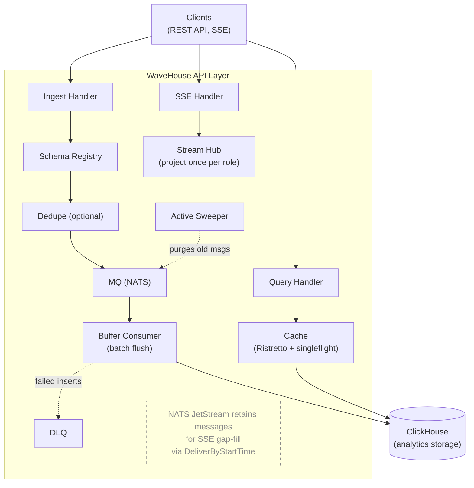

This document describes the internal architecture of WaveHouse, a schema-aware ClickHouse proxy.

## Overview

WaveHouse is a Go-based gateway that sits in front of ClickHouse, acting as the entry and exit point for data. It discovers your real ClickHouse table schemas, validates data at ingest time, batches inserts asynchronously, and provides real-time streaming and query caching.



## Binaries

WaveHouse ships a single binary, `wavehouse`: an all-in-one process running the API, batch worker, embedded NATS JetStream, and optional embedded Pebble dedup. The only external dependency is ClickHouse.

## Internal Packages

```text
internal/
├── api/         HTTP layer (Chi router, handlers, middleware)
├── auth/        JWT/JWKS authentication middleware (HMAC or JWKS, role extraction)
├── cache/       In-process Ristretto cache with singleflight coalescing
├── chsql/       Shared ClickHouse SQL helpers (identifier quoting, bind-safety)
├── config/      YAML + env var configuration loading
├── dedupe/      Optional deduplication (Pebble)
├── discovery/   ClickHouse schema introspection and validation
├── ingest/      Batch buffering, DLQ, and Active Sweeper
├── mq/          Message queue abstraction (embedded NATS)
├── observability/ OpenTelemetry pipeline (traces/metrics/logs + Prometheus exposition)
├── pipes/       Named query pipes (NATS KV store + SQL file bootstrap)
├── policy/      Hasura-style access control (policy types, evaluation, NATS KV store)
├── query/       Structured query AST, SQL builder, and timestamp bucketing
└── stream/      SSE fan-out: event Hub (project once per role), Subscriber queue, Bucket fan-out, keepalive Heartbeater wheel
```

### `api/` — HTTP Layer

The API layer uses [Chi](https://github.com/go-chi/chi) for routing with RequestID, a CORS middleware, and a custom JSON recoverer (`jsonRecoverer`) that emits a JSON `500` on panic instead of chi's plain-text `middleware.Recoverer`.

- **router.go** — Route definitions. Public: `/livez`, `/readyz`, and the content-free `/v1/health` SDK ping (plus the permanent `/healthz` alias and the deprecated `/health`, `/ready` aliases). Policy-gated: `/v1/ingest?table={table}`, `/v1/query?table={table}` (structured), `/v1/pipes/{name}` (named pipes), `/v1/stream`. Admin-only (`RequireAdmin` — role == `policy.admin_role`, or a request bearing the operator key's operator bit, which passes even under a nil policy): `/v1/schema/*`, `/v1/dlq/stats`, `/v1/admin/policy`, `/v1/admin/pipes/*`, `/v1/admin/query` (raw SQL — same gate as the rest of `/v1/admin/*`).
- **auth middleware** — the JWT/JWKS authentication middleware is its own package, [`auth/`](#auth--authentication); the router runs it on every `/v1/*` route.
- **policy.go** — CRUD handler for access control policies (`/v1/admin/policy`).
- **pipes.go** — Named query pipe handlers: admin CRUD and execution with parameter binding.
- **structured_query.go** — Handler for `POST /v1/query?table={table}`: validates query AST, enforces permissions, builds and executes SQL.
- **ingest.go** — Accepts flat JSON body for `POST /v1/ingest?table={table}`, validates against discovered schema, optional dedup, publishes to NATS subject `ingest.{table}`. When dedup is on, a row missing the configured `id_field` can't be deduped: it is logged at `WARN` and counted by `wavehouse_ingest_dedupe_missing_id_total` (labeled by `table`), then published un-deduped — or rejected when `dedupe.require_id` is set (#219).
- **query.go** — Proxies raw SQL for `POST /v1/admin/query` straight to ClickHouse's HTTP interface. **Not cached** — sets `Cache-Control: no-store` so every request hits ClickHouse; DateTime is rendered ISO-8601 via `date_time_output_format=iso` (the Go-side type conversion lives in the structured-query / pipes path, not here).
- **stream.go** — Real-time streaming via SSE. Callers select a table with the `?table=` query parameter. Each connection registers one `Subscriber` (the `stream/` package) with both the event `Hub` (under its `(topic, role)`) and the shared keepalive wheel, then drains both from a single byte-pump — so idle streams keep emitting `:` keepalive comments (surviving reverse-proxy idle timeouts) while live events arrive already projected and serialized. Per-event projection/serialization happens **once per role** in the `Hub`, not once per subscriber ([#294](https://github.com/Wave-RF/WaveHouse/issues/294)). Gap-fill replay from NATS JetStream (`DeliverByStartTime`) stays per-connection (low-volume, one-time on connect).
- **schema.go** — Schema discovery API: list all schemas, get one table, trigger refresh.
- **dlq.go** — DLQ stats endpoint and `EnsureDLQStream` helper for creating the `WAVEHOUSE_DLQ` NATS stream.
- **health.go** — Liveness (`/livez`), readiness (`/readyz`), and a content-free `Online` ping (`/v1/health`, the SDK's public liveness check); `/healthz` is a permanent alias of `/livez`, and `/health`/`/ready` are deprecated aliases. All three consult an optional `BootState` so they can return 503 while boot-time schema discovery is still failing in the retry loop (see `cmd/wavehouse/main.go`); once `BootState.Set(nil)` fires, `/livez` returns 200 and stays there. `/readyz` additionally pings ClickHouse each call; `/v1/health` deliberately does not.

### `stream/` — SSE keepalive & fan-out

The SSE fan-out, factored out of `api/` so the delivery hot path ([#294](https://github.com/Wave-RF/WaveHouse/issues/294)) lives next to the keepalive primitives it shares. One abstraction per file.

- **hub.go** — `Hub`, the event fan-out. Subscribers register under `(topic, role)`; `Broadcast` decodes each event once, applies each subscribed role's column policy once, builds one SSE frame per role, and fans it to every member of that role's `Bucket` — collapsing the prior per-subscriber `unmarshal → evaluate → filter → marshal` into one pass per distinct `(role, table)` output shape (the [#294](https://github.com/Wave-RF/WaveHouse/issues/294) lever; the measured ceiling was ~2 270 deliveries/s from re-projecting per subscriber). The `(topic, role)` key is sufficient because column visibility derives only from the role+table policy entry, never from JWT claims (claims feed only the row-level `WHERE`/`CHECK`, which the stream path does not apply). `ReplayFrame` shares the same projection for the handler's per-connection gap-fill.
- **subscriber.go** — `Subscriber`, the per-connection handle. It owns a single ready-to-write outbound queue of `Frame`s (each tagged with its `kind`, so the handler labels the write where it happens): producers — the keepalive wheel and the event `Hub` — fan frames in with `Send` (non-blocking; a full queue drops and the `Hub` counts it), and the handler drains `Frames()` to the client verbatim. The queue is sized for buffering live events (cap 64, up from the keepalive-only cap 1; #152 will make it a knob), and an `Evicted()` channel is the seam the slow-consumer follow-up closes to disconnect a wedged consumer.
- **bucket.go** — `Bucket`, the reusable fan-out primitive: a concurrency-safe set of subscribers. `Push` delivers a shared `Frame` to each fire-and-forget (the keepalive wheel's ring); `Snapshot` exposes the members so the event `Hub` can fan out while inspecting each `Send` result (to count drops). The `Hub` holds one `Bucket` per `(topic, role)` so a projected frame is built once and sent to every member instead of re-projected per subscriber.
- **heartbeat.go** — The keepalive wheel (`Heartbeater`). A single process-wide ticker fans a minimal `:` comment across the ring of `Bucket`s, waking ~1/N of live streams per tick so the writes don't synchronize. The effective per-connection keepalive period is `stream.keepalive_interval` (the wheel ticks every `keepalive_interval ÷ keepalive_buckets`, so one rotation spans the interval); the owning handler goroutine does the actual write, so the shared ticker never touches a `ResponseWriter` directly.
- **metrics.go** — `Metrics`, the SSE instrument set: `wavehouse_sse_active_streams` (open streams), `wavehouse_sse_stream_duration_seconds` (lifetime), `wavehouse_sse_frames_sent_total` / `wavehouse_sse_bytes_sent_total` (labeled by `kind`: `keepalive`, `event`, `replay`), and `wavehouse_sse_dropped_frames_total` (frames dropped to a full subscriber queue — the slow-consumer signal that was silent before #294). Nil-safe, so the handler holds one unconditionally and tests skip wiring it; one shared instance records both the handler's write sites and the `Hub`'s drop counts. Separate from `observability.RegisterSystemMetrics`, which covers only the NATS/Pebble system gauges. Streams are observed through these metrics rather than per-event traces (the router excludes `/v1/stream` from the HTTP tracer).

### `auth/` — Authentication

- **auth.go** — `Middleware(cfg, store, logger)`: the auth middleware. Verifies JWT tokens with HMAC **or** JWKS (never both), with the accepted `alg` pinned to the active verifier and checked before any key is consulted (rejects `alg: none` and cross-family confusion). Extracts the caller's role from a configurable dot-path claim (`auth.role_claim`, default `role`). It always runs and never rejects — a missing/invalid/expired token yields an empty role (resolved to `default_role` downstream), with the token error stashed in context so a denying gate can fail loud (`401`, not a bare `403`). Before the Bearer token it checks a non-JWT operator key (`auth.operator_key`): a constant-time match on the presented credential — an `Authorization: Operator <key>` header, or the `X-Operator-Key` alias — stamps the live admin role plus an operator bit (`auth.WithOperator`) that `RequireAdmin` honors even under a nil policy — a full-access break-glass credential, audit-logged at Info with no client IP (`store`/`logger` back this path). A presented-but-wrong operator key is logged at `WARN` and counted by `wavehouse_auth_operator_key_failures_total` — a probing signal on the most privileged credential — then falls through like any unauthenticated request (the middleware never rejects).
- **context.go** — request-context accessors and their setters for the role, claims, and token error (`RoleFromContext`, `ClaimsFromContext`, `AuthErrorFromContext`, and the matching `With*` helpers).

### `cache/` — Query Cache

- **cache.go** — `Cache` interface: `Get`, `Set`, `Close`.
- **local.go** — In-process cache using [Ristretto](https://github.com/dgraph-io/ristretto) with `sync.Map` TTL tracking.
- **tiered.go** — Wraps the local cache with [singleflight](https://pkg.go.dev/golang.org/x/sync/singleflight) to prevent cache stampede on concurrent misses. The tiered interface accepts an optional second cache slot for future shared-cache backends, but ships with the slot empty.

### `config/` — Configuration

- **config.go** — Loads configuration from YAML file with environment variable overrides (using [cleanenv](https://github.com/ilyakaznacheev/cleanenv)). All settings use `WH_` prefixed env vars. See [Configuration Reference](/configuration).

### `dedupe/` — Deduplication (Optional)

- **dedupe.go** — `Deduplicator` interface: `CheckAndMark(ctx, eventID) (bool, error)`.
- **embedded.go** — Uses [Pebble](https://github.com/cockroachdb/pebble) (embedded key-value store). Key = event ID.

### `discovery/` — Schema Discovery & Validation

- **discovery.go** — `SchemaRegistry` queries `system.columns` to discover ClickHouse table schemas. Each refresh also discovers the server's default time zone (`SELECT timezone()`) and bakes every `DateTime`/`DateTime64` column's canonicalization spec (precision + resolved zone) into the cached schema, so the per-record ingest path parses no type strings and loads no zones ([#372](https://github.com/Wave-RF/WaveHouse/issues/372)). Supports periodic auto-refresh, on-demand refresh, and `RetryRefresh` (boot-time exponential backoff loop used by `cmd/wavehouse` so a transiently unreachable ClickHouse doesn't crash-loop the binary). Thread-safe via `sync.RWMutex`.
- **timestamp.go** — `CanonicalizeTimestamps(schema, data)` rewrites every `DateTime`/`DateTime64` value it can parse to the canonical RFC 3339 UTC wire form before the event is published (#372): zone-less values are interpreted in the column's declared zone, else the discovered server default — ClickHouse's own rule, so the spelling changes but never the instant. Fail-open: an unparseable value or unresolvable zone passes through verbatim for ClickHouse's own parser to judge; ingest never rejects a record over its timestamp spelling.
- **validation.go** — `Validate(schema, data)` checks incoming JSON against the discovered schema: unknown fields, type compatibility, missing required columns, null handling.
- **discovery_test.go** — Unit tests for validation logic.

### `ingest/` — Ingest Pipeline, DLQ & Sweeping

- **worker.go** — `StartIngestWorker` launches an ingest pipeline: a JetStream consumer reads from the `WAVEHOUSE` stream via a durable `buffer-consumer` pull subscription, batches events per table, and performs bulk INSERTs to ClickHouse. The pipeline is **insert-only**. The wire format `EventMessage` carries `{table_name, received_timestamp, data}` and nothing else; the worker accepts any table name now (the table name in the NATS subject is `query.SafeEncodeNATS(rawUnsafeTableName)`), then bulk-INSERTs. The embedded NATS server runs with `DontListen: true` (`internal/mq/embedded.go`), so the only Publishers reachable on the `ingest.>` subjects are in-process Go code — today, only the HTTP `/v1/ingest?table={table}` handler. Non-insert mutations (`DELETE`/`UPDATE`/`TRUNCATE`/…) must go through `POST /v1/admin/query` under the admin role (`policy.admin_role`) — see the Query Path section below; the `/v1/admin/*` `RequireAdmin` middleware enforces the check at the API layer, so a no/invalid-token request (resolved to `default_role`, not admin in a production config) never reaches the proxy. Failed batches are routed to the DLQ (`sendToDLQ`), which republishes the original `EventMessage` envelope to `dlq.{table}` NATS subjects with the failure context in `X-DLQ-*` headers when DLQ is enabled — see [Ingest Pipeline](/ingest-pipeline) for the worker internals.
- **types.go** — `EventMessage` struct (TableName, ReceivedTimestamp, Data) and `BufferConsumerName` constant, shared across API handlers and the ingest pipeline.
- **sweeper.go** — `Sweeper` implements the Active Sweeper pattern. It runs every minute and purges NATS JetStream messages that are **both** ACKed by the buffer consumer (written to ClickHouse) **and** older than the configurable gap window.

### `mq/` — Message Queue

- **mq.go** — `Publisher` and `Subscriber` interfaces. `Message` struct with `DoubleAck(ctx)`, `Ack()`, and `Nak()`.
- **embedded.go** — In-process NATS server with JetStream. Creates stream `WAVEHOUSE` with subjects `ingest.>`.

### `observability/` — OpenTelemetry Pipeline

- **provider.go** — `InitProvider(ctx, serviceName, ProviderConfig)` wires the OTel pipeline. Each output is independently gated; the W3C TraceContext + Baggage propagator is always installed (cheap, harmless when traces are off). Returns `(shutdown, promHandler http.Handler, err)` — `promHandler` is non-nil only when `PrometheusEnabled` is true and reads from a *private* `prometheus.Registry` to avoid leaking the process/Go collectors that `prometheus.DefaultRegisterer` auto-registers. OTLP-metrics push (`MetricsEnabled`) and Prometheus exposition (`PrometheusEnabled`) are independent: either, both, or neither may be set, and any combination produces a single MeterProvider feeding the active readers. The Endpoint field is only dialed by the OTLP exporters (traces / metrics-OTLP / logs); Prometheus-only operation leaves it untouched. Provider init in `main.go` runs whenever `otel.enabled` OR `prometheus.enabled` is true, so Prometheus-only operation (Alloy/scrape, no collector) is a first-class mode.
- **logger.go** — `NewLogger(component, level, isJSON, otlpSampleRate)` produces a slog logger that fans out to stdout (always 100%) and the OTLP log exporter (DEBUG/INFO sampled at `otlpSampleRate`, WARN/ERROR always 100% as a non-configurable safety floor). `TraceHandler` injects `trace_id`/`span_id` from the active span when one exists. `otlpSamplerFn` is exposed (lowercase) for unit testing the per-level rate logic without driving through the slogmulti middleware.
- **metrics.go** — `RegisterSystemMetrics(natsServer, dedup)` registers observable gauges for embedded NATS connections, in-msgs, and Pebble dedupe storage stats. Wired in `cmd/wavehouse/main.go` after the providers are up.
- **tracer.go** — W3C TraceContext propagation over NATS message headers (`InjectNATS` / `ExtractNATS`) — bridges the API request span into the ingest worker so end-to-end traces survive the queue handoff.

The package's design invariants — stdout always 100%, WARN+ERROR always export at 100%, gRPC exporters dial lazily so unreachable collectors never block startup, private Prometheus registry — are documented in AGENTS.md "Key Design Decisions" #15 and must be preserved by anything touching this package.

### `policy/` — Access Control

- **policy.go** — Hasura-style policy types (`Policy`, `TablePolicy`, `RolePermissions`, `Filter`), `Evaluate()` function that resolves permissions against JWT claims (including `{{ jwt.claim.path }}` template resolution), the per-column decision `IsColumnAllowed()` plus its batch/projection forms `AllowedProjection()` and `RestrictsColumns()` (used to expand a `select_all` request into a role's allowed columns), `IsAggregationAllowed()`, `Validate()`.
- **store.go** — `Store` backed by NATS KV bucket `WAVEHOUSE_POLICY`. Supports file-based bootstrap (YAML/JSON), cluster-wide sync via KV Watch, local caching.

### `pipes/` — Named Query Pipes

- **pipes.go** — `NamedQuery` type with SQL template and parameter definitions, `Store` backed by NATS KV bucket `WAVEHOUSE_PIPES`. Supports `.sql` file directory bootstrap. `BindParams()` resolves `{{param}}` / `{{param:default}}` placeholders by inlining escaped literal values into the SQL (strings single-quote-escaped; arrays rendered as escaped `(…)` `IN`-lists). A non-scalar value with no SQL form (a JSON object, or an empty array) is rejected rather than emitted raw.

### `query/` — Structured Query Engine

- **ast.go** — `StructuredQuery` AST types: columns, aggregations, filters, group by, order by, limit, time range.
- **builder.go** — `Build()` converts AST to parameterized SQL. It is the single chokepoint that validates every referenced identifier against the schema **and** authorizes every column reference — projection, aggregation args, filters, group_by, order_by, time_range — against the role's column allowlist (the [#223](https://github.com/Wave-RF/WaveHouse/issues/223) hard cap). A full-row read is requested with `select_all`, which expands to the role's allowed columns rather than emitting a raw `SELECT *`; an omitted projection selects nothing, and `*` in `columns` is a literal column name. Every identifier is backtick-quoted via `internal/chsql` (`QuoteIdent`) so any ClickHouse-legal name is accepted — a name containing `?` is refused fail-closed ([#279](https://github.com/Wave-RF/WaveHouse/issues/279)). `InjectPermissionFilters()` adds row-level security. `ApplyMaxRows()` enforces limits. Timestamp bucketing for cache optimization.

### `chsql/` — ClickHouse SQL Helpers

- **chsql.go** — Dependency-free ClickHouse SQL helpers shared by `query/` and `policy/`, kept in their own package to break an import cycle. `QuoteIdent` is the single place every identifier — column, table, alias — becomes SQL text: always backtick-quoted and escaped, so any ClickHouse-legal name (dots, spaces, unicode, keywords) is safe. `BindUnsafe` reports whether a name contains a literal `?`, which would desync clickhouse-go's positional binder; such names are rejected fail-closed rather than silently mis-bound.

## Data Flows

### Ingest Path

```text wrap=false
Client POST /v1/ingest?table={table}
  → JWT auth middleware (always runs; token optional)
  → Look up table schema from SchemaRegistry
  → Policy check: role allowed to insert into this table (before the body is parsed)
  → Validate JSON body against schema (type checks, required columns)
  → Policy column rules + check clauses (disallowed columns rejected;
    claim-derived values enforced or injected)
  → Canonicalize DateTime/DateTime64 values to RFC 3339 UTC (rewrites the
    payload so every consumer shares one spelling; fail-open — an unparseable
    value passes through verbatim for ClickHouse's own parser to judge)
  → Optional deduplication check (configurable ID field; a row missing that
    field is published un-deduped + logged/counted, or rejected under require_id)
  → Publish to NATS JetStream (ingest.{table})
  → 200 OK returned immediately
  → (If NATS stream is full: 503 + Retry-After header)

Ingest worker pipeline (StartIngestWorker):
  ← JetStream pull consumer (buffer-consumer) on ingest.>
  → Parse the event envelope (a malformed envelope is the only poison pill: it's acked-and-dropped)
  → Batch events per table, bulk INSERT to ClickHouse
    (INSERTs pin date_time_input_format=best_effort — the server default since
    ClickHouse 26.5; on older servers the 'basic' default rejects the canonical
    RFC 3339 form's zone suffix. A superset of basic, so pre-canonical and
    fail-open pass-through spellings parse as before)
  → On success: DoubleAck messages
  → On failure: route to DLQ output (dlq.{table}), then Ack to prevent infinite retry

  (Insert-only pipeline. The wire format `EventMessage` carries only
  {table_name, received_timestamp, data}; non-insert mutations
  DELETE/UPDATE/TRUNCATE/DROP/etc. must go through POST /v1/admin/query — the
  /v1/admin/* RequireAdmin gate rejects non-admin callers at the API layer, so
  a no/invalid-token request (resolved to default_role, not admin in a
  production config) cannot reach the proxy.)

Active Sweeper (async goroutine, every 60s):
  → Read buffer consumer's AckFloor (highest contiguous ACKed seq)
  → Binary search for first message within the gap window
  → Purge target = MIN(ack_floor + 1, gap_window_seq)
  → Purge all messages below target from JetStream
```

### Query Path

```text
Client POST /v1/admin/query
  → JWT auth middleware (always runs; no/invalid token → empty role)
  → /v1/admin RequireAdmin (role == policy.admin_role, or the operator-key bit) — single gate shared
    with the rest of /v1/admin/* (policy CRUD, pipes CRUD). Raw SQL has
    no per-statement scope check (a full SQL parser would be needed to
    authorize predicates), so the role gate is the entire authorization
    story. /v1/admin/query is the only sanctioned surface for non-SELECT
    statements (DELETE/UPDATE/TRUNCATE/DROP/ALTER/…); non-admin callers
    use `POST /v1/ingest?table={table}` for writes and the structured query
    endpoint or named pipes for reads.
  → Decode {"sql": "..."} from the request body.
  → POST the SQL verbatim to ClickHouse's HTTP interface at
    <scheme>://<host>:<httpport>/?default_format=JSON
       &date_time_output_format=iso&database=<db>
    Auth via X-ClickHouse-User / X-ClickHouse-Key headers.
    Bound by a clickhouse.query_timeout context derived from the inbound request — client
    disconnect cancels the upstream call.
  → ClickHouse parses the SQL natively and decides what to do:
    → Read: returns 200 + {"meta":[...], "data":[...], "rows":N,
      "statistics":{...}} as JSON. The handler extracts `data` and
      forwards just that array, preserving the [{...}, {...}] response
      shape callers expect.
    → Mutation/DDL: returns 200 + empty body. The handler emits `[]` so
      response shape stays "always an array."
    → Error: returns 4xx/5xx + plain-text error message. The handler
      maps ClickHouse 4xx → HTTP 400 (caller-fault, bad SQL or missing
      table) and ClickHouse 5xx → HTTP 502 (gateway-fault, upstream
      problem), with the trimmed message inside the JSON error
      envelope — admins see ClickHouse's exact diagnostic.
  → Response carries Cache-Control: no-store so no downstream layer
    (browser, CDN, corp proxy) caches the result.
```

The proxy-pattern wins are: zero classification logic on the WaveHouse
side (no isMutation heuristic to maintain), and any ClickHouse statement
type — including verbs added in future versions and inline FORMAT
overrides — works without WaveHouse code changes. Multi-statement input
(`SELECT 1; TRUNCATE t`) is supported when the upstream ClickHouse has
multi-query enabled, which is the default on recent versions; older or
restrictively-configured servers will return a clear error from
ClickHouse itself for the second statement. The proxy buffers the response in memory with a
64 MiB cap (502 with `clickhouse response exceeded N bytes` on overflow,
to keep a runaway `SELECT *` from pinning RAM on the API server), and
passes ClickHouse's `Content-Type` through when an inline `FORMAT`
directive overrides the default JSON envelope. The structured query
endpoint and pipes still go through `clickhouse-go`'s native driver
(Query/Exec) for performance and to keep the cached row-array shape
consistent.

### Streaming Path

```text
Client GET /v1/stream
  → JWT auth middleware (always runs; token optional)
  → Register a Subscriber with the Stream Hub, keyed by (topic, role)
  → If ?since= / Last-Event-ID provided:
    → Create ephemeral NATS consumer with DeliverByStartTime
    → Send historical events (projected per-connection) first
  → Live events: MQ → Hub.Broadcast → projected & serialized ONCE per role
    → fan the finished frame to every Subscriber of that (topic, role)
  → Handler drains keepalives + event frames from one byte-pump → client
  → Per-role policy filtering (historical + live): denied tables skipped,
    denied columns stripped. Live projection runs once per role (Hub.Broadcast);
    replay shares the same column policy but projects per-connection
```

## Technology Stack

| Component | Technology | Purpose |
| --------- | ---------- | ------- |
| Language | Go 1.26 | Core runtime |
| HTTP Router | Chi v5 | Request routing and middleware |
| Authentication | golang-jwt v5 + keyfunc v3 | JWT (HMAC + JWKS) parsing and validation |
| Analytics DB | ClickHouse | Primary data store + schema source of truth |
| Message Queue | NATS + JetStream | Durable event streaming |
| L1 Cache | Ristretto v2 | In-process memory cache |
| Embedded KV | Pebble | Optional deduplication |
| Config | cleanenv | YAML + env var config loading |
| Release | GoReleaser | Cross-platform binary builds |
| Containers | Docker (distroless) | Minimal production images |
