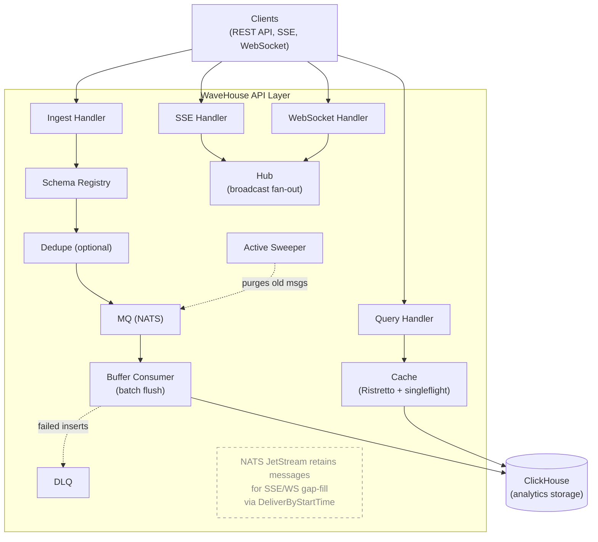

This document describes the internal architecture of WaveHouse, a schema-aware ClickHouse proxy.

## Overview

WaveHouse is a Go-based gateway that sits in front of ClickHouse, acting as the entry and exit point for data. It discovers your real ClickHouse table schemas, validates data at ingest time, batches inserts asynchronously, and provides real-time streaming and query caching.



## Binaries

WaveHouse ships a single binary, `wavehouse`: an all-in-one process running the API, batch worker, embedded NATS JetStream, and optional embedded Pebble dedup. The only external dependency is ClickHouse.

## Internal Packages

```text
internal/
├── api/         HTTP layer (Chi router, handlers, middleware, Hub)
├── cache/       In-process Ristretto cache with singleflight coalescing
├── config/      YAML + env var configuration loading
├── dedupe/      Optional deduplication (Pebble)
├── discovery/   ClickHouse schema introspection and validation
├── ingest/      Batch buffering, DLQ, and Active Sweeper
├── mq/          Message queue abstraction (embedded NATS)
├── observability/ OpenTelemetry pipeline (traces/metrics/logs + Prometheus exposition)
├── pipes/       Named query pipes (NATS KV store + SQL file bootstrap)
├── policy/      Hasura-style access control (policy types, evaluation, NATS KV store)
└── query/       Structured query AST, SQL builder, and timestamp bucketing
```

### `api/` — HTTP Layer

The API layer uses [Chi](https://github.com/go-chi/chi) for routing with standard middleware (RequestID, RealIP, Recoverer).

- **router.go** — Route definitions. Public: `/health`, `/ready`. Policy-gated: `/v1/ingest?table={table}`, `/v1/query?table={table}` (structured), `/v1/pipes/{name}` (named pipes), `/v1/stream/sse`, `/v1/stream/ws`. Admin-only (`RequireAdmin`, role == `policy.admin_role`): `/v1/schema/*`, `/v1/dlq/stats`, `/v1/admin/policy`, `/v1/admin/pipes/*`, `/v1/admin/query` (raw SQL — same gate as the rest of `/v1/admin/*`).
- **`internal/auth`** — JWT auth middleware supporting HMAC and JWKS validation and role extraction from a configurable claim path. It always runs (no on/off flag) and never rejects: a missing/invalid/expired token yields an empty role (resolved to `default_role` downstream), with the token error stashed in context so a denying gate can fail loud.
- **policy.go** — CRUD handler for access control policies (`/v1/admin/policy`).
- **pipes.go** — Named query pipe handlers: admin CRUD and execution with parameter binding.
- **structured_query.go** — Handler for `POST /v1/query?table={table}`: validates query AST, enforces permissions, builds and executes SQL.
- **ingest.go** — Accepts flat JSON body for `POST /v1/ingest?table={table}`, validates against discovered schema, optional dedup, publishes to NATS subject `ingest.{table{.scope}}`.
- **query.go** — Executes SQL queries directly against ClickHouse. Results are cached. UUID/DateTime columns are converted to strings.
- **stream_sse.go** / **stream_ws.go** — Real-time streaming via SSE and WebSocket. Callers select a table with the `?table=` query parameter (required for SSE); WS additionally accepts in-band `{"action":"subscribe","table":"..."}` commands. Supports gap-fill from NATS JetStream using `DeliverByStartTime`.
- **transform.go** — Shared `transformForClient` function: passes through `table_name`, `received_timestamp`, and `data` from the wire format.
- **schema.go** — Schema discovery API: list all schemas, get one table, trigger refresh.
- **dlq.go** — DLQ stats endpoint and `EnsureDLQStream` helper for creating the `WAVEHOUSE_DLQ` NATS stream.
- **hub.go** — In-process pub/sub for broadcasting MQ messages to connected streaming clients.
- **health.go** — Liveness (`/health`) and readiness (`/ready`) probes. Both consult an optional `BootState` so they can return 503 with a diagnostic while boot-time schema discovery is still failing in the retry loop (see `cmd/wavehouse/main.go`); once `BootState.Set(nil)` fires, `/health` returns 200 and stays there.

### `cache/` — Query Cache

- **cache.go** — `Cache` interface: `Get`, `Set`, `Close`.
- **local.go** — In-process cache using [Ristretto](https://github.com/dgraph-io/ristretto) with `sync.Map` TTL tracking.
- **tiered.go** — Wraps the local cache with [singleflight](https://pkg.go.dev/golang.org/x/sync/singleflight) to prevent cache stampede on concurrent misses. The tiered interface accepts an optional second cache slot for future shared-cache backends, but ships with the slot empty.

### `config/` — Configuration

- **config.go** — Loads configuration from YAML file with environment variable overrides (using [cleanenv](https://github.com/ilyakaznacheev/cleanenv)). All settings use `WH_` prefixed env vars. See [Configuration Reference](/configuration).

### `dedupe/` — Deduplication (Optional)

- **dedupe.go** — `Deduplicator` interface: `CheckAndMark(ctx, eventID) (bool, error)`.
- **embedded.go** — Uses [Pebble](https://github.com/cockroachdb/pebble) (embedded key-value store). Key = event ID.

### `discovery/` — Schema Discovery & Validation

- **discovery.go** — `SchemaRegistry` queries `system.columns` to discover ClickHouse table schemas. Supports periodic auto-refresh, on-demand refresh, and `RetryRefresh` (boot-time exponential backoff loop used by `cmd/wavehouse` so a transiently unreachable ClickHouse doesn't crash-loop the binary). Thread-safe via `sync.RWMutex`.
- **validation.go** — `Validate(schema, data)` checks incoming JSON against the discovered schema: unknown fields, type compatibility, missing required columns, null handling.
- **discovery_test.go** — Unit tests for validation logic.

### `ingest/` — Ingest Pipeline, DLQ & Sweeping

- **worker.go** — `StartIngestWorker` launches an ingest pipeline: a JetStream input (`jsInput`) reads from the `WAVEHOUSE` stream via a durable `buffer-consumer` pull consumer, batches events per table, and performs bulk INSERTs to ClickHouse. The pipeline is **insert-only**. The wire format `EventMessage` carries `{table_name, scope, received_timestamp, data}` and nothing else; the worker accepts any table name now (the table name in the NATS subject is `query.SafeEncodeNATS(rawUnsafeTableName)`), then bulk-INSERTs. The embedded NATS server runs with `DontListen: true` (`internal/mq/embedded.go`), so the only Publishers reachable on the `ingest.>` subjects are in-process Go code — today, only the HTTP `/v1/ingest?table={table}` handler. Non-insert mutations (`DELETE`/`UPDATE`/`TRUNCATE`/…) must go through `POST /v1/admin/query` under the admin role (`policy.admin_role`) — see the Query Path section below; the `/v1/admin/*` `RequireAdmin` middleware enforces the check at the API layer, so a no/invalid-token request (resolved to `default_role`, not admin in a production config) never reaches the proxy. Failed batches are routed to a DLQ output (`dlqOutput`) which publishes the inner data payload (`{"id":"abc","field":...}`) to `dlq.{table{.scope}}` NATS subjects when DLQ is enabled.
- **types.go** — `EventMessage` struct (TableName, Scope, ReceivedTimestamp, Data) and `BufferConsumerName` constant, shared across API handlers and the ingest pipeline.
- **sweeper.go** — `Sweeper` implements the Active Sweeper pattern. It runs every minute and purges NATS JetStream messages that are **both** ACKed by the buffer consumer (written to ClickHouse) **and** older than the configurable gap window.

### `mq/` — Message Queue

- **mq.go** — `Publisher` and `Subscriber` interfaces. `Message` struct with `DoubleAck(ctx)`, `Ack()`, and `Nak()`.
- **embedded.go** — In-process NATS server with JetStream. Creates stream `WAVEHOUSE` with subjects `ingest.>`.

### `observability/` — OpenTelemetry Pipeline

- **provider.go** — `InitProvider(ctx, serviceName, ProviderConfig)` wires the OTel pipeline. Each output is independently gated; the W3C TraceContext + Baggage propagator is always installed (cheap, harmless when traces are off). Returns `(shutdown, promHandler http.Handler, err)` — `promHandler` is non-nil only when `PrometheusEnabled` is true and reads from a *private* `prometheus.Registry` to avoid leaking the process/Go collectors that `prometheus.DefaultRegisterer` auto-registers. OTLP-metrics push (`MetricsEnabled`) and Prometheus exposition (`PrometheusEnabled`) are independent: either, both, or neither may be set, and any combination produces a single MeterProvider feeding the active readers. The Endpoint field is only dialed by the OTLP exporters (traces / metrics-OTLP / logs); Prometheus-only operation leaves it untouched. Provider init in `main.go` runs whenever `otel.enabled` OR `prometheus.enabled` is true, so Prometheus-only operation (Alloy/scrape, no collector) is a first-class mode.
- **logger.go** — `NewLogger(component, level, isJSON, otlpSampleRate)` produces a slog logger that fans out to stdout (always 100%) and the OTLP log exporter (DEBUG/INFO sampled at `otlpSampleRate`, WARN/ERROR always 100% as a non-configurable safety floor). `TraceHandler` injects `trace_id`/`span_id` from the active span when one exists. `otlpSamplerFn` is exposed (lowercase) for unit testing the per-level rate logic without driving through the slogmulti middleware.
- **metrics.go** — `RegisterSystemMetrics(natsServer, dedup)` registers observable gauges for embedded NATS connections, in-msgs, and Pebble dedupe storage stats. Wired in `cmd/wavehouse/main.go` after the providers are up.
- **tracer.go** — W3C TraceContext propagation over NATS message headers (`InjectNATS` / `ExtractNATS`) — bridges the API request span into the ingest worker so end-to-end traces survive the queue handoff.

The package's design invariants — stdout always 100%, WARN+ERROR always export at 100%, gRPC exporters dial lazily so unreachable collectors never block startup, private Prometheus registry — are documented in AGENTS.md "Key Design Decisions" #15 and must be preserved by anything touching this package.

### `policy/` — Access Control

- **policy.go** — Hasura-style policy types (`Policy`, `TablePolicy`, `RolePermissions`, `Filter`), `Evaluate()` function that resolves permissions against JWT claims (including `{{ jwt.claim.path }}` template resolution), `IsColumnAllowed()`, `IsAggregationAllowed()`, `Validate()`.
- **store.go** — `Store` backed by NATS KV bucket `WAVEHOUSE_POLICY`. Supports file-based bootstrap (YAML/JSON), cluster-wide sync via KV Watch, local caching.

### `pipes/` — Named Query Pipes

- **pipes.go** — `NamedQuery` type with SQL template and parameter definitions, `Store` backed by NATS KV bucket `WAVEHOUSE_PIPES`. Supports `.sql` file directory bootstrap. `BindParams()` resolves `{{param}}` / `{{param:default}}` placeholders by inlining escaped literal values into the SQL (strings are single-quote-escaped).

### `query/` — Structured Query Engine

- **ast.go** — `StructuredQuery` AST types: columns, aggregations, filters, group by, order by, limit, time range.
- **builder.go** — `Build()` converts AST to parameterized SQL. Validates all identifiers against schema (SQL injection prevention). `InjectPermissionFilters()` adds row-level security. `ApplyMaxRows()` enforces limits. Timestamp bucketing for cache optimization.

## Data Flows

### Ingest Path

```text
Client POST /v1/ingest?table={table}
  → Optional JWT auth middleware
  → Look up table schema from SchemaRegistry
  → Validate JSON body against schema (type checks, required columns)
  → Optional deduplication check (configurable ID field)
  → Publish to NATS JetStream (ingest.{table})
  → 200 OK returned immediately
  → (If NATS stream is full: 503 + Retry-After header)

Ingest worker pipeline (StartIngestWorker):
  ← JetStream pull consumer (buffer-consumer) on ingest.>
  → Validate table name against safeIdentifierRe
  → Validate payload presence (reject envelopes with empty `data`)
  → Batch events per table, bulk INSERT to ClickHouse
  → On success: DoubleAck messages
  → On failure: route to DLQ output (dlq.{table}), then Ack to prevent infinite retry

  (Insert-only pipeline. The wire format `EventMessage` carries only
  {table_name, scope, received_timestamp, data}; non-insert mutations
  DELETE/UPDATE/TRUNCATE/DROP/etc. must go through POST /v1/admin/query — the
  /v1/admin/* RequireAdmin gate rejects non-admin callers at the API layer, so
  a no/invalid-token request (resolved to default_role, not admin in a
  production config) cannot reach the proxy.)

Active Sweeper (async goroutine, every 60s):
  → Read buffer consumer's AckFloor (highest contiguous ACKed seq)
  → Binary search for first message within the gap window
  → Purge target = MIN(ack_floor + 1, gap_window_seq)
  → Purge all messages below target from JetStream
```

### Query Path

```text
Client POST /v1/admin/query
  → JWT auth middleware (always runs; no/invalid token → empty role)
  → /v1/admin RequireAdmin (role == policy.admin_role) — single gate shared
    with the rest of /v1/admin/* (policy CRUD, pipes CRUD). Raw SQL has
    no per-statement scope check (a full SQL parser would be needed to
    authorize predicates), so the role gate is the entire authorization
    story. /v1/admin/query is the only sanctioned surface for non-SELECT
    statements (DELETE/UPDATE/TRUNCATE/DROP/ALTER/…); non-admin callers
    use `POST /v1/ingest?table={table}` for writes and the structured query
    endpoint or named pipes for reads.
  → Decode {"sql": "..."} from the request body.
  → POST the SQL verbatim to ClickHouse's HTTP interface at
    <scheme>://<host>:<httpport>/?default_format=JSON
       &date_time_output_format=iso&database=<db>
    Auth via X-ClickHouse-User / X-ClickHouse-Key headers.
    Bound by a clickhouse.query_timeout context derived from the inbound request — client
    disconnect cancels the upstream call.
  → ClickHouse parses the SQL natively and decides what to do:
    → Read: returns 200 + {"meta":[...], "data":[...], "rows":N,
      "statistics":{...}} as JSON. The handler extracts `data` and
      forwards just that array, preserving the [{...}, {...}] response
      shape callers expect.
    → Mutation/DDL: returns 200 + empty body. The handler emits `[]` so
      response shape stays "always an array."
    → Error: returns 4xx/5xx + plain-text error message. The handler
      maps ClickHouse 4xx → HTTP 400 (caller-fault, bad SQL or missing
      table) and ClickHouse 5xx → HTTP 502 (gateway-fault, upstream
      problem), with the trimmed message inside the JSON error
      envelope — admins see ClickHouse's exact diagnostic.
  → Response carries Cache-Control: no-store so no downstream layer
    (browser, CDN, corp proxy) caches the result.
```

The proxy-pattern wins are: zero classification logic on the WaveHouse
side (no isMutation heuristic to maintain), and any ClickHouse statement
type — including verbs added in future versions and inline FORMAT
overrides — works without WaveHouse code changes. Multi-statement input
(`SELECT 1; TRUNCATE t`) is supported when the upstream ClickHouse has
multi-query enabled, which is the default on recent versions; older or
restrictively-configured servers will return a clear error from
ClickHouse itself for the second statement. The proxy buffers the response in memory with a
64 MiB cap (502 with `clickhouse response exceeded N bytes` on overflow,
to keep a runaway `SELECT *` from pinning RAM on the API server), and
passes ClickHouse's `Content-Type` through when an inline `FORMAT`
directive overrides the default JSON envelope. The structured query
endpoint and pipes still go through `clickhouse-go`'s native driver
(Query/Exec) for performance and to keep the cached row-array shape
consistent.

### Streaming Path

```text
Client GET /v1/stream/sse or /v1/stream/ws
  → Optional JWT auth middleware
  → If ?since= parameter provided:
    → Create ephemeral NATS consumer with DeliverByStartTime
    → Send historical events from JetStream first
  → Subscribe to Hub (in-process pub/sub)
  → Stream live events as they arrive via MQ → Hub → client
```

## Technology Stack

| Component | Technology | Purpose |
| --------- | ---------- | ------- |
| Language | Go 1.26 | Core runtime |
| HTTP Router | Chi v5 | Request routing and middleware |
| Authentication | golang-jwt v5 + keyfunc v3 | JWT (HMAC + JWKS) parsing and validation |
| Analytics DB | ClickHouse | Primary data store + schema source of truth |
| Message Queue | NATS + JetStream | Durable event streaming |
| L1 Cache | Ristretto v2 | In-process memory cache |
| Embedded KV | Pebble | Optional deduplication |
| WebSocket | coder/websocket | WebSocket protocol support |
| Config | cleanenv | YAML + env var config loading |
| Release | GoReleaser | Cross-platform binary builds |
| Containers | Docker (distroless) | Minimal production images |
