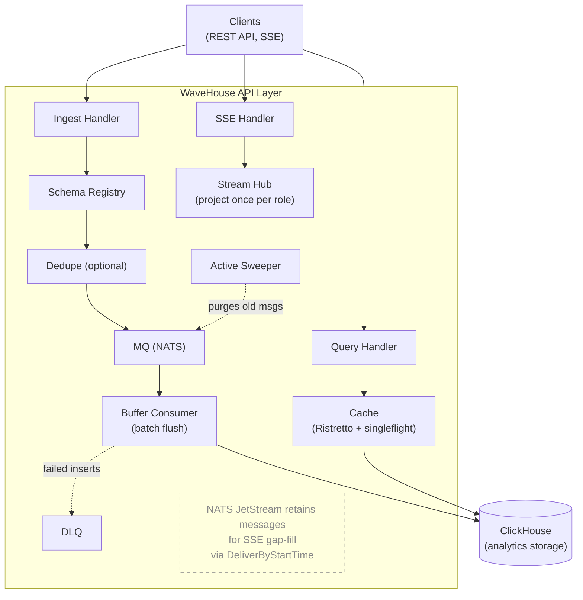

This document describes the internal architecture of WaveHouse, a schema-aware ClickHouse proxy.

## Overview

WaveHouse is a Go-based gateway that sits in front of ClickHouse, acting as the entry and exit point for data. It discovers your real ClickHouse table schemas, validates data at ingest time, batches inserts asynchronously, and provides real-time streaming and query caching.



## Binaries

WaveHouse ships a single binary, `wavehouse`: an all-in-one process running the API, batch worker, embedded NATS JetStream, and optional embedded Pebble dedup. The only external dependency is ClickHouse. `cmd/wavehouse` is the shell — subcommand dispatch, the logger, `config.Load`, the signal context — and `internal/app` is the process itself (see [`app/`](#app--process-wiring) below).

## Internal Packages

```text
internal/
├── api/         HTTP layer (Chi router, handlers, middleware, the cached read paths' singleflight)
├── app/         Process wiring: build every component, run them under one errgroup, release in reverse
├── auth/        JWT/JWKS authentication middleware (HMAC or JWKS, role extraction)
├── cache/       Query cache: Ristretto L1 + the tenant-led version index
├── chconn/      One ClickHouse pool per connection tuple among the served tenants, reconciled on reload under the ceiling
├── chsql/       Shared ClickHouse SQL helpers (identifier quoting, bind-safety)
├── config/      YAML + env var configuration loading
├── dedupe/      Optional deduplication (Pebble)
├── discovery/   ClickHouse schema introspection and validation
├── ingest/      Batch buffering, DLQ, and Active Sweeper
├── mq/          MQ boundary: the only NATS/JetStream importer (owned message/consumer/stream types + embedded server)
├── observability/ OpenTelemetry pipeline (traces/metrics/logs + Prometheus exposition)
├── pipes/       Named query pipes (NamedQuery type, parameter binding, Source)
├── policy/      Hasura-style access control (policy types, evaluation, Source)
├── query/       Structured query AST, SQL builder, and timestamp bucketing
├── settings/    Settings directory: validate the JSON files, hold each tenant's adopted snapshot, reload on watch / SIGHUP / API
├── stream/      SSE fan-out: event Hub (project once per role), Subscriber queue, Bucket fan-out, keepalive Heartbeater wheel
└── tenant/      Tenant id: the type, its grammar, the reserved default, the request header name
```

### `api/` — HTTP Layer

The API layer uses [Chi](https://github.com/go-chi/chi) for routing with RequestID, a CORS middleware that decorates each response from the allowlist of the tenant the request names (`corsOrigins`; the tenant-exempt routes and a refused request read tenant `0`'s, and nothing when no tenant `0` is served), and a custom JSON recoverer (`jsonRecoverer`) that emits a JSON `500` on panic instead of chi's plain-text `middleware.Recoverer`.

- **router.go** — Route definitions. Public: `/livez`, `/readyz`, and the content-free `/v1/health` SDK ping (plus the permanent `/healthz` alias and the deprecated `/health`, `/ready` aliases). Policy-gated: `/v1/ingest?table={table}`, `/v1/query?table={table}` (structured), `/v1/pipes/{name}` (named pipes), `/v1/stream`. Admin-only (`RequireAdmin` — role == `policy.admin_role`, or a request bearing the operator key's operator bit, which passes even under a nil policy; over a nested settings directory `NewRouter` mounts the gate with no policy at all, whatever `Dependencies.PolicySource` was wired, so the operator key alone passes): `/v1/ops/schema/*`, `/v1/ops/dlq/stats`, `GET /v1/ops/pipes[/{name}]`, `/v1/ops/settings/reload`, `/v1/ops/query` (raw SQL — same gate as the rest of `/v1/ops/*`).
- **auth middleware** — the JWT/JWKS authentication middleware is its own package, [`auth/`](#auth--authentication); the router runs it on every `/v1/*` route.
- **tenant.go** — `TenantMW` resolves the request's tenant ahead of the auth middleware on every `/v1` route outside `/v1/ops/*`: the [`X-Tenant-ID`](/deployment#multi-tenant-deployments) header (absent means `tenant.Default`), validated by `tenant.Parse` (`400`), looked up in the `settings.Registry` (`resolveStore`: `404` for an id it does not hold, a bare `503` for a tenant whose folder was rejected — the findings stay out of a body answered before authentication), and the resolved `*settings.Store` stored in the request context (`WithStore` / `StoreFromContext` — here rather than in `tenant/`, because `settings` names `tenant.ID`). A handler reads the store once and passes it down as an argument — the per-tenant getters it holds take it as a parameter (`(*settings.Store).Policy`, `.DedupeFor`, `.DefaultMaxRows`, … in production) — and nothing below a handler reads the context; a tenant route reached without a resolved store answers `500` rather than fall back to a tenant. The probes, `/version`, the metrics path, and `/v1/ops/*` are tenant-exempt; an ops route that addresses one tenant — the admin pipe reads, the schema routes, the raw-SQL proxy and the settings reload — names it in `?tenant=` (`opsTenant`, and `opsStore` over it for the routes that need the tenant's store), parsed strictly so that a query `url.ParseQuery` would half-read is a `400` rather than a read of the default tenant, which is what it means when absent on the reads (on the reload, absent is the whole directory).
- **pipes.go** — Named query pipe handlers: admin listing (`GET /v1/ops/pipes[/{name}]`, read per request from its `pipes.Source`) and execution with parameter binding. `pipes.json` is the only write path.
- **structured_query.go** — Handler for `POST /v1/query?table={table}`: validates query AST, enforces permissions, builds and executes SQL.
- **ingest.go** — Accepts `POST /v1/ingest?table={table}` in three body shapes: one flat JSON object, a JSON array of them, or NDJSON. The **required** `Content-Type` chooses the format *family* — `application/json` versus the four NDJSON spellings — and within the JSON family the body's first non-whitespace byte picks array versus single object; the bytes never choose the family. Anything that is not exactly one readable media type is a `415`, decided before the body is read: the header is parsed per RFC 9110 §8.3, and because `Content-Type` is a singleton field, repeated header lines must all resolve to the same format and a value carrying a comma is refused unless the value as a whole parses as one media type — a comma inside a *quoted* parameter value is data, so `application/json; a=", application/x-ndjson; b="` is accepted. It then reads the whole (`MaxBytesReader`-capped) body into a pooled buffer and runs the per-format record readers over those bytes, so the `413` lands before any record is processed and peak memory per request is O(body) rather than O(record). Then it validates each record against the discovered schema, optional dedup, and publishes each row through `mq.Publisher` on `mq.Topic{Tenant, Table, Scope}` (the request's tenant, read off its resolved store — `store.Tenant()` — and raw names; the subject it becomes is `internal/mq`'s; a full queue comes back as `mq.ErrQueueFull`, which is the `503` + `Retry-After`). When dedup is on, a row missing the configured `id_field` can't be deduped: it is logged at `WARN` and counted by `wavehouse_ingest_dedupe_missing_id_total` (labeled by `table`), then published un-deduped — or rejected when `dedupe.require_id` is set ([#219](https://github.com/Wave-RF/WaveHouse/issues/219)).
- **query.go** — Proxies raw SQL for `POST /v1/ops/query` straight to the `?tenant=`'s ClickHouse HTTP interface (`chconn.Pools.Target` by the resolved store's tenant; the zero target — no pool — is a `503` with `Retry-After`). **Not cached** — sets `Cache-Control: no-store` so every request hits ClickHouse; DateTime is rendered ISO-8601 via `date_time_output_format=iso` (the Go-side type conversion lives in the structured-query / pipes path, not here).
- **stream.go** — Real-time streaming via SSE. Callers select a table with the `?table=` query parameter. Each connection registers one `Subscriber` (the `stream/` package) with both the event `Hub` (under its `(topic, role)`) and the shared keepalive wheel, then drains both from a single byte-pump — so idle streams keep emitting `:` keepalive comments (surviving reverse-proxy idle timeouts) while live events arrive already projected and serialized. Per-event projection/serialization happens **once per role** in the `Hub`, not once per subscriber ([#294](https://github.com/Wave-RF/WaveHouse/issues/294)); the handler also snapshots the connection's JWT claims onto the `Subscriber`, which the `Hub` evaluates per subscriber when the role carries a row-level `filter` ([#319](https://github.com/Wave-RF/WaveHouse/issues/319)). Gap-fill replay (`mq.Replayer.ReplaySince` on the connection's `mq.Topic` — a `DeliverByStartTime` consumer inside `internal/mq`) stays per-connection (low-volume, one-time on connect).
- **schema.go** — Schema discovery API of one tenant, the `?tenant=` (`opsStore`): list all schemas, get one table, trigger refresh. `lookupSchema`, shared with the ingest and structured-query handlers, is the one reading of a `SchemaRegistry.Lookup` miss: `503` with `Retry-After` before the tenant's first discovery (`ErrNotLoaded`, or no registry built yet), `404` for a table the discovered schema lacks; the list answers the same `503` rather than `[]`. A refresh of a tenant on no pool (`discovery.ErrNoConnection`) is a `503` with `Retry-After` too. The handlers hold `RegistrySource`, `func(*settings.Store) *discovery.SchemaRegistry`, and the query paths a `func(*settings.Store) driver.Conn` beside it — each resolves the request's tenant per call, and a nil connection (a tenant the connection ceiling left on no pool) is a `503` ahead of the cache, so nothing cached before is served.
- **dlq.go** — DLQ stats endpoint (`GET /v1/ops/dlq/stats`): asks `mq.DeadLetterStats.DeadLetterCounts` for the per-table parked counts (optionally one table) and the total. A dead-letter queue that does not exist (`mq.ErrNoDeadLetterQueue`) reads as empty; any other failure to read it is a 500. The queue itself is `internal/mq`'s.
- **health.go** — Liveness (`/livez`), readiness (`/readyz`), and a content-free `Online` ping (`/v1/health`, the SDK's public liveness check); `/healthz` is a permanent alias of `/livez`, and `/health`/`/ready` are deprecated aliases. All three consult an optional `BootState` so they can return 503 while boot-time schema discovery is still failing in the retry loop (see `internal/app`; over a nested directory, while no tenant's has succeeded); once `BootState.Set(nil)` fires, `/livez` returns 200 and stays there. `/readyz` additionally runs a `Ping` each call — `chconn.Pools.Ping` in production: every open pool at once, ready at the first answer, every pool's error joined when none answers; `/v1/health` deliberately does not.

### `app/` — Process wiring

- **app.go** — `New(ctx, Options)` builds every component from the boot config (`Options.Config`) and the settings directory it names, in dependency order: settings registry, observability, ClickHouse pools, schema discovery, the dedupe stores, embedded NATS (ingest + DLQ streams), cache, sweeper, streaming (hub, MQ→hub bridge, keepalive wheel), ingest worker, auth, reload triggers, HTTP. Each is one `component` value — what it opens, what it loops, what it releases — so a failure part-way releases what was already opened and returns the error. `Run(ctx)` drives every loop under one `errgroup` until `ctx` is canceled (a clean stop: every loop drains, the API server and the ingest worker within `server.shutdown_timeout`; open SSE streams are ended as the drain begins rather than waited on) or a component fails, which stops the rest and returns that error. `Close(ctx)` releases what `New` opened, newest first, under the caller's release budget (`ReleaseTimeout`, 5s), a real bound: a remote implementation's close gives up at the deadline itself, and a close that ignores the context (the local stores) is abandoned at it, with the components below it left unreleased rather than overlapping it, both named in the error — and then flushes telemetry under its own 3s budget, so the flush that reports on the stop is never handed a deadline a slow close already spent. The SIGHUP registration is released last of all. `Handler`, `Registry`, and `MQ` expose the pieces a harness needs; `Options.Listener` lets one serve the API on its own listener instead of `server.port`.
- **wire.go** — one `wire*` function per component, each handed the settings registry whole and deriving the per-call getters the internal packages take (`DLQFor`, `DedupeFor`, `GapWindow`, …) and registering its `AfterAdopt` hook there where it has one. Those wiring functions are where the per-tenant registry of [#583](https://github.com/Wave-RF/WaveHouse/issues/583) is injected, not `main`: `wireSettings` opens the `settings.Registry`, the HTTP handlers get store-keyed getters (method expressions such as `(*settings.Store).Policy`), and `perTenant` adapts a store accessor into the `func(tenant.ID) T` getter the async packages take, with the tenant each message's `mq.Topic` names for the stream hub and the ingest worker — a tenant the registry is not serving is logged and read as the zero value, except in `dlqFor`, the ingest worker's DLQ switch, where it reads as on so a message the worker cannot read is parked rather than dropped. The ClickHouse pools (`chconn.Pools`) and the per-tenant schema registries (`discoveries`, in `discoveries.go`) are reconciled from `AfterAdopt` after every reload ([#583](https://github.com/Wave-RF/WaveHouse/issues/583) story 6): `wireClickHouse` builds each served tenant's `chconn.Member` from its store and logs what the ceiling refused; `wireDiscovery` builds a registry over `pools.For` for each newly served tenant — a flat directory's tenant `0` refreshed synchronously first, as before — runs its loop under the App's stop context, stops the loop of a tenant no longer served, and drives the `BootState` from the first tenant's first discovery, sticky from there. The handlers resolve both per request through store-keyed getters (`chConnFor`, `registryFor`, `chTargetFor`, `queryTimeout`), the hub and the ingest worker through tenant-keyed ones (`discoveries.For`, `pools.Target`) called with the tenant the message's topic names; a tenant on no pool is an untyped nil connection, the handlers' `503`. The ingest worker is handed the cache through `sharedTables`, which bumps each namespace the worker invalidates under every tenant on the same ClickHouse address and database (`pools.SharingTables`), and the pools hook orphans the table-keyed cache — the structured-query results — of a tenant back on a pool after an absence (`Cache.InvalidateTenant`), since it was out of that fan-out while away, and of a tenant moved to another address or database, since it now reads other tables (both returned by `Pools.Reconcile`). The one resource a process still has one of, the MQ byte budget, follows the default tenant: `defaultSetting` reads the store tenant `0` last adopted (`App.defaultStore`; the zero value when a nested directory has never served a tenant `0`, warned about once at boot), and `onDefaultAdopt` runs its hook only after a reload that adopted it, so another tenant's reload never moves it and a `0` folder that a reload rejects or removes leaves it as it was — like the one setting read per request that follows tenant `0`, the ops gate's admin role. The auth verifiers are per tenant: `wireAuth` builds one for each tenant being served, its `AfterAdopt` hook reconfigures the adopted tenants' (rebuilt only when their wiring changed) and prunes the ones no longer served, and the operator key's admin role is read from the request tenant's policy. Two settings are shared by folding over the tenants being served rather than by following tenant `0`: the keepalive wheel runs at the shortest `stream.keepalive_interval` among them (`shortestKeepalive`), re-derived after every reload the registry applies — an adoption, a rejection, or a removal — so a dropped tenant's interval leaves the wheel at once ([#597](https://github.com/Wave-RF/WaveHouse/issues/597)); and the sweeper keeps the longest `stream.gap_window_minutes` (`longestGapWindow`, read every sweep), since the ingest queue is one stream and a purge is one bound over it — a stream per tenant ([#583](https://github.com/Wave-RF/WaveHouse/issues/583) story 5b) gives each its own. The dedupe stores are per tenant ([#583](https://github.com/Wave-RF/WaveHouse/issues/583) story 7): `wireDedupe` builds a `dedupe.Stores` over a factory that opens each tenant's embedded Pebble store at `data_dir/<tenant>/dedupe` whatever the directory's shape (the four files are tenant `0`; an earlier layout's `data_dir/pebble` is moved to tenant `0`'s once by `moveLegacyDedupeStore`, both present is left alone and warned about, and a failed move refuses boot) — the factory being the one place Pebble is named, so a shared backend behind the same switch is a wiring change — and one reconcile closure, the boot apply and the `AfterAdopt` hook alike, sets every store to what the registry says: open exactly when its tenant is served with `dedupe.enabled` on, closed with its data left on disk when the tenant is switched off, rejected, or removed. A store that cannot open follows the registry's rule for the shape: fatal at boot over a flat directory, fail-closed for that tenant alone over a nested one. The ingest handler picks the tenant's store off the request's `settings.Store` (`Store.Tenant()`). The reload triggers only start in `Run`, after `New` has registered every hook, so the watcher's first reload already drives all of them: SIGHUP in both shapes, the directory watcher for a flat directory only. The `mq.max_bytes_gb` hook only hands the adopted budget to `mq.Broker.SetMaxBytes` under the App's stop context; how it is split across the streams, the time bounds, and the rollback are `internal/mq`'s.

### `stream/` — SSE keepalive & fan-out

The SSE fan-out, factored out of `api/` so the delivery hot path ([#294](https://github.com/Wave-RF/WaveHouse/issues/294)) lives next to the keepalive primitives it shares. One abstraction per file.

- **hub.go** — `Hub`, the event fan-out. Subscribers register under `(mq.Topic, role)` — one tenant's table, so a subscriber never receives another tenant's rows for a table of the same name — and each event is evaluated under its own tenant's policy (the `PolicySource` read with the topic's tenant; a gap-fill and the opening schema frame read the connection's); `Broadcast` decodes each event once, applies each subscribed role's column policy once, builds one SSE frame per role, and fans it to every member of that role's `Bucket` — prepending a per-connection `event: schema` frame wherever that connection's announced column list has drifted, and withholding the row if the announcement cannot be queued — collapsing the prior per-subscriber `unmarshal → evaluate → filter → marshal` into one pass per distinct `(role, table)` output shape (the [#294](https://github.com/Wave-RF/WaveHouse/issues/294) lever; the measured ceiling was ~2 270 deliveries/s from re-projecting per subscriber). That schema-before-row guarantee is the LIVE path's: `ReplayProjector` tracks drift in its own state and the two are not reconciled ([#543](https://github.com/Wave-RF/WaveHouse/issues/543)). The column projection is claims-independent, so it is shared across a role's whole bucket; the role's row-level `filter` predicate is not — it is resolved against each subscriber's JWT claims, so for a role that carries a filter `Broadcast` keeps the shared column projection but delivers it only to the subscribers whose claims admit each row (`ResolvedPermissions.RowVisible`, evaluated against the full event via the type-aware comparison seeded from the schema registry — `policy.ColumnSpec`: numeric columns compare numerically, `String` bytewise, `DateTime`/`DateTime64` as instants through the same parser ingest canonicalization uses (`discovery.Column.TimeParser` — one grammar, so filter constants and canonicalized payloads can't disagree on the instant), everything else admits byte-equality only and fails ordering/`!=` closed, so a missing schema can never downgrade the comparison to a leak). Each row withheld this way increments `wavehouse_sse_rows_withheld_total`. This is the [#319](https://github.com/Wave-RF/WaveHouse/issues/319) fix that closes the query/stream row-level-security drift; roles without a filter keep the pure once-per-role fast path. `ReplayProjector` shares the same projection and per-connection row check for the handler's gap-fill, reading the policy per replayed event as `Broadcast` does, and caching the per-table column-kind lookup across the replay loop.
- **subscriber.go** — `Subscriber`, the per-connection handle. It carries the connection's JWT claims, fixed at construction (`NewSubscriber(claims, metrics)`, no setter) — the claims the `Hub` resolves a role's row-level `filter` against, and immutability is what makes the fan-out's unsynchronized claims read race-free structurally. It owns a single ready-to-write outbound queue of `Frame`s (each tagged with its `kind`, so the handler labels the write where it happens): producers — the keepalive wheel and the event `Hub` — fan frames in with `Send` (non-blocking; a full queue drops, and `Send` itself counts the drop by frame kind, so no producer can forget to), and the handler drains `Frames()` to the client verbatim. The queue is sized for buffering live events (cap 64, up from the keepalive-only cap 1; #152 will make it a knob), and an `Evicted()` channel is the seam the slow-consumer follow-up closes to disconnect a wedged consumer.
- **bucket.go** — `Bucket`, the reusable fan-out primitive: a concurrency-safe set of subscribers. `Push` fans one `Frame` to every member fire-and-forget — the keepalive wheel's ring is its only caller now that both `Hub` paths iterate `Snapshot`, since the schema announcement is per connection even where the projection is shared per role; `Snapshot` exposes the members so the event `Hub` can evaluate row visibility per subscriber before sending (drop counting lives in `Send` itself). The `Hub` holds one `Bucket` per `(topic, role)` so a projected frame is built once and sent to every member instead of re-projected per subscriber.
- **heartbeat.go** — The keepalive wheel (`Heartbeater`). A single process-wide ticker fans a minimal `:` comment across the ring of `Bucket`s, waking ~1/N of live streams per tick so the writes don't synchronize. The effective per-connection keepalive period is `stream.keepalive_interval` in the settings directory (the wheel ticks every `keepalive_interval ÷ keepalive_buckets`, so one rotation spans the interval; a reload calls `Reconfigure`, which rebuilds the ring in place with every live subscriber carried over); the owning handler goroutine does the actual write, so the shared ticker never touches a `ResponseWriter` directly.
- **metrics.go** — `Metrics`, the SSE instrument set: `wavehouse_sse_active_streams` (open streams), `wavehouse_sse_stream_duration_seconds` (lifetime), `wavehouse_sse_frames_sent_total` / `wavehouse_sse_bytes_sent_total` (labeled by `kind`: `keepalive`, `event`, `replay`, `schema`), `wavehouse_sse_dropped_frames_total` (frames dropped to a full subscriber queue — the slow-consumer signal that was silent before #294), and `wavehouse_sse_rows_withheld_total` (rows withheld from a subscriber by the row-level-security filter, labeled by table and role — the signal that separates "no matching rows" from "a fail-closed filter is withholding everything"). Nil-safe, so the handler holds one unconditionally and tests skip wiring it; one shared instance records the handler's write sites, each `Subscriber`'s queue-full drops (counted inside `Send`, by frame kind), and the `Hub`'s row-withheld counts. Separate from `observability.RegisterSystemMetrics`, which covers only the NATS/Pebble system gauges. Streams are observed through these metrics rather than per-event traces (the router excludes `/v1/stream` from the HTTP tracer).

### `auth/` — Authentication

- **auth.go** — `NewAuthenticator(cfg, tenantOf, policies)` owns one verifier per tenant: `cfg` is the boot-config half (the HMAC secret and the operator key, shared by every tenant), and `Reconfigure(id, wiring)` gives a tenant a verifier built from its own `auth` block (`auth.jwks_url` / `auth.role_claim`; see [Settings Directory — Authentication](/settings-directory#authentication)) — key source plus its pinned `alg` allowlist, swapped atomically after a reload that adopts the tenant and kept when the wiring did not change; `Prune` drops the verifiers of tenants that stopped being served (removed or rejected), `Close` stops every JWKS refresh. `Middleware()` reads the request tenant's verifier per request — the tenant of the store `TenantMW` resolved (`settings.Store.Tenant()`, through the injected `TenantSource`), tenant `0` on a tenant-exempt route — so a JWKS-issued token verifies only under the tenants whose `jwks_url` names its provider's key set; a tenant with no verifier fails closed. A JWKS key set is fetched off the calling goroutine, so neither boot nor a reload waits on the endpoint: the verifier is in place at once and *pending* until a set has been stored (`observedKeys`, the one success signal the library gives — a failed first fetch leaves it holding an empty set). That first fetch is `fetch`'s to retry, from one second doubling to a minute, since a pending verifier never reaches the library and so never triggers its unknown-key-id refetch; once a set is stored the library keeps it fresh on its own, hourly and, rate-limited, on an unknown key id. Each response is capped at 1 MiB. A token checked against a pending verifier records `auth.ErrVerifierPending`, which the router's `refuseUnverifiable` turns into `503` + `Retry-After: 30` on every `/v1` route rather than let the request run under the `default_role`. Verifies JWT tokens with HMAC **or** JWKS (never both), with the accepted `alg` pinned to the active verifier and checked before any key is consulted (rejects `alg: none` and cross-family confusion). Extracts the caller's role from a configurable dot-path claim (`auth.role_claim`, default `role`). Claims parse with `jwt.WithJSONNumber()`, so a numeric claim reaches the policy engine as its exact digits (`json.Number`, never a rounded float64) — part of the row-visibility guarantee (AGENTS.md invariant 12). It always runs and never rejects — a missing/invalid/expired token yields an empty role (resolved to `default_role` downstream), with the token error stashed in context so a denying gate can fail loud (`401`, not a bare `403`). Before the Bearer token it checks a non-JWT operator key (`auth.operator_key`): a constant-time match on the presented credential — an `Authorization: Operator <key>` header, or the `X-Operator-Key` alias — stamps the live admin role — the request tenant's, read from that tenant's policy (`policies`) — plus an operator bit (`auth.WithOperator`) that `RequireAdmin` honors even under a nil policy — a full-access break-glass credential, audit-logged at Info with no client IP (the audit line goes through the default logger). A presented-but-wrong operator key is logged at `WARN` and counted by `wavehouse_auth_operator_key_failures_total` — a probing signal on the most privileged credential — then falls through like any unauthenticated request (the middleware never rejects).
- **context.go** — request-context accessors and their setters for the role, claims, and token error (`RoleFromContext`, `ClaimsFromContext`, `AuthErrorFromContext`, and the matching `With*` helpers).

### `cache/` — Query Cache

- **cache.go** — `Cache` interface: `Get`, `Set`, `Invalidate`, `Close`, plus `QueryTimeToTTL`, which sets a result's TTL from how long its query took (10 s floor, 1 h ceiling). Every entry is keyed by the caller's query key — `<tenant>:query:<sha256 of SQL + params>`, built by the two cached handlers in `api/` (`queryCacheKey`, with the tenant read off the request's store — `settings.Store.Tenant`), which use it as their [singleflight](https://pkg.go.dev/golang.org/x/sync/singleflight) key too — folded with the `Namespace`s the result depends on, each naming its tenant, table and scope: one for a structured query, none yet for a pipe (a pipe's table dependencies are [#343](https://github.com/Wave-RF/WaveHouse/pull/343)).
- **local.go** — `LocalCache`, the in-process L1 on [Ristretto](https://github.com/dgraph-io/ristretto): one pool shared by every tenant (a heavier tenant holds more of it), sized by the boot config's `cache.l1_max_cost`.
- **version_manager.go** — `VersionManager`, the invalidation index behind `Invalidate` and `InvalidateTenant`: a namespace key is `<tenant>.<tenant version>.<table>.<table version>.<scope>`, and a query key is folded with each dependency's namespace key and namespace version, so bumping a table (a scopeless write) or one scope — scope is reserved and empty today, so every write is the whole-table bump — orphans every dependent entry without touching the pool. The tenant leads every key ([#583](https://github.com/Wave-RF/WaveHouse/issues/583) story 8): the same table under two tenants is two namespaces, so a bump through `Invalidate` under one tenant never touches — and a read under one tenant is never served — the other's results, and the flat directory's single tenant simply carries the `0` prefix. `BumpTenant` (behind `InvalidateTenant`) advances the tenant version that leads every namespace key of one tenant, orphaning its every namespace, and every cached query keyed by one, in one step (a pipe result names no table and keeps its TTL) — a table no bump ever keyed included, which an enumeration of the index would miss — for a tenant back on a pool after an absence from the fan-out, or moved to another address or database (story 6). The index is per tenant; the cross-tenant invalidation an insert into a shared table needs is not the index's but the wiring's: `internal/app` hands the ingest worker a cache (`sharedTables`) that repeats each bump under every tenant on the same ClickHouse address and database.

### `config/` — Configuration

- **config.go** — Loads *boot* configuration from a YAML file with environment variable overrides (using [cleanenv](https://github.com/ilyakaznacheev/cleanenv)); every key has a `WH_`-prefixed env var. Boot config is only what can't change under a running process — resource sizing, listeners, observability exporters, the settings-directory path, and the secrets (`clickhouse.password`, `auth.jwt_secret`, `auth.operator_key`). Everything tenant-tunable lives in the settings directory (`settings/`). Both sources are strict: `Load` refuses to boot naming every YAML key the struct doesn't declare (`strict.go`) and every `WH_*` environment variable no field binds (`check.go`), so a tunable that moved to the settings directory can't be read, ignored, and believed. Boot is the validator for this half — there is no dry-run command. See [Configuration Reference](/configuration).
- **check.go** — `rejectUnboundEnv` is the environment half of the strict loader: `unboundEnv` walks the struct's `env` tags (plus the two process-level names, `WH_CONFIG` and `WH_LOG_LEVEL`) against the environment; `CheckDataDir` probes `data_dir` — run by `main` right after `Load`, so an unusable `data_dir` refuses boot before anything dials out. It refuses an empty value (reachable through `WH_DATA_DIR=`) outright rather than probing the working directory; a path that exists and is not a directory; a dangling symlink at `data_dir` or any component above it (the walk to the nearest existing ancestor uses `Lstat`, so a failed mount is not skipped over as "does not exist"); and a directory the process cannot write to — or, when it does not exist, an unwritable nearest ancestor — probed by creating and removing one temp file. A permission denial, on the probe or on reaching the path through a parent without search permission, carries the UID-65532 hint, since a bind mount owned by root is the typical cause.
- **strict.go** — `rejectUnknownKeys`, the YAML half: re-reads the file as a generic tree and walks it against the struct's `yaml` tags, listing every key the struct doesn't declare. cleanenv itself is lenient by design, which is exactly wrong for boot config once keys have moved to the settings directory.
- **persistence.go** — `WarnIfFreshDataDir` logs the startup `WARN` when `data_dir` is missing or empty (on a redeploy, the sign that the volume didn't persist); `LogStorageInitError` attaches the UID-65532 `permissionHint` to a NATS or Pebble open failure that looks like a permission denial — the same hint string `CheckDataDir` uses.

### `dedupe/` — Deduplication (Optional)

- **dedupe.go** — `Deduplicator` interface: `CheckAndMark(ctx, eventID) (bool, error)`.
- **embedded.go** — Uses [Pebble](https://github.com/cockroachdb/pebble) (embedded key-value store). Key = event ID, within one tenant's store: the tenant is the store, not part of the key. `Embedded(dir)` is the opener a `Managed` takes.
- **managed.go** — `Managed` wraps one store — opened through the function `NewManaged` takes, so the switch semantics are the same for every backend — behind the hot-reloadable `dedupe.enabled` switch: `Apply(enabled)` opens or closes it, idempotently, and in-flight `CheckAndMark` calls are serialized against the swap, so flipping the key is a reload, not a restart. `CheckAndMark` returns `ErrDisabled` while switched off (the ingest handler publishes un-deduped and counts it — a reload-window race, not a mode) and `ErrUnavailable` while switched on but not open (ingest fails closed).
- **stores.go** — `Stores` is one `Managed` per tenant ([#583](https://github.com/Wave-RF/WaveHouse/issues/583) story 7), built on first use through a `Factory` (`func(tenant.ID) *Managed`) — the seam a shared backend slots into later by putting the tenant in the key, with nothing that holds the `Stores` changing. `For(id)` returns a tenant's store, built closed so a tenant adopted a moment ago answers `ErrDisabled` rather than having no store; `Retain(keep)` closes and forgets the stores of tenants no longer served, touching nothing on disk; `Stats()` sums the open stores for the system gauges; `Close()` closes every store. `internal/app` drives it from the registry's `AfterAdopt` hook.

### `discovery/` — Schema Discovery & Validation

- **discovery.go** — `SchemaRegistry`, one per tenant since [#583](https://github.com/Wave-RF/WaveHouse/issues/583) story 6, over a `Source` read once per refresh: the tenant's pool's connection and the database that pool was opened for, one snapshot (`App.discoverySource` over `chconn.Pools.For` in production, so a reload that repoints the tenant applies to the next refresh, and a move the ceiling refused keeps discovering the database the tenant's queries and inserts still use; no pool is `ErrNoConnection`), queries `system.columns` to discover ClickHouse table schemas, keeping each column's `default_kind` so `IsInsertable` / `InsertableColumns` / `InsertableColumnNames` (memoized per table at refresh) can decide the insertable subset the ingest envelope and the SSE announcement are both built from. Each refresh also records the server version (`SELECT version()`), joins `system.tables` for each table's `create_table_query` (kept in-process as `TableSchema.DDL` and marked `json:"-"` — an external-engine table renders its wiring in that statement — endpoint, bucket/host, database, username, access key id — so it must never reach `/v1/ops/schema`; ClickHouse masks the password as `[HIDDEN]` from ~23.9, so what is withheld here is the topology), reads each column's `default_expression` and 1-based `position` alongside its type, discovers the server's default time zone (`SELECT timezone()`) and bakes every `DateTime`/`DateTime64` column's canonicalization spec (precision + resolved zone) into the cached schema, so the per-record ingest path parses no type strings and loads no zones ([#372](https://github.com/Wave-RF/WaveHouse/issues/372)). `Lookup` tells the two misses apart — `ErrNotLoaded` before the first successful refresh, `ErrUnknownTable` after — where `Get` answers nil for both (the stream hub's fail-closed reading). Supports periodic auto-refresh (`StartAutoRefresh`, the first tick at a random point within the interval so tenants adopted together do not refresh together, the cadence re-read after every tick), on-demand refresh, and `RetryRefresh` (boot-time exponential backoff loop used by `internal/app` so a transiently unreachable ClickHouse doesn't crash-loop the binary); a loop's failed attempt counts in `wavehouse_schema_refresh_failures_total{tenant}`. Thread-safe via `sync.RWMutex`.
- **timestamp.go** — `CanonicalizeTimestamps(schema, data)` rewrites every parseable value in a top-level `DateTime`/`DateTime64` column to the canonical RFC 3339 UTC wire form before the event is published ([#372](https://github.com/Wave-RF/WaveHouse/issues/372)): zone-less values are interpreted in the column's declared zone, else the discovered server default — ClickHouse's own rule, so the spelling changes but never the instant. Fail-open: an unparseable value or unresolvable zone passes through verbatim for ClickHouse's own parser to judge; ingest never rejects a record over its timestamp spelling. `Column.TimeParser()` exposes the same grammar as a value→instant parser (nil for a column with no resolved timestamp spec — a non-timestamp column, or one whose declared zone couldn't be loaded), which the stream row-filter uses so filter constants and canonicalized payloads can't disagree on the instant ([#381](https://github.com/Wave-RF/WaveHouse/issues/381)).
- **validation.go** — `Validate(schema, data)` checks incoming JSON against the discovered schema: unknown fields, type compatibility, missing required columns, null handling. Also exports the type classifiers `IsNumericType` / `IsStringType` and the storage-model classifier `NumericStorageOf` (all unwrapping `Nullable`/`LowCardinality`; the latter yields a numeric column's float width, `Decimal` scale, or integer exactness), which — together with `Column.TimeParser` from timestamp.go — seed the stream row-filter's `policy.ColumnSpec` comparison.
- **discovery_test.go** — Unit tests for validation logic.

### `ingest/` — Ingest Pipeline, DLQ & Sweeping

- **worker.go** — `StartIngestWorker` launches an ingest pipeline: a durable `buffer-consumer` consumer of the ingest queue (created through `mq.ConsumerManager`) reads events, batches them per tenant table — the tenant read off each message's `mq.Topic` — and performs bulk INSERTs to ClickHouse. The pipeline is **insert-only**. The wire format `EventMessage` carries `{table_name, scope, received_timestamp, format, columns, row}` — the row positionally as one `JSONCompactEachRow` line, with `columns` naming its positions (the table's insertable columns — a computed one cannot be named in an `INSERT`); the worker batches per (tenant, table, column list) and writes `INSERT INTO … (cols) FORMAT JSONCompactEachRow`. It accepts any table name (events are addressed by `mq.Topic{Tenant, Table, Scope}` with raw names; `internal/mq` encodes them into subject tokens), then bulk-INSERTs. The embedded NATS server runs with `DontListen: true` (`internal/mq/embedded.go`), so the only publishers that can reach the ingest queue are in-process Go code — today, only the HTTP `/v1/ingest?table={table}` handler. Non-insert mutations (`DELETE`/`UPDATE`/`TRUNCATE`/…) must go through `POST /v1/ops/query` under the admin role (`policy.admin_role`) — see the Query Path section below; the `/v1/ops/*` `RequireAdmin` middleware enforces the check at the API layer, so a no/invalid-token request (resolved to `default_role`, not admin in a production config) never reaches the proxy. On a bulk-insert failure the batch is re-inserted row by row; rows that succeed are acked, and only the rows that fail again are routed to the DLQ (`sendToDLQ` → `mq.DeadLetterer.DeadLetter`), which parks the as-published `EventMessage` envelope under the topic it arrived on (`dlq.{tenant}.{table}` subjects inside `internal/mq`) with the failure context in `X-DLQ-*` headers when the tenant's `dlq.enabled` is on for the table — see [Ingest Pipeline](/ingest-pipeline) for the worker internals.
- **types.go** — `EventMessage` struct (TableName, Scope — reserved, always empty today, ReceivedTimestamp, Format, Columns, Row; `Format` is `FormatJSONCompactEachRow` and `Row` is one positional line whose slots `Columns` names) and `BufferConsumerName` constant, shared across API handlers and the ingest pipeline.
- **compact.go** — `EncodeCompactRow`, the positional row encoder every published row goes through, rendering one record over the table's **insertable** columns in declaration order. Serialization only: it validates nothing and judges no value.
- **sweeper.go** — `Sweeper` implements the Active Sweeper pattern. It runs every minute and asks the MQ (`mq.Purger.PurgeAcked`) to drop the ingest events that are **both** ACKed by the buffer consumer (written to ClickHouse) **and** older than the gap window (re-read every sweep: the longest `stream.gap_window_minutes` among the tenants being served — `internal/app`'s `longestGapWindow`). Finding the purge point is `internal/mq`'s (`purge.go`).

### `mq/` — Message Queue

The **only** package that imports NATS/JetStream — a `depguard` rule in `.golangci.yml` fails `make lint` on any `github.com/nats-io` import in every package golangci-lint builds; the `integration`-tagged files under `tests/` sit outside its default build context, so the boundary there rests on convention (AGENTS.md Key Design Decision #20). Every other package talks to the broker through the types below, so a subject, stream, or broker change lands here once.

- **mq.go** — The owned surface, stated as intent rather than broker mechanics. `Topic{Tenant, Table, Scope}` is the only address the rest of the process handles (a validated tenant id and raw names; comparable, so the SSE hub keys its index by the value). `Message` carries `Data`, its topic (`Topic()` decodes the delivered key on demand — the tenant included, which is how the hub bridge and the worker learn whose event it is; `TopicKey()` is the delivered form, for log lines), and the ack family (`DoubleAck(ctx)`, `Ack()`, `Nak()`); `Headers` is the message header map (`Add`/`Set`/`Get`, exact-key) that `PublishOpt`s such as `WithHeader` shape. Interfaces: `Publisher` (`ErrQueueFull` when the ingest queue is at its byte budget — the API's 503 + `Retry-After`), `Subscriber` (every ingest event, under a named durable consumer — the hub bridge), `ConsumerManager` → `Consumer` (a durable explicit-ack consumer from a `ConsumerConfig`; `Consume` delivers on the client goroutine so a blocking handler is backpressure, and returns a `stop` plus a `failed` channel that reports delivery ending on its own — `ErrDeliveryEnded`, e.g. a deleted consumer or a closed connection — since no message would ever say so) for the ingest worker, `DeadLetterer.DeadLetter` (park a message under its own topic; the caller acks), `DeadLetterStats.DeadLetterCounts` (`ErrNoDeadLetterQueue` when there is none), `Purger.PurgeAcked` (drop what is both acked by a consumer and stored before a cutoff; `ErrConsumerNotFound` when the consumer has not been created yet) for the sweeper, and `Replayer.ReplaySince` for SSE gap-fill. `Broker` composes them with the byte budget (`SetMaxBytes`/`MaxBytes`), `Stats`, and `Close`; it is what `internal/app` holds.
- **subject.go** — The embedded broker's naming, private to the package: the stream names (`WAVEHOUSE`, `WAVEHOUSE_DLQ`), the `ingest.`/`dlq.` prefixes and `>` wildcards, the subject-token encoder (alphanumerics and `_` pass, everything else is percent-encoded, so a name can never split or wildcard a subject), and `Topic` ↔ subject conversion. A subject is `<prefix><tenant>.<table>[.<scope>]`: the tenant verbatim — its grammar (`tenant.Parse`) makes it one token, and it is checked on the way to the wire, so a topic without one has no subject — then the table and scope as encoded tokens; tenant first so one wildcard selects a tenant's traffic (`ingest.acme.>`). A topic has the same tail on both streams, so parking on the DLQ is a prefix swap on the delivered subject — nothing is decoded or re-encoded. A tail of one token is the form written before the tenant led it and reads as tenant `0`'s table, which is how the events in flight across that upgrade keep inserting, streaming, and counting.
- **purge.go** — The Active Sweeper's arithmetic over JetStream sequences: purge target = `MIN(consumer ack floor + 1, first sequence stored at or after the cutoff)`, the latter found by binary search over message timestamps (~15 lookups). Every uncertainty resolves toward purging less: a sequence that holds no message is kept as a candidate bound rather than discarding the half below it, and a lookup that fails outright aborts the sweep. Healthy state keeps exactly the gap window; ClickHouse down freezes purging; a catastrophic outage fills the stream to `MaxBytes` and `DiscardNew` pushes back.
- **embedded.go** — `EmbeddedNATS`, the one `Broker`: an in-process NATS server with JetStream. Creates stream `WAVEHOUSE` with subjects `ingest.>`, capped at the settings directory's `mq.max_bytes_gb`, and stream `WAVEHOUSE_DLQ` (`dlq.>`, `DiscardOld`) at a tenth of it — always present, since an empty stream costs nothing. `SetMaxBytes` applies a reloaded budget to both live streams as a pair: if the DLQ update fails after the ingest one succeeded, the ingest resize is undone so both stay on the previous budget — best effort, since if that undo also fails the ingest stream stays at the new limit and the DLQ at the previous, and the error says so. Its JetStream calls are bounded to ten seconds, plus five more for the rollback (a budget of its own, not the one that just expired), since a reload holds the settings store's lock while its hooks run; `MaxBytes` reports the budget last applied in full, so a failed resize is retried by the next reload. `Stats` reports connection and inbound-message counters for `observability.RegisterSystemMetrics`. Trace context rides in the message headers: `Publish` applies `observability.InjectHeaders`, and a message delivered through `Subscribe` (the hub bridge) carries `observability.ExtractHeaders` on its `Ctx`; the worker's `Consumer` path skips the extraction, since it batches across messages and reads no per-message context.

### `observability/` — OpenTelemetry Pipeline

- **provider.go** — `InitProvider(ctx, serviceName, ProviderConfig)` wires the OTel pipeline. Each output is independently gated; the W3C TraceContext + Baggage propagator is always installed (cheap, harmless when traces are off). Returns `(shutdown, promHandler http.Handler, err)` — `promHandler` is non-nil only when `PrometheusEnabled` is true and reads from a *private* `prometheus.Registry` to avoid leaking the process/Go collectors that `prometheus.DefaultRegisterer` auto-registers. OTLP-metrics push (`MetricsEnabled`) and Prometheus exposition (`PrometheusEnabled`) are independent: either, both, or neither may be set, and any combination produces a single MeterProvider feeding the active readers. The Endpoint field is only dialed by the OTLP exporters (traces / metrics-OTLP / logs); Prometheus-only operation leaves it untouched. Provider init in `internal/app` runs whenever `otel.enabled` OR `prometheus.enabled` is true, so Prometheus-only operation (Alloy/scrape, no collector) is a first-class mode.
- **logger.go** — `NewLogger(component, level, isJSON, otlpSampleRate)` produces a slog logger that fans out to stdout (always 100%) and the OTLP log exporter (DEBUG/INFO sampled at `otlpSampleRate`, WARN/ERROR always 100% as a non-configurable safety floor). `TraceHandler` injects `trace_id`/`span_id` from the active span when one exists. `otlpSamplerFn` is exposed (lowercase) for unit testing the per-level rate logic without driving through the slogmulti middleware.
- **metrics.go** — `RegisterSystemMetrics(mqStats, pebbleStats)` registers observable gauges for embedded NATS connections, in-msgs, and Pebble dedupe storage stats. Both are functions read on every scrape — `mqStats` a `func() (MQStats, error)` (`mq.Broker.Stats` in production; nil skips the MQ gauges), `pebbleStats` a `func() map[string]int64` (`dedupe.Stores.Stats`, the figures summed across the tenants' stores; nil, or a nil map while no store is open, skips the Pebble gauges) — this package never holds the NATS server or a store. Wired in `internal/app` after the providers are up.
- **tracer.go** — W3C TraceContext propagation over message headers (`InjectHeaders` / `ExtractHeaders` on a plain `map[string][]string`, the shape NATS and HTTP headers share) — `internal/mq` injects on every publish and extracts onto the delivered `Message.Ctx` on the `Subscribe` path; no consumer reads it yet (the SSE hub bridge forwards the bytes and starts no span), and the ingest worker's `Consumer` path skips extraction entirely (see `embedded.go` above), so nothing downstream of the queue is linked to the originating request span.

The package's design invariants — stdout always 100%, WARN+ERROR always export at 100%, gRPC exporters dial lazily so unreachable collectors never block startup, private Prometheus registry — are documented in AGENTS.md "Key Design Decisions" #15 and must be preserved by anything touching this package.

### `policy/` — Access Control

- **policy.go** — Hasura-style policy types, now **role-first**: `TablePolicy` is `map[string]RolePermissions`, and a role's grant carries a separate `SelectPermissions` and `InsertPermissions` — so a field only one side ever honored (`filter`, aggregations and the `max_*` limits on select; `check` on insert) does not exist on the other, and a document that puts one there fails the strict decode as an unknown key. `Evaluate()` resolves permissions against JWT claims (including `{{ jwt.claim.path }}` template resolution) for ONE operation, leaving the side it did not resolve **nil**. That is what the pointers buy: an *empty* side means "no restrictions" — what the admin return constructs on both sides — while a *nil* side means "you asked the wrong operation", and as value types the two were the same zero value. Every accessor fails closed on a nil side. The handful of bare field reads outside this package each sit past an accessor that denies an unresolved side first, so a nil `Select` never reaches one; if that ordering ever changed they would panic rather than silently widen. A nil guard that skips such a read must never be added, since an absent `WhereClause` is an unfiltered query. The per-column decision `IsColumnAllowed(col, insert)` takes the side it is being asked about, alongside its batch/projection forms `AllowedProjection()` and `RestrictsColumns()`, `IsAggregationAllowed()`, `CheckClauses()` — the write-side accessor for the one consumer that iterates a side's map instead of asking about a column, whose `ok=false` a caller must treat as *refuse the write*, never as *no checks to run* — `resolvePredicates()` — the one resolution both read surfaces render from, so the SQL `WHERE` and the in-memory row check cannot drift — and `Validate()`, split into `validateSelectPerms`/`validateInsertPerms` and run from `settings.Validate` on every adoption, which is where the rules in [Access Control](/access-control) are actually enforced.
- **rowfilter.go** — the in-memory row-visibility twin of the SQL `WHERE`: `HasRowFilter`, `RowVisible` (evaluates the resolved predicates against a decoded event, per subscriber), and `ColumnSpec` — the per-column comparison contract (`ColumnKind` `Numeric`/`Text`/`Time`/`Opaque`, plus each kind's parameters: the caller-supplied instant parser for `Time`, the `NumericSpec` storage model for `Numeric`) whose zero value is the fail-closed floor: numeric columns compare in the column's **storage domain** (operands rendered by canonical.go, compared by numeric.go — next two bullets), `String` bytewise, `DateTime`/`DateTime64` chronologically (both operands through the ingest grammar; either side unreadable ⇒ withheld), and everything else (including any column with no usable schema) admits byte-equality only, failing `!=`/`>`/`<` closed. Both `HasRowFilter` and `RowVisible` fail closed on a denied or unresolved grant: `HasRowFilter` is the gate in front of `RowVisible`, so it must answer *true* there or the whole-bucket fast path skips the check entirely.
- **canonical.go** — the one rendering layer for comparison operands: every value a `filter` or `check` compares — a JWT claim (`CanonicalScalar`), a policy-authored literal (`CanonicalNumericLiteral`), an ingested payload value (`numericCanonical`) — converges on one exact canonical decimal form (positional, digit-bounded, never a float64 round-trip), so what a read filter binds and what the stream compares can't drift; `scalarString` is the deliberate exception, the raw byte rendering that `Text`/`Opaque` equality compares.
- **numeric.go** — compares canonical forms the way the column that stores them would: `compareCanonicalDecimals` orders by exact digit-string arithmetic, and `NumericSpec` first narrows both operands the way ClickHouse narrows the stored value and the bound constant — `Float32`/`Float64` width rounding, `Decimal` scale truncation, integers exact at any width, with an operand outside the column's width or a `Decimal`'s precision budget refused rather than modeled; the `tests/integration` differential oracle holds in-range verdicts equal to a live ClickHouse's and asserts the never-admit-where-SQL-hides direction for the refused out-of-range operands.
- **source.go** — `Source`, a `func() *Policy` the `/v1/ops` gate (over a flat settings directory) reads per call, so a settings reload applies to the very next request; in production it is the default tenant's `settings.Store.Policy`, and `Static(p)` fixes one for tests. The tenant-aware surfaces take a keyed variant that resolves to the same `Store.Policy`: `api.PolicySource` (`func(*settings.Store) *policy.Policy`) for ingest, structured query and pipes, `stream.PolicySource` (`func(tenant.ID) *policy.Policy`) for the hub, and `auth.PolicySource` (same shape) for the operator key's admin role. A `nil` result is a deliberate lockout.

### `pipes/` — Named Query Pipes

- **pipes.go** — `NamedQuery` type with SQL template and parameter definitions, and `Source` (`Pipe(name)` / `Pipes()`), read per request — `settings.Store` in production (`pipes.json`), `Static(q...)` in tests. `BindParams()` resolves `{{param}}` / `{{param:default}}` placeholders by inlining escaped literal values into the SQL (strings single-quote-escaped; arrays rendered as escaped `(…)` `IN`-lists). A non-scalar value with no SQL form (a JSON object, or an empty array) is rejected rather than emitted raw.

### `query/` — Structured Query Engine

- **ast.go** — `StructuredQuery` AST types: columns, aggregations, filters, group by, order by, limit, time range.
- **builder.go** — `Build()` converts AST to parameterized SQL. It is the single chokepoint that validates every referenced identifier against the schema **and** authorizes every column reference — projection, aggregation args, filters, group_by, order_by, time_range — against the role's column allowlist (the [#223](https://github.com/Wave-RF/WaveHouse/issues/223) hard cap). A full-row read is requested with `select_all`, which expands to the role's allowed columns rather than emitting a raw `SELECT *`; an omitted projection selects nothing, and `*` in `columns` is a literal column name. Every identifier is backtick-quoted via `internal/chsql` (`QuoteIdent`) so any ClickHouse-legal name is accepted — a name containing `?` is refused fail-closed ([#279](https://github.com/Wave-RF/WaveHouse/issues/279)). The role's row-level-security predicate and `max_rows` cap are emitted by `Build()` itself, as part of the WHERE and LIMIT assembly — policy SQL is never spliced into rendered text ([#322](https://github.com/Wave-RF/WaveHouse/issues/322)). Timestamp bucketing for cache optimization.

### `settings/` — Settings Directory

The hot-reloadable half of configuration: a directory of four JSON files (`config.json`, `roles.json`, `policies.json`, `pipes.json`) — or, [nested](/deployment#the-nested-settings-directory), one folder of those four per tenant — that the server validates at boot and re-adopts while running. `Validate` is the single gate (strict decode, per-file shape rules, and the cross-file check that every role a policy grant or pipe allowlist names is declared in `roles.json`), a `Store` holds one tenant's adopted `Document` as one atomic snapshot, and the `Registry` maps tenant ids to stores and owns every reload. `Store` is also the runtime authority for access control and pipes: it implements `policy.Source` (`Store.Policy`, nil when `policies.json` is `{}` — fail closed) and `pipes.Source`, and there is no other copy — the files are the only write path. See [Settings Directory](/settings-directory).

- **validate.go** — `ValidateDir(dir)` reads, decodes, and checks one directory of the four files — a flat root, or one tenant's folder — in one pass (strict JSON — unknown fields and duplicate keys are errors; per-file shape rules; cross-file role references) and returns every `Finding` at once. Shared, by way of `Validate`, by `wavehouse validate`, boot, and every reload.
- **finding.go** — `Finding` / `Severity`: errors make the directory invalid, warnings don't block adoption. The JSON shape is part of the ops API (`POST /v1/ops/settings/reload` returns them).
- **tree.go** — `Validate(root)` reads the directory's shape off its entries and checks either one: a root holding any of the four file names is flat and goes through `ValidateDir` untouched; otherwise a root holding a folder is nested, each folder name going through `tenant.Parse` and each folder through `ValidateDir`, with the folder leading every finding's `File` (`acme/policies.json`). The `Tree` it returns is nil when the finding is about the root itself — it cannot be listed, or a nested root holds a loose file or an entry that cannot be stat'ed.
- **store.go** — `Store` is a passive holder: one tenant's adopted document behind an atomic pointer, swapped by the registry, which stamps it with the id of the tenant it created the store for (`Tenant()`, how a handler names its tenant to a per-tenant resource). Consumers read typed accessors per call (`ClickHouse()`, `Auth()`, `DedupeFor(table)`, `DLQFor(table)`, `Keepalive()`, …) rather than holding values.
- **registry.go** — `Registry` maps a tenant id to its `Store` and owns everything that changes one. `Open` validates and adopts at boot; `Reload` re-validates the whole directory and `ReloadTenant` one tenant's folder, serialized with each other; `AfterAdopt` hooks run after every reload the registry applied, with the tenants it adopted — none when it only rejected or removed one, which a consumer holding a resource per tenant needs to hear of too; `For(id)` and `All()` see only the tenants being served, `Known()` every tenant held, rejected ones included, and `Resolve(id)` tells a rejected tenant from an unknown one. The shape is fixed at `Open`. Flat: an invalid directory refuses boot, and a rejected reload keeps the previous snapshot. Nested: fail closed per tenant — a folder with an error finding stops being served (the store keeps its document for requests already admitted, and gets the next good one) while the rest carry on; a whole-directory reload mirrors the folders; and a finding about the directory itself refuses boot or rejects the reload whole, leaving every tenant as it was. The tenant map is replaced whole by a reload, so a lookup is one lock-free load.
- **watch.go** — `Registry.Watch`, which `internal/app` starts for a flat directory only: fsnotify on the *directory* (not the files, so atomic-writer replaces and Kubernetes ConfigMap symlink swaps aren't lost), debounced into one reload; reloads once as soon as the watch exists so an edit between the boot read and the watch is never missed. `SIGHUP` and the reload endpoint funnel through the same serialized `Reload`.
- **seed.go** / **seed/** — The embedded (`go:embed`) starter directory with every key at its default. The binary carries no compiled defaults: `wavehouse bootstrap [dir]` writes this seed, and the compose stack and e2e fixture ship copies of it.

### `tenant/` — Tenant Identifier

- **tenant.go** — `ID`, a validated string (never a number: a 19-digit id already rounds as a float64), and `Parse`, the one grammar that makes an id safe both as a folder name and as a message-queue subject token: ASCII letters, digits, `_`, `-`, at most `MaxLen` (64) bytes, and not `nats` or `pebble` in any letter case, the entries `data_dir` keeps for itself beside the tenants' own directories. `Default` (`"0"`) is the tenant a request without the header resolves to; `Header` is `X-Tenant-ID`. The package imports nothing from the rest of the repository, so any package can name a tenant. HTTP handlers receive the tenant as its resolved `*settings.Store`, which knows its id (`Store.Tenant`) for the topics they publish and subscribe on; the stream hub and the ingest worker read each event's tenant off its `mq.Topic` — the leading subject token — and their settings getters take it as a parameter, which `internal/app` resolves through the registry; the sweeper folds over the tenants served; each served tenant has a schema registry of its own, built with its id (story 6).

### `chconn/` — ClickHouse Connection Pools

- **chconn.go** — `Pools` holds one `Manager` per distinct connection tuple among the served tenants — `Identity{Addr, Database, Username, Password, TLS}`, a plain comparable value, the map key — reconciled from the settings registry's `AfterAdopt` hook after every reload ([#583](https://github.com/Wave-RF/WaveHouse/issues/583) story 6): tenants naming one tuple share its pool, sized to the largest `max_open_conns` and `max_idle_conns` among them (`Sizes`); a tenant whose tuple changed is repointed; a tuple no tenant names is released after the longest `query_timeout` among the tenants it had; a changed largest ask is a `Resize` with the same grace. The walk keeps the boot config's `clickhouse.max_total_conns` — the ceiling on the open pools' `max_open_conns` together — at every step, tenants no longer served leaving first and what the ceiling refused placed once more at the end: a refused resize keeps the pool's size, and a tuple that cannot be opened (the ceiling, or a certificate file that cannot be read) leaves its tenants on the pool they had — `Params` and all, so their `Target` stays whole — or on none; `NewPools` refuses boot on any refusal, `Reconcile` returns them joined for the wiring to log, and the next reload retries. `Manager` is a `driver.Conn` over one tuple's pool whose backing connection `Resize` swaps; like `clickhouse.Open` it never dials, so boot tolerates an unreachable ClickHouse (schema discovery retries) and a bad address surfaces where reachability is already handled (`/readyz`, query errors). The `tls` block is the tuple's, read once into one `tls.Config` handed to the driver when `tls.enabled` and carried on each tenant's `Target` for the https hop. Resolution is per tenant: `For` (the `driver.Conn`, nil for a tenant on no pool — the wiring returns an untyped nil), `Target` (the tenant's own `http_port`, `http_scheme` and `headers` over its pool's host, credentials, database and TLS config, from the `Params` last applied for it), `SharingTables` (the tenants on the same address and database, whatever their user — the cache fan-out's rule) and `Ping` (every pool at once, nil at the first answer). The HTTP-interface consumers (ingest INSERTs, raw-SQL proxy) take their `http.Client` from an `HTTPClients` cache, one client per TLS config ever handed to it, since the proxy serves tenants on different configs in alternation.

### `chsql/` — ClickHouse SQL Helpers

- **chsql.go** — Dependency-free ClickHouse SQL helpers shared by `query/` and `policy/`, kept in their own package to break an import cycle. `QuoteIdent` is the single place every identifier — column, table, alias — becomes SQL text: always backtick-quoted and escaped, so any ClickHouse-legal name (dots, spaces, unicode, keywords) is safe. `BindUnsafe` reports whether a name contains a literal `?`, which would desync clickhouse-go's positional binder; such names are rejected fail-closed rather than silently mis-bound.

## Data Flows

### Ingest Path

```text wrap=false
Client POST /v1/ingest?table={table}
  → Tenant resolution: X-Tenant-ID → settings.Registry → the request's *settings.Store
    (absent = tenant 0; 400 malformed / 404 unknown / 503 rejected, before auth)
  → JWT auth middleware (always runs; token optional)
  → refuseUnverifiable (503 + Retry-After: 30 for a token sent while the
    tenant's JWKS has not been fetched yet; tokenless and operator-key
    requests pass through)
  → Look up table schema from SchemaRegistry
  → Policy check: role allowed to insert into this table (before the body is parsed)
  → Resolve the declared Content-Type into the body's format (415 if absent,
    unsupported, or if declarations disagree; before the body is read)
  → Read the whole body into a pooled buffer, bounded by the 16 MiB cap
    (413 before any record is processed, so nothing is published)
  → Validate JSON body against schema (type checks, required columns)
  → Policy column rules + check clauses (disallowed columns rejected;
    claim-derived values enforced or injected)
  → Canonicalize top-level DateTime/DateTime64 column values to RFC 3339 UTC
    (rewrites the payload so every consumer shares one spelling; fail-open —
    an unparseable value passes through verbatim for ClickHouse's parser to judge)
  → Optional deduplication check (configurable ID field; a row missing that
    field is published un-deduped + logged/counted, or rejected under require_id)
  → Publish to NATS JetStream (ingest.{tenant}.{table})
  → 200 OK returned immediately
  → (If NATS stream is full: 503 + Retry-After header)

Ingest worker pipeline (StartIngestWorker):
  ← JetStream pull consumer (buffer-consumer) on ingest.>
  → Parse the event envelope (an envelope the worker cannot read — malformed JSON,
    an unknown or absent format, columns and row that don't pair — is parked on the
    DLQ, or acked-and-dropped where the DLQ is off for the table; either way
    counted by wavehouse_ingest_poison_total under its disposition)
  → Batch events per tenant table, bulk INSERT to ClickHouse
    (INSERTs pin date_time_input_format=best_effort — the server default since
    ClickHouse 26.5; see /ingest-pipeline for the basic-vs-best_effort divergence)
  → On success: DoubleAck messages
  → On failure: re-insert row by row; each row that fails again → DLQ output (dlq.{tenant}.{table}), then Ack to prevent infinite retry

  (Insert-only pipeline. The wire format `EventMessage` carries only
  {table_name, scope, received_timestamp, format, columns, row}; non-insert mutations
  DELETE/UPDATE/TRUNCATE/DROP/etc. must go through POST /v1/ops/query — the
  /v1/ops/* RequireAdmin gate rejects non-admin callers at the API layer, so
  a no/invalid-token request (resolved to default_role, not admin in a
  production config) cannot reach the proxy.)

Active Sweeper (async goroutine, every 60s):
  → Read buffer consumer's AckFloor (highest contiguous ACKed seq)
  → Binary search for first message within the gap window (the longest among the tenants served)
  → Purge target = MIN(ack_floor + 1, gap_window_seq)
  → Purge all messages below target from JetStream
```

### Query Path

```text
Client POST /v1/ops/query
  → JWT auth middleware (always runs, never rejects; a bad token yields an
    empty role and stashes its verification error for the denying gate)
  → refuseUnverifiable (503 + Retry-After: 30 for a token sent while tenant 0's
    JWKS has not been fetched yet — the ops tree resolves no tenant; tokenless
    and operator-key requests pass through)
  → policy.ResolveRole (empty role → default_role — the one sanctioned
    roleless exception)
  → /v1/ops RequireAdmin (resolved role == policy.admin_role, or the
    operator-key bit) — single gate shared with the rest of /v1/ops/*
    (pipes inspection, settings reload, schema discovery, DLQ stats). A denial is
    401 when a stashed error shows the caller presented an invalid token,
    else 403. Raw SQL has no per-statement scope check (a full SQL parser
    would be needed to authorize predicates), so the role gate is the
    entire authorization story. /v1/ops/query is the only sanctioned
    surface for non-SELECT statements (DELETE/UPDATE/TRUNCATE/DROP/ALTER/…);
    non-admin callers use `POST /v1/ingest?table={table}` for writes and
    the structured query endpoint or named pipes for reads.
  → Decode {"sql": "..."} from the request body.
  → POST the SQL verbatim to ClickHouse's HTTP interface at
    <scheme>://<host>:<httpport>/?default_format=JSON
       &date_time_output_format=iso&database=<db>
    Auth via X-ClickHouse-User / X-ClickHouse-Key headers.
    Bound by a clickhouse.query_timeout context derived from the inbound request — client
    disconnect cancels the upstream call.
  → ClickHouse parses the SQL natively and decides what to do:
    → Read: returns 200 + {"meta":[...], "data":[...], "rows":N,
      "statistics":{...}} as JSON. The handler extracts `data` and
      forwards just that array, preserving the [{...}, {...}] response
      shape callers expect.
    → Mutation/DDL: returns 200 + empty body. The handler emits `[]` so
      response shape stays "always an array."
    → Error: returns 4xx/5xx + plain-text error message. The handler
      maps ClickHouse 4xx → HTTP 400 (caller-fault, bad SQL or missing
      table) and ClickHouse 5xx → HTTP 502 (gateway-fault, upstream
      problem), with the trimmed message inside the JSON error
      envelope — admins see ClickHouse's exact diagnostic.
  → Response carries Cache-Control: no-store so no downstream layer
    (browser, CDN, corp proxy) caches the result.
```

The proxy-pattern wins are: zero classification logic on the WaveHouse side (no isMutation heuristic to maintain), and any ClickHouse statement type — including verbs added in future versions and inline FORMAT overrides — works without WaveHouse code changes. Multi-statement input (`SELECT 1; TRUNCATE t`) is supported when the upstream ClickHouse has multi-query enabled, which is the default on recent versions; older or restrictively-configured servers will return a clear error from ClickHouse itself for the second statement. The proxy buffers the response in memory with a 64 MiB cap (502 with `clickhouse response exceeded N bytes` on overflow, to keep a runaway `SELECT *` from pinning RAM on the API server), and passes ClickHouse's `Content-Type` through when an inline `FORMAT` directive overrides the default JSON envelope. The structured query endpoint and pipes still go through `clickhouse-go`'s native driver (Query/Exec) for performance and to keep the cached row-array shape consistent.

### Streaming Path

```text
Client GET /v1/stream
  → Tenant resolution: X-Tenant-ID → settings.Registry → the request's *settings.Store
    (absent = tenant 0; 400 malformed / 404 unknown / 503 rejected, before auth)
  → JWT auth middleware (always runs; token optional)
  → refuseUnverifiable (503 + Retry-After: 30 for a token sent while the
    tenant's JWKS has not been fetched yet; tokenless and operator-key
    requests pass through)
  → Announce the caller's projected column list as an `event: schema` frame
    (no `id:`, so it never moves Last-Event-ID) BEFORE registering, so a client
    on a quiet table learns its columns before any row arrives and a live event
    during setup finds the announcement already recorded rather than repeating
    it. This announcement is best-effort — skipped when the registry has no
    schema for the table yet, or the role cannot read the table at all (a role
    that CAN read it but whose column rules leave nothing readable is still
    announced, with an empty list) — and what actually guarantees a row is
    never sent without its names is the LIVE path's per-connection drift check
    on every event
  → Register a Subscriber with the Stream Hub, keyed by (topic, role)
  → If ?since= / Last-Event-ID provided:
    → Create ephemeral NATS consumer with DeliverByStartTime
    → Send historical events (projected per-connection) first
  → Live events: MQ → Hub.Broadcast → projected & serialized ONCE per role
    → fan the finished frame to every Subscriber of that (topic, role);
      a role carrying a row-level filter delivers per subscriber instead:
      the shared frame goes only to subscribers whose JWT claims admit
      the row (RowVisible)
    → a connection whose column list drifts (a schema change mid-stream) is
      re-announced before the next row, per connection
  → Live and replay track that drift in SEPARATE state and do not reconcile
    it (#543): replay keeps its own last-announced signature while the live
    path recorded one at subscribe time, so a connection that gap-fills
    ACROSS a column change can then receive live rows with no fresh
    announcement. A client that checks arity drops the mismatched rows; a
    same-length change (RENAME COLUMN, or a drop paired with an add) zips
    under the wrong names until it reconnects
  → Handler drains keepalives + event frames from one byte-pump → client
  → Policy filtering (historical + live): denied tables skipped, denied
    columns stripped, row filter evaluated per subscriber against claims.
    Column projection runs once per role (Hub.Broadcast) — per-subscriber
    work only where a row filter makes visibility per-connection; replay
    shares the same column policy + row check but projects per-connection
```

## Technology Stack

| Component | Technology | Purpose |
| --------- | ---------- | ------- |
| Language | Go 1.26 | Core runtime |
| HTTP Router | Chi v5 | Request routing and middleware |
| Authentication | golang-jwt v5 + keyfunc v3 | JWT (HMAC + JWKS) parsing and validation |
| Analytics DB | ClickHouse | Primary data store + schema source of truth |
| Message Queue | NATS + JetStream | Durable event streaming |
| L1 Cache | Ristretto v2 | In-process memory cache |
| Embedded KV | Pebble | Optional deduplication |
| Config | cleanenv | YAML + env var config loading |
| Release | GoReleaser | Cross-platform binary builds |
| Containers | Docker (distroless) | Minimal production images |
