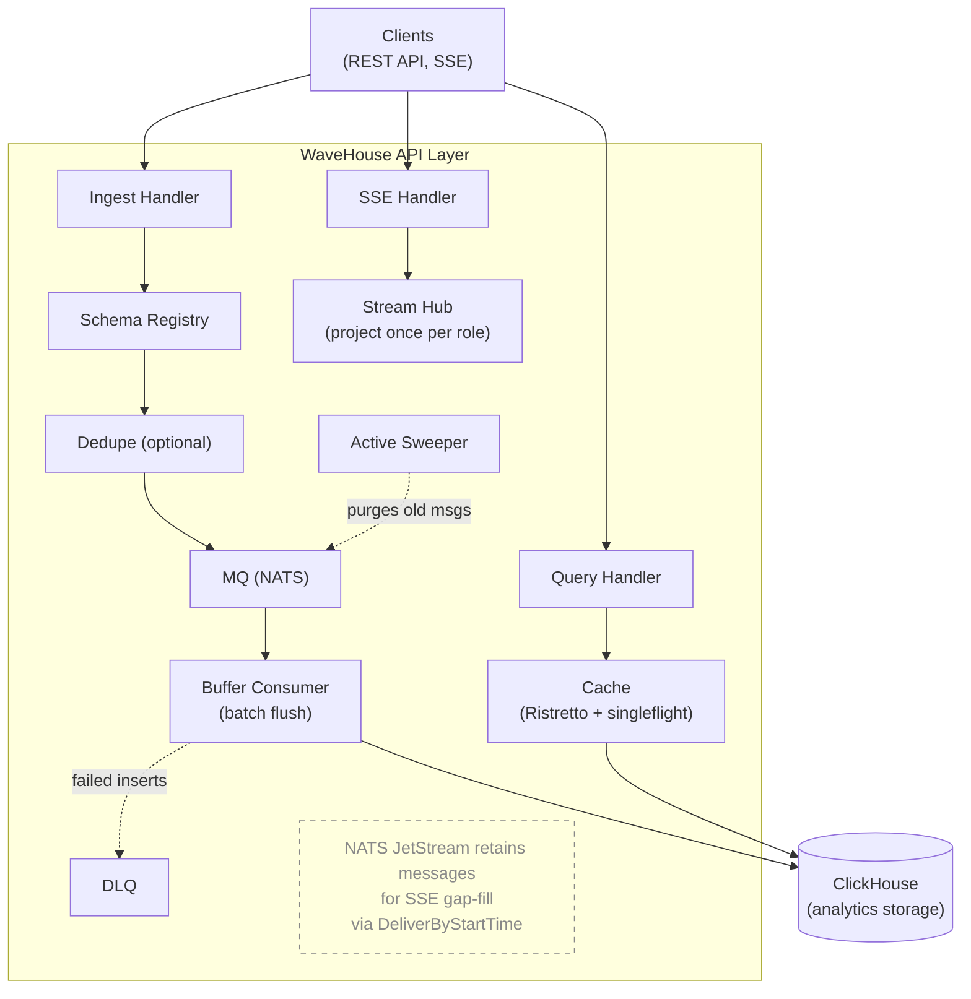

This document describes the internal architecture of WaveHouse, a schema-aware ClickHouse proxy.

## Overview

WaveHouse is a Go-based gateway that sits in front of ClickHouse, acting as the entry and exit point for data. It discovers your real ClickHouse table schemas, validates data at ingest time, batches inserts asynchronously, and provides real-time streaming and query caching.



## Binaries

WaveHouse ships one binary, `wavehouse` — an all-in-one process running the API, batch worker, embedded NATS JetStream, and optional embedded Pebble dedup — plus a second artifact it loads at start: a per-ClickHouse-version shared library (`internal/typelayer`, via [chtypes](/deployment#chtypes-artifacts)) that runs ClickHouse's own parser in-process for ingest validation, type coercion, and row-level security. The binary requires cgo (dlopen only — no static link to the artifact) and glibc, so supported platforms are Linux amd64/arm64 and macOS arm64. The only external network dependency is ClickHouse.

## Internal Packages

```text
internal/
├── api/         HTTP layer (Chi router, handlers, middleware)
├── auth/        JWT/JWKS authentication middleware (HMAC or JWKS, role extraction)
├── cache/       In-process Ristretto cache with singleflight coalescing
├── chconn/      The one ClickHouse driver.Conn every consumer holds; reload swaps the connection behind it
├── chsql/       Shared ClickHouse SQL helpers (identifier quoting, bind-safety)
├── config/      YAML + env var configuration loading
├── dedupe/      Optional deduplication (Pebble)
├── discovery/   ClickHouse schema introspection (system.columns/system.tables, server version + timezone)
├── ingest/      Batch buffering, DLQ, and Active Sweeper
├── mq/          Message queue abstraction (embedded NATS)
├── observability/ OpenTelemetry pipeline (traces/metrics/logs + Prometheus exposition)
├── pipes/       Named query pipes (NamedQuery type, parameter binding, Source)
├── policy/      Hasura-style access control (policy types, claim resolution, Source)
├── query/       Structured query AST, SQL builder, and timestamp bucketing
├── settings/    Settings directory: validate the JSON files, hold the adopted snapshot, reload on watch / SIGHUP / API
├── stream/      SSE fan-out: event Hub (project once per role), Subscriber queue, Bucket fan-out, keepalive Heartbeater wheel
└── typelayer/   In-process ClickHouse parser (chtypes): ingest validation/coercion + predicate compilation
```

### `api/` — HTTP Layer

The API layer uses [Chi](https://github.com/go-chi/chi) for routing with RequestID, a CORS middleware, and a custom JSON recoverer (`jsonRecoverer`) that emits a JSON `500` on panic instead of chi's plain-text `middleware.Recoverer`.

- **router.go** — Route definitions. Public: `/livez`, `/readyz`, and the content-free `/v1/health` SDK ping (plus the permanent `/healthz` alias and the deprecated `/health`, `/ready` aliases). Policy-gated: `/v1/ingest?table={table}`, `/v1/query?table={table}` (structured), `/v1/pipes/{name}` (named pipes), `/v1/stream`. Admin-only (`RequireAdmin` — role == `policy.admin_role`, or a request bearing the operator key's operator bit, which passes even under a nil policy): `/v1/ops/schema/*`, `/v1/ops/dlq/stats`, `GET /v1/ops/pipes[/{name}]`, `/v1/ops/settings/reload`, `/v1/ops/query` (raw SQL — same gate as the rest of `/v1/ops/*`).
- **auth middleware** — the JWT/JWKS authentication middleware is its own package, [`auth/`](#auth--authentication); the router runs it on every `/v1/*` route.
- **pipes.go** — Named query pipe handlers: admin listing (`GET /v1/ops/pipes[/{name}]`, read per request from its `pipes.Source`) and execution with parameter binding. `pipes.json` is the only write path.
- **structured_query.go** — Handler for `POST /v1/query?table={table}`: validates query AST, enforces permissions, builds and executes SQL.
- **ingest.go** — Accepts `POST /v1/ingest?table={table}` and hands the body to ClickHouse's own parser in one call. The **required** `Content-Type` chooses the format (`content_type.go`: the `application/json` and NDJSON spellings → `JSONEachRow`, `text/csv` → `CSV`, `text/tab-separated-values` → `TSV`); the bytes never choose it. Anything that is not exactly one readable media type is a `415`, decided before the body is read: the header is parsed per RFC 9110 §8.3, and because `Content-Type` is a singleton field, repeated header lines must all resolve to the same format and a value carrying a comma is refused unless the value as a whole parses as one media type. It then reads the whole (`MaxBytesReader`-capped) body into a pooled buffer, so the `413` lands before any record is processed. `ingest_framing.go` is the only code that reads those bytes itself: the first non-whitespace byte answers the one remaining question inside the JSON family (array → batch response, otherwise single object), a top-level array is re-framed in place — outer brackets and depth-1 commas blanked to newlines — so one bad record cannot cost the batch, and the dedupe id is read positionally out of the exported row. One `typelayer.Table.Ingest` call per body returns a verdict per record and the accepted rows as `JSONCompactEachRow` bytes; the role's insert `check` clauses are then evaluated over those rows by one compiled chtypes filter. Accepted rows are deduped and published to NATS subject `ingest.{table}`. When dedup is on, a row missing the configured `id_field` can't be deduped: it is logged at `WARN` and counted by `wavehouse_ingest_dedupe_missing_id_total` (labeled by `table`), then published un-deduped — or rejected when `dedupe.require_id` is set ([#219](https://github.com/Wave-RF/WaveHouse/issues/219)).
- **query.go** — Proxies raw SQL for `POST /v1/ops/query` straight to ClickHouse's HTTP interface. **Not cached** — sets `Cache-Control: no-store` so every request hits ClickHouse; DateTime is rendered ISO-8601 via `date_time_output_format=iso` — a deliberately different audience from the structured-query path, which leaves ClickHouse's default spelling alone so it matches the SSE wire.
- **stream.go** — Real-time streaming via SSE. Callers select a table with the `?table=` query parameter. Each connection registers one `Subscriber` (the `stream/` package) with both the event `Hub` (under its `(topic, role)`) and the shared keepalive wheel, then drains both from a single byte-pump — so idle streams keep emitting `:` keepalive comments (surviving reverse-proxy idle timeouts) while live events arrive already projected and serialized. Per-event projection/serialization happens **once per role** in the `Hub`, not once per subscriber ([#294](https://github.com/Wave-RF/WaveHouse/issues/294)); the handler also snapshots the connection's JWT claims onto the `Subscriber`, which the `Hub` evaluates per subscriber when the role carries a row-level `filter` ([#319](https://github.com/Wave-RF/WaveHouse/issues/319)). Gap-fill replay from NATS JetStream (`DeliverByStartTime`) stays per-connection (low-volume, one-time on connect).
- **schema.go** — Schema discovery API: list all schemas, get one table, trigger refresh.
- **dlq.go** — DLQ stats endpoint and `EnsureDLQStream` helper for creating the `WAVEHOUSE_DLQ` NATS stream.
- **health.go** — Liveness (`/livez`), readiness (`/readyz`), and a content-free `Online` ping (`/v1/health`, the SDK's public liveness check); `/healthz` is a permanent alias of `/livez`, and `/health`/`/ready` are deprecated aliases. All three consult an optional `BootState` so they can return 503 while boot-time schema discovery is still failing in the retry loop (see `cmd/wavehouse/main.go`); once `BootState.Set(nil)` fires, `/livez` returns 200 and stays there. `/readyz` additionally pings ClickHouse each call; `/v1/health` deliberately does not.

### `stream/` — SSE keepalive & fan-out

The SSE fan-out, factored out of `api/` so the delivery hot path ([#294](https://github.com/Wave-RF/WaveHouse/issues/294)) lives next to the keepalive primitives it shares. One abstraction per file.

- **hub.go** — `Hub`, the event fan-out. Subscribers register under `(topic, role)`; `Broadcast` decodes each event once, applies each subscribed role's column policy once, builds one SSE frame per role, and fans it to every member of that role's `Bucket` — prepending a per-connection `event: schema` frame wherever that connection's announced column list has drifted, and withholding the row if the announcement cannot be queued — collapsing the prior per-subscriber `unmarshal → evaluate → filter → marshal` into one pass per distinct `(role, table)` output shape (the [#294](https://github.com/Wave-RF/WaveHouse/issues/294) lever; the measured ceiling was ~2 270 deliveries/s from re-projecting per subscriber). That schema-before-row guarantee is the LIVE path's: `ReplayProjector` tracks drift in its own state and the two are not reconciled ([#543](https://github.com/Wave-RF/WaveHouse/issues/543)). The column projection is claims-independent, so it is shared across a role's whole bucket; the role's row-level `filter` predicate is not — it is resolved against each subscriber's JWT claims, so for a role that carries a filter `Broadcast` keeps the shared column projection but delivers it only to the subscribers whose claims admit each row. Visibility itself is decided by `internal/typelayer` (`Table.ParseRow` once per event, `Row.Visible` per subscriber) — the same ClickHouse parsing and comparison semantics the server's own `WHERE` clause applies, for every column type, rather than a hand-written per-type comparator; a predicate error, a policy column the table no longer has, a schema drift between the event and the live table, or an unavailable engine all withhold the row rather than guessing. Each row withheld this way increments `wavehouse_sse_rows_withheld_total{table,role,reason}`. This is the [#319](https://github.com/Wave-RF/WaveHouse/issues/319) fix that closes the query/stream row-level-security drift; roles without a filter keep the pure once-per-role fast path. `ReplayProjector` shares the same projection and per-connection row check for the handler's gap-fill, holding one policy snapshot per gap-fill and caching the per-table column-kind lookup across the replay loop.
- **subscriber.go** — `Subscriber`, the per-connection handle. It carries the connection's JWT claims, fixed at construction (`NewSubscriber(claims, metrics)`, no setter) — the claims the `Hub` resolves a role's row-level `filter` against, and immutability is what makes the fan-out's unsynchronized claims read race-free structurally. It owns a single ready-to-write outbound queue of `Frame`s (each tagged with its `kind`, so the handler labels the write where it happens): producers — the keepalive wheel and the event `Hub` — fan frames in with `Send` (non-blocking; a full queue drops, and `Send` itself counts the drop by frame kind, so no producer can forget to), and the handler drains `Frames()` to the client verbatim. The queue is sized for buffering live events (cap 64, up from the keepalive-only cap 1; #152 will make it a knob), and an `Evicted()` channel is the seam the slow-consumer follow-up closes to disconnect a wedged consumer.
- **bucket.go** — `Bucket`, the reusable fan-out primitive: a concurrency-safe set of subscribers. `Push` fans one `Frame` to every member fire-and-forget — the keepalive wheel's ring is its only caller now that both `Hub` paths iterate `Snapshot`, since the schema announcement is per connection even where the projection is shared per role; `Snapshot` exposes the members so the event `Hub` can evaluate row visibility per subscriber before sending (drop counting lives in `Send` itself). The `Hub` holds one `Bucket` per `(topic, role)` so a projected frame is built once and sent to every member instead of re-projected per subscriber.
- **heartbeat.go** — The keepalive wheel (`Heartbeater`). A single process-wide ticker fans a minimal `:` comment across the ring of `Bucket`s, waking ~1/N of live streams per tick so the writes don't synchronize. The effective per-connection keepalive period is `stream.keepalive_interval` in the settings directory (the wheel ticks every `keepalive_interval ÷ keepalive_buckets`, so one rotation spans the interval; a reload calls `Reconfigure`, which rebuilds the ring in place with every live subscriber carried over); the owning handler goroutine does the actual write, so the shared ticker never touches a `ResponseWriter` directly.
- **metrics.go** — `Metrics`, the SSE instrument set: `wavehouse_sse_active_streams` (open streams), `wavehouse_sse_stream_duration_seconds` (lifetime), `wavehouse_sse_frames_sent_total` / `wavehouse_sse_bytes_sent_total` (labeled by `kind`: `keepalive`, `event`, `replay`, `schema`), `wavehouse_sse_dropped_frames_total` (frames dropped to a full subscriber queue — the slow-consumer signal that was silent before #294), and `wavehouse_sse_rows_withheld_total` (rows withheld from a subscriber by row-level security, labeled by `table`, `role`, and `reason` — `filter` (a definite non-match) vs. `error`/`decline`/`unavailable`/`drift` — the signal that separates "no matching rows" from "a fail-closed filter is withholding everything"). Nil-safe, so the handler holds one unconditionally and tests skip wiring it; one shared instance records the handler's write sites, each `Subscriber`'s queue-full drops (counted inside `Send`, by frame kind), and the `Hub`'s row-withheld counts. Separate from `observability.RegisterSystemMetrics`, which covers only the NATS/Pebble system gauges. Streams are observed through these metrics rather than per-event traces (the router excludes `/v1/stream` from the HTTP tracer).

### `auth/` — Authentication

- **auth.go** — `NewAuthenticator(cfg, policySource, logger)` owns the verifier; its `Middleware()` reads the current one per request, and `Reconfigure(cfg)` swaps the whole verifier — key source plus its pinned `alg` allowlist — atomically after a settings reload (`auth.jwks_url` / `auth.role_claim`; see [Settings Directory — Authentication](/settings-directory#authentication)). Verifies JWT tokens with HMAC **or** JWKS (never both), with the accepted `alg` pinned to the active verifier and checked before any key is consulted (rejects `alg: none` and cross-family confusion). Extracts the caller's role from a configurable dot-path claim (`auth.role_claim`, default `role`). Claims parse with `jwt.WithJSONNumber()`, so a numeric claim reaches the policy engine as its exact digits (`json.Number`, never a rounded float64) — part of the row-visibility guarantee (AGENTS.md invariant 12). It always runs and never rejects — a missing/invalid/expired token yields an empty role (resolved to `default_role` downstream), with the token error stashed in context so a denying gate can fail loud (`401`, not a bare `403`). Before the Bearer token it checks a non-JWT operator key (`auth.operator_key`): a constant-time match on the presented credential — an `Authorization: Operator <key>` header, or the `X-Operator-Key` alias — stamps the live admin role plus an operator bit (`auth.WithOperator`) that `RequireAdmin` honors even under a nil policy — a full-access break-glass credential, audit-logged at Info with no client IP (`store`/`logger` back this path). A presented-but-wrong operator key is logged at `WARN` and counted by `wavehouse_auth_operator_key_failures_total` — a probing signal on the most privileged credential — then falls through like any unauthenticated request (the middleware never rejects).
- **context.go** — request-context accessors and their setters for the role, claims, and token error (`RoleFromContext`, `ClaimsFromContext`, `AuthErrorFromContext`, and the matching `With*` helpers).

### `cache/` — Query Cache

- **cache.go** — `Cache` interface: `Get`, `Set`, `Close`.
- **local.go** — In-process cache using [Ristretto](https://github.com/dgraph-io/ristretto) with `sync.Map` TTL tracking.
- **tiered.go** — Wraps the local cache with [singleflight](https://pkg.go.dev/golang.org/x/sync/singleflight) to prevent cache stampede on concurrent misses. The tiered interface accepts an optional second cache slot for future shared-cache backends, but ships with the slot empty.

### `config/` — Configuration

- **config.go** — Loads *boot* configuration from a YAML file with environment variable overrides (using [cleanenv](https://github.com/ilyakaznacheev/cleanenv)); every key has a `WH_`-prefixed env var. Boot config is only what can't change under a running process — resource sizing, listeners, observability exporters, the settings-directory path, and the secrets (`clickhouse.password`, `auth.jwt_secret`, `auth.operator_key`). Everything tenant-tunable lives in the settings directory (`settings/`). Both sources are strict: `Load` refuses to boot naming every YAML key the struct doesn't declare (`strict.go`) and every `WH_*` environment variable no field binds (`check.go`), so a tunable that moved to the settings directory can't be read, ignored, and believed. Boot is the validator for this half — there is no dry-run command. See [Configuration Reference](/configuration).
- **check.go** — `rejectUnboundEnv` is the environment half of the strict loader: `unboundEnv` walks the struct's `env` tags (plus the two process-level names, `WH_CONFIG` and `WH_LOG_LEVEL`) against the environment; `CheckDataDir` probes `data_dir` — run by `main` right after `Load`, so an unusable `data_dir` refuses boot before anything dials out. It refuses an empty value (reachable through `WH_DATA_DIR=`) outright rather than probing the working directory; a path that exists and is not a directory; a dangling symlink at `data_dir` or any component above it (the walk to the nearest existing ancestor uses `Lstat`, so a failed mount is not skipped over as "does not exist"); and a directory the process cannot write to — or, when it does not exist, an unwritable nearest ancestor — probed by creating and removing one temp file. A permission denial, on the probe or on reaching the path through a parent without search permission, carries the UID-65532 hint, since a bind mount owned by root is the typical cause.
- **strict.go** — `rejectUnknownKeys`, the YAML half: re-reads the file as a generic tree and walks it against the struct's `yaml` tags, listing every key the struct doesn't declare. cleanenv itself is lenient by design, which is exactly wrong for boot config once keys have moved to the settings directory.
- **persistence.go** — `WarnIfFreshDataDir` logs the startup `WARN` when `data_dir` is missing or empty (on a redeploy, the sign that the volume didn't persist); `LogStorageInitError` attaches the UID-65532 `permissionHint` to a NATS or Pebble open failure that looks like a permission denial — the same hint string `CheckDataDir` uses.

### `dedupe/` — Deduplication (Optional)

- **dedupe.go** — `Deduplicator` interface: `CheckAndMark(ctx, eventID) (bool, error)`.
- **embedded.go** — Uses [Pebble](https://github.com/cockroachdb/pebble) (embedded key-value store). Key = event ID.
- **managed.go** — `Managed` wraps the Pebble store behind the hot-reloadable `dedupe.enabled` switch: a `settings.Store.AfterAdopt` hook opens or closes the store after every adoption, so flipping the key is a reload, not a restart. `CheckAndMark` returns `ErrDisabled` while switched off (the ingest handler publishes un-deduped and counts it — a reload-window race, not a mode).

### `discovery/` — Schema Discovery & Validation

- **discovery.go** — `SchemaRegistry` queries `system.columns` to discover ClickHouse table schemas, keeping each column's `default_kind`, `default_expression`, and 1-based `position` so `IsInsertable` / `InsertableColumns` / `InsertableColumnNames` (memoized per table at refresh) can decide the insertable subset the ingest envelope and the SSE announcement are both built from. Each refresh also records the server version (`SELECT version()`) and default time zone (`SELECT timezone()`, exposed via `ServerTimezone()`), and joins `system.tables` for each table's `create_table_query` (kept in-process as `TableSchema.DDL` and marked `json:"-"` — an external-engine table renders its wiring in that statement — endpoint, bucket/host, database, username, access key id — so it must never reach `/v1/ops/schema`; ClickHouse masks the password as `[HIDDEN]` from ~23.9, so what is withheld here is the topology). An `OnRefresh(func(serverVersion, serverTZ string, tables []*TableSchema))` hook fires synchronously right after the atomic swap on every successful refresh — `internal/typelayer.Engine.Bind` is its only registered consumer, and it is what resolves the chtypes artifact matching the connected server's line and recompiles per-table handles ([#372](https://github.com/Wave-RF/WaveHouse/issues/372)). Supports periodic auto-refresh, on-demand refresh, and `RetryRefresh` (boot-time exponential backoff loop used by `cmd/wavehouse` so a transiently unreachable ClickHouse doesn't crash-loop the binary). Thread-safe via `sync.RWMutex`.
- **discovery_test.go** — Unit tests for schema discovery.

### `typelayer/` — In-Process ClickHouse Parser

The only package that imports `github.com/wave-rf/chtypes/go/chtypes` (the sole exception: `cmd/wavehouse/main.go` references `typelayer` itself, never chtypes directly). It wraps one `chtypes.Registry` for the process, opened once at boot from a registry directory (`clickhouse.chtypes_registry` / `WH_CHTYPES_REGISTRY`; empty means the chtypes search path) — see [Deployment → chtypes artifacts](/deployment#chtypes-artifacts) for what ships where and how large it is.

- **`Engine.Bind`** runs synchronously from `discovery.SchemaRegistry`'s `OnRefresh` hook: it resolves the artifact matching the connected server's **minor** version — never a nearest-version fallback, so an unmatched line leaves the engine `Unavailable` for every table — sets the process-global ClickHouse timezone from the discovered server timezone before the first library call (a later refresh reporting a *different* server timezone is a hard error: every table becomes `Unavailable` until the process restarts), and recompiles a handle per table whose column signature changed since the last bind.
- **`Engine.RoleTable(table, RoleShape)`** compiles the role's *own* schema — the columns it may insert, plus a `DEFAULT '<claim>'` on each `_eq` check column — and caches it per `(generation, shape)`. That is how column policy and auto-inject are answered without WaveHouse looking at a record: a denied column is simply not in the schema, so naming it is ClickHouse's code 117, and an absent check column takes the claim as its default while a supplied value still wins.
- **`Table.Ingest(format, body)`** runs the whole request body through ClickHouse's own reader in one call (`JSONEachRow`, `CSV` or `TSV`), with the parsing settings the worker's `INSERT` pins (`date_time_input_format=best_effort`, `input_format_null_as_default=1`) and `input_format_skip_unknown_fields=0`. It returns one verdict per input record — **accepted**, **rejected** with ClickHouse's real code and message, or **declined** (chtypes could not answer at all, a distinct condition never conflated with a rejection) — plus the accepted rows as `JSONCompactEachRow` bytes, exactly what ClickHouse's own writer produced: `DEFAULT`s evaluated, out-of-range integers wrapped, computed columns absent.
- **Predicates** compile through chtypes with every bound value as a `{pN:String}` parameter, never interpolated: `Table.CheckVerdicts` judges an ingest `check` over the accepted rows, `Table.ParseRow` / `Row.Visible` judge a subscriber's row filter over one parsed event, cached per `(generation, expression, params)`. Only a definite true admits; a predicate error, a policy column the table no longer has, schema drift, or an unavailable engine all withhold (fail closed), counted in `wavehouse_sse_rows_withheld_total{table,role,reason}`.
- A table with no matching artifact for the server's line, or one caught mid a server-timezone change, returns an `Unavailable` error naming the cause: ingest maps it to `503`, the stream withholds every row for that table.

See [API → Ingest](/api#post-v1ingesttabletable--ingest-data) for the ingest error-response shape and [Access Control → Where each rule is enforced](/access-control#where-each-rule-is-enforced) for how predicates are compiled and evaluated.

### `ingest/` — Ingest Pipeline, DLQ & Sweeping

- **worker.go** — `StartIngestWorker` launches an ingest pipeline: a JetStream consumer reads from the `WAVEHOUSE` stream via a durable `buffer-consumer` pull subscription, batches events per table, and performs bulk INSERTs to ClickHouse. The pipeline is **insert-only**. The wire format `EventMessage` carries `{table_name, scope, received_timestamp, format, columns, row}` — the row positionally as one `JSONCompactEachRow` line, with `columns` naming its positions (the table's **wire** columns — `internal/typelayer.Table.WireColumns`, the insertable subset minus any `MATERIALIZED`/`ALIAS`/`EPHEMERAL` column); the worker batches per (table, column list) and writes `INSERT INTO … (cols) FORMAT JSONCompactEachRow` with `internal/typelayer.InsertSettings()` (`date_time_input_format=best_effort`, `input_format_null_as_default=1`) plus `async_insert=0`, the same parsing settings chtypes compiled the row with. It accepts any table name (the table name in the NATS subject is `query.SafeEncodeNATS(rawUnsafeTableName)`), then bulk-INSERTs. The embedded NATS server runs with `DontListen: true` (`internal/mq/embedded.go`), so the only Publishers reachable on the `ingest.>` subjects are in-process Go code — today, only the HTTP `/v1/ingest?table={table}` handler. Non-insert mutations (`DELETE`/`UPDATE`/`TRUNCATE`/…) must go through `POST /v1/ops/query` under the admin role (`policy.admin_role`) — see the Query Path section below; the `/v1/ops/*` `RequireAdmin` middleware enforces the check at the API layer, so a no/invalid-token request (resolved to `default_role`, not admin in a production config) never reaches the proxy. On a bulk-insert failure the batch is re-inserted row by row; rows that succeed are acked, and only the rows that fail again are routed to the DLQ (`sendToDLQ`), which republishes the as-published `EventMessage` envelope to `dlq.{table}` NATS subjects with the failure context in `X-DLQ-*` headers when DLQ is enabled — see [Ingest Pipeline](/ingest-pipeline) for the worker internals.
- **types.go** — `EventMessage` struct (TableName, Scope — reserved, always empty today, ReceivedTimestamp, Format, Columns, Row; `Format` is `FormatJSONCompactEachRow` and `Row` is one positional line whose slots `Columns` names) and `BufferConsumerName` constant, shared across API handlers and the ingest pipeline. `Row` is now the exact bytes `internal/typelayer.Table.Ingest` returned for an accepted record — ClickHouse's own `JSONCompactEachRow` writer output, `DEFAULT`s already filled in — not a value WaveHouse encodes itself.
- **sweeper.go** — `Sweeper` implements the Active Sweeper pattern. It runs every minute and purges NATS JetStream messages that are **both** ACKed by the buffer consumer (written to ClickHouse) **and** older than the configurable gap window.

### `mq/` — Message Queue

- **mq.go** — `Publisher` and `Subscriber` interfaces. `Message` struct with `DoubleAck(ctx)`, `Ack()`, and `Nak()`.
- **embedded.go** — In-process NATS server with JetStream. Creates stream `WAVEHOUSE` with subjects `ingest.>`, capped at the settings directory's `mq.max_bytes_gb`; `Resize` updates the cap on the live stream after a reload.

### `observability/` — OpenTelemetry Pipeline

- **provider.go** — `InitProvider(ctx, serviceName, ProviderConfig)` wires the OTel pipeline. Each output is independently gated; the W3C TraceContext + Baggage propagator is always installed (cheap, harmless when traces are off). Returns `(shutdown, promHandler http.Handler, err)` — `promHandler` is non-nil only when `PrometheusEnabled` is true and reads from a *private* `prometheus.Registry` to avoid leaking the process/Go collectors that `prometheus.DefaultRegisterer` auto-registers. OTLP-metrics push (`MetricsEnabled`) and Prometheus exposition (`PrometheusEnabled`) are independent: either, both, or neither may be set, and any combination produces a single MeterProvider feeding the active readers. The Endpoint field is only dialed by the OTLP exporters (traces / metrics-OTLP / logs); Prometheus-only operation leaves it untouched. Provider init in `main.go` runs whenever `otel.enabled` OR `prometheus.enabled` is true, so Prometheus-only operation (Alloy/scrape, no collector) is a first-class mode.
- **logger.go** — `NewLogger(component, level, isJSON, otlpSampleRate)` produces a slog logger that fans out to stdout (always 100%) and the OTLP log exporter (DEBUG/INFO sampled at `otlpSampleRate`, WARN/ERROR always 100% as a non-configurable safety floor). `TraceHandler` injects `trace_id`/`span_id` from the active span when one exists. `otlpSamplerFn` is exposed (lowercase) for unit testing the per-level rate logic without driving through the slogmulti middleware.
- **metrics.go** — `RegisterSystemMetrics(natsServer, dedup)` registers observable gauges for embedded NATS connections, in-msgs, and Pebble dedupe storage stats. Wired in `cmd/wavehouse/main.go` after the providers are up.
- **tracer.go** — W3C TraceContext propagation over NATS message headers (`InjectNATS` / `ExtractNATS`) — bridges the API request span into the ingest worker so end-to-end traces survive the queue handoff.

The package's design invariants — stdout always 100%, WARN+ERROR always export at 100%, gRPC exporters dial lazily so unreachable collectors never block startup, private Prometheus registry — are documented in AGENTS.md "Key Design Decisions" #15 and must be preserved by anything touching this package.

### `policy/` — Access Control

- **policy.go** — Hasura-style policy types, now **role-first**: `TablePolicy` is `map[string]RolePermissions`, and a role's grant carries a separate `SelectPermissions` and `InsertPermissions` — so a field only one side ever honored (`filter`, aggregations and the `max_*` limits on select; `check` on insert) does not exist on the other, and a document that puts one there fails the strict decode as an unknown key. `Evaluate()` resolves permissions against JWT claims (including `{{ jwt.claim.path }}` template resolution) for ONE operation, leaving the side it did not resolve **nil**. That is what the pointers buy: an *empty* side means "no restrictions" — what the admin return constructs on both sides — while a *nil* side means "you asked the wrong operation", and as value types the two were the same zero value. Every accessor fails closed on a nil side. The handful of bare field reads outside this package each sit past an accessor that denies an unresolved side first, so a nil `Select` never reaches one; if that ordering ever changed they would panic rather than silently widen. A nil guard that skips such a read must never be added, since an absent `WhereClause` is an unfiltered query. The per-column decision `IsColumnAllowed(col, insert)` takes the side it is being asked about, alongside its batch/projection forms `AllowedProjection()` and `RestrictsColumns()`, `IsAggregationAllowed()`, `CheckClauses()` — the write-side accessor for the one consumer that iterates a side's map instead of asking about a column, whose `ok=false` a caller must treat as *refuse the write*, never as *no checks to run* — `resolvePredicates()` and its exported `Predicates()` accessor — the one resolution every read surface renders from, so the SQL `WHERE`, and the `internal/typelayer` row-level-security engine that replaced the in-memory evaluator below, cannot drift apart — and `Validate()`, split into `validateSelectPerms`/`validateInsertPerms` and run from `settings.Validate` on every adoption, which is where the rules in [Access Control](/access-control) are actually enforced.
- **canonical.go** — the one rendering layer for policy comparison operands: every JWT claim value (`CanonicalScalar`) is rendered into one exact canonical decimal form (positional, digit-bounded, never a float64 round-trip) before it reaches a `filter`/`check` predicate, so every comparison surface binds the same value the same way, and a null/object/array claim fails closed. A policy-authored literal is *not* re-rendered — it binds exactly as written, and a spelling the column cannot read is ClickHouse's own type error at evaluation time on both surfaces.
- **source.go** — `Source`, a `func() *Policy` every consumer (the auth middleware, ingest, structured query, pipes, the stream hub, the `/v1/ops` gate) reads per call, so a settings reload applies to the very next request. In production it is `settings.Store.Policy`; `Static(p)` fixes one for tests. A `nil` result is a deliberate lockout.

Predicate *evaluation* lives elsewhere: `internal/typelayer` compiles a role's resolved predicates through chtypes and evaluates them — `Table.ParseRow` / `Row.Visible` for a streamed event, `Table.CheckVerdicts` for an ingest `check` — with ClickHouse's own comparison semantics for every column type. `policy` only resolves the values both the SQL path and that engine bind.

### `pipes/` — Named Query Pipes

- **pipes.go** — `NamedQuery` type with SQL template and parameter definitions, and `Source` (`Pipe(name)` / `Pipes()`), read per request — `settings.Store` in production (`pipes.json`), `Static(q...)` in tests. `BindParams()` resolves `{{param}}` / `{{param:default}}` placeholders by inlining escaped literal values into the SQL (strings single-quote-escaped; arrays rendered as escaped `(…)` `IN`-lists). A non-scalar value with no SQL form (a JSON object, or an empty array) is rejected rather than emitted raw.

### `query/` — Structured Query Engine

- **ast.go** — `StructuredQuery` AST types: columns, aggregations, filters, group by, order by, limit, time range.
- **builder.go** — `Build()` converts AST to parameterized SQL. It is the single chokepoint that validates every referenced identifier against the schema **and** authorizes every column reference — projection, aggregation args, filters, group_by, order_by, time_range — against the role's column allowlist (the [#223](https://github.com/Wave-RF/WaveHouse/issues/223) hard cap). A full-row read is requested with `select_all`, which expands to the role's allowed columns rather than emitting a raw `SELECT *`; an omitted projection selects nothing, and `*` in `columns` is a literal column name. Every identifier is backtick-quoted via `internal/chsql` (`QuoteIdent`) so any ClickHouse-legal name is accepted — a name containing `?` is refused fail-closed, because `Build` emits positional placeholders that a later pass rewrites to ClickHouse's named parameters ([#279](https://github.com/Wave-RF/WaveHouse/issues/279)). The role's row-level-security predicate and `max_rows` cap are emitted by `Build()` itself, as part of the WHERE and LIMIT assembly — policy SQL is never spliced into rendered text ([#322](https://github.com/Wave-RF/WaveHouse/issues/322)). Timestamp bucketing for cache optimization.

### `settings/` — Settings Directory

The hot-reloadable half of configuration: a directory of four JSON files (`config.json`, `roles.json`, `policies.json`, `pipes.json`) that the server validates at boot and re-adopts while running — `Validate` is the single gate (strict decode, per-file shape rules, and the cross-file check that every role a policy grant or pipe allowlist names is declared in `roles.json`), and `Store` holds the adopted `Document` as one atomic snapshot. `Store` is also the runtime authority for access control and pipes: it implements `policy.Source` (`Store.Policy`, nil when `policies.json` is `{}` — fail closed) and `pipes.Source`, and there is no other copy — the files are the only write path. See [Settings Directory](/settings-directory).

- **validate.go** — `Validate(dir)` reads, decodes, and checks the directory in one pass (strict JSON — unknown fields and duplicate keys are errors; per-file shape rules; cross-file role references) and returns every `Finding` at once. Shared by `wavehouse validate`, boot, and every reload.
- **finding.go** — `Finding` / `Severity`: errors make the directory invalid, warnings don't block adoption. The JSON shape is part of the ops API (`POST /v1/ops/settings/reload` returns them).
- **store.go** — `Store` owns the adopted snapshot. `Open` validates and adopts at boot; `Reload` re-validates and swaps the document atomically when there are no errors (a rejected reload keeps the previous snapshot). Consumers read typed accessors per call (`ClickHouse()`, `Auth()`, `DedupeFor(table)`, `DLQFor(table)`, `Keepalive()`, …) rather than holding values, and `AfterAdopt` registers hooks (dedupe store open/close, keepalive-wheel rebuild) that run after each successful reload.
- **watch.go** — fsnotify on the *directory* (not the files, so atomic-writer replaces and Kubernetes ConfigMap symlink swaps aren't lost), debounced into one reload; reloads once as soon as the watch exists so an edit between the boot read and the watch is never missed. `SIGHUP` and the reload endpoint funnel through the same serialized `Reload`.
- **seed.go** / **seed/** — The `go:embed`ded starter directory with every key at its default. The binary carries no compiled defaults: `wavehouse bootstrap [dir]` writes this seed, and the compose stack and e2e fixture ship copies of it.

### `chconn/` — ClickHouse Connection Manager

- **chconn.go** — `Manager` is a `driver.Conn` whose backing connection is swapped by `Reconfigure(Params)` after a settings reload changes the ClickHouse wiring (`clickhouse.addr` / `http_port` / `http_scheme` / `database` / `username` / `query_timeout`, combined with the boot-config password). Like `clickhouse.Open` it never dials, so boot tolerates an unreachable ClickHouse (schema discovery retries) and a bad address surfaces where reachability is already handled (`/readyz`, query errors). The replaced connection closes after a `query_timeout` grace so in-flight queries finish. `Target()` / `Database()` / `QueryTimeout()` expose the current wiring for the HTTP-interface consumers (ingest INSERTs, raw-SQL proxy).

### `chsql/` — ClickHouse SQL Helpers

- **chsql.go** — Dependency-free ClickHouse SQL helpers shared by `query/` and `policy/`, kept in their own package to break an import cycle. `QuoteIdent` is the single place every identifier — column, table, alias — becomes SQL text: always backtick-quoted and escaped, so any ClickHouse-legal name (dots, spaces, unicode, keywords) is safe. `BindUnsafe` reports whether a name contains a literal `?`, which would desync the positional-to-named parameter rewrite; such names are rejected fail-closed rather than silently mis-bound.

## Data Flows

### Ingest Path

```text wrap=false
Client POST /v1/ingest?table={table}
  → JWT auth middleware (always runs; token optional)
  → Look up table schema from SchemaRegistry
  → Policy check: role allowed to insert into this table (before the body is parsed)
  → Resolve the declared Content-Type into the body's format (415 if absent,
    unsupported, or if declarations disagree; before the body is read)
  → Read the whole body into a pooled buffer, bounded by the 16 MiB cap
    (413 before any record is processed, so nothing is published)
  → Compile the ROLE's schema: the columns it may insert, plus a DEFAULT per
    _eq check column carrying the claim (cached per generation+shape)
  → Validate the whole body through chtypes (internal/typelayer), one call per
    request: ClickHouse's own parser type-checks, coerces, and fills DEFAULTs
    (including now()) per record. A rejected record carries ClickHouse's real
    error code and message — an unknown field, a MATERIALIZED/ALIAS/EPHEMERAL
    column, or a column this role may not write is 117; a record chtypes
    cannot answer for is a distinct "declined" outcome (422), never a data
    rejection. No artifact matching the server's line, or a server timezone
    change since boot, fails the whole table closed (503)
  → Evaluate the role's check clauses over the accepted rows with one compiled
    chtypes filter — false is 403 for that record, unevaluable is 422
  → Optional deduplication check, on records chtypes accepted (configurable
    ID field; a row missing that field is published un-deduped + logged/
    counted, or rejected under require_id) — deliberately after validation,
    so a chtypes-rejected record is never marked seen
  → Publish the ClickHouse-rendered row (DEFAULTs filled, MATERIALIZED/
    ALIAS/EPHEMERAL columns absent) to NATS JetStream (ingest.{table})
  → 200 OK returned immediately, per-record outcomes in the response body
  → (If NATS stream is full: 503 + Retry-After header)

Ingest worker pipeline (StartIngestWorker):
  ← JetStream pull consumer (buffer-consumer) on ingest.>
  → Parse the event envelope (an envelope the worker cannot read — malformed JSON,
    an unknown or absent format, columns and row that don't pair — is parked on the
    DLQ, or acked-and-dropped where the DLQ is off for the table; either way
    counted by wavehouse_ingest_poison_total under its disposition)
  → Batch events per table, bulk INSERT to ClickHouse
    (INSERTs pin the same parsing settings chtypes compiled the row with —
    date_time_input_format=best_effort, input_format_null_as_default=1 —
    plus async_insert=0, so per-row error attribution isn't lost to an
    async flush wait; see /ingest-pipeline for detail)
  → On success: DoubleAck messages
  → On failure: re-insert row by row; each row that fails again → DLQ output (dlq.{table}), then Ack to prevent infinite retry

  (Insert-only pipeline. The wire format `EventMessage` carries only
  {table_name, scope, received_timestamp, format, columns, row}; non-insert mutations
  DELETE/UPDATE/TRUNCATE/DROP/etc. must go through POST /v1/ops/query — the
  /v1/ops/* RequireAdmin gate rejects non-admin callers at the API layer, so
  a no/invalid-token request (resolved to default_role, not admin in a
  production config) cannot reach the proxy.)

Active Sweeper (async goroutine, every 60s):
  → Read buffer consumer's AckFloor (highest contiguous ACKed seq)
  → Binary search for first message within the gap window
  → Purge target = MIN(ack_floor + 1, gap_window_seq)
  → Purge all messages below target from JetStream
```

### Query Path

```text
Client POST /v1/ops/query
  → JWT auth middleware (always runs, never rejects; a bad token yields an
    empty role and stashes its verification error for the denying gate)
  → policy.ResolveRole (empty role → default_role — the one sanctioned
    roleless exception)
  → /v1/ops RequireAdmin (resolved role == policy.admin_role, or the
    operator-key bit) — single gate shared with the rest of /v1/ops/*
    (pipes inspection, settings reload, schema discovery, DLQ stats). A denial is
    401 when a stashed error shows the caller presented an invalid token,
    else 403. Raw SQL has no per-statement scope check (a full SQL parser
    would be needed to authorize predicates), so the role gate is the
    entire authorization story. /v1/ops/query is the only sanctioned
    surface for non-SELECT statements (DELETE/UPDATE/TRUNCATE/DROP/ALTER/…);
    non-admin callers use `POST /v1/ingest?table={table}` for writes and
    the structured query endpoint or named pipes for reads.
  → Decode {"sql": "..."} from the request body.
  → POST the SQL verbatim to ClickHouse's HTTP interface at
    <scheme>://<host>:<httpport>/?default_format=JSON
       &date_time_output_format=iso&database=<db>
    Auth via X-ClickHouse-User / X-ClickHouse-Key headers.
    Bound by a clickhouse.query_timeout context derived from the inbound request — client
    disconnect cancels the upstream call.
  → ClickHouse parses the SQL natively and decides what to do:
    → Read: returns 200 + {"meta":[...], "data":[...], "rows":N,
      "statistics":{...}} as JSON. The handler extracts `data` and
      forwards just that array, preserving the [{...}, {...}] response
      shape callers expect.
    → Mutation/DDL: returns 200 + empty body. The handler emits `[]` so
      response shape stays "always an array."
    → Error: returns 4xx/5xx + plain-text error message. The handler
      maps ClickHouse 4xx → HTTP 400 (caller-fault, bad SQL or missing
      table) and ClickHouse 5xx → HTTP 502 (gateway-fault, upstream
      problem), with the trimmed message inside the JSON error
      envelope — admins see ClickHouse's exact diagnostic.
  → Response carries Cache-Control: no-store so no downstream layer
    (browser, CDN, corp proxy) caches the result.
```

The proxy-pattern wins are: zero classification logic on the WaveHouse side (no isMutation heuristic to maintain), and any ClickHouse statement type — including verbs added in future versions and inline FORMAT overrides — works without WaveHouse code changes. Multi-statement input (`SELECT 1; TRUNCATE t`) is supported when the upstream ClickHouse has multi-query enabled, which is the default on recent versions; older or restrictively-configured servers will return a clear error from ClickHouse itself for the second statement. The proxy buffers the response in memory with a 64 MiB cap (502 with `clickhouse response exceeded N bytes` on overflow, to keep a runaway `SELECT *` from pinning RAM on the API server), and passes ClickHouse's `Content-Type` through when an inline `FORMAT` directive overrides the default JSON envelope. The structured query endpoint and pipes reach ClickHouse the same way, over its HTTP interface, but ask for `default_format=JSONEachRow` and bind their values as named `{pN:String}` parameters. ClickHouse renders the JSON; WaveHouse frames the lines into an array and caches those bytes, so no Go-side row conversion sits between the server and the response.

### Streaming Path

```text
Client GET /v1/stream
  → JWT auth middleware (always runs; token optional)
  → Announce the caller's projected column list as an `event: schema` frame
    (no `id:`, so it never moves Last-Event-ID) BEFORE registering, so a client
    on a quiet table learns its columns before any row arrives and a live event
    during setup finds the announcement already recorded rather than repeating
    it. This announcement is best-effort — skipped when the registry has no
    schema for the table yet, or the role cannot read the table at all (a role
    that CAN read it but whose column rules leave nothing readable is still
    announced, with an empty list) — and what actually guarantees a row is
    never sent without its names is the LIVE path's per-connection drift check
    on every event
  → Register a Subscriber with the Stream Hub, keyed by (topic, role)
  → If ?since= / Last-Event-ID provided:
    → Create ephemeral NATS consumer with DeliverByStartTime
    → Send historical events (projected per-connection) first
  → Live events: MQ → Hub.Broadcast → projected & serialized ONCE per role
    → fan the finished frame to every Subscriber of that (topic, role);
      a role carrying a row-level filter delivers per subscriber instead:
      the shared frame goes only to subscribers whose JWT claims admit
      the row (internal/typelayer's Row.Visible, compiled and evaluated by
      the same engine as the server's WHERE clause)
    → a connection whose column list drifts (a schema change mid-stream) is
      re-announced before the next row, per connection
  → Live and replay track that drift in SEPARATE state and do not reconcile
    it (#543): replay keeps its own last-announced signature while the live
    path recorded one at subscribe time, so a connection that gap-fills
    ACROSS a column change can then receive live rows with no fresh
    announcement. A client that checks arity drops the mismatched rows; a
    same-length change (RENAME COLUMN, or a drop paired with an add) zips
    under the wrong names until it reconnects
  → Handler drains keepalives + event frames from one byte-pump → client
  → Policy filtering (historical + live): denied tables skipped, denied
    columns stripped, row filter compiled and evaluated per subscriber
    against claims by internal/typelayer (fail closed on a compile/parse
    error, a missing policy column, schema drift, or an unavailable engine).
    Column projection runs once per role (Hub.Broadcast) — per-subscriber
    work only where a row filter makes visibility per-connection; replay
    shares the same column policy + row check but projects per-connection
```

## Technology Stack

| Component | Technology | Purpose |
| --------- | ---------- | ------- |
| Language | Go 1.27 | Core runtime |
| HTTP Router | Chi v5 | Request routing and middleware |
| Authentication | golang-jwt v5 + keyfunc v3 | JWT (HMAC + JWKS) parsing and validation |
| Analytics DB | ClickHouse | Primary data store + schema source of truth |
| Message Queue | NATS + JetStream | Durable event streaming |
| L1 Cache | Ristretto v2 | In-process memory cache |
| Embedded KV | Pebble | Optional deduplication |
| Config | cleanenv | YAML + env var config loading |
| Type engine | [chtypes](https://github.com/wave-rf/chtypes) (cgo/dlopen) | In-process ClickHouse parser: ingest validation/coercion + row-level-security compilation |
| Release | GoReleaser | Binary builds for Linux amd64/arm64 and macOS arm64 |
| Containers | Docker (`distroless/cc`, glibc) | Minimal production images |
