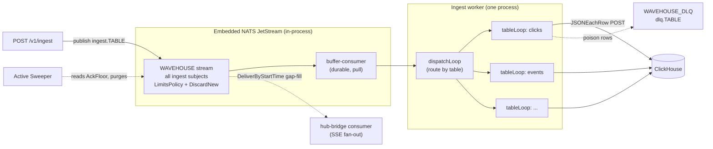
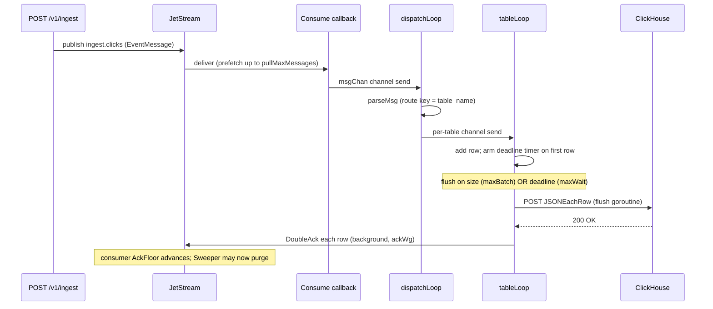
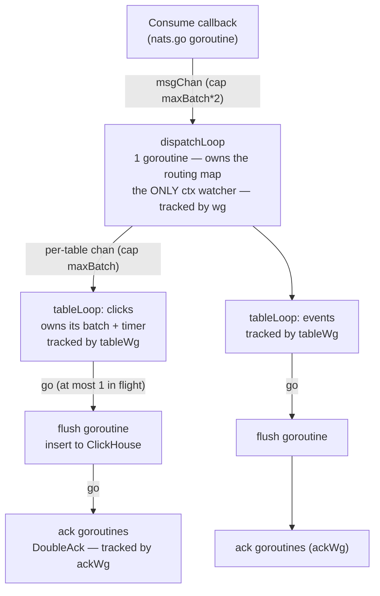
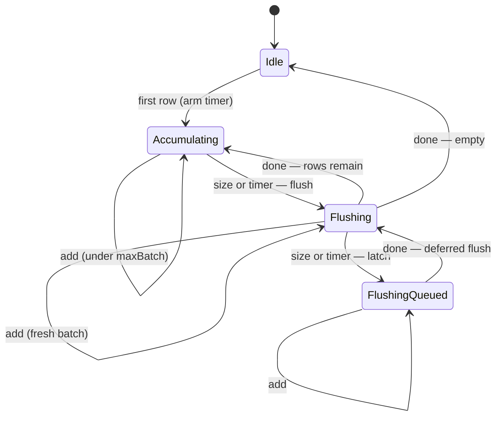
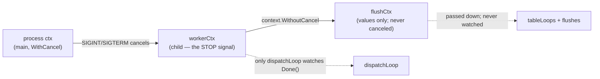
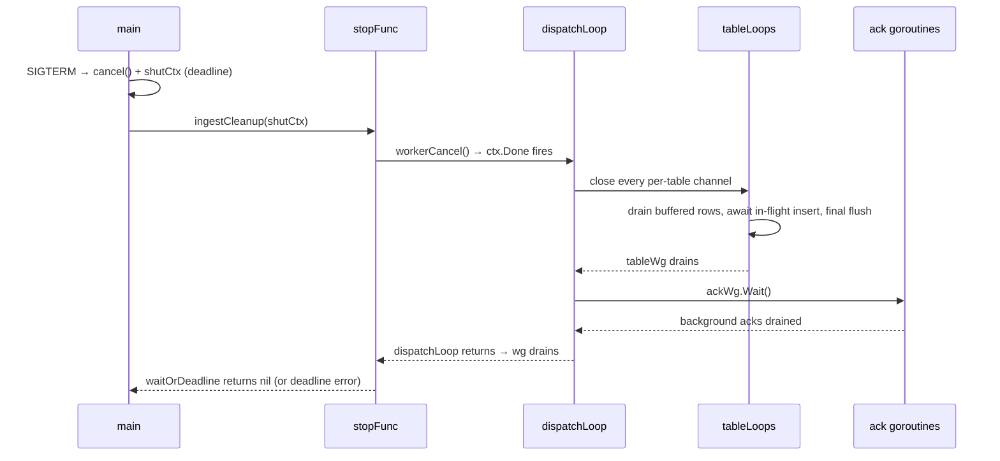
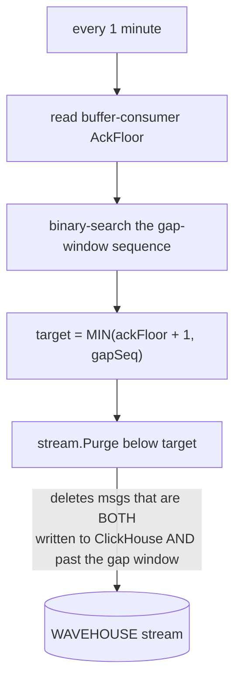
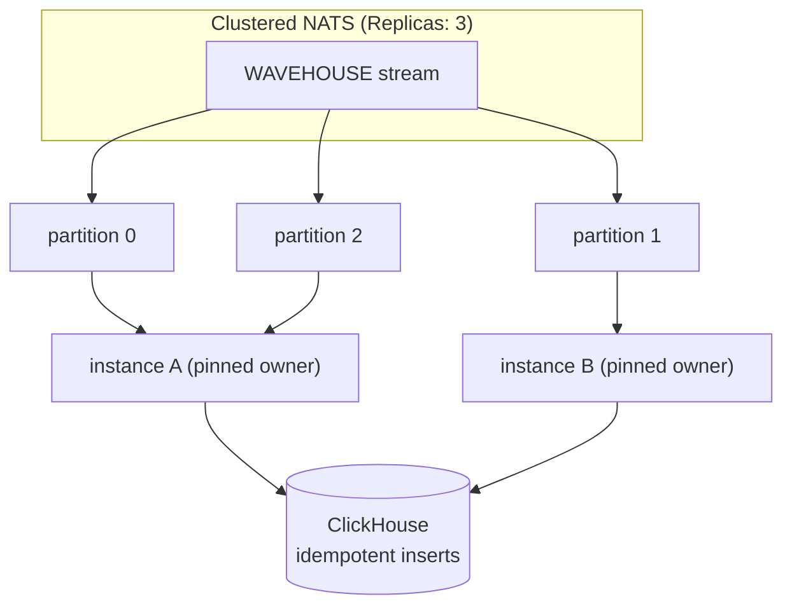

This page is the deep-dive on `internal/ingest` — the worker that turns the
stream of ingest events into batched ClickHouse inserts. The [Architecture](/architecture)
page covers where it sits in the system; this page covers **how the code itself
works** so contributors and reviewers can reason about (and safely change) it.

It is deliberately detailed: this is a hot, concurrency-heavy path, and the
goroutine / channel / timer interplay is subtle.

## Responsibilities and files

| File | Contents |
| --- | --- |
| `worker.go` | `StartIngestWorker`, `dispatchLoop`, per-table `tableBatcher`/`tableLoop`, `flushTable` (bulk insert with row-by-row poison-isolation fallback), `insertToClickHouse`, `handleSuccess` (cache invalidation + acks), `sendToDLQ` |
| `sweeper.go` | **Active Sweeper**: purges stream messages written to ClickHouse and past the SSE gap window |
| `types.go` | `EventMessage` wire format, `BufferConsumerName` constant |

The pipeline is **insert-only**. The `{table_name, received_timestamp, data}` wire format is parsed by the worker for bulk-`INSERT`. HTTP ingest handlers validate schemas before publishing. Non-insert mutations use a separate admin path.

## High-level shape

One process consumes a single durable JetStream consumer and fans events to one goroutine per table. Each table batches independently and POSTs to ClickHouse via HTTP (`JSONEachRow`). On bulk-insert failure, rows are re-inserted individually: clean rows ack, while failing rows go to the dead-letter stream. A separate sweeper reclaims storage.



The stream is **dual-use**: a durable buffer for the worker and a replay buffer for SSE client gap-fills. Thus, a custom sweeper replaces work-queue auto-deletion (see [Scaling out](#scaling-to-multiple-instances)).

:::note[ClickHouse timestamp parsing]
Inserts pin `date_time_input_format=best_effort`—the server default since ClickHouse 26.5; older servers' `basic` default rejects RFC 3339 `Z` suffixes ([#372](https://github.com/Wave-RF/WaveHouse/issues/372)). Zone-less date-times and 9–10-digit Unix strings parse identically under both. However, `best_effort` reads calendar shapes (e.g., `"20260711"`) as dates, whereas `basic` read them as Unix seconds. For `DateTime64`, they diverge on calendar shapes and when epoch run units mismatch column scale (`basic` treats >10 digits as column-scale ticks; `best_effort` detects 13/16/19-digit runs as ms/µs/ns). Producers relying on `basic` parsing change meaning upon deploying this WaveHouse version via the pin.
:::

## The journey of one event



## Goroutine topology

Design rule: **single-owner state, lock-free**. One goroutine touches each piece of mutable state; no mutexes exist in the hot path.



Three `WaitGroup`s ensure correct shutdown via a strict containment hierarchy:

- **`wg`**: tracks `dispatchLoop`.
- **`tableWg`** (owned by `dispatchLoop`): tracks per-table `tableLoop`s.
- **`ackWg`**: tracks background `DoubleAck` goroutines.

## Why per table? The bug this design fixes

Shared batches couple tables: high-volume tables can trip size triggers, stranding low-volume rows until time triggers fire. Routing each table to its own `tableLoop` provides **independent** size triggers and timers; one table's traffic never delays another's. (`dispatchLoop` does no batching—it only parses enough to pick the route key.)

## The `tableBatcher` state machine

Each `tableLoop` owns a `tableBatcher`. Flushes are triggered by reaching `maxBatch` (checked in `add`) or the `maxWait` deadline timer. Only one insert runs per table at a time ("coalescing"); a flush completing is not a trigger.

The `flushing` channel signals an active insert; it is `nil` when idle, making the loop's `<-flushing` arm inert. The `flushQueued` flag latches triggers that fire during an active insert, ensuring a deferred flush runs once the slot frees.



Two key consequences:

- **`maxBatch` is a "try to flush" threshold, not a hard cap.** If rows arrive during a flush, the next batch coalesces and may exceed `maxBatch`, flushing as one larger insert. This reduces ClickHouse part pressure and is bounded upstream by `maxAckPending`.
- **Leftovers wait for their own size/timer.** If 500 rows flush and 100 remain, those 100 wait for `maxBatch` or `maxWait`. The `flushQueued` latch prevents stranding: if a leftover's timer fires during an insert, the latch ensures they flush when the slot frees.

### Why there are no data races

Flushes use a **private snapshot**:

```go
rows := b.batch   // snapshot the slice header
b.batch = nil     // fresh batch here; appends allocate a new backing array
go func() { w.flushTable(ctx, b.table, rows) }()
```

The flush goroutine only touches `rows` and concurrency-safe collaborators (HTTP client, cache, `ackWg`). It never touches `b.batch`, `b.timer`, or `b.flushing`, which are exclusive to the `tableLoop` goroutine. Setting `b.batch = nil` instead of `b.batch[:0]` prevents new appends from overwriting rows being read. The race detector (`go test -race`) guards this.

## Contexts

Three contexts each perform one job.



- **`workerCtx`**: The stop signal. Only `dispatchLoop` watches it. Downstream goroutines stop via channel-close to ensure deterministic drain without select races abandoning buffered rows.
- **`flushCtx` = `context.WithoutCancel(workerCtx)`**: Carries trace values; never canceled. Started flushes must finish so ClickHouse data is acked, not redelivered. It is bounded by the 30s HTTP client timeout; shutdown bounds the wait via a deadline.
- **Shutdown-deadline context**: Rooted in `context.Background()` within `main`'s signal handler to survive `workerCtx` cancellation and cap shutdown wait time.

Principle: **`ctx` cancellation stops long-running loops; `Close()`/stop-funcs manage resources.**

## Lifecycle and shutdown

Startup: `StartIngestWorker` creates the consumer, builds the worker, and launches `dispatchLoop`, returning a `stopFunc` closure for `main` to call during graceful shutdown.

Shutdown drains **bottom-up through the containment hierarchy** under one deadline:



This ordering is correct because every `ackWg.Add` occurs within a `tableLoop`'s lifetime; all complete before `tableWg.Wait()` returns, ensuring `dispatchLoop` can safely call `ackWg.Wait()` without racing `Add`. This structural hierarchy replaces the old reliance on synchronous flushes.

If the deadline fires, `waitOrDeadline` returns a deadline error and in-flight goroutines are abandoned; un-acked data is redelivered next boot (at-least-once).

Messages in `msgChan` or the consumer's prefetch buffer at shutdown are **not** flushed—only in-hand per-table batches are.

## Backpressure and durability knobs

Pipeline throttling layers (inner to outer):

1. **`batch`**: flushes at `maxBatch` rows or `maxWait`.
2. **`msgChan`** (cap `maxBatch*2`): when full, consume callback blocks and delivery pauses.
3. **`pullMaxMessages`**: nats.go client-side prefetch buffer before `msgChan`.
4. **`maxAckPending`**: server suspends delivery once this many messages are delivered-but-unacked; the outermost in-memory bound.
5. **`MaxBytes` + `DiscardNew`** (stream): if disk fills (e.g. ClickHouse down), new publishes are rejected via 503 API errors.

| Knob | Default | Meaning / invariant |
| --- | --- | --- |
| `maxBatch` | 500 | rows triggering flush (soft; coalescing may exceed) |
| `maxWait` | 5s | max row wait before batch flushes |
| `ackWait` | 60s | server redelivery timeout; **must exceed `maxWait` + flush time** to prevent duplicate inserts |
| `pullMaxMessages` | 500 | client prefetch; keep `<= maxAckPending` |
| `maxAckPending` | 10,000 | server unacked message cap (backpressure) |

`DoubleAck` records durable ClickHouse storage. With embedded server `SyncAlways`, every ack is a slow fsync; thus, acks run backgrounded via `ackWg` off the insert path.

## The Active Sweeper

The worker advances the consumer's `AckFloor` by acking; the sweeper observes it to decide what to purge. They communicate only via `AckFloor`.



`MIN(ackFloor+1, gapSeq)` ensures no purging past ClickHouse data or the SSE replay window. If ClickHouse fails, `AckFloor` stops, purging freezes, and the stream hits `MaxBytes`, creating backpressure. The sweeper starts via `go sweeper.Start(ctx)`; as an idempotent process, it requires no shutdown drain.

## Scaling to multiple instances

The current **single-process** design uses embedded NATS; since the connection cannot fail independently, there is no reconnect logic. Moving to clustered NATS requires several changes:



Required changes and trade-offs:

- **Work distribution.** Use either a *shared* durable pull consumer (competing consumers; coordination-free, but shrinks per-instance batches) or **partitioned consumer groups** hashing by table-name subject token (pinned consumer; provides per-table affinity and automatic failover via an assignment layer).
- **Idempotent inserts.** Mandatory due to at-least-once delivery and redelivery-on-crash. Use `ReplacingMergeTree` or a dedup key.
- **NATS resilience.** Remote NATS requires explicit reconnect/backoff and a `Consume` error handler.
- **The sweeper.** Replace the single-`AckFloor` model by **splitting the dual-use stream**: use a `WorkQueuePolicy` work stream (auto-deletes on ack) and a `MaxAge` replay stream (server-expired). This removes the sweeper and leader-election issues, though it duplicates in-flight overlap on disk.

## Deferred / not yet implemented

Tracked under [#191](https://github.com/Wave-RF/WaveHouse/issues/191):

- **Pipelining beyond coalescing**: multiple in-flight inserts per table (with documented bound), pending benchmark justification.
- **`tableLoop` reaping**: loops spawn per distinct table and aren't reaped; safe for bounded, schema-validated, in-process publishers. Idle-reaping is required before allowing untrusted/remote publishers to create unbounded cardinality.
- **Per-table / partitioned consumers** and the **two-stream retention redesign**.
- **Parallel e2e test files**: tables are isolated per file (`tests/e2e/sdk/tables.ts` — each file gets its own `clicks_<suite>`/`events_<suite>`/`users_<suite>`), so data contamination is structurally impossible. Parallel execution (removing `maxWorkers: 1` in `vitest.config.ts`) is deferred; files race on the global policy document and `streaming.test.ts` flips the global `default_role`. Requires per-table policy storage with atomic updates ([#214](https://github.com/Wave-RF/WaveHouse/issues/214)).
