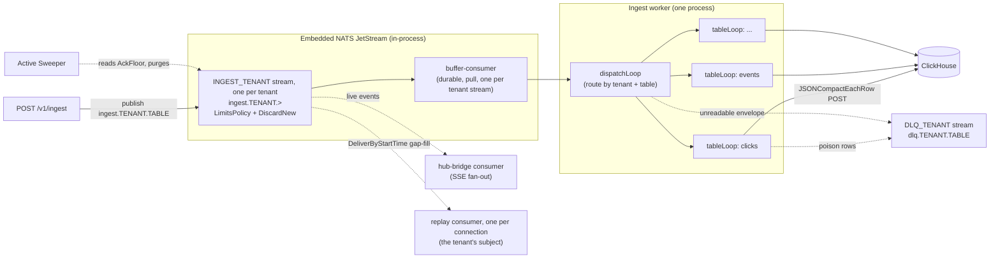
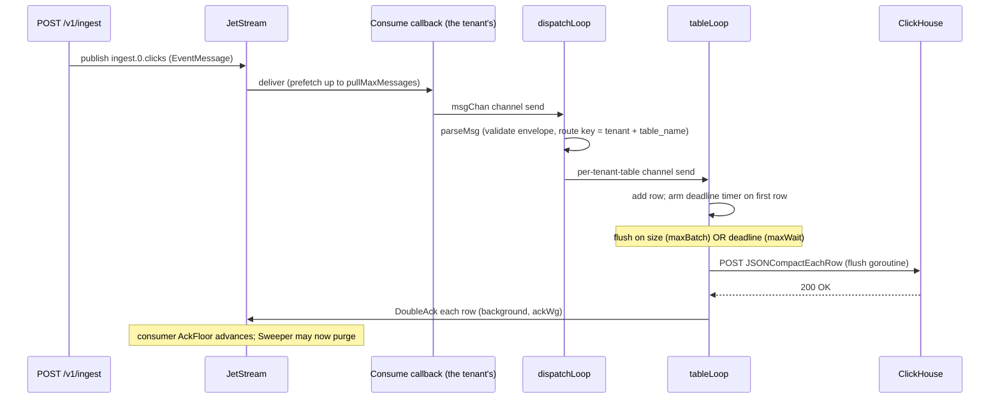
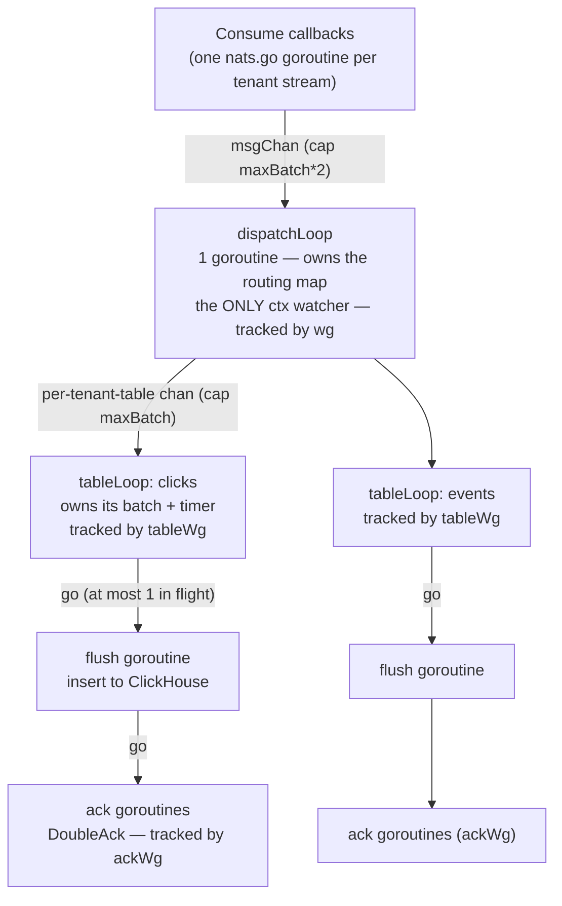
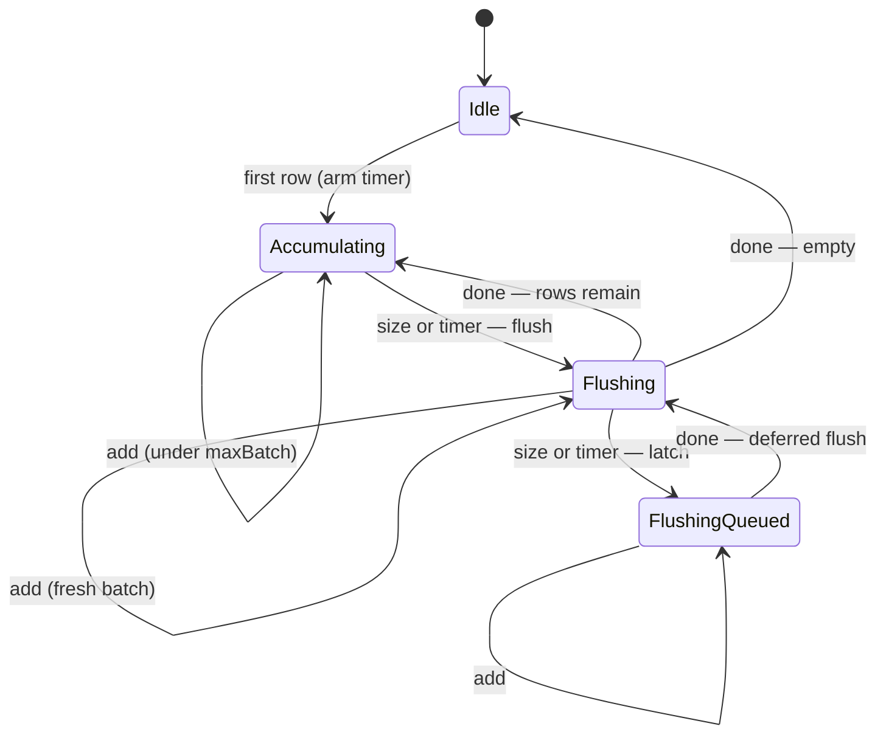
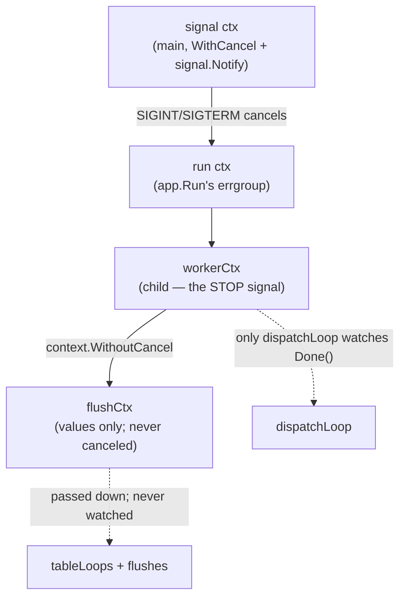
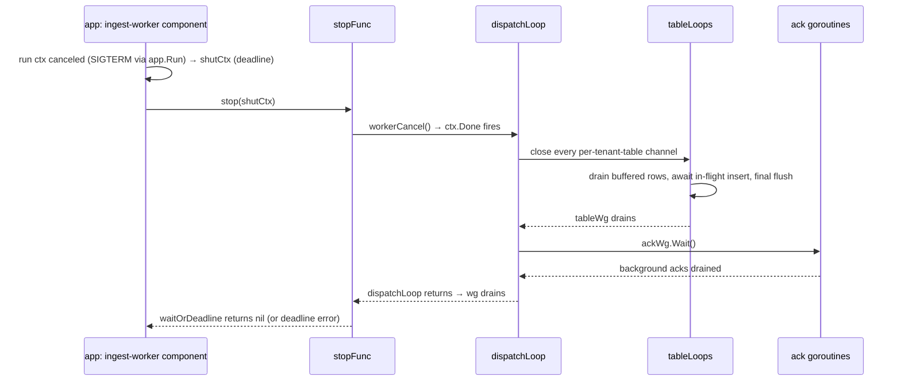
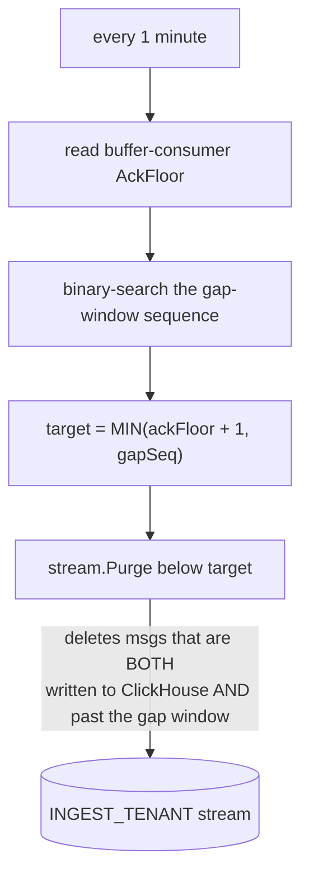
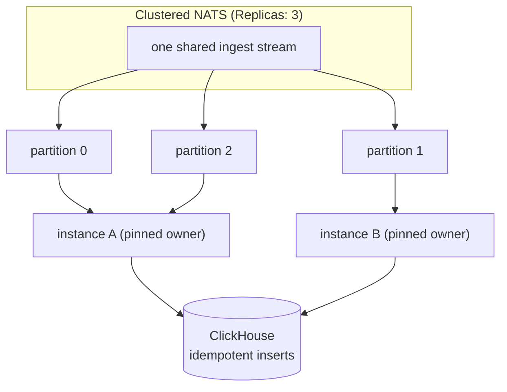

This page is the deep-dive on `internal/ingest` — the worker that turns the stream of ingest events into batched ClickHouse inserts. The [Architecture](/architecture) page covers where it sits in the system; this page covers **how the code itself works** so contributors and reviewers can reason about (and safely change) it.

It is deliberately detailed: this is a hot, concurrency-heavy path, and the goroutine / channel / timer interplay is subtle.

## Responsibilities and files

| File | Contents |
| --- | --- |
| `worker.go` | `StartIngestWorker`, the `dispatchLoop`, `parseMsg` (+ `rejectPoison` for an envelope it cannot read), the per-tenant-table `tableBatcher`/`tableLoop`, `flushTable` (splits a batch per column list via `groupByColumns`, or hands the whole batch of a tenant with no ClickHouse connection to `parkBatch`) and `flushGroup` (bulk insert with a row-by-row poison-isolation fallback), `insertToClickHouse` (into the batch's tenant's ClickHouse, `chconn.Pools.Target`), `handleSuccess` (acks, after `invalidate` bumps the tenant's cache namespaces — under every tenant on the same ClickHouse address and database, through the cache `internal/app` hands the worker, since they read the same tables), `sendToDLQ`/`parkOnDLQ` |
| `compact.go` | `EncodeCompactRow` — renders one record as a `JSONCompactEachRow` line over the table's **insertable** columns, in declaration order. Serialization only: it validates nothing and judges no value |
| `sweeper.go` | The **Active Sweeper** — every minute, asks the MQ to purge the events that are both written to ClickHouse and past the SSE gap window (the purge arithmetic below lives in `internal/mq/purge.go`) |
| `types.go` | `EventMessage` wire format and the `BufferConsumerName` constant |

The pipeline is **insert-only**. (Upgrading across the v2 envelope? [Drain the queue first](/deployment#upgrading-across-the-v2-ingest-envelope).) The wire format carries `{table_name, scope, received_timestamp, format, columns, row}`: `row` is one `JSONCompactEachRow` line — a positional JSON array — and `columns` names its positions — the table's insertable columns, in declaration order (a `MATERIALIZED` or `ALIAS` column cannot be named in an `INSERT`, so it is not part of the row's contract). (`scope` is reserved and always `""` today.) Each NATS message is its own envelope, so the names ride along per record; where they are carried once is the `INSERT` the worker emits per group. The worker parses the envelope, groups a batch by column list, and bulk-`INSERT`s each group as `INSERT INTO … (cols) FORMAT JSONCompactEachRow` — schema validation already happened at the HTTP ingest handler, before publish. Non-insert mutations go through `POST /v1/ops/query` (admin-only).

## High-level shape

Each tenant's events are queued on a JetStream stream of its own. One process holds one durable consumer on each tenant's stream, delivered into one handler, and fans events out to a goroutine per tenant table — the tenant is the subject's leading token. Each tenant's table batches independently and POSTs to ClickHouse over the HTTP interface (`JSONCompactEachRow`). On a bulk-insert failure the batch is re-inserted row by row, so a single poison row can't sink it: clean rows ack, and only the rows that fail again go to the dead-letter stream. A batch whose tenant has no ClickHouse connection — one no longer served, or one no pool could be opened for (such as by the connection ceiling) — skips that retry, which no row of it could pass, and meets the dead-letter switch once, whole; a tenant no longer served has no switch to read, so its batch is parked. An envelope the worker cannot *read* — malformed JSON, an unknown row `format` (what a pre-v2 message looks like), or columns and a row that don't pair — never reaches a table loop at all: `parseMsg` parks it on the same dead-letter stream, or, where the DLQ is off for the table, acks and drops it rather than redelivering a message that can never insert. A separate sweeper reclaims stream storage.



Note the stream is **dual-use**: it is both the durable buffer feeding the worker and the replay buffer that SSE clients gap-fill from. That is why a custom sweeper exists instead of plain work-queue auto-deletion (see [Scaling out](#scaling-to-multiple-instances)).

:::note[Omitted columns on `Nullable` columns with a default]
Inserts also pin `input_format_null_as_default=1`. A positional row has one value per insertable column and no way to say "absent", so a field the record omitted rides as an explicit `null` in its slot. That setting turns the `null` back into the column's default for a **non-nullable** column, matching what omitting the key did under `JSONEachRow` — but on a `Nullable(T) DEFAULT …` column ClickHouse stores `NULL` whatever the setting says, because only an *absent* key ever took the default. So such a column now stores `NULL` where it previously took its default. Verified on ClickHouse 26.6.3.
:::

:::note[ClickHouse timestamp parsing]
Inserts pin `date_time_input_format=best_effort` — the server default since ClickHouse 26.5, but on older servers the `basic` default rejects the canonical RFC 3339 form's `Z` suffix ([#372](https://github.com/Wave-RF/WaveHouse/issues/372)). The ordinary spellings (zone-less date-times, 9–10-digit Unix-seconds strings) parse identically under both settings. (This is moot for anything an older build buffered: the upgrade deletes it — see [Upgrading across the v2 ingest envelope](/deployment#upgrading-across-the-v2-ingest-envelope).) Bare digit-strings of other lengths are the exception: `best_effort` reads them as ClickHouse's calendar/epoch shapes, where `basic` read a plain `DateTime` column's digit string of five or more digits as Unix seconds (shorter runs it rejected outright, where `best_effort` reads `"2026"` as a year): under `best_effort` `"20260711"` stores 2026-07-11, where `basic` stored 1970-08-23. `DateTime64` columns diverge the same way on calendar-shaped runs, and additionally whenever an epoch run's unit doesn't match the column scale (under `basic`, runs longer than 10 digits are ticks at the column's own scale; `best_effort` unit-detects 13/16/19-digit runs as ms/µs/ns). A producer relying on the old `basic` reading changes meaning as soon as this WaveHouse version is deployed — the pin, not a ClickHouse upgrade, is what flips the parse.
:::

## The journey of one event



## Goroutine topology

The design rule is **single-owner state, lock-free**: each piece of mutable state is touched by exactly one goroutine. There are no mutexes in the hot path. The one fan-in is at the top: each tenant's stream is delivered on a nats.go goroutine of its own, and they all send into the one `msgChan`, which is safe from all of them at once; everything from `dispatchLoop` down stays single-owner, and a full `msgChan` pauses every tenant's delivery (layer 2 below).



Three `WaitGroup`s form a strict containment hierarchy, which is what makes shutdown correct (below):

- **`wg`** tracks the `dispatchLoop` goroutine.
- **`tableWg`** (owned by `dispatchLoop`) tracks the per-tenant-table `tableLoop`s.
- **`ackWg`** tracks the background `DoubleAck` goroutines, and the poison disposal (a DLQ publish *plus* a `DoubleAck`) that `rejectPoison` backgrounds from the dispatch loop.

## Why per table? The bug this design fixes

A single shared batch across all tables couples them: a high-volume table can trip the size trigger and strand a low-volume table's rows in a batch that then waits for the time trigger, and vice-versa. Routing each table to its own `tableLoop` gives every table an **independent** size trigger and timer, so one table's traffic never delays another's. (`dispatchLoop` does no batching itself — it parses the envelope, pairs `columns` with `row`, and picks the route key; an envelope it cannot read never reaches a `tableLoop`.)

## The `tableBatcher` state machine

Each `tableLoop` owns a `tableBatcher`. It has exactly two flush **triggers** — the batch reaching `maxBatch` (checked in `add`) and the `maxWait` deadline timer — plus a rule that **at most one insert runs per tenant table at a time** ("coalescing"). A flush *completing* is **not** a trigger.

The `flushing` channel signals "an insert is in flight" (it is `nil` when idle — and receiving from a `nil` channel blocks forever, so the loop's `<-flushing` arm is automatically inert while idle). The `flushQueued` flag **latches** a trigger that fires while an insert is already running, so the deferred flush runs the moment the slot frees.



Two consequences worth internalizing:

- **`maxBatch` is a "try to flush" threshold, not a hard cap.** If rows keep arriving while a flush is in flight, the next batch coalesces and can exceed `maxBatch`, flushing as one larger insert when the slot frees. That is *good* for ClickHouse part pressure (bigger batches when hot) and is bounded upstream by `maxAckPending`.
- **A partial leftover after a size flush waits for its own size/timer.** When 500 rows flush and 100 remain, those 100 do **not** flush just because the first insert finished — they wait for their own `maxBatch` or `maxWait`. The `flushQueued` latch is also what prevents a stranding bug: if the leftover's timer fires *during* the in-flight insert, the latch remembers it so the rows still flush when the slot frees (rather than the tick being silently lost).

### Why there are no data races

When a flush starts, the batcher hands the goroutine a **private snapshot**:

```go
rows := b.batch   // snapshot the slice header
b.batch = nil     // fresh batch here; appends allocate a new backing array
go func() { w.flushTable(ctx, b.table, rows) }()
```

The flush goroutine only ever touches `rows` and the worker's concurrency-safe collaborators (HTTP client, cache, `ackWg`); it never touches `b.batch`, `b.timer`, or `b.flushing`. Those are touched solely by the `tableLoop` goroutine. `b.batch = nil` (rather than `b.batch[:0]`) is load-bearing — reusing the array would let new appends overwrite rows the flush is still reading. The race detector (`go test -race`) guards this.

## Contexts

The signal context cancels `app.Run`'s errgroup context, which cancels `workerCtx` — the worker's stop signal. Two more are immune to it by construction: `flushCtx` is `context.WithoutCancel(workerCtx)`, and the drain deadline each component builds is rooted in `context.Background()`. Each has one job.



- **`workerCtx`** is the stop signal. **Only `dispatchLoop` watches it.** Every downstream goroutine stops via channel-close instead, which gives a deterministic drain with no select race that could abandon buffered rows.
- **`flushCtx` = `context.WithoutCancel(workerCtx)`** carries trace values but is never canceled. A flush that has started must finish, so data already written to ClickHouse gets acked rather than redelivered. It is bounded by the HTTP client timeout (30s); shutdown bounds the *wait* for it with a deadline.
- Each component that drains builds its own **shutdown-deadline context** (`App.shutdownContext` in `internal/app`, `server.shutdown_timeout`), rooted in `context.Background()` so it survives `workerCtx` being canceled. The ingest worker's and the API server's run concurrently, so the drain phase is bounded by one timeout, not their sum.

The principle: **`ctx` cancellation is the stop mechanism for long-running loops; `Close()`/stop-funcs are the mechanism for resources.**

## Lifecycle and shutdown

Startup: `StartIngestWorker` creates the consumer, builds the worker, and launches `dispatchLoop`. It returns a `stopFunc` closure that the app's ingest-worker component holds and calls once the run context is canceled; `app.Run` does not return until that drain has finished. It also returns a `failed` channel, which carries at most one error if the worker ends on its own — see [When the consumer dies](#when-the-consumer-dies).

Shutdown drains **bottom-up through the containment hierarchy**, under the ingest-worker component's own `server.shutdown_timeout` deadline (the API server's drain takes another, concurrently):



Why this ordering is correct: every `ackWg.Add` happens either inside a `tableLoop`'s lifetime **or on the `dispatchLoop` goroutine itself** (`rejectPoison`, reached from `parseMsg`), and `dispatchLoop` is the goroutine that `Wait`s — so no `Add` can race the `Wait` on either path. The `tableLoop` ones all complete before `tableWg.Wait()` returns — which means `dispatchLoop` can safely `ackWg.Wait()` afterward with no `Add` racing `Wait`. The old code relied on "flush runs synchronously" for this; the hierarchy makes it structural instead.

If the deadline fires first, `waitOrDeadline` returns the deadline error and the in-flight goroutines are abandoned — the process is exiting anyway, and anything un-acked is redelivered on the next boot (at-least-once).

Messages still sitting in `msgChan` or the consumer's prefetch buffer at shutdown are **not** flushed; they are simply redelivered next boot. Graceful shutdown flushes the in-hand per-tenant-table batches, not the entire in-flight pipeline.

### When the consumer dies

Delivery can end underneath a running worker: the durable consumer is deleted, or the MQ connection closes. The broker client reports that only through an asynchronous error callback and then stops delivering — no message ever arrives to say so, so a loop that only watches `msgChan` would wait forever while the API kept accepting events nothing writes. `mq.Consumer.Consume` therefore returns a `failed` channel next to `stop` (`mq.ErrDeliveryEnded`, wrapping the broker's reason), and `dispatchLoop` selects on it beside `ctx.Done()` and `msgChan`. On a failure it runs the same bottom-up drain as a shutdown — the rows already in hand are flushed and acked, not abandoned — and then reports the error on the worker's own `failed` channel. A consumer that cannot start at all takes the same path.

The worker does not try to revive the consumer. The app's ingest-worker component returns the error from `app.Run`, which stops every other component and exits non-zero, the same way any failed component does; the supervisor's restart recreates the durable consumer at boot, and everything unacked is redelivered (at-least-once). Passing conditions the client also reports through that callback (a missed heartbeat, a leadership change) are logged at `WARN` and do not end the worker. With the embedded broker (`DontListen`, no external client that could delete a durable) this path is hard to reach; the likeliest way in is a tenant's queue, opened at runtime, that the consumer cannot join. It matters more once a remote broker exists.

## Backpressure and durability knobs

Several layers throttle the pipeline, inner to outer:

1. **`batch`** flushes at `maxBatch` rows or `maxWait`.
2. **`msgChan`** (cap `maxBatch*2`) — when full, the consume callback blocks and delivery pauses.
3. **`pullMaxMessages`** — nats.go's client-side prefetch buffer in front of `msgChan`, shared by the tenants' streams (at least one message each).
4. **`maxAckPending`** — the server suspends a tenant's delivery once this many of its messages are delivered-but-unacked; no other tenant's delivery waits on it. The outermost in-memory bound, and a per-tenant one: while ClickHouse stalls, the worker can hold up to `maxAckPending` rows for every tenant served.
5. **`MaxBytes` + `DiscardNew`** on each tenant's stream (its `mq.max_bytes_gb` in the [settings directory](/settings-directory#message-queue), resized in place on reload) — when it fills (e.g. ClickHouse is down so nothing acks/purges), that tenant's new publishes are rejected and the API returns 503.

| Knob | Default | Meaning / invariant |
| --- | --- | --- |
| `maxBatch` | 500 | rows that trigger a flush (soft — coalescing can exceed it) |
| `maxWait` | 5s | max time a row waits before its batch flushes |
| `ackWait` | 60s | server redelivery timeout; **must exceed `maxWait` + flush time** or in-flight rows get redelivered → duplicate inserts |
| `pullMaxMessages` | 500 | client prefetch, shared by the tenants' streams; keep `<= maxAckPending` |
| `maxAckPending` | 10,000 | server cap on a tenant's unacked messages (backpressure) |

`DoubleAck` is used (not fire-and-forget `Ack`) because acking is what records "this data is durably in ClickHouse." With the embedded server's `SyncAlways`, every ack is an fsync and therefore *slow*, which is exactly why acks run in the background (`ackWg`) off the insert path.

## The Active Sweeper

The worker advances the consumer's `AckFloor` by acking; the sweep observes it to decide what is safe to purge. They never call each other — the consumer's `AckFloor` is their only contract. The sweeper (`internal/ingest`) owns the schedule and the window: each tick it calls `mq.Purger.PurgeAcked(buffer-consumer, cutoffs)` with each served tenant's cutoff at now − its own `stream.gap_window_minutes`; a tenant no longer served — its folder removed or rejected — is given none, and keeps none of the history it has acknowledged. The steps after the tick below are the embedded broker's implementation of that call, run on each tenant's stream at that tenant's cutoff.



`MIN(ackFloor+1, gapSeq)` is the safety argument: never purge past what is in ClickHouse, and never past the SSE replay window. If ClickHouse is down the `AckFloor` stops advancing, purging freezes, and the stream fills toward `MaxBytes` — backpressure by construction. The sweeper is one of `app.Run`'s components (`Sweeper.Start` blocks until the run context is canceled), but an interrupted sweep is harmless and idempotent, so it returns on `ctx.Done()` with no drain of its own — unlike the worker's bounded `stopFunc`.

## Scaling to multiple instances

Today this is a **single-process** design (embedded, in-process NATS — the "connection" cannot blip independently of the process, so there is intentionally no reconnect logic). Running multiple instances against a real/clustered NATS changes several things:



What will need to change, and the trade-offs (discussed at length on the batching work):

- **Work distribution.** Either a *shared* durable pull consumer (competing consumers — coordination-free, but a hot table's rows spread across instances, shrinking per-instance batches), or **partitioned consumer groups** that hash by the tenant and table subject tokens so a tenant's table always lands on one owner (pinned consumer → per-table affinity + automatic failover, at the cost of an assignment layer).
- **Idempotent inserts become mandatory.** At-least-once + redelivery-on-crash means another instance can re-insert a batch the dead one had written but not acked. Use `ReplacingMergeTree` (or a dedup key). The single-instance design hides this today.
- **NATS resilience.** Remote NATS needs explicit reconnect/backoff for the connection itself — the embedded path never dials out, so there is nothing to reconnect. The `Consume` error handler that detects a dead consumer already lives in `embedded.go` and needs no change for a remote broker.
- **The sweeper.** Its single-`AckFloor` model assumes one consumer. With per-table/partition consumers you either rework it to purge below the *minimum* AckFloor across consumers, or — cleaner — **split the dual-use stream**: a `WorkQueuePolicy` work stream (auto-deletes on ack, no sweeper) plus a `MaxAge` replay stream (server-expired by time, no sweeper), joined by stream sourcing. That deletes the sweeper and its leader-election problem entirely, at the cost of duplicating the in-flight overlap on disk.

## Deferred / not yet implemented

Tracked under [#191](https://github.com/Wave-RF/WaveHouse/issues/191):

- **Pipelining beyond coalescing** — more than one insert in flight per tenant table (with a documented bound), once benchmarks justify the added concurrency.
- **`tableLoop` reaping** — loops are spawned per distinct tenant table and never reaped; safe while tenants and table names are bounded (a settings folder per tenant, schema-validated tables, in-process publishers only). Needs idle-reaping before untrusted/remote publishers can create unbounded cardinality. Tracked in [#263](https://github.com/Wave-RF/WaveHouse/issues/263).
- **Per-table / partitioned consumers** and the **two-stream retention redesign**.
- **Parallel e2e test files.** The e2e suite now isolates tables **per file** (`tests/e2e/sdk/tables.ts` — each file gets its own `clicks_<suite>`/`events_<suite>`/`users_<suite>`), so cross-file *data* contamination is structurally impossible. Running the files in parallel (dropping `maxWorkers: 1` in `vitest.config.ts`) is still deferred: several files do read-modify-write on the **single global policy document** and `streaming.test.ts` flips the global `default_role`, so concurrent files would race those writes. Parallelism needs per-table policy storage with atomic per-table updates first — tracked in [#214](https://github.com/Wave-RF/WaveHouse/issues/214).
