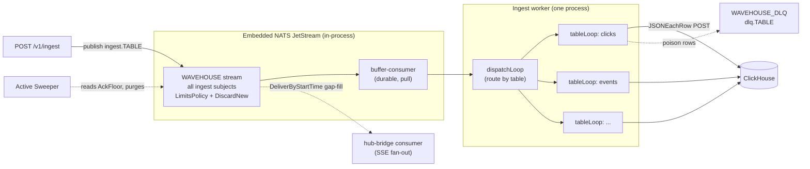
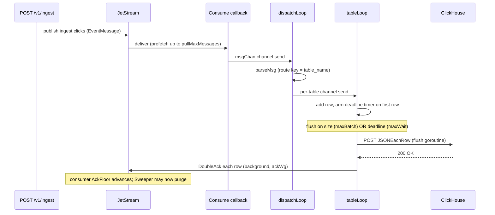
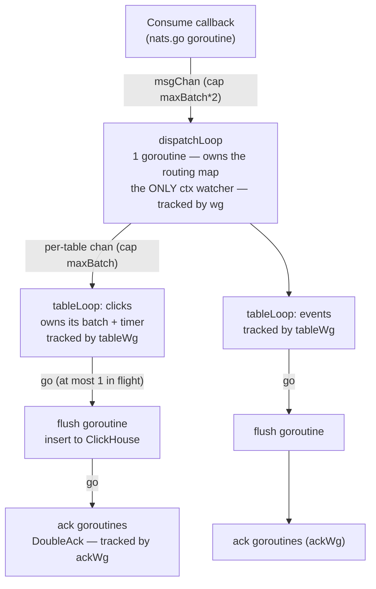
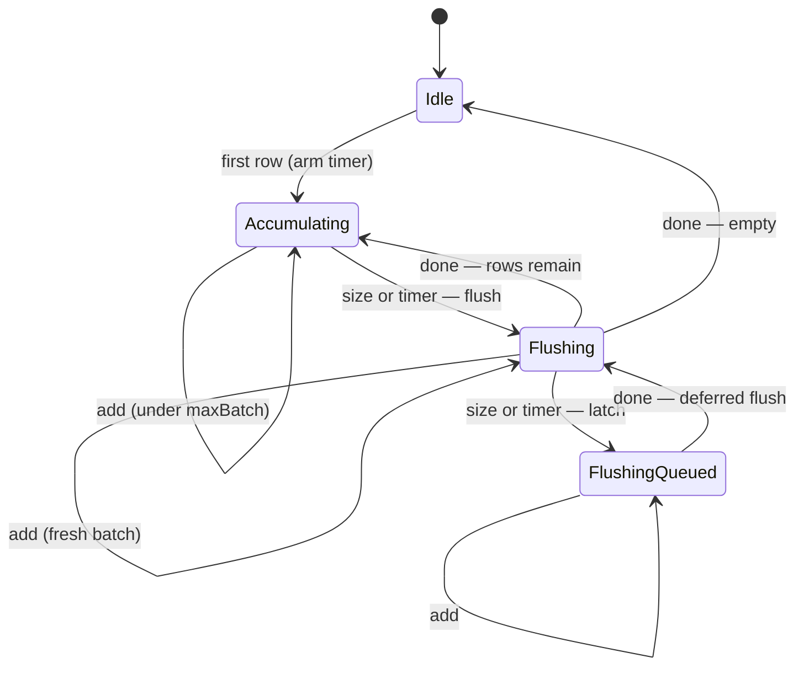
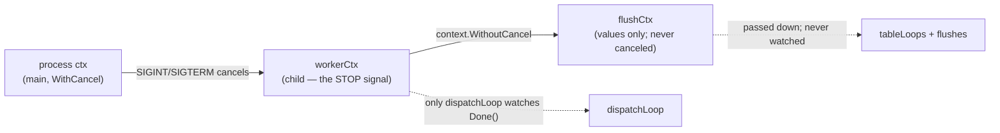
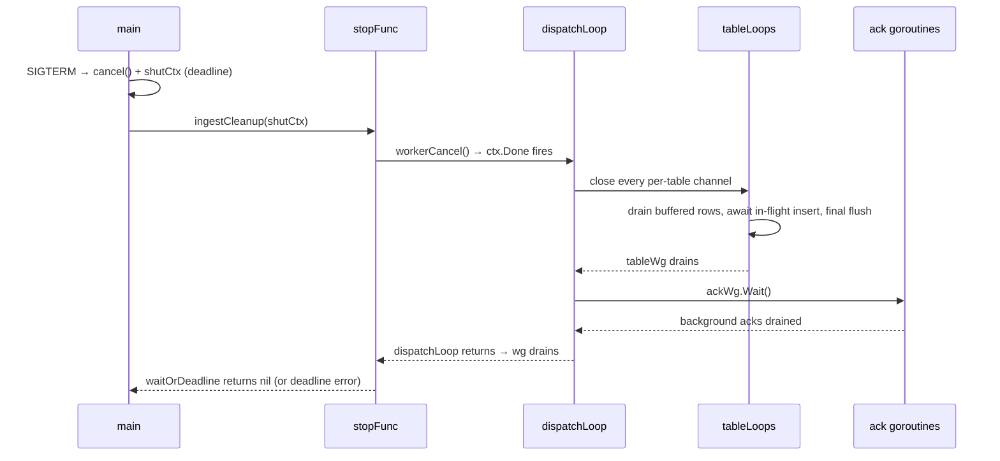
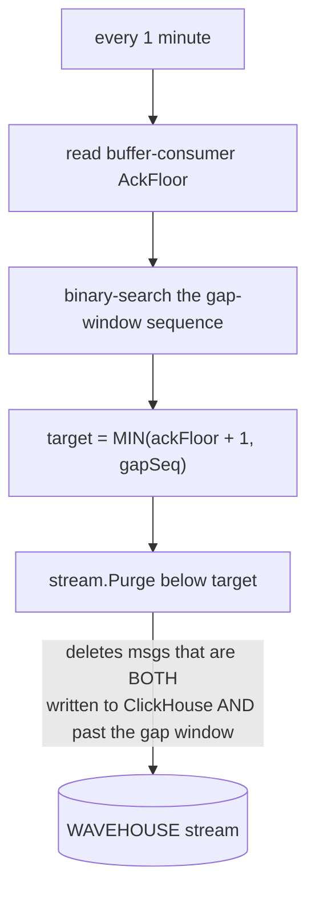
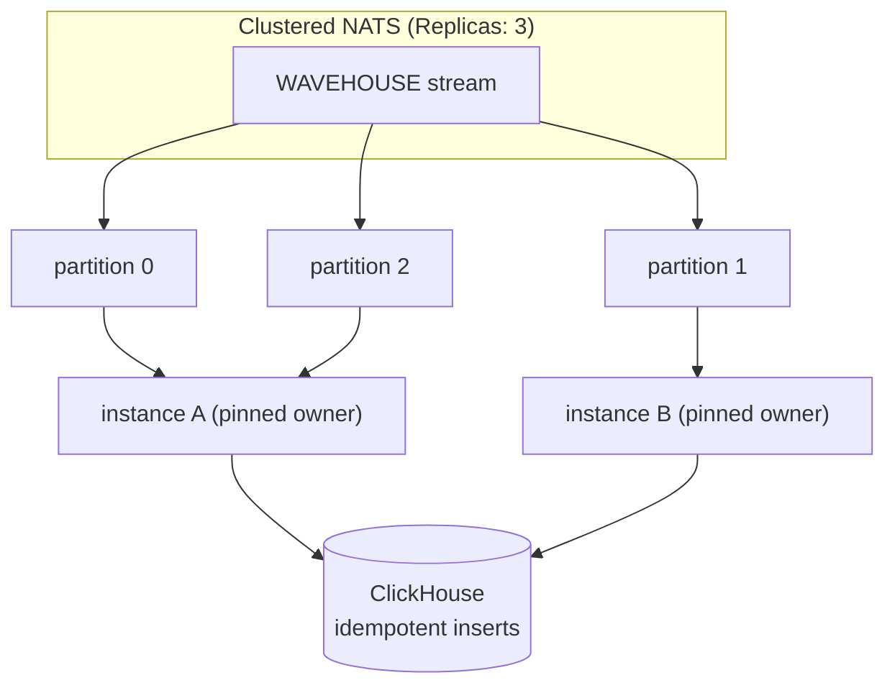

This page is the deep-dive on `internal/ingest` — the worker that turns the
stream of ingest events into batched ClickHouse inserts. The [Architecture](/architecture)
page covers where it sits in the system; this page covers **how the code itself
works** so contributors and reviewers can reason about (and safely change) it.

It is deliberately detailed: this is a hot, concurrency-heavy path, and the
goroutine / channel / timer interplay is subtle.

## Responsibilities and files

| File | Contents |
| --- | --- |
| `worker.go` | `StartIngestWorker`, the `dispatchLoop`, the per-table `tableBatcher`/`tableLoop`, `flushTable`, `insertToClickHouse`, `handleSuccess` (cache invalidation + acks), `sendToDLQ` |
| `sweeper.go` | The **Active Sweeper** — purges stream messages that are both written to ClickHouse and past the SSE gap window |
| `types.go` | `EventMessage` wire format and the `BufferConsumerName` constant |

The pipeline is **insert-only**. The wire format carries
`{table_name, received_timestamp, data}` and nothing else; the worker
validates and bulk-`INSERT`s. Non-insert mutations go through a different admin path.

## High-level shape

One process consumes a single durable JetStream consumer and fans events out to
a goroutine per table. Each table batches independently and POSTs to ClickHouse
over the HTTP interface (`JSONEachRow`, with `date_time_input_format=best_effort`:
ClickHouse's default `basic` parser rejects the canonical RFC 3339 timestamps'
zone suffix (#372); `best_effort` is a superset, so pre-canonical spellings still
parse). Failed rows go to a dead-letter stream; a separate sweeper reclaims
stream storage.



Note the stream is **dual-use**: it is both the durable buffer feeding the
worker and the replay buffer that SSE clients gap-fill from. That is why a
custom sweeper exists instead of plain work-queue auto-deletion (see
[Scaling out](#scaling-to-multiple-instances)).

## The journey of one event



## Goroutine topology

The design rule is **single-owner state, lock-free**: each piece of mutable
state is touched by exactly one goroutine. There are no mutexes in the hot path.



Three `WaitGroup`s form a strict containment hierarchy, which is what makes
shutdown correct (below):

- **`wg`** tracks the `dispatchLoop` goroutine.
- **`tableWg`** (owned by `dispatchLoop`) tracks the per-table `tableLoop`s.
- **`ackWg`** tracks the background `DoubleAck` goroutines.

## Why per table? The bug this design fixes

A single shared batch across all tables couples them: a high-volume table can
trip the size trigger and strand a low-volume table's rows in a batch that then
waits for the time trigger, and vice-versa. Routing each table to its own
`tableLoop` gives every table an **independent** size trigger and timer, so one
table's traffic never delays another's. (`dispatchLoop` does no batching itself
— it only parses enough to pick the route key.)

## The `tableBatcher` state machine

Each `tableLoop` owns a `tableBatcher`. It has exactly two flush **triggers** —
the batch reaching `maxBatch` (checked in `add`) and the `maxWait` deadline
timer — plus a rule that **at most one insert runs per table at a time**
("coalescing"). A flush *completing* is **not** a trigger.

The `flushing` channel signals "an insert is in flight" (it is `nil` when idle —
and receiving from a `nil` channel blocks forever, so the loop's `<-flushing`
arm is automatically inert while idle). The `flushQueued` flag **latches** a
trigger that fires while an insert is already running, so the deferred flush runs
the moment the slot frees.



Two consequences worth internalizing:

- **`maxBatch` is a "try to flush" threshold, not a hard cap.** If rows keep
  arriving while a flush is in flight, the next batch coalesces and can exceed
  `maxBatch`, flushing as one larger insert when the slot frees. That is *good*
  for ClickHouse part pressure (bigger batches when hot) and is bounded upstream
  by `maxAckPending`.
- **A partial leftover after a size flush waits for its own size/timer.** When
  500 rows flush and 100 remain, those 100 do **not** flush just because the
  first insert finished — they wait for their own `maxBatch` or `maxWait`. The
  `flushQueued` latch is also what prevents a stranding bug: if the leftover's
  timer fires *during* the in-flight insert, the latch remembers it so the rows
  still flush when the slot frees (rather than the tick being silently lost).

### Why there are no data races

When a flush starts, the batcher hands the goroutine a **private snapshot**:

```go
rows := b.batch   // snapshot the slice header
b.batch = nil     // fresh batch here; appends allocate a new backing array
go func() { w.flushTable(ctx, b.table, rows) }()
```

The flush goroutine only ever touches `rows` and the worker's
concurrency-safe collaborators (HTTP client, cache, `ackWg`); it never touches
`b.batch`, `b.timer`, or `b.flushing`. Those are touched solely by the
`tableLoop` goroutine. `b.batch = nil` (rather than `b.batch[:0]`) is load-bearing
— reusing the array would let new appends overwrite rows the flush is still
reading. The race detector (`go test -race`) guards this.

## Contexts

There are three contexts, each with one job.



- **`workerCtx`** is the stop signal. **Only `dispatchLoop` watches it.** Every
  downstream goroutine stops via channel-close instead, which gives a
  deterministic drain with no select race that could abandon buffered rows.
- **`flushCtx` = `context.WithoutCancel(workerCtx)`** carries trace values but is
  never canceled. A flush that has started must finish, so data already written
  to ClickHouse gets acked rather than redelivered. It is bounded by the HTTP
  client timeout (30s); shutdown bounds the *wait* for it with a deadline.
- A separate **shutdown-deadline context** lives only in `main`'s signal handler
  and is rooted in `context.Background()` (so it survives `workerCtx` being
  canceled) — it caps how long shutdown waits.

The principle: **`ctx` cancellation is the stop mechanism for long-running
loops; `Close()`/stop-funcs are the mechanism for resources.**

## Lifecycle and shutdown

Startup: `StartIngestWorker` creates the consumer, builds the worker, and
launches `dispatchLoop`. It returns a `stopFunc` closure that `main` holds and
calls during graceful shutdown.

Shutdown drains **bottom-up through the containment hierarchy**, under a single
deadline:



Why this ordering is correct: every `ackWg.Add` happens inside a `tableLoop`'s
lifetime, so all of them complete before `tableWg.Wait()` returns — which means
`dispatchLoop` can safely `ackWg.Wait()` afterward with no `Add` racing `Wait`.
The old code relied on "flush runs synchronously" for this; the hierarchy makes
it structural instead.

If the deadline fires first, `waitOrDeadline` returns the deadline error and the
in-flight goroutines are abandoned — the process is exiting anyway, and anything
un-acked is redelivered on the next boot (at-least-once).

Messages still sitting in `msgChan` or the consumer's prefetch buffer at shutdown
are **not** flushed; they are simply redelivered next boot. Graceful shutdown
flushes the in-hand per-table batches, not the entire in-flight pipeline.

## Backpressure and durability knobs

Several layers throttle the pipeline, inner to outer:

1. **`batch`** flushes at `maxBatch` rows or `maxWait`.
2. **`msgChan`** (cap `maxBatch*2`) — when full, the consume callback blocks and
   delivery pauses.
3. **`pullMaxMessages`** — nats.go's client-side prefetch buffer in front of
   `msgChan`.
4. **`maxAckPending`** — the server suspends delivery once this many messages are
   delivered-but-unacked. The outermost in-memory bound.
5. **`MaxBytes` + `DiscardNew`** on the stream — when disk fills (e.g. ClickHouse
   is down so nothing acks/purges), new publishes are rejected and the API
   returns 503.

| Knob | Default | Meaning / invariant |
| --- | --- | --- |
| `maxBatch` | 500 | rows that trigger a flush (soft — coalescing can exceed it) |
| `maxWait` | 5s | max time a row waits before its batch flushes |
| `ackWait` | 60s | server redelivery timeout; **must exceed `maxWait` + flush time** or in-flight rows get redelivered → duplicate inserts |
| `pullMaxMessages` | 500 | client prefetch; keep `<= maxAckPending` |
| `maxAckPending` | 10,000 | server cap on unacked messages (backpressure) |

`DoubleAck` is used (not fire-and-forget `Ack`) because acking is what records
"this data is durably in ClickHouse." With the embedded server's `SyncAlways`,
every ack is an fsync and therefore *slow*, which is exactly why acks run in the
background (`ackWg`) off the insert path.

## The Active Sweeper

The worker advances the consumer's `AckFloor` by acking; the sweeper observes it
to decide what is safe to purge. They never call each other — the consumer's
`AckFloor` is their only contract.



`MIN(ackFloor+1, gapSeq)` is the safety argument: never purge past what is in
ClickHouse, and never past the SSE replay window. If ClickHouse is down the
`AckFloor` stops advancing, purging freezes, and the stream fills toward
`MaxBytes` — backpressure by construction. The sweeper is launched fire-and-forget
(`go sweeper.Start(ctx)`); an interrupted sweep is harmless and idempotent, so it
needs no drain on shutdown — the opposite posture from the worker.

## Scaling to multiple instances

Today this is a **single-process** design (embedded, in-process NATS — the
"connection" cannot blip independently of the process, so there is intentionally
no reconnect logic). Running multiple instances against a real/clustered NATS
changes several things:



What will need to change, and the trade-offs (discussed at length on the
batching work):

- **Work distribution.** Either a *shared* durable pull consumer (competing
  consumers — coordination-free, but a hot table's rows spread across instances,
  shrinking per-instance batches), or **partitioned consumer groups** that hash
  by table-name subject token so a table always lands on one owner (pinned
  consumer → per-table affinity + automatic failover, at the cost of an
  assignment layer).
- **Idempotent inserts become mandatory.** At-least-once + redelivery-on-crash
  means another instance can re-insert a batch the dead one had written but not
  acked. Use `ReplacingMergeTree` (or a dedup key). The single-instance design
  hides this today.
- **NATS resilience.** Remote NATS needs explicit reconnect/backoff and a
  `Consume` error handler — none of which the embedded path needs.
- **The sweeper.** Its single-`AckFloor` model assumes one consumer. With
  per-table/partition consumers you either rework it to purge below the *minimum*
  AckFloor across consumers, or — cleaner — **split the dual-use stream**: a
  `WorkQueuePolicy` work stream (auto-deletes on ack, no sweeper) plus a
  `MaxAge` replay stream (server-expired by time, no sweeper), joined by stream
  sourcing. That deletes the sweeper and its leader-election problem entirely,
  at the cost of duplicating the in-flight overlap on disk.

## Deferred / not yet implemented

Tracked under [#191](https://github.com/Wave-RF/WaveHouse/issues/191):

- **Pipelining beyond coalescing** — more than one insert in flight per table
  (with a documented bound), once benchmarks justify the added concurrency.
- **`tableLoop` reaping** — loops are spawned per distinct table and never
  reaped; safe while table names are bounded (schema-validated, in-process
  publishers only). Needs idle-reaping before untrusted/remote publishers can
  create unbounded cardinality.
- **Per-table / partitioned consumers** and the **two-stream retention
  redesign**.
- **Parallel e2e test files.** The e2e suite now isolates tables **per file**
  (`tests/e2e/sdk/tables.ts` — each file gets its own
  `clicks_<suite>`/`events_<suite>`/`users_<suite>`), so cross-file *data*
  contamination is structurally impossible. Running the files in parallel
  (dropping `maxWorkers: 1` in `vitest.config.ts`) is still deferred: several
  files do read-modify-write on the **single global policy document** and
  `streaming.test.ts` flips the global `default_role`, so concurrent files would
  race those writes. Parallelism needs per-table policy storage with atomic
  per-table updates first — tracked in
  [#214](https://github.com/Wave-RF/WaveHouse/issues/214).
