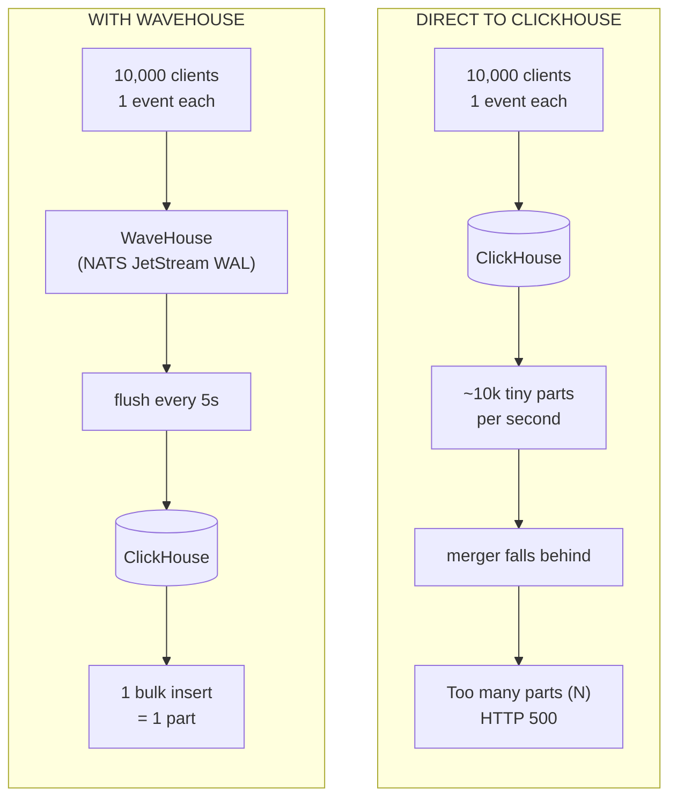
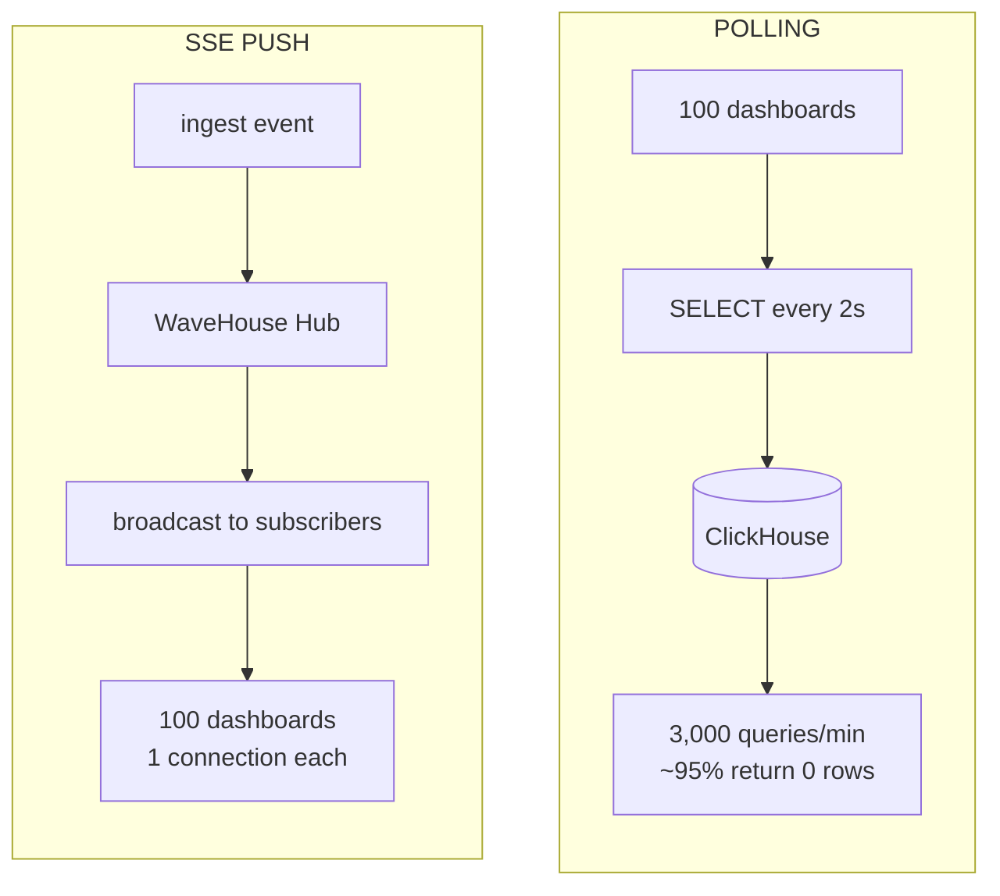
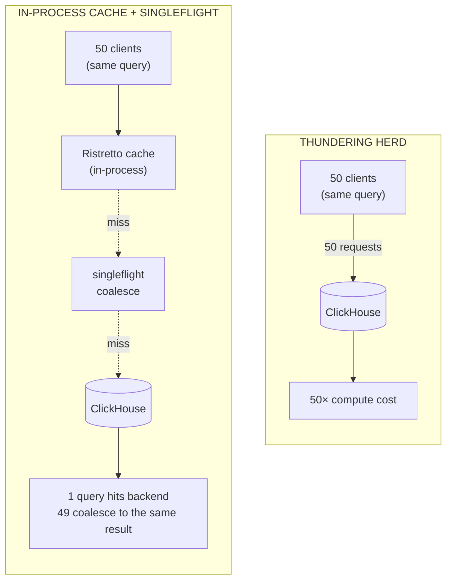
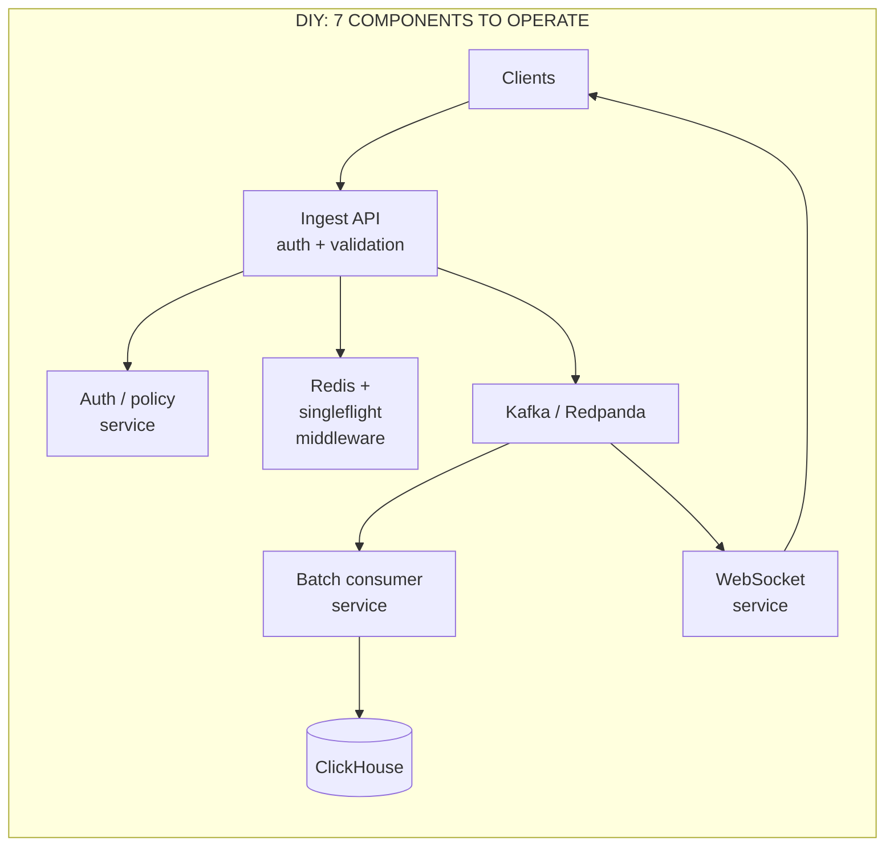
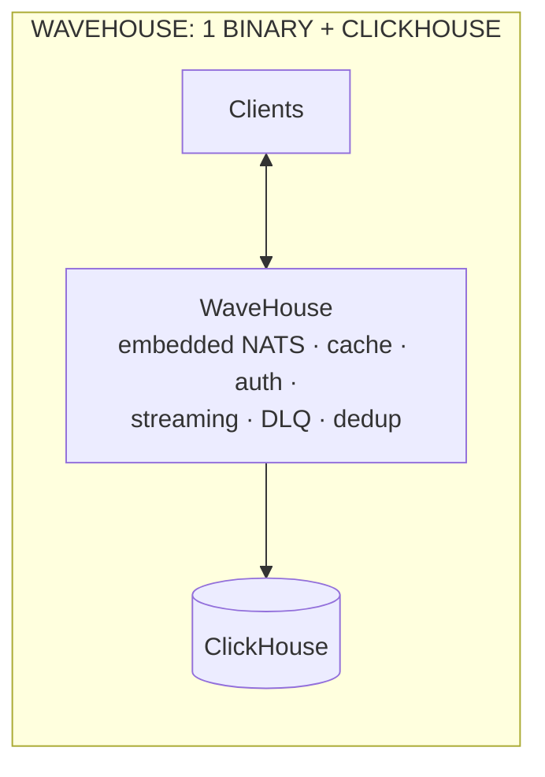
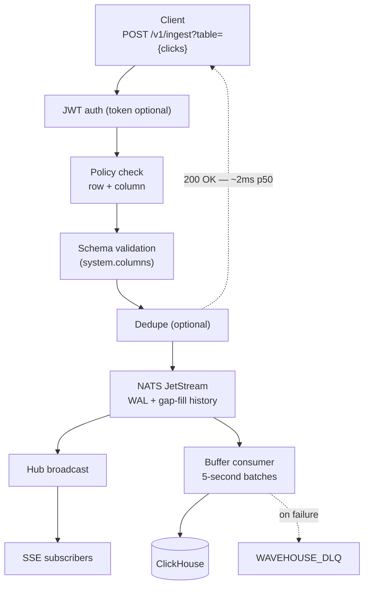
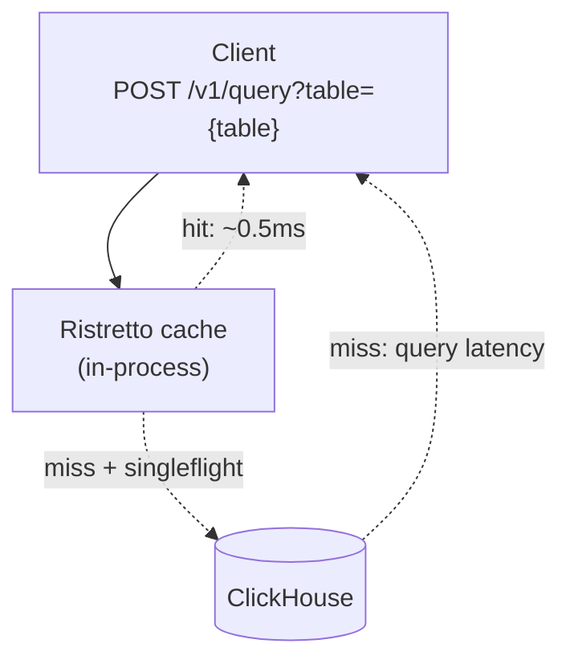

WaveHouse is an API gateway purpose-built for fronting ClickHouse with user-facing traffic. This page is the engineering answer to "why not just point my clients at ClickHouse?" — or "why not Kafka + ClickHouse?" or "why not Tinybird?" — with the failure modes, the common DIY stacks, and where the cost falls.

## Part I — Why ClickHouse alone breaks under user-facing writes

### The one-row-insert anti-pattern

ClickHouse is an OLAP database. Every `INSERT` writes a new *part* on disk; a background merger then consolidates parts over time. This design is phenomenal for bulk analytics ingestion (1M rows in a single block) and catastrophic for streaming ingest from many clients.

ClickHouse's own documentation is unambiguous: **insert batches of 1,000–100,000 rows at a time, and no more often than once per second.** ([ClickHouse — Inserting Data Best Practices](https://clickhouse.com/docs/en/guides/inserting-data).) A frontend that POSTs one event at a time violates both rules by orders of magnitude.

What goes wrong in concrete terms:

The `parts_to_delay_insert` and `parts_to_throw_insert` thresholds are documented MergeTree settings (historical defaults around 1,000 and 3,000 respectively; current values depend on version and are tunable). The failure mode is not hypothetical — it shows up in production any time insert rate outpaces merges, and the error text is literally `DB::Exception: Too many parts (N). Merges are processing significantly slower than inserts`.

**The scenario in dollars.** A product shipping 10M events/day to ClickHouse directly — say, a user analytics widget on 20k daily actives — produces ~115 events/sec. With default merge settings, an unlucky hour of traffic spike pushes you over the delay threshold; inserts stall; the frontend starts 503'ing; engineers get paged; someone spends the weekend writing an ad-hoc batching service. The same 10M events/day via WaveHouse: ~17k bulk inserts/day instead of 10M, merge pressure flat, no incidents.

### No backpressure, no DLQ, no validation at the edge

Even if you remember to batch client-side, a naive ingest path has no safe way to tell a client "slow down" or "that payload was malformed":

- **Validation happens late.** ClickHouse will accept an insert with a `String` where you expected a `UInt32` — it just rejects the whole block at parse time, and only after the network round-trip. There is no "this field is unknown" signal at the HTTP boundary; you build that yourself.
- **No backpressure channel.** If the merger falls behind, ClickHouse raises an error at the *next* insert. The client has already left.
- **No DLQ.** Bad events that fail to insert are either lost or logged into ClickHouse's error log. Good luck replaying yesterday's dropped rows.

WaveHouse fixes all three at the gateway: validates every payload against the real `system.columns` schema before accepting, returns `503 Service Unavailable` with a `Retry-After` header when the NATS WAL fills, and routes failed batch inserts to a dedicated `WAVEHOUSE_DLQ` stream you can inspect via `GET /v1/ops/dlq/stats`.

### No real-time push

ClickHouse has no pub/sub. If a dashboard needs to see new events within a second of ingest, your choices are:

- **Poll.** Every client issues `SELECT ... WHERE received_timestamp > ?` every N seconds. For a dashboard with 100 concurrent viewers polling every 2s, that's **3,000 queries/min against ClickHouse** — most returning zero rows.
- **Add another system** (Kafka, Pulsar, Redis pub/sub) and duplicate the event stream.

WaveHouse's SSE layer broadcasts events **before** they flush to ClickHouse, with NATS JetStream history for gap-fill when a client reconnects. Same binary, no separate pub/sub stack.

### Thundering-herd queries

A popular dashboard recomputes the same expensive aggregation for every viewer. ClickHouse has a built-in query cache, but it is **per-server** and there is no client-facing singleflight: 50 dashboards hitting refresh at once means up to 50 identical queries land on ClickHouse.

WaveHouse coalesces identical queries with an in-process Ristretto cache and Go's `singleflight`, so only the first of N concurrent identical queries actually hits ClickHouse — the rest receive the same result without making the round trip.

### No row/column access control

ClickHouse has users and role grants, but nothing like row-level security driven by a JWT claim. If your product serves multiple tenants from a shared table, you're writing middleware to inject `WHERE tenant_id = ?` on every query — and hoping you never miss one. WaveHouse ships Hasura-style policies stored in NATS KV: per-role `allow_columns`, row-level `filter` with JWT claim templating (`{{ jwt.app_metadata.tenant_id }}`), bootstrapped from a YAML file, synced cluster-wide via KV Watch.

## Part II — What people actually build instead

The canonical DIY stack for user-facing analytics on ClickHouse looks like this:

**Ingredient count, cleanly:**

| Capability | DIY stack | WaveHouse |
| ---------- | --------- | --------- |
| Durable ingest buffer | Kafka / Redpanda cluster (3+ brokers, Zookeeper/KRaft) | Embedded NATS JetStream |
| Batch consumer | Custom Go/Rust/Java service you write and operate | Built in |
| Query cache | Redis + singleflight middleware you write | Built in (Ristretto + singleflight) |
| Real-time push | WebSocket service + bridge from Kafka | Built in (`/v1/stream`) |
| Schema validation | Custom code in ingest API | Built in (discovers `system.columns`) |
| Row/column access control | Custom middleware or a dedicated service | Built in (Hasura-style, JWT-driven) |
| Dead letter queue | Custom retry + dead topic on Kafka | Built in (`WAVEHOUSE_DLQ`) |
| Client SDK | Each team writes one | `@wavehouse/sdk` (TypeScript, one dependency, codegen) |

The DIY path works — big teams run it — but the ops cost is not small. You're paying for a Kafka cluster (or Confluent bill), a second service you wrote from scratch, and all the debugging hours when the batching consumer stalls at 3 a.m.

**The scenario.** A seed-stage team building user-facing analytics picks "Kafka + ClickHouse + custom ingest". Six months in: two engineers are spending ~30% of their time on data-plane reliability (batching edge cases, DLQ replay tooling, Kafka upgrades, monitoring dashboards for all of it). That's roughly one full-time engineer of drag on a 3-person backend team. A drop-in gateway removes that line item.

### Tinybird

Tinybird is the most direct commercial alternative — a hosted ClickHouse platform with SQL-based "pipes" for defining APIs. Genuinely good product for teams that want to pay to skip the plumbing.

Where it differs from WaveHouse:

| Dimension | Tinybird | WaveHouse |
| --------- | -------- | --------- |
| Hosting | SaaS only (managed tiers: Developer $49/mo → Enterprise custom) | Self-host, single binary |
| Pricing model | Pay for allocated vCPU/QPS/storage; egress fees for cross-region | Your infra; no per-query or per-GB fee |
| Data residency | Their infrastructure | Your infrastructure |
| Source of truth for schema | Tinybird datasource definitions | Your ClickHouse tables (`system.columns`) |
| Deployment workflow | Tinybird CLI against Tinybird Cloud | `docker compose up` or any K8s |
| Real-time push | Pipe endpoints (request/response) | Native SSE |
| Access control | Tinybird tokens (API-level) | JWT + Hasura-style row/column policies |
| Vendor lock-in | Queries run on Tinybird; moving off = rewriting | None — WaveHouse is Apache 2.0, ClickHouse is yours |

Tinybird wins on "zero ops to start." WaveHouse wins on "own your data plane and pay AWS, not a second vendor" — which gets more compelling at scale, on sensitive data, or for anyone who needs on-prem.

## Part III — The feature matrix

| Concern | Direct ClickHouse | Kafka + ClickHouse (DIY) | Tinybird | **WaveHouse** |
| ------- | ----------------- | ----------------------- | -------- | ------------- |
| Single-binary deployment | — | — | N/A (SaaS) | ✓ |
| Self-hosted | ✓ | ✓ | ✗ | ✓ |
| Handles N-row inserts safely | ✗ merge blowup | ✓ via Kafka | ✓ | ✓ native |
| Schema validation at the edge | ✗ | Custom | ✓ | ✓ (discovers schema) |
| Dead letter queue | ✗ | Custom | Partial | ✓ `WAVEHOUSE_DLQ` |
| Backpressure (503 + Retry-After) | ✗ | Custom | ✓ | ✓ |
| Idempotent ingest (dedup by ID) | ✗ | Custom | ✓ | ✓ optional |
| Real-time push (SSE) | ✗ | Custom service | ✗ | ✓ native, gap-fill |
| Thundering-herd coalescing | ✗ | Custom | ✓ | ✓ Ristretto + singleflight |
| Row/column policies with JWT claims | ✗ | Custom | Tokens only | ✓ Hasura-style |
| Named parameterized pipes | ✗ | Custom | ✓ | ✓ stored in NATS KV |
| Type-safe client SDK with codegen | ✗ | Per team | Partial | ✓ `@wavehouse/sdk` |
| Cost model | Infra only | Infra + eng time | Per-vCPU SaaS | Infra only |

## Part IV — End-to-end data journey

How an event actually moves through WaveHouse, end to end. The ingest path is split into a synchronous edge (everything before the `200 OK`) and two async tails — real-time broadcast and batched insert.

**Ingest & broadcast path:**

**Query path with tiered cache:**

**Latency budget at each stage** (representative):

| Stage | Typical p50 | Typical p99 |
| ----- | ----------- | ----------- |
| API auth + validation | < 1 ms | ~3 ms |
| NATS JetStream publish | ~1 ms | ~5 ms |
| API `200 OK` to client | ~2 ms | ~8 ms |
| Hub broadcast to SSE subscriber | ~1 ms | ~10 ms |
| Batch flush to ClickHouse | 5 s (configurable) | 5 s + ClickHouse insert time |
| Query cache hit (L1) | < 0.5 ms | ~1 ms |
| Query cache miss → ClickHouse | depends on query | depends on query |

## Part V — When WaveHouse is *not* the right answer

The honest list:

- **Internal BI / data team workloads** — if the only clients of ClickHouse are analysts in a BI tool and ETL jobs that already batch, WaveHouse adds latency and an extra component for no gain. Point BI straight at ClickHouse.
- **Pure bulk ETL pipelines** — if your writes already arrive as 100k-row blocks from Airflow or dbt, the buffering layer is redundant.
- **ClickHouse-as-a-datalake** — using ClickHouse for cold analytics over S3/Iceberg. WaveHouse is about the hot path.
- **Kafka-shaped organizations** — if you already run a heavily-invested Kafka Connect ecosystem with custom sinks, the migration cost may exceed the benefit. Run Kafka → WaveHouse in front of ClickHouse if you want the real-time and cache layers without throwing out Kafka.

## Summary

The pitch in one sentence: **ClickHouse is a great database and a poor API**. Every product putting user-facing traffic on ClickHouse eventually builds WaveHouse — the question is whether you build it on the weekend before the merge backlog, after it, or skip the build by deploying ours.

Read next:

- **[Architecture](/architecture)** — the internal package map and how each of these capabilities is implemented.
- **[Getting Started](/getting-started)** — five minutes to `200 OK`.
- **[API Reference](/api)** — every endpoint and the schema-validation contract.
