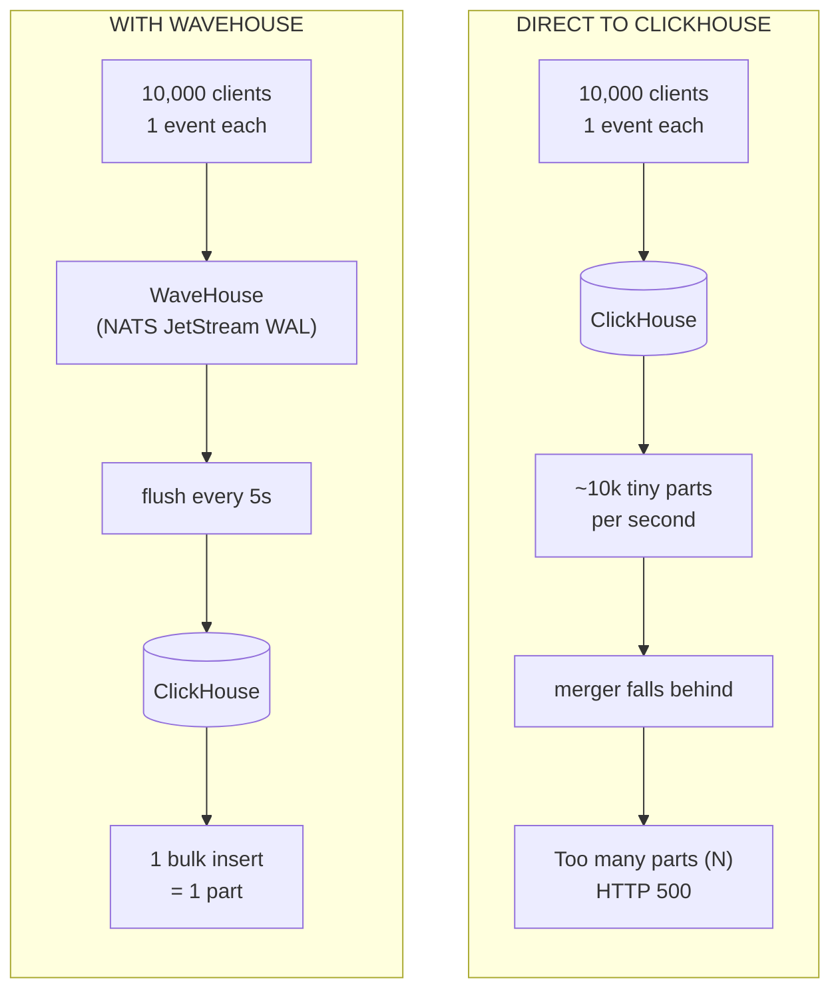
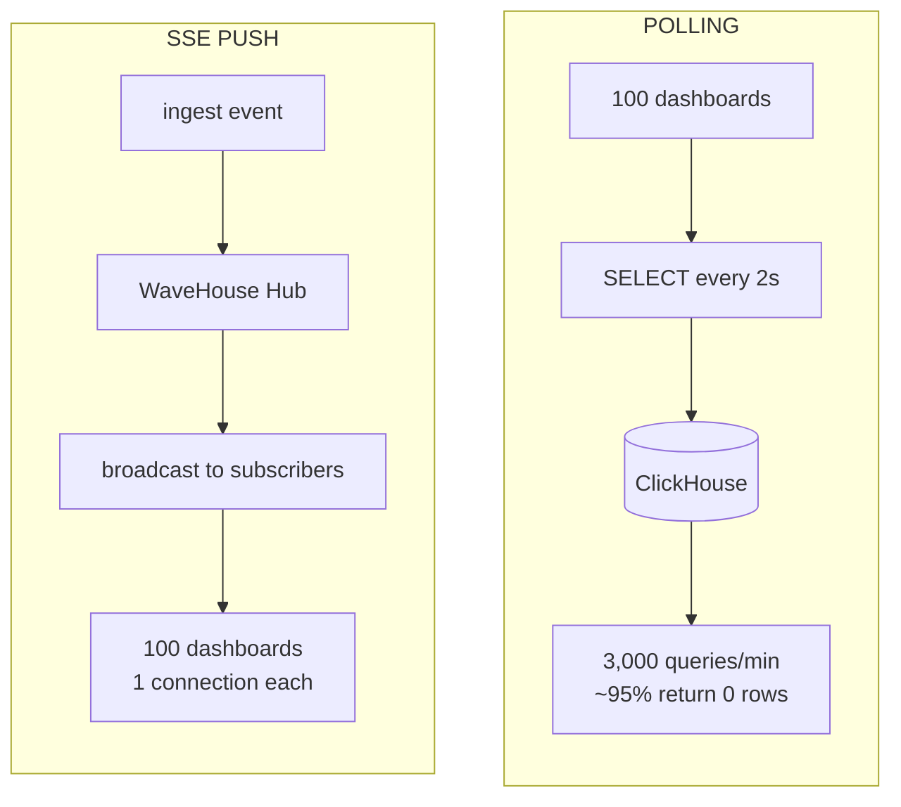
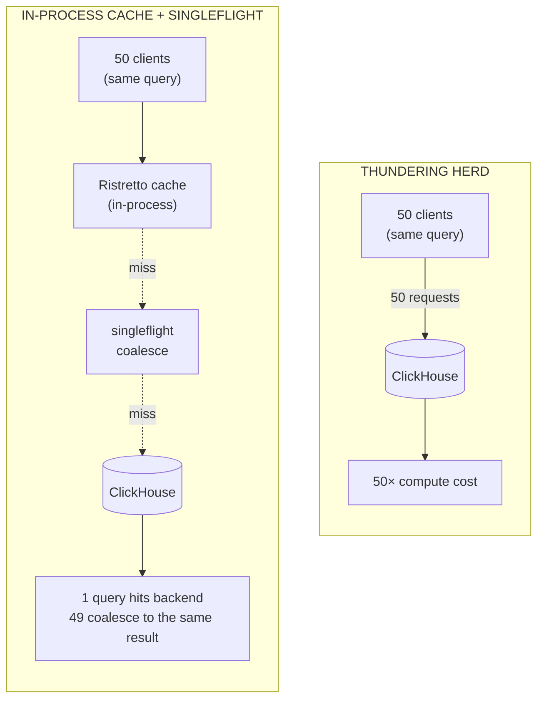
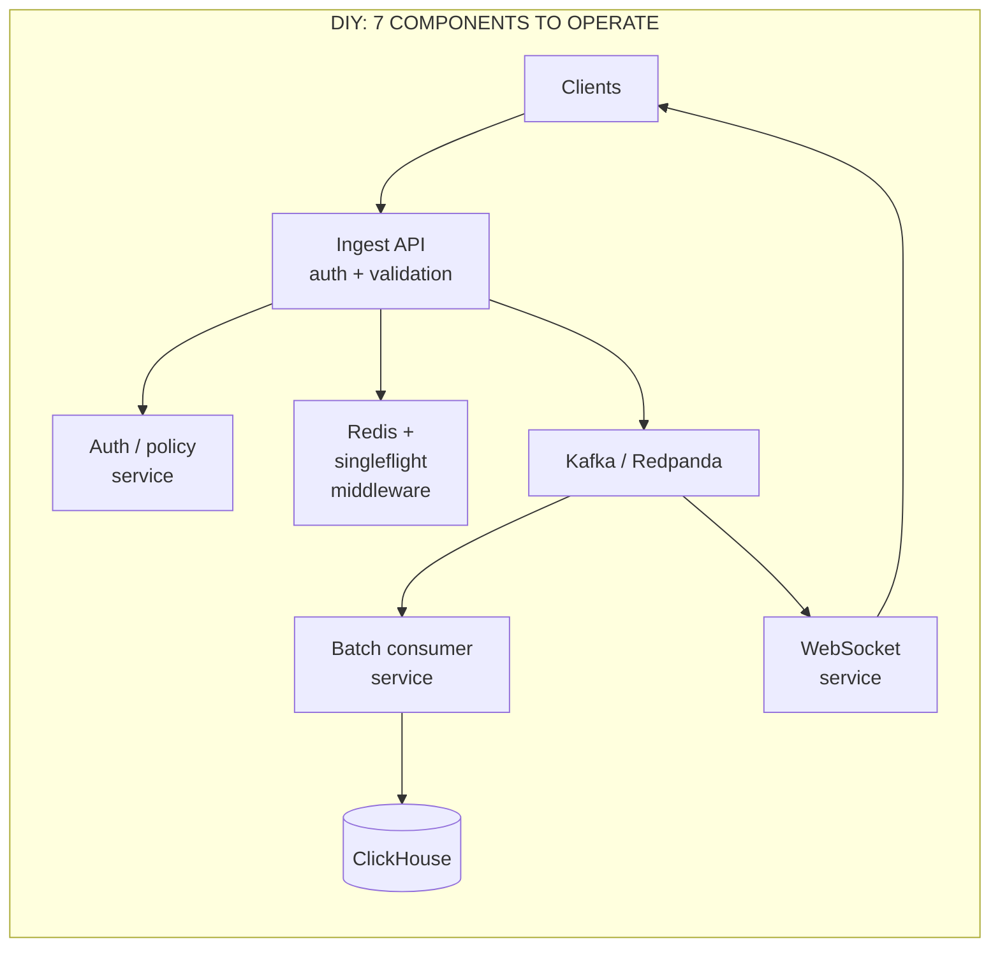
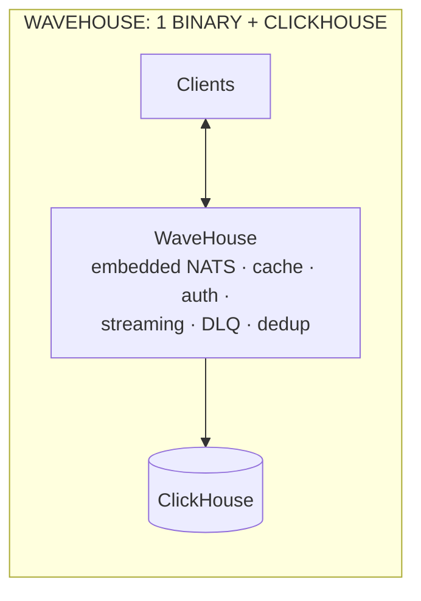
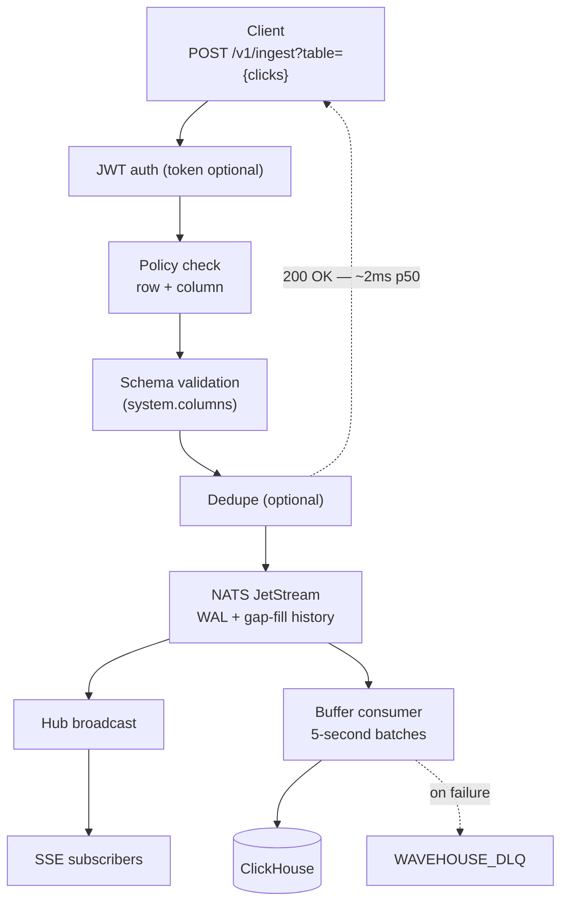
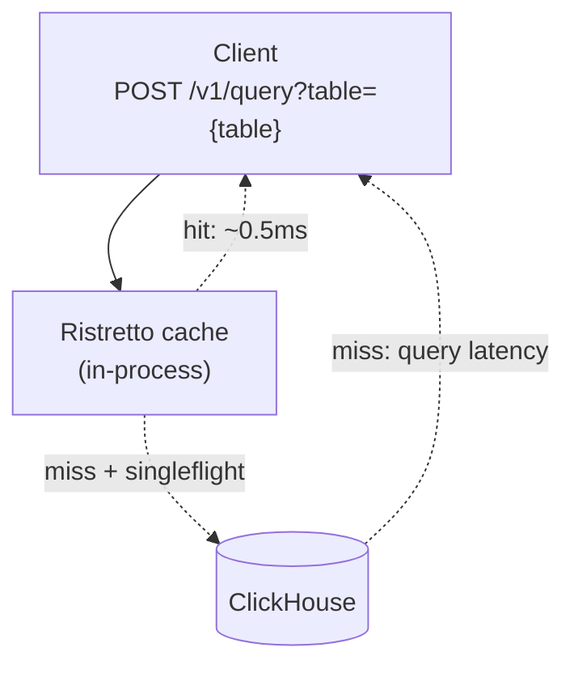

WaveHouse is an API gateway for fronting ClickHouse with user-facing traffic. This page answers "why not point clients straight at ClickHouse?", "why not Kafka + ClickHouse?", and "why not Tinybird?" — failure modes, DIY stacks, and where the cost falls.

## Part I — Why ClickHouse alone breaks under user-facing writes

### The one-row-insert anti-pattern

ClickHouse is an OLAP database: every `INSERT` creates a disk *part*, consolidated later by background mergers. Fine for bulk analytics, bad for streaming ingest from many clients.

The docs mandate **batches of 1,000–100,000 rows, at most once per second** ([ClickHouse — Inserting Data Best Practices](https://clickhouse.com/docs/en/guides/inserting-data)). Single-event frontend POSTs violate that by orders of magnitude.

MergeTree settings `parts_to_delay_insert` and `parts_to_throw_insert` (historically ~1,000 and 3,000) trigger failures when insert rates outpace merges, raising `DB::Exception: Too many parts (N). Merges are processing significantly slower than inserts`.

**The scenario in dollars.** 10M events/day (~115 events/sec) inserted directly: a spike stalls inserts, the frontend 503s, someone writes an emergency batching service. Through WaveHouse it's ~17k bulk inserts/day — merge pressure flat, no incidents.

### No backpressure, no DLQ, no validation at the edge

Naive ingest paths can't tell a client to slow down or reject a malformed payload:

- **Late Validation:** ClickHouse accepts a `String` where you expected a `UInt32`, then rejects the whole block at parse time, after the network round-trip; no "unknown field" signal at the HTTP boundary.
- **No Backpressure:** if mergers lag, ClickHouse errors on the *next* insert — the client already left.
- **No DLQ:** failed events are lost or buried in error logs; replay is painful.

WaveHouse fixes all three at the gateway: validates against `system.columns`, returns `503 Service Unavailable` + `Retry-After` when the NATS WAL fills, and routes failed batches to a `WAVEHOUSE_DLQ` stream (`GET /v1/dlq/stats`).

### No real-time push

ClickHouse has no pub/sub. For sub-second dashboard updates:

- **Poll:** every client issues `SELECT ... WHERE received_timestamp > ?` every N seconds; 100 viewers at 2s means **3,000 queries/min**, mostly zero rows.
- **Duplicate Streams:** Add Kafka, Pulsar, or Redis.

WaveHouse's SSE layer broadcasts **before** the ClickHouse flush, with NATS JetStream history for gap-fill on reconnect.

### Thundering-herd queries

ClickHouse's query cache is per-server with no client-facing singleflight: 50 simultaneous refreshes are 50 identical queries. WaveHouse coalesces them with an in-process Ristretto cache and Go `singleflight` — one query reaches ClickHouse.

### No row/column access control

ClickHouse has no JWT-driven row-level security; multi-tenant apps hand-inject `WHERE tenant_id = ?` everywhere. WaveHouse keeps Hasura-style policies in NATS KV: per-role `allow_columns` and row-level `filter` with JWT claim templating (`{{ jwt.app_metadata.tenant_id }}`), bootstrapped from YAML, synced cluster-wide.

## Part II — What people actually build instead

The canonical DIY stack:

**Ingredient count:**

| Capability | DIY stack | WaveHouse |
| ---------- | --------- | --------- |
| Durable ingest buffer | Kafka / Redpanda cluster (3+ brokers, Zookeeper/KRaft) | Embedded NATS JetStream |
| Batch consumer | Custom Go/Rust/Java service | Built in |
| Query cache | Redis + singleflight middleware | Built in (Ristretto + singleflight) |
| Real-time push | WebSocket service + Kafka bridge | Built in (`/v1/stream`) |
| Schema validation | Custom code in ingest API | Built in (discovers `system.columns`) |
| Row/column access control | Custom middleware or service | Built in (Hasura-style, JWT-driven) |
| Dead letter queue | Custom retry + dead topic on Kafka | Built in (`WAVEHOUSE_DLQ`) |
| Client SDK | Each team writes one | `@wavehouse/sdk` (TypeScript, zero-dep, codegen) |

The DIY path works for big teams; the ops cost is Kafka bills and 3 a.m. batch-consumer stalls.

**Scenario:** a seed-stage team picks "Kafka + ClickHouse + custom ingest". Six months on, two engineers spend ~30% of their time on data-plane reliability (batching edge cases, DLQ replay, Kafka upgrades) — one full-time engineer of drag on a 3-person backend team. A drop-in gateway removes it.

### Tinybird

Tinybird is the main commercial alternative: hosted ClickHouse with SQL "pipes" as APIs, for teams paying to skip the plumbing.

Differences:

| Dimension | Tinybird | WaveHouse |
| --------- | -------- | --------- |
| Hosting | SaaS only (Developer $49/mo → Enterprise) | Self-host, single binary |
| Pricing model | vCPU/QPS/storage; egress fees | Your infra; no per-query/GB fee |
| Data residency | Their infrastructure | Your infrastructure |
| Schema source of truth | Tinybird datasource definitions | ClickHouse tables (`system.columns`) |
| Deployment workflow | Tinybird CLI against Cloud | `docker compose up` or K8s |
| Real-time push | Pipe endpoints (request/response) | Native SSE |
| Access control | Tinybird tokens (API-level) | JWT + Hasura-style row/column policies |
| Vendor lock-in | Rewriting queries | None — WaveHouse is Apache 2.0, ClickHouse is yours |

Tinybird wins on "zero ops to start". WaveHouse wins on owning the data plane and paying AWS instead of a second vendor — for scale, sensitive data, or on-prem.

## Part III — The feature matrix

| Concern | Direct ClickHouse | Kafka + ClickHouse (DIY) | Tinybird | **WaveHouse** |
| ------- | ----------------- | ----------------------- | -------- | ------------- |
| Single-binary deployment | — | — | N/A (SaaS) | ✓ |
| Self-hosted | ✓ | ✓ | ✗ | ✓ |
| Handles N-row inserts safely | ✗ merge blowup | ✓ via Kafka | ✓ | ✓ native |
| Schema validation at the edge | ✗ | Custom | ✓ | ✓ (discovers schema) |
| Dead letter queue | ✗ | Custom | Partial | ✓ `WAVEHOUSE_DLQ` |
| Backpressure (503 + Retry-After) | ✗ | Custom | ✓ | ✓ |
| Idempotent ingest (dedup by ID) | ✗ | Custom | ✓ | ✓ optional |
| Real-time push (SSE) | ✗ | Custom service | ✗ | ✓ native, gap-fill |
| Thundering-herd coalescing | ✗ | Custom | ✓ | ✓ Ristretto + singleflight |
| Row/column policies with JWT claims | ✗ | Custom | Tokens only | ✓ Hasura-style |
| Named parameterized pipes | ✗ | Custom | ✓ | ✓ stored in NATS KV |
| Type-safe client SDK with codegen | ✗ | Per team | Partial | ✓ `@wavehouse/sdk` |
| Cost model | Infra only | Infra + eng time | Per-vCPU SaaS | Infra only |

## Part IV — End-to-end data journey

Events move through a synchronous edge (pre-`200 OK`) and two async tails: real-time broadcast and batched insert.

**Ingest & broadcast path:**

**Query path with tiered cache:**

**Latency budget at each stage:**

| Stage | Typical p50 | Typical p99 |
| ----- | ----------- | ----------- |
| API auth + validation | < 1 ms | ~3 ms |
| NATS JetStream publish | ~1 ms | ~5 ms |
| API `200 OK` to client | ~2 ms | ~8 ms |
| Hub broadcast to SSE subscriber | ~1 ms | ~10 ms |
| Batch flush to ClickHouse | 5 s (configurable) | 5 s + ClickHouse insert time |
| Query cache hit (L1) | < 0.5 ms | ~1 ms |
| Query cache miss → ClickHouse | depends on query | depends on query |

## Part V — When WaveHouse is *not* the right answer

The honest list:

- **Internal BI / data team workloads** — if the clients are BI tools and batch ETL, point them straight at ClickHouse.
- **Pure bulk ETL** — redundant when writes already arrive as 100k-row blocks from Airflow or dbt.
- **ClickHouse-as-a-datalake** — WaveHouse targets the hot path, not cold analytics over S3/Iceberg.
- **Kafka-shaped organizations** — deep in Kafka Connect custom sinks, migration may cost too much; run Kafka → WaveHouse → ClickHouse for the real-time layer.

## Summary

**ClickHouse is a great database but a poor API**. Products serving user traffic from ClickHouse eventually build WaveHouse — deploy ours instead.

Read next:

- **[Architecture](/architecture)** — package map and implementation details.
- **[Getting Started](/getting-started)** — five minutes to `200 OK`.
- **[API Reference](/api)** — endpoints and schema-validation contracts.
